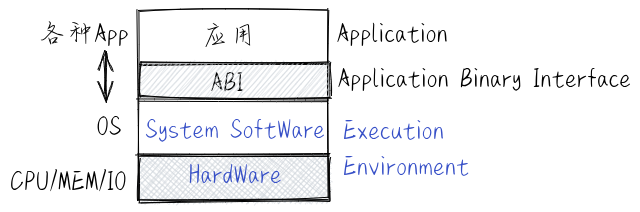

什么是操作系统
================================================

.. toctree::
   :hidden:
   :maxdepth: 5

站在一万米的代码空间维度看
----------------------------------

.. chyyuu What is an Operating System? A historical investigation (1954–1964) Maarten Bullynck

一个操作系统（OS）是一个软件，它帮助用户和应用程序使用和管理计算机的资源。操作系统可能对最终用户不可见，但控制着嵌入式设备、更通用的系统（如智能手机、台式计算机和服务器）以及巨型机等各种计算机系统。

今天，我们很难想象在没有操作系统的情况下使用计算机，它塑造和构建了我们访问计算机及其外围设备的交互方式。当第一批电子计算机在第二次世界大战后被开发出来时，还没有操作系统这种软件。仅仅在计算机诞生十年后，某种操作系统的首次尝试才开始出现。又过了十年，操作系统才被大家广泛接受。

我们的讨论将集中在通用操作系统上，因为它们需要的技术是嵌入式系统所需技术的超集，对操作系统原理、概念和技术的覆盖更加全面。现在的通用操作系统是一个复杂的系统软件，比如 Linux 操作系统达到了千万行的 C 源码量级。在学习操作系统的初期，如果去分析了解这样大规模的软件，要付出巨大的代价。

.. note::
   
   **什么是系统软件？**

   系统软件是在一个计算机系统范围内使用的软件，可涉及到整个计算机系统。
   如果这样来看，一个编辑软件，如 Vi、Emacs、MS Word，只涉及到对文本文件的编辑，就不能算是系统软件。
   而在计算机中安装的 C 标准库 libc（类似的有 Rust 标准库 等）可以算是系统软件，因为它提供了与OS交互的系统调用接口，其功能覆盖了整个计算机系统，会被许多不同的软件访问和调用。

   不难看出，操作系统也是这样的一个系统软件。

如果我们站在一万米的高空来看 :ref:`操作系统 <computer-hw-sw>` ，可以发现操作系统这个系统软件干的事主要有两件：一是向下管理并控制计算机硬件和各种外设，二是向上管理应用软件并提供各种服务。我们可对其进一步描述：操作系统是一个可以管理CPU、内存和各种外设，并管理和服务应用软件的系统软件。这样的描述也是大多数操作系统教材上对操作系统的一个比较概括的定义。为了完成这些工作，操作系统需要知道如何与硬件打交道，如何更好地给应用软件提供服务。这就有一系列与操作系统相关的理论、抽象、设计等来支持如何做和做得好这两件事情。

.. image:: computer-hw-sw.png
   :align: center
   :scale: 50 %
   :name: computer-hw-sw

如果看看我们的身边， Android 应用运行在 ARM 处理器上的 Android 操作系统执行环境中；微软的 Office 应用运行在 x86-64 处理器上的 Windows 操作系统执行环境中；Web Server应用运行在 x86-64 处理器上的 Linux 操作系统执行环境中；Web app 应用运行在 x86-64 或 ARM 处理器上的 Chrome OS 操作系统执行环境中。而在一些嵌入式环境中，操作系统以运行时库的形式与应用程序紧密结合在一起，形成一个可在嵌入式硬件上执行的嵌入式应用。所以，在不同的应用场景下，操作系统的边界也是不同的，我们可以把运行时库、图形界面支持库等这些可支持不同应用的系统软件 (System Software) 也看成是操作系统的一部分。

站在应用程序的角度来看，我们可以发现常见的应用程序其实是运行在由硬件、操作系统内核、运行时库、图形界面支持库等所包起来的一个 :ref:`执行环境 (Execution Environment) <exec-env>` 中，应用程序只需根据与系统软件约定好的应用程序二进制接口 (ABI, Application Binary Interface) 来请求执行环境提供的各种服务或功能，从而完成应用程序自己的功能。基于这样的观察，我们可以把操作系统的定义简化为： **应用程序的软件执行环境** 。这样的简单定义能适应在操作系统发展的不同历史时期对操作系统的概括性描述。从这个角度出发，操作系统可以包括运行时库、图形界面支持库等系统软件，

站在计算机发展的百年时间尺度看
----------------------------------

虽然电子计算机的出现距今才仅仅七十年左右，但计算机技术和操作系统已经发生了巨大的变化。从计算机发展的短暂的历史角度看，操作系统也是从计算机诞生大约十年后，从无到有地逐步发展起来的。操作系统主要完成硬件控制和为应用程序提供服务这些必不可少的功能，它的历史与计算机的发展史密不可分。操作系统的内涵和功能随着历史的发展也在一直变化、改进中。如今在二十一世纪初期的大众眼中，操作系统就是他们的手机/终端上的软件系统，包括各种应用程序集合，图形界面和网络浏览器是其中重要的组成部分。

其实，操作系统的内涵和外延随着历史的发展也一直在变化，并没有类似于“1+1=2”这样的明确定义。参考地球生物的进化史，我们也给操作系统的进化历史做一个简单的概述，从中可以看到操作系统在各个时间段上包含什么，具有什么样的特征。但无论操作系统的内在实现和具体目标如何变化，其管理计算机硬件，给应用提供服务的核心定位没有变化。

寒武纪生物大爆发时代 [#寒武纪]_
~~~~~~~~~~~~~~~~~~~~~~~~~~~~~~~~~~~~~~~~~~~~~~~~~~~~~~~~~

.. chyyuu https://en.wikipedia.org/wiki/Timeline_of_operating_systems  https://en.wikipedia.org/wiki/History_of_operating_systems https://computerhistory.org/ https://en.wikipedia.org/wiki/Comparison_of_operating_systems

在 1946 年出现电子计算机的时候，只有人类操作员 (Operator)来管理和操作机器，还没有操作系统 (Operating System)这种事物 。启动，扳开关，装卡片/纸带等比较辛苦的工作都是计算机操作员或者用户自己完成。操作员/用户带着记录有程序和数据的卡片 (Punch Card) 或打孔纸带去操作机器。装好卡片/纸带后，启动卡片/纸带阅读器，把程序和数据读入计算机内存中之后，计算机就开始工作，并把结果也输出到卡片/纸带或显示屏上，最后程序停止。

随着程序设计语言和编译技术的进步，推动了程序员开发翻译符号程序（即编译器）来自动把代码转换成机器代码，代替了以前低效的手工机器编码的方式，提高了程序开发的效率。但程序执行的效率还很低。而且随着计算机和I/O设备变得更强大，运行程序的时间减少了，相比之下，让计算机运行的准备时间变得更长了，使得计算机的整体执行效率很低。

一般情况下，五十年代初期的计算机每次只能执行一个任务， CPU 大部分时间都在等待人类操作员的缓慢操作。由于过低的人工操作效率浪费了计算机的宝贵机时，所以就引入监控程序 (Monitor) 辅助完成输入、输出、加载、运行程序等工作，从而提高了使用计算机的效率。监控程序就是操作系统最开始的雏形，类似寒武纪生物大爆发中的著名生物--“三叶虫”。在1951-1954年前后，Swinnerton-Dwyer等在EDSAC（Electronic Delay Storage Automatic Calculator）计算机上研制了监控程序，这也许是有记录的最早操作系统雏形 [#UNIX25Y]_ 。这种类似监控程序的初级“辅助操作”过程一直持续到 20 世纪 50 年代中后期。

.. chyyuu http://www.ict.ac.cn/jssgk/lsyg/ http://www.wyzxwk.com/Article/chanye/2020/09/424229.html  https://www.ccf.org.cn/Computing_history/Full_List/2017/Second_class/2018-09-12/652328.shtml https://www.ccf.org.cn/Computing_history/Full_List/2020/First_class/2021-01-20/722002.shtml

在中国，计算机与操作系统相关技术的发展也很快。1958年8月1日，在苏联专家的指导下，中科院计算所、第四机械工业部(电子工业部)等单位，仿制苏联M-3小型数字电子计算机，设计完成了中国第一台以电子管为主的小型数字电子计算机 --103型(即DJS-1型)计算机，这个计算机没有监控程序。1959年10月1日，中科院计算所、四机部等单位合作，仿照苏联БЭCM-Ⅱ大型机，制成了中国第一台以电子管为主的大型通用数字电子计算机 -- 104机。在104机上的软件已经比较丰富了，包括具有前期操作系统雏形的自检程序、标准子程序库、自动更换地址程序，以及面向应用的算法语言与编译系统。

.. note::

   **历史的缩影 -- 寒武纪“三叶虫”操作系统 -- LibOS**

   可以在 :ref:`本书第一章 <link-chapter1>` 看到初级的“三叶虫”操作系统 -- LibOS 其实就是一个给应用提供各种服务（比如输出字符串）的库，方便了单一应用程序的开发与运行。

泥盆纪 [#泥盆纪]_ 鱼类时代和二叠纪  [#二叠纪]_ 两栖动物时代
~~~~~~~~~~~~~~~~~~~~~~~~~~~~~~~~~~~~~~~~~~~~~~~~~~~~~~~~~~~~~~~~~~~~~~~~~~~~~~~~

在 20 世纪 50~60 年代，计算机发展到大型机阶段，计算能力和I/O处理能力进一步加强，存储空间进一步扩展，应用领域逐步扩大，这使得所对应的各种早期操作系统具有多样化、专用化的特点。计算机生产厂商设计出针对各自硬件的专用操作系统，且大部分用汇编语言编写。这导致操作系统的开发效率不高，不具有跨硬件平台的可移植性，进化比较缓慢。而且当时的处理器时间很宝贵，将计算机系统一次使用限制为一个用户是一种很大的浪费。例如，在早期计算机系统中，当用户通过监控程序加载程序时，处理器保持空闲状态，所有其他用户的程序都不能执行。但进化在持续进行，操作系统从“手工操作”和“监控程序”阶段进化到了“批处理”和“多道程序”阶段。

批处理是指把一批作业（古老的术语，可理解为现在的程序）以脱机方式输入到磁带上，并使这批作业能一个接一个地连续处理，流程如下：

1. 将磁带上的一个作业装入内存；
2. 操作系统把运行控制权交给该作业；
3. 当该作业处理完成后，控制权被交还给操作系统；
4. 重复1-3的步骤处理下一个作业直到所有作业处理完毕。

这样能充分地利用计算机系统，应尽量使该系统连续运行，减少CPU的空闲时间。批处理操作系统分为单道批处理系统和多道批处理系统。单道批处理操作系统只能管理内存中的一个（道）作业，无法充分利用大型计算机系统中的所有资源，致使系统整体性能较差。这就像泥盆纪 [#泥盆纪]_ 的史前鱼类--邓氏鱼，有着坚硬的头部铠甲，很强壮，但运动缓慢，灵敏度低，离不开水。

.. note::

   **历史的缩影 -- 泥盆纪“邓氏鱼”操作系统 -- BatchOS**
   
   可以在 :ref:`本书第二章 <link-chapter2>` 看到“邓氏鱼”操作系统 -- BatchOS ，虽然每次只能加载运行一个应用，但BatchOS通过硬件隔离机制让APP与OS隔离，加强了系统安全，并在一定程度上提高了执行效率。

在1956年，由鲍勃.帕特里克(Bob Patrick)在美国通用汽车的系统监督程序(system monitor)的基础上，为美国通用汽车和北美航空公司，在IBM 704计算机上设计了最早的批处理操作系统--GM-NAA I/O [#OSHISTORY]_ 。这个最早的操作系统已经具有了单道批处理系统的基本功能。

在 1964 年， IBM 公司开发了面向 System/360 系列大型计算机的统一可兼容的操作系统—— OS/360  [#MAN]_ ，它是一种多道批处理操作系统。多道批处理操作系统能管理内存中的多个（道）作业，可比较充分地利用计算机系统中的所有资源，提升系统整体性能。

.. chyyuu  https://blog.csdn.net/weixin_39716043/article/details/118742378 http://www.wyzxwk.com/Article/lishi/2021/12/445916.html http://www.wyzxwk.com/Article/chanye/2020/09/424229.html  https://www.zhihu.com/question/20984050 https://new.qq.com/omn/20210305/20210305A0G8VW00.html

1965年2月，在哈尔滨军事工程学院(国防科大前身)慈云桂教授等研制成功我国第一台晶体管通用电子计算机441B-I。441B-I是中国第二代计算机，具有批处理功能的操作系统雏形、汇编语言、FORTRAN语言及标准程序库等丰富的软件。

多道批处理操作系统为此采用了多道程序设计技术，就是指允许同时把多个程序放入内存，并允许它们交替在 CPU 中运行，它们共享系统中的各种硬、软件资源。当一道程序因 I/O 请求而暂停运行时， CPU 便立即转去运行另一道程序。这就像二叠纪  [#二叠纪]_ 的两栖动物，当水中暂时有危险或食物不多的时候，可以离开水面到陆地上来，并享用陆地上的动植物资源。

然而，处理器共享提出了对程序隔离的需求，以限制一个程序中的运行错误使其他程序崩溃或损坏。为此计算机中进一步添加了硬件级的内存保护机制，限制了一个程序在运行时能访问的地址空间，提高了故障隔离的能力，并减少了隔离的开销。

虽然批处理操作系统提高了系统的执行效率，但其缺点是人机交互性差，比如，批处理计算的一个实际挑战是如何调试应用程序和操作系统本身。如果程序员的代码出现错误，必须重新编码，上传内存，再执行。这需要花费以小时和天为单位的时间开销，使得程序员修改和调试程序很不方便。实质上是将计算机重新变成单用户系统。

.. note::

   **历史的缩影 -- 二叠纪“锯齿螈”、三叠纪“始初龙”和三叠纪“腔骨龙”操作系统**

   在 :ref:`本书第三章 <link-chapter3>` 可以看到二叠纪“锯齿螈”操作系统支持在内存中驻留多个应用，形成多道程序操作系统 -- Multiprog OS
   ；三叠纪“始初龙”操作系统 -- Coop OS 进一步进化，支持协作式多道程序，即支持应用程序主动放弃 CPU 并切换到另一个应用继续执行，从而提高系统整体执行效率；三叠纪“腔骨龙”操作系统 -- Timesharing OS 则可以抢占应用的执行，从而可以公平和高效地分时执行多个应用，提高系统的整体效率。

侏罗纪 [#侏罗纪]_ 与白垩纪 [#白垩纪]_ 的恐龙时代
~~~~~~~~~~~~~~~~~~~~~~~~~~~~~~~~~~~~~~~~~~~~~~~~~~~~~~~~~~~~~

摩尔定律（“当价格不变时，集成电路上可容纳的晶体管数目，约每隔18个月便会增加一倍，性能也将提升一倍。”）的累积效应使得计算成本逐渐下降，这意味着软件开发者不必将全部精力用于提高处理器利用率，而是可以开始努力提升用户的使用体验。例如，UNIX 是在 70 年代初在当时没有人使用的备用计算机上开发的。20 世纪 50 年代末，提高人机交互方式的分时操作系统越来越崭露头角。分时是指多个用户和多个程序以很小的时间间隔来共享使用同一台计算机上的 CPU 和其他硬件资源。1961 年，麻省理工学院的Fernando Corbató带领团队成功研发了在 IBM 709 计算机上的 CTSS（Compatible Time-Sharing System， 兼容时间共享系统）操作系统 [#UNIX25Y]_ ，它拥有分时系统必须有的特征：支持多个用户分享使用同一台计算机，即宏观上的同一时间段内能完成多个人机交互工作。在 CTSS 的鼓舞下，1964 年，麻省理工学院、贝尔实验室及美国通用电气公司共同研发一个目标远大的操作系统：MULTICS (MULTiplexed Information and Computing System) ，它是一套安装在大型主机上、支持多人多任务的操作系统。 MULTICS 以兼容分时系统 (CTSS) 做基础，建置在美国通用电力公司的大型机 GE-645 ，目标是连接 1000 部终端机，支持 300 位用户同时上线。因 MULTICS 的目标太宏大，而研发工作进度过于缓慢，1969 年 AT&T 的 Bell 实验室从 MULTICS 研发中撤出。CTSS 和 MULTICS 这就像侏罗纪时期体型庞大的食肉恐龙--霸王龙，称霸一时，但进化缓慢，最终灭绝。

但贝尔实验室的两位软件工程师 Ken Thompson 与 Dennis Ritchie借鉴了一些重要的 MULTICS 设计思想和理念，以 C 语言为基础发展出小巧灵活的 UNIX 操作系统 [#UNIX]_ 。UNIX 操作系统的早期版本是完全免费的，可以轻易获得并随意修改，所以它得到了广泛的接受。后来，它成为开发小型机操作系统的起点。由于早期的广泛应用，它已经成为分时操作系统的典范。这好像一种生活在侏罗纪晚期的小型恐龙--始祖鸟，它可能是鸟类的祖先，最终进化为可以展翅高飞的飞鸟。

.. note::

   Ken Thompson 与 Dennis Ritchie 于 1974 年 7 月在 the Communications of the ACM 期刊上发表 “The UNIX Time Sharing System”，引起了学术界的广泛兴趣并向他们要源码进行分析和学习，所以 Unix v5 以“仅用于教育目的”的开放协议，提供给各个大学作为操作系统教学之用，成为当时操作系统课程中的重要学习资料，而且各大学和公司开始进一步研究 Unix，并对 Unix 进行改进和扩展，从而使得 Unix 在世界上广泛流行。

.. chyyuu https://new.qq.com/omn/20210305/20210305A0G8VW00.html

1973年，南京大学徐家福、中科院软件所仲萃豪、北京大学杨芙清合作，研制了系统程序设计语言 XCY。XCY 由徐(Xu)家福、仲萃(Cui)豪、杨(Yang)芙清的姓名汉语拼音各取一个字母组成。南京大学的开发小组还用 XCY 语言编写开发了 240 机的 DJS200/XT I、DJS200/XT II、XW 等具有分时和进程管理能力的通用操作系统。

.. note::

   **历史的缩影 -- 侏罗纪和白垩纪的操作系统**

   侏罗纪和白垩纪是恐龙称霸地球的最后繁荣时期。侏罗纪“头甲龙”操作系统、白垩纪“伤齿龙”操作系统、白垩纪“霸王龙”操作系统、白垩纪“迅猛龙”操作系统、白垩纪“达科塔盗龙”操作系统、白垩纪“慈母龙”操作系统
   可以在 :ref:`本书第四章 <link-chapter4>` 到  :ref:`本书第八章 <link-chapter8>` 中看到。

   :ref:`第四章 <link-chapter4>` 的侏罗纪“头甲龙”操作系统 -- “Address Space OS”主要解决多个应用所在内存隔离的问题，从而确保应用之间不会相互破坏各自的内存空间，并进一步发展出地址空间、虚拟内存等操作系统核心概念。

   :ref:`第五章 <link-chapter5>` 的白垩纪“伤齿龙”操作系统 -- “Process OS”主要解决多个应用灵活创建与执行的问题，并进一步发展出进程、调度等操作系统核心概念。

   :ref:`第六章 <link-chapter6>` 的白垩纪“霸王龙”操作系统-- “Filesystem OS”主要解决数据持久保存的应用需求，并进一步提出文件的概念，并且把文件与地址空间作为进程的资源来进行管理，综合了操作系统三大核心概念。

   :ref:`第七章 <link-chapter7>` 的白垩纪“迅猛龙”操作系统 -- “IPC OS”主要解决进程间的数据交换与信息通知的应用需求，并把部分IPC功能建立在文件的抽象之下，简化了应用开发的复杂性。

   :ref:`第八章 <link-chapter8>` 的白垩纪“达科塔盗龙”操作系统 -- “Thread OS”支持线程抽象，把线程作为处理器的调度单位，并成为进程资源管理的一部分内容。线程间通过共享进程的地址空间建立了线程间共享数据和进行数据交换的基础。而白垩纪“慈母龙”操作系统 -- “SyncMutex OS”通过建立同步互斥机制来让线程间能够有序、互斥地访问共享资源，从而让基于多线程的应用 能够高效正确地完成任务。

古近纪 [#古近纪]_ 哺乳动物时代
~~~~~~~~~~~~~~~~~~~~~~~~~~~~~~~~~~~~~~~~~~~~~~~~~~~~

20 世纪 70 年代中后期，微型处理器的快速发展使计算机的应用普及至中小企及个人爱好者，推动了PC( Personal Computer，个人计算机) 的发展，也进一步推动了面向一般大众使用的操作系统的出现。其代表是由微软公司在 20 世纪 80 年代为个人计算机开发（实际是购买）的 DOS操作系统，其特点是简单易用。后来又开发了有图形用户界面（GUI）的操作系统--MS Windows，极大地简化了一般用户使用计算机的难度，使得个人计算机得到了快速的普及和广泛的使用。这里需要注意的是，第一个带 GUI 界面的个人计算机原型起源于伟大却又让人扼腕叹息的施乐帕洛阿图研究中心 (PARC, Palo Alto Research Center) ，PARC 研发出的带有图标、弹出式菜单和重叠窗口的图形交互界面 (GUI, Graphical User Interface)，可利用鼠标的点击动作来进行操控，这是当今我们所使用的 GUI 系统的基础。支持便捷的图形交互界面也成为自 20 世纪 70 年代以来操作系统的主要特征之一。这就像古近纪 [#古近纪]_ 的哺乳动物，能在陆上跑，空中飞和水里游，有很强的适应性和生存能力。

.. chyyuu http://news.newhua.com/news/2009/1224/82274.shtml https://baike.baidu.com/item/CCDOS/2782730 https://zhuanlan.zhihu.com/p/161170166

1980年左右，用于远望号测量船的多机实时操作系统GX-73诞生了。1983年，国防科技大学研制了中国第一台亿次巨型机 -- 银河-I，并研制了配套的多道批处理操作系统 -- YHOS。同年，电子工业部第六研究所设计实现了面向微型计算机的操作系统CCDOS（汉字磁盘操作系统，英语：Chinese Characters Disk Operation System），这是一个在微软DOS微机操作系统上的汉化版本。80年代到90年代，微软的DOS操作系统和后继的Windows操作系统和Intel公司的x86处理器相互支持，形成了Wintel联盟，逐渐在桌面计算机市场上被广泛使用。中国的操作系统主要集中在使用范围较小的科研领域。1989年--1997年期间，中国计算机服务总公司与中国软件技术公司联合国内高校和科研院所，共同承担了开发与UNIX兼容的COSIX操作系统的科技攻关计划。COSIX取得了很多科研成果，但由于没基于新的硬件进行研发等多种因素，最终没有形成广泛的操作系统产业生态。

.. note::

   **历史的缩影 -- “侏罗猎龙”操作系统**

   晚侏罗纪的侏罗猎龙体型小巧，有着适应微光环境的大眼睛和具备压力感应能力的神奇鳞片，能够发现外部环境的微小变化，这种“小巧灵敏”的特征为后续哺乳动物的生物进化开辟了一个方向。 :ref:`第九章 <link-chapter9>` 的“侏罗猎龙”操作系统 -- “Device OS”支持与新增的键盘、鼠标、GPU等多种Virtio外设的交互，可以形成初级的人机交互GUI能力，而且支持在内核中响应中断来降低I/O响应的总体延迟。这在某种程度上体现了当前广泛使用的有图形界面的桌面/移动终端操作系统的基本特征。

第四纪智人时代 [#人类简史]_
~~~~~~~~~~~~~~~~~~~~~~~~~~~~~~~~~~~~~~~~~~~~~~~~~~~~~

21 世纪以来， Internet 和移动互联网的迅猛发展，使得在服务器领域和个人终端的应用与需求大增，数据中心和个人终端已经进入了人们的日常生活中。现在我们拥有种类繁多的计算设备，在这些设备上运行着许多不同的操作系统，操作系统设计者面临的功能权衡取决于硬件的物理能力以及应用程序和用户需求。下面是一些目前常见类型的操作系统：

- 面向服务器的操作系统：当前大家常用的主流搜索引擎、新媒体、电子商务网站和大数据处理系统等一般都托管在数据中心的计算机上。每台计算机都是强大的服务器，运行着服务器操作系统，典型的例子是Linux。通常每台服务器只运行一个应用服务程序，例如 数据库服务器或Web 服务器等，处于处理成千上万个用户传入的网络服务请求，所以吞吐量（每秒处理的请求数量）是一个关键的优化目标。而安全和可靠也是服务器操作性系统需要重点应对的目标。服务器操作系统的一种形态是虚拟机（Virtual Machine Monitor，VMM），它可在一台物理机上虚拟出多台虚拟计算机，可以像运行应用程序一样运行另一个操作系统。通过虚拟机可以充分利用数据中心中资源利用率不高的物理服务器，提高整个数据中心的运行效率。典型的服务器操作系统有：FreeBSD、微软的Windows Server、基于Linux系的RHLS、Ubuntu、openEuler、龙蜥操作系统、麒麟服务器操作系统等。

- 面向台式机/笔记本电脑和上网本的操作系统：典型的例子是：Windows 8、Mac OS X、Linux、Chrome OS等。这些计算机系统是单用户的，运行许多应用程序，并具有各种 I/O 设备。有人可能认为只有一个用户，就没有必要将系统设计为支持共享，而最初的个人计算机操作系统确实采用了这种方法。

- 面向智能移动终端（手机/平板）的操作系统：智能移动终端是一种带有强大处理器的手机或平板，能够运行第三方应用程序。智能移动终端操作系统的典型例子包括 两个霸主 iOS、Android，和曾经辉煌过的Symbian，还有几乎快消失的WebOS、Blackberry OS 和 Windows Phone等。智能移动终端一般只有一个用户，对交互响应能力、长效的电池使用时间和各种应用的支持有着迫切的需求。

- 嵌入式操作系统：随着物联网的发展，处理器芯片可以集成到各种的消费设备中，从机顶盒、手表到机器人等，形成各种物联网中的嵌入式设备。这些嵌入式设备的功能相对单一，通常运行嵌入式操作系统。典型的嵌入式操作系统有 嵌入式Linux、VxWorks、FreeRTOS、RT-Thread、SylixOS等。预计在下一个十年，通过基于物联网设备的操作系统，可以把各种嵌入式设备连接在一起，实现灵活多变的功能协同与组合，形成万物互联的新应用场景和生态。

从上面的简介，我们可以看到，iOS 和 Android 操作系统是21世纪个人终端操作系统的代表，Linux 在巨型机到数据中心服务器操作系统中占据了统治地位。以 Android 系统为例，Android 操作系统是一个包括 Linux 操作系统内核、基于 Java 的中间件、用户界面和关键应用软件的移动设备软件栈集合。这里介绍一下广泛用在服务器领域、智能移动终端和嵌入式系统中的操作系统内核--Linux 操作系统内核。1991 年 8 月，芬兰学生 Linus Torvalds \(林纳斯·托瓦兹\) 在 comp.os.minix 新闻组贴上了以下这段话： 

  ＂你好，所有使用 minix 的人 -我正在为 386 ( 486 ) AT 做一个免费的操作系统 ( 只是为了爱好 )...″

而他所说的“爱好″成为了大家都知道的 Linux 操作系统内核。这个时代的操作系统的特征是联网，发挥网络的吞吐量和低延迟是这个时代的网络操作系统追求的目标。 Linux就像是第四纪出现的智人，横扫陆地上的各种强大生物，出现在生物界的顶端，统治了整个地球。

.. chyyuu  https://www.163.com/dy/article/FIIMV82I0538KQKE.html https://blog.csdn.net/itmaster/article/details/27901

中国对Linux系统的引进，源于在芬兰读博士的宫敏。1994年，他回国休假，随手带了20张磁盘、存储了80GB的自由软件，其中就有Linux。由于Linux基于GPL协议开放源代码，使得在国内的高校中被小范围传播。从1999年起，国内出现了很多基于Linux的操作系统公司，出现了Xteam、蓝点、中科红旗、银河麒麟、中软Linux等几十种发行版。但这些发行版大多数基于Fedora/CentOS/Debian/Ubuntu进行二次开发，并没有形成桌面计算机的应用生态，在二十年左右的时间内，大部分发行版都退出了。目前（2019年之后）在桌面计算机领域，麒麟操作系统和统信 UOS 操作系统目前有比较好的应用发展趋势。在服务器领域，华为的openEuler操作系统和阿里的龙蜥操作系统借助于云计算的快速发展，形成了较好的云应用生态。在嵌入式操作系统领域，国内有不少有技术特色的操作系统，主要代表是RT-Thread、SylixOS、LiteOS等。

.. chyyuu note::

   目前支持联网的操作系统设计实现在本书中还没有对应的章节。但其操作系统的内核其实与分时操作系统的设计实现思路基本是一致的。如果在本书设计的简单分时操作系统的基础上，添加一个网卡外设的驱动和一个简单的网络协议栈，也许是另一个有趣的实验内容。

二十一世纪神人时代 [#未来简史]_
~~~~~~~~~~~~~~~~~~~~~~~~~~~~~~~

当前，大数据、人工智能、机器学习、高速移动互联网络、AR/VR 对操作系统等系统软件带来了新的挑战。如何有效支持和利用这些技术是未来操作系统的方向。同时，我们也看到操作系统的外延在放大，位于云、边、端的操作系统通过多种形态的网络基础设施，跳出了传统单机为主的运行模式，具有在分布式环境下的互联互通互操作的能力，从而扩大为分布式操作系统。

在 2020 年，我们看到了华为逐步推出的OpenHarmony系统；小米也推出了物联网软件平台小米 Vela ；阿里推出了 AliOS Thing；腾讯推出了Tencent OS；苹果公司接连推出 A14、M1 等基于 ARM 的 CPU，逐步开始淘汰 X86CPU；微软推出 Windows 10 IoT，Google 推出 Fuchsia OS。大家都在做着各种位于云、边、端的操作系统的技术调整和创新，构建多种形态的网络基础设施，跳出了传统单机为主的运行模式，形成在分布式环境下的互联互通互操作的能力。

大家好像都意识到，不仅仅是人工智能和机器学习，下一个与人工智能充分融合，并分布式特征的操作系统即将到来，并试图通过这种操作系统带来的连贯用户体验，打通从数据中心、服务器、桌面、移动端、边缘设备等的整个 AI 和物联网 (IoT, Internet of Things) 的生态。也许这种未来操作系统与之前的操作系统相比，其最大的不同是具有了人工智能的属性，跳出了单个设备节点，通过多种网络从不同维度来管理多个设备。这种操作系统也许这就是尤瓦尔·赫拉利所著的《未来简史》 [#未来简史]_ 中描述的“无所不能”的神人。

目前支持AIoT的操作系统设计实现在本书中还没有对应的章节，不过我们的同学也设计了 `zCore操作系统 <https://github.com/rcore-os/zCore>`_ ，欢迎看完本书的同学能够尝试参与或独立设计面向未来的操作系统。

 
.. chyyuu https://www.sohu.com/a/323094413_783821 https://it.sohu.com/20050117/n223974639.shtml  https://www.museum.uestc.edu.cn/info/1184/2337.htm

.. [#寒武纪] 5亿年前的寒武纪期间生物种类突然丰富起来，呈爆炸式的增加，期间的典型生物是三叶虫。
.. [#泥盆纪] 4亿年前的泥盆纪期间鱼类空前繁荣，并在晚期出现了两栖动物。
.. [#二叠纪] 3亿年前的二叠纪期间是一个承上启下的阶段，两栖类动物最繁盛，爬行动物逐渐繁荣。 
.. [#侏罗纪] 2亿年前的侏罗纪期间温暖潮湿，爬行类动物的代表--恐龙成为当时的统治者，哺乳动物开始发展。
.. [#白垩纪] 1亿年前的白垩纪期间温暖干旱，恐龙经历了从鼎盛到灭绝的巨大变化，哺乳动物兴起。
.. [#古近纪] 0.6亿年前的古近纪时期，哺乳动物迅速发展，且形态多样化，逐渐统治了地面。
.. [#人类简史] 尤瓦尔·赫拉利所著的“人类简史” 书中提到的智人遍布地球，可类比现在的Linux 。
.. [#未来简史] 尤瓦尔·赫拉利所著的“未来简史” 书中描述的神人可类比于未来支持AI的分布式操作系统 。
.. [#UNIX25Y] Peter H.Salus, A Quarter Century of UNIX, Addison-Wesley Publishing, 1997
.. [#UNIX] Brain W. Kernighan, UNIX: A History and a Memoir, Independently published, 2020 
.. [#OSHISTORY] Maarten Bullynck, What is an Operating System? A historical investigation (1954–1964), https://halshs.archives-ouvertes.fr/halshs-01541602/document
.. [#MAN] 布鲁克斯(Brooks, F. P.), 人月神话(40周年中文纪念版),2015
