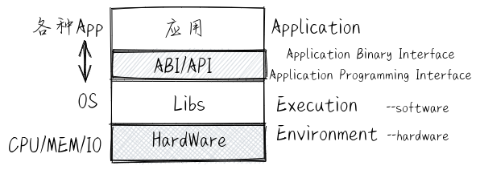
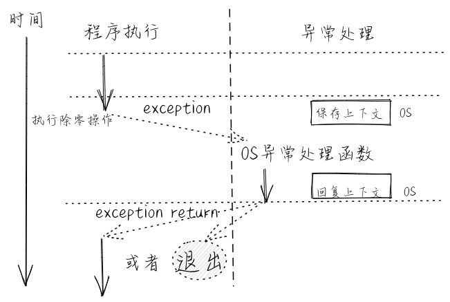
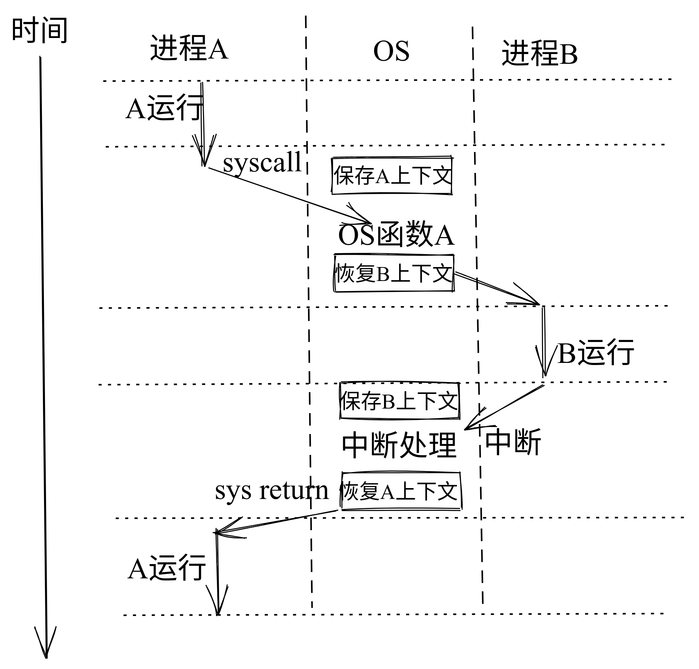

操作系统抽象
================================================

.. toctree::
   :hidden:
   :maxdepth: 5

..
  chyyuu：我觉得需要给出执行环境（EE），Task，...，上下文（函数，trap,task，进程...），执行流等的描述。
  并且有一个图，展示这些概念的关系。这些概念能够有链接，指向进一步实际定义或使用的地方。

接下来同学可站在操作系统实现的角度来看操作系统。操作系统为了能够更好地管理计算机系统并为应用程序提供便捷的服务，在计算机和操作系统的技术研究和发展的过程中，形成了一系列的核心（抽象）概念：执行环境、进程、地址空间和文件，这些奠定了操作系统内核设计与实现的基础。

.. note::

   在本书中，关于执行环境、进程、地址空间和文件的抽象表示不会仅仅就是一个文字描述，还会在后续章节关于具体操作系统设计与运行的讲述中，以具体化的静态数据结构、动态执行导致计算机中物理/虚拟资源的改变来展示。从而让同学能够建立操作系统抽象概念与操作系统具体实现之间的内在联系。

.. _term-exec-env-define:

执行环境
----------------------------------------

**执行环境** (Execution Environment) 是一个内涵很丰富且有一定变化的术语，它主要负责给在其上执行的软件提供相应的功能与资源，并可在计算机系统中形成多层次的执行环境。对于现在直接运行在裸机硬件 (Bare-Metal) 上的操作系统，其执行环境是 *计算机的硬件* 。计算机刚刚诞生时，还没有操作系统的概念，对于直接运行在裸机硬件上的应用程序而言，其执行环境也是 *计算机的硬件* 。 随着计算机技术的发展，应用程序下面形成了一层比较通用的函数库，这使得应用程序不需要直接访问硬件了，它所需要的功能（比如显示字符串）和资源（比如一块内存）都可以通过函数库的函数来帮助完成。在第二个阶段，应用程序的执行环境就变成了 *函数库* -> *计算机硬件* ，而这时函数库的执行环境就是计算机的硬件。

再进一步，操作系统取代了函数库来访问硬件，函数库通过访问操作系统的系统调用服务来进一步给应用程序提供丰富的功能和资源。在第三个阶段，应用程序的执行环境就变成了 *函数库* -> *操作系统内核* -> *计算机硬件* 。在后面又出现了基于 Java 语言的应用程序，在函数库和操作系统之间，多了一层 Java 虚拟机，此时 Java 应用程序的执行环境就变成了 *函数库* -> *Java 虚拟机* -> *操作系统内核* -> *计算机硬件* 。在云计算时代，在传统操作系统与计算机硬件之间多了一层 Hypervisor/VMM ，此时应用程序的执行环境变成了 *函数库* -> *Java 虚拟机* -> *操作系统内核* -> *Hypervisor/VMM* -> *计算机硬件* 。这里可以看到，随着软件需求的多样化和复杂化， **执行环境的层次** 也越来越多。

.. _term-ee-switch:

另外，CPU在执行过程中，可以在不同层次的执行环境之间切换，这称为 **执行环境切换** 。执行环境切换主要是通过特定的 API 或 ABI 来完成的，这样不同执行环境的软件就能实现数据交换与互操作，而且还保证了彼此之间有清晰的隔离。

.. image:: complex-EE.png
   :align: center
   :name: complex-ee

对于应用程序的执行环境而言，应用程序只能看到执行环境直接提供给它的接口（API 或 ABI），这使得应用程序所能得到的服务取决于执行环境提供给它的访问接口。所以，操作系统可以看成是应用程序执行环境，其形态可以是一个库，也可以是一个虚拟机等，或者它们的某种组合形式。比如， 手机上的 **Android操作系统** 是 Android 应用程序的执行环境，它包括了库形态的 Framework 层，执行 Java 程序的虚拟机层，与操作系统交互的系统类 C 库和 Linux kernel。运行在服务器上的 **麒麟服务器操作系统** 、 **openEuler 服务器操作系统** 、 **龙蜥服务器操作系统** 、 **RHEL-RedHat 服务器操作系统** 是各种服务器应用软件， 如Web Server 应用、数据库等的执行环境，这些操作系统都包含了与操作系统交互的系统类 C 库、Java 虚拟机、容器系统、VMM 虚拟机系统等和Linux kernel。

基于上面的介绍，我们可以给应用程序的执行环境一个基本的定义：执行环境是应用程序正确运行所需的服务与管理环境，用来完成应用程序在运行时的数据与资源管理、应用程序的生存期等方面的处理，它定义了应用程序有权访问的其他数据或资源，并决定了应用程序的行为限制范围。

.. note::

   在本书中，我们将主要侧重设计与实现类似 Linux kernel 这样的 **操作系统内核** 形态的执行环境。

.. _term-ccf:

普通控制流
^^^^^^^^^^^^^^^^^^^^^^^^^^^^^^^^^^^^^^

各种应用程序在执行环境中执行其功能，而具体如何执行，取决于 **程序的控制流** 。回顾一下编译原理课上的知识，程序的控制流 (Flow of Control or Control Flow) 是指以一个程序的指令、语句或基本块为单位的执行序列。再回顾一下计算机组成原理课上的知识，处理器的控制流是指处理器中程序计数器的控制转移序列。最简单的一种控制流（没有异常或中断产生的前提下）是一个“平滑的”序列，其中每个要执行的指令地址在内存中都是相邻的。如果站在程序员的角度来看控制流，会发现控制流是程序员编写的程序的执行序列，这些序列是程序员预设好的。程序运行时能以多种简单的控制流（顺序、分支、循环结构和多层嵌套函数调用）组合的方式，来一行一行的执行源代码（以编程语言级的视角），也是一条一条的执行汇编指令（以汇编语言级的视角）。对于上述的不同描述，我们可以统称其为 **普通控制流** (CCF，Common Control Flow，简称 控制流) 。在应用程序视角下，它只能接触到它所在的执行环境，不会跳到其他执行环境，所以应用程序执行基本上是以普通控制流的形式完成整个运行的过程。

.. _term-ecf:

异常控制流
^^^^^^^^^^^^^^^^^^^^^^^^^^^^^^^^^^^^^^

应用程序在执行过程中，如果发出系统调用请求，或出现外设中断、CPU 异常等情况，处理器执行的前一条指令和后一条指令将会位于两个完全不同的位置，即不同的执行环境 。比如，前一条指令还在应用程序的代码段中，后一条指令就跑到操作系统的代码段中去了，这就是一种控制流的“突变”，即控制流脱离了其所在的执行环境，并产生 :ref:`执行环境的切换 <term-ee-switch>`。 我们把这种“突变”的控制流称为 **异常控制流** (ECF, Exceptional Control Flow) 。

应用程序 *感知* 不到这种异常的控制流情况，这主要是由于操作系统把这种情况 *透明* 地进行了执行环境的切换和对各种异常情况的处理，让应用程序从始至终地 *认为* 没有这些异常控制流的产生。

简单地说， **异常控制流** 是处理器在执行过程中的突变，其主要作用是通过硬件和操作系统的协同工作来响应处理器状态中的特殊变化。比如当应用程序正在执行时，产生了时钟外设中断，导致操作系统打断当前应用程序的执行，转而进入 **操作系统** 执行环境去处理时钟外设中断。处理完毕后，再回到应用程序中被打断的地方继续执行。

.. note::

   本书是从操作系统的角度来给出的异常控制流的定义。

   在《深入理解计算机系统（CSAPP）》 [#CSAPP]_ 中，对异常控制流也给出了相关定义：
   系统必须能对系统状态的变化做出反应，这些系统状态不是被内部程序变量捕获，也不一定和程序的执行相关。现代系统通过使控制流发生突变对这些情况做出反应。我们称这种突变为异常控制流( Exceptional Control Flow, ECF)
   
   我们这里的异常控制流不涉及C++/Java等编程语言级的exception机制。

.. _term-context:
.. _term-ees:

控制流上下文（执行环境的状态）
^^^^^^^^^^^^^^^^^^^^^^^^^^^^^^^^^^^^^^

站在硬件的角度来看普通控制流或异常控制流的具体执行过程，我们会发现从控制流起始的某条指令执行开始，指令可访问的所有物理资源的内容，包括自带的所有通用寄存器、特权级相关特殊寄存器、以及指令访问的内存等，会随着指令的执行而逐渐发生变化。

这里我们把控制流在执行完某指令时的物理资源内容，即确保下一时刻能继续 *正确* 执行控制流指令的物理资源内容称为控制流的 **上下文** (Context) ，也可称为控制流所在执行环境的状态。

我们这里说的控制流的上下文是指仅会影响控制流正确执行的有限的物理/虚拟资源内容。这里需要理解程序中控制流的上下文对程序 *正确* 执行的影响。如果在某时刻，由于某种有意或无意的原因，控制流的上下文发生了变化（比如某个寄存器的值变了），但并不是由于程序的控制流本身的指令导致的，这就会使得接下来的程序指令执行出现偏差，并最终导致执行过程或执行结果不符合预期，这种情形称为 **程序执行错误** 。 而操作系统有责任来保护应用程序中控制流的上下文，以让应用程序得以正确执行。

.. note::

   * 物理资源：即计算机硬件资源，如CPU的寄存器、可访问的物理内存等。
   * 虚拟资源：即操作系统提供的资源，如文件，网络端口号，网络地址，信号等。

如果一个控制流属于某个函数，那么这个控制流的上下文简称为函数调用上下文。如果一个控制流属于某个应用程序，那么这个控制流的上下文简称为应用程序上下文。如果把某 :ref:`进程 <term-process>` 看做是运行的应用程序，那么这个属于某个应用程序的控制流可简称为某进程上下文。如果一个控制流属于操作系统，那么这个控制流的上下文简称为操作系统上下文。如果一个控制流是属于操作系统中处理中断/异常/陷入的那段代码，那么这个控制流的上下文简称为中断/异常/陷入的上下文。

在 CPU 不断执行指令的过程中，各种前缀的上下文（执行环境的状态）会不断地变化。如果出现了处理器在执行过程中的突变（即异常控制流）或转移（如多层函数调用），需要由维持执行环境的软硬件协同起来，保存发生突变或转移前的控制流上下文，即当前执行环境的状态（比如突变或函数调用前一刻的指令寄存器，栈寄存器和其他一些通用寄存器等内容），并在完成突变处理或被调用函数执行完毕后，恢复突变或转移前的控制流上下文。这是由于完成与突变相关的执行会破坏突变前的控制流上下文（比如上述各种寄存器的内容），导致如果不保存之前的控制流上下文，就无法恢复到突变前正确的执行环境，继续正常的普通控制流的执行。

对于异常控制流的上下文保存与恢复，主要是通过 CPU 和操作系统（手动编写在栈上保存与恢复寄存器的指令）来协同完成；对于函数转移控制流的上下文保存与恢复，主要是通过编译器（自动生成在栈上保存与恢复寄存器的指令）来帮助完成的。

在操作系统中，需要处理三类异常控制流：外设中断 (Device Interrupt) 、陷入 (Trap) 和异常 (Exception，也称Fault Interrupt)。

.. chyyuu 可以不要
   .. _term-execution-flow:

   执行流或执行历史
   ^^^^^^^^^^^^^^^^^^^^^^^^^^^^^^^^^^^^^^

   无论是操作系统还是应用程序，它在某一段时间上的执行过程会让处理器执行一系列程序的指令，并对计算机的物理资源的内容（即上下文）进行了改变。如果结合上面的抽象概念更加细致地表述一下，可以认为在它从开始到结束的整个执行过程中，截取其中一个时间段，在这个时间段中，它所执行的指令流形成了这个时间段的控制流，而控制流中的每条执行的指令和它执行后的上下文，形成由二元组<指令指针，上下文>（<pc，context>）构成的有序序列，我们用 **执行流** (Execution Flow) 或 **执行历史** (Execution History) 来表示这个二元组有序序列。它完整描述了操作系统或应用程序在一段时间内执行的指令流以及计算机物理资源的变化过程。

异常控制流：中断
^^^^^^^^^^^^^^^^^^^^^^^^^^^^^^^^^^^^^^

外设 **中断** (Interrupt) 是指由外部设备引起的外部 I/O 事件，如时钟中断、控制台中断等。外设中断是异步产生的，与处理器的执行无关。产生中断后，操作系统需要进行中断处理来响应中断请求，这会破坏被打断前应用程序的控制流上下文，所以操作系统要保存与恢复被打断前应用程序的控制流上下文。

.. image:: interrupt.png
   :align: center
   :name: interrupt

异常控制流：异常
^^^^^^^^^^^^^^^^^^^^^^^^^^^^^^^^^^^^^^

**异常** (Exception) 是在处理器执行指令期间检测到不正常的或非法的内部事件（如 x86 平台上的除零错、地址访问越界）。产生异常后，操作系统需要进行异常处理，这会破坏被打断前应用程序的控制流上下文，所以操作系统要保存与恢复被打断前应用程序的控制流上下文。

.. note::

   如果是应用程序产生的不可恢复的异常，操作系统有权直接终止该应用程序的执行。

异常控制流：陷入
^^^^^^^^^^^^^^^^^^^^^^^^^^^^^^^^^^^^^^

**陷入** (Trap) 是程序在执行过程中由于要通过系统调用请求操作系统服务而有意引发的事件。产生陷入后，操作系统需要执行系统调用服务来响应系统调用请求，这会破坏陷入前应用程序的控制流上下文，所以操作系统要保存与恢复陷入前应用程序的控制流上下文。

.. image:: syscall.png
   :align: center
   :name: syscall   

在后面的叙述中，如果没有特别指出，我们将用简称中断、陷入、异常来区分这三种异常控制流。

.. note::
   
   本书是从操作系统的角度来给出的中断 (Interrupt) 、陷入 (Trap) 和异常（Exception）的定义。

   在不同的书籍中，对于中断、陷入和异常的定义会有一些差别。有的书籍把中断、陷入和异常都统一为一种中断，表示程序的当前控制流被打断了，要去执行不属于这个控制流的另外一个没有程序逻辑先后关系的控制流；也有书籍把这三者统一为一种异常，表示相对于程序的正常控制流而言，出现了一种没有程序逻辑先后关系的异常控制流。甚至也有书籍把这三者统一为一种陷入，表示相对于程序的正常控制流而言，CPU 会陷入到操作系统内核中去执行。

   在 RISC-V 的特权级规范文档中，异常指的是由于 CPU 当前指令执行而产生的异常控制流，中断指的是与 CPU 当前指令执行无关的异常控制流，中断和异常统称为陷入。当中断或异常触发时，我们首先进行统一的陷入处理流程，随即根据 ``mcause/scause`` 等寄存器的内容判定目前触发的是中断还是异常，再对应进行处理。在操作系统意义上的陷入，在 RISC-V 的语境下属于异常的一部分。另外，在 x86 架构下的“软件中断”（也即指令 ``int 0x80`` ）可以理解为操作系统意义上的陷入，但在 RISC-V 语境下软件中断表示一种特殊的处理核间中断。
   
   这些都是从不同的视角来阐释中断、陷入和异常，并没有一个唯一精确的解释。对于同学而言，重点是了解这些术语在后续章节的操作系统设计实现中所表示的具体含义和特征。   

.. _term_process:

进程
----------------------------------

站在应用程序自身的角度来看，进程 (Process) 的一个经典定义是一个正在运行的程序实例。当程序运行在操作系统中的时候，从程序的视角来看，它会产生一种“幻觉”：即该程序是整个计算机系统中当前运行的唯一的程序，能够独占使用处理器、内存和外设，而且程序中的代码和数据是系统内存中唯一的对象。

.. image:: prog-illusion.png
   :align: center
   :name: prog-illusion

然而，这种“幻觉”是操作系统为了便于应用的开发且不损失安全性刻意为应用程序营造出来的，它具体表现为“进程”这个抽象概念。站在计算机系统和操作系统的角度来看，并不存在这种“幻觉”。事实上，在一段时间之内，往往会有多个程序同时或交替在操作系统上运行，因此程序并不能独占整个计算机系统。具体而言，进程是应用程序的一次执行过程。并且在这个执行过程中，由“操作系统”执行环境来管理程序执行过程中的 **进程上下文** -- 一种控制流上下文。这里的进程上下文是指程序在运行中的各种物理/虚拟资源（寄存器、可访问的内存区域、打开的文件、信号等）的内容，特别是与程序执行相关的具体内容：内存中的代码和数据，栈、堆、当前执行的指令位置（程序计数器的内容）、当前执行时刻的各个通用寄存器中的值等。进程上下文如下图所示：

.. image:: context-of-process.png
   :align: center
   :name: context-of-process

我们知道，处理器是计算机系统中的硬件资源。为了提高处理器的利用率，操作系统需要让处理器足够忙，即让不同的程序轮流占用处理器来运行。如果一个程序因某个事件而不能运行下去时，就通过进程上下文切换把处理器占用权转交给另一个可运行程序。进程上下文切换如下图所示：

基于上面的介绍，我们可以给进程一个更加准确的定义：一个进程是一个具有一定独立功能的程序在一个数据集合上的一次动态执行过程。操作系统中的进程管理需要采用某种调度策略将处理器资源分配给程序并在适当的时候回收，并且要尽可能充分利用处理器的硬件资源。

地址空间
----------------------------------

**地址空间** (Address Space) 是对物理内存的虚拟化和抽象，也称虚存 (Virtual Memory)。它就是操作系统通过处理器中的内存管理单元 (MMU, Memory Management Unit) 硬件的支持而给应用程序和用户提供一个大的（可能超过计算机中的物理内存容量）、连续的（连续的地址空间编址）、私有的（其他应用程序无法破坏）的存储空间。这需要操作系统将内存和外存（即持久存储，硬盘是一种典型的外存）结合起来管理，为用户提供一个容量比实际内存大得多的虚拟存储器，并且需要操作系统为应用程序分配内存空间，使用户存放在内存中的程序和数据彼此隔离、互不侵扰。操作系统中的虚存管理与处理器的 MMU 密切相关,在启动虚存机制后，软件通过 CPU 访问的每个虚拟地址都需要通过 CPU 中的 MMU 转换为一个物理地址来进行访问。下面是虚拟的地址空间与物理内存和物理磁盘映射的图示：

.. image:: address-space.png
   :align: center
   :name: address-space

文件
----------------------------------

**文件** (File) 主要用于对持久存储的抽象，并进一步扩展到为外设的抽象。具体而言，文件可理解为存放在持久存储介质（比如硬盘、光盘、U盘等）上，方便应用程序和用户读写的数据。以磁盘为代表的持久存储介质的数据访问单位是一个扇区或一个块，而在内存中的数据访问单位是一个字节或一个字。这就需要操作系统通过文件来屏蔽磁盘与内存差异，尽量以内存的读写方式来处理持久存储的数据。当处理器需要访问文件中的数据时，可通过操作系统把它们装入内存。文件管理的任务是有效地支持文件的存储、
检索和修改等操作。

下面是文件对磁盘的抽象映射图示：

.. image:: file-disk.png
   :align: center
   :name: file-disk

从一个更高和更广泛的层次上看，各种外设虽然差异很大，但也有基本的读写操作，可以通过文件来进行统一的抽象，并在操作系统内部实现中来隐藏对外设的具体访问过程，从而让用户可以以统一的文件操作来访问各种外设。这样就可以把文件看成是对外设的一种统一抽象，应用程序通过基本的读写操作来完成对外设的访问。

.. [#CSAPP] 兰德尔 E.布莱恩特（Randal E.·Bryant） 著，龚奕利，贺莲 译, Computer Systems: A Programmer's Perspective (3rd Edition), 深入理解计算机系统（原书第3版）,机械工业出版社， 2016
