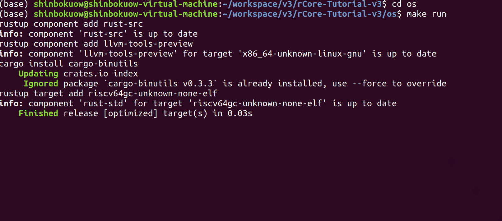
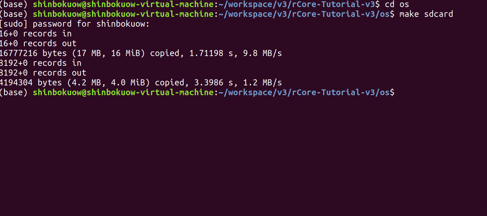
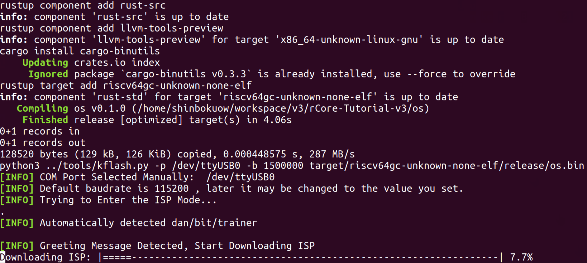

实验环境配置
============

.. toctree::
   :hidden:
   :maxdepth: 4

.. _setup-overview:

本节我们将完成实验环境配置并成功运行 rCore-Tutorial-v3。根据您的需求和操作系统，我们提供了多种配置方式，支持大多数 Linux 发行版、macOS、Windows 以及部分 RISC-V 开发板。

**配置步骤依赖关系：**

.. mermaid::

   flowchart LR
       Start(["开始"]) --> A1["本地原生配置"]
       Start --> A2["GitHub Classroom"]
       Start --> A3["Docker"]

       subgraph Stage1["阶段1: 基础环境准备"]
           direction TB
           A1 --> Stage1_1["阶段1.1: 基础依赖安装"]
           A2
           A3
       end

       Stage1_1 --> Stage2
       A2 --> Stage5
       A3 --> Stage5

       Stage2["阶段2: Rust工具链"] --> Stage3["阶段3: QEMU"]
       Stage3 --> Stage4["阶段4: IDE与调试支持"]
       Stage4 --> Stage5

       subgraph Stage5["阶段5: 运行项目"]
           I["QEMU运行"]
           J["K210真机运行"]
       end

       Stage5 --> End(["完成"])

       style Start fill:#fff9c4
       style Stage5 fill:#c8e6c9
       style End fill:#c8e6c9

**请从** :ref:`阶段1: 基础环境准备 <setup-stage1>` **开始阅读，根据您的实际情况选择适合的配置方案。**

.. _setup-stage1:

阶段1: 基础环境准备
-------------------------------------------------

本节提供多种环境配置方案，请根据您的实际情况选择一种：

1. :ref:`GitHub Classroom 线上环境 <setup-route-a>` —— 仅需浏览器，全平台通用
2. :ref:`Docker 快速通道 <setup-route-b>` —— 容器化环境，开箱即用
3. :ref:`本地原生配置 <setup-route-native>` —— 在本地安装Linux环境进行开发

其中 GitHub Classroom 和 Docker 方式配置完成后可直接进入 :ref:`阶段5: 运行项目 <setup-stage5>`；选择本地原生配置则需要继续完成 :ref:`阶段1.1: 基础依赖安装 <setup-stage1-1>` → :ref:`阶段2: Rust 工具链 <setup-stage2>` → :ref:`阶段3: QEMU <setup-stage3>` → :ref:`阶段4: IDE与调试支持 <setup-stage4>` → :ref:`阶段5: 运行项目 <setup-stage5>`

.. _setup-route-a:

GitHub Classroom 线上环境（全平台通用）
~~~~~~~~~~~~~~~~~~~~~~~~~~~~~~~~~~~~~~~~~~~~~~~~~~~~~~~~~~~~~

基于 github classroom，可方便建立开发用的 git repository，并可基于 github 的 codespace（在线版 ubuntu + vscode）在线开发使用。整个开发环境仅仅需要一个网络浏览器。

.. note::

   注：这种方式目前主要用于 `2022年开源操作系统训练营 <https://learningos.github.io/rust-based-os-comp2022/>`_

**适用场景:**

- 不想配置本地环境
- 网络条件良好
- 快速开始实验
- 任何操作系统

**配置步骤:**

1. 在网络浏览器中用自己的 github id 登录 github.com
2. 接收 `第一个实验练习 setup-env-run-os1 的github classroom在线邀请 <https://classroom.github.com/a/hnoWuKGF>`_，根据提示一路选择OK即可。
3. 完成第二步后，你的第一个实验练习 setup-env-run-os1 的 github repository 会被自动建立好，点击此 github repository 的链接，就可看到你要完成的第一个实验了。
4. 在你的第一个实验练习的网页的中上部可以看到一个醒目的 ``code`` 绿色按钮，点击后，可以进一步看到 ``codespace`` 标签和醒目的 ``create codesapce on main`` 绿色按钮。请点击这个绿色按钮，就可以进入到在线的ubuntu +vscode环境中
5. 再按照下面的环境安装提示在 vscode 的 ``console`` 中安装配置开发环境：rustc，qemu 等工具。注：也可在 vscode 的 ``console`` 中执行 ``make codespaces_setenv`` 来自动安装配置开发环境（执行 ``sudo`` 需要root权限，仅需要执行一次）。
6. **重要：** 在 vscode 的 ``console`` 中执行 ``make setupclassroom_testX`` （该命令仅执行一次，X的范围为 1-8）配置 github classroom 自动评分功能。
7. 然后就可以基于在线 vscode 进行开发、运行、提交等完整的实验过程了。

上述的3，4，5步不是必须的，你也可以仅仅基于 ``Github Classroom`` 生成 git repository，并进行本地开发。

**状态: ✅ 环境配置完成** —— 直接进入 :ref:`阶段5: 运行项目 <setup-stage5>`

.. _setup-route-b:

Docker 快速通道（全平台通用）
~~~~~~~~~~~~~~~~~~~~~~~~~~~~~~~~~~~~~~~~~~~~~~~~~~~~~~~~~~~~~

**适用场景:**

- 已安装 Docker Desktop
- 希望完全隔离的开发环境
- 不想手动编译 QEMU
- 任何操作系统

.. _link-docker-env:

.. note::

   **Docker 开发环境**

   感谢 qobilidop，dinghao188 和张汉东老师帮忙配置好的 Docker 开发环境，进入 Docker 开发环境之后不需要任何软件工具链的安装和配置，可以直接将 tutorial 运行起来，目前仅支持将 tutorial 运行在 QEMU 模拟器上。

**使用方法如下（以 Ubuntu18.04 为例）：**

1. 通过 ``su`` 切换到管理员账户 ``root`` （注：如果此前并未设置 ``root`` 账户的密码需要先通过 ``sudo passwd`` 进行设置），在 ``rCore-Tutorial-v3`` 根目录下，执行 ``make build_docker``，来建立基于docker的开发环境；
2. 在 ``rCore-Tutorial-v3`` 根目录下，执行 ``make docker`` 进入到 Docker 环境；
3. 进入 Docker 之后，会发现当前处于根目录 ``/``，我们通过 ``cd mnt`` 将当前工作路径切换到 ``/mnt`` 目录；
4. 通过 ``ls`` 可以发现 ``/mnt`` 目录下的内容和 ``rCore-Tutorial-v3`` 目录下的内容完全相同，接下来就可以在这个环境下运行 tutorial 了。例如 ``cd os && make run``。

**状态: ✅ 环境配置完成** —— 直接进入 :ref:`阶段5: 运行项目 <setup-stage5>`

.. _setup-route-native:

本地原生配置
~~~~~~~~~~~~~~~~~~~~~~~~~~~~~~~~~~~~~~~~~~~~~~~~~~~~~~~~~~~~~

选择本地原生配置后，根据您的操作系统或硬件环境选择具体方案：

- :ref:`Windows WSL2 <setup-route-c>` —— Windows 内置虚拟机（推荐）
- :ref:`Windows VMware <setup-route-d>` —— 传统虚拟机方案
- :ref:`macOS VMware/Parallels <setup-route-mac>` —— Mac 虚拟机方案
- :ref:`macOS 原生配置 <setup-route-macos-native>` —— 在macOS上直接配置开发环境
- :ref:`Linux 原生配置 <setup-route-linux>` —— 如当前安装的系统为 Ubuntu、OpenEuler、龙蜥操作系统等 linux 发行版，可直接安装依赖
- :ref:`RISC-V 硬件环境 <setup-route-riscv>` —— RV64硬件模拟或真机环境（适合hacker尝试）

无论选择哪种方案，后续都需要完成 :ref:`阶段1.1: 基础依赖安装 <setup-stage1-1>` → :ref:`阶段2: Rust 工具链 <setup-stage2>` → :ref:`阶段3: QEMU <setup-stage3>` → :ref:`阶段4: IDE与调试支持 <setup-stage4>` → :ref:`阶段5: 运行项目 <setup-stage5>`

.. _setup-route-c:

**Windows - WSL2（推荐）**

对于Windows10/11 的用户可以通过系统内置的 WSL2 虚拟机（请不要使用 WSL1）来安装 Ubuntu 18.04 / 20.04 。步骤如下：

- 升级 Windows 10/11 到最新版（Windows 10 版本 18917 或以后的内部版本）。注意，如果不是 Windows 10/11 专业版，可能需要手动更新，在微软官网上下载。升级之后，可以在 PowerShell 中输入 ``winver`` 命令来查看内部版本号。
- 「Windows 设置 > 更新和安全 > Windows 预览体验计划」处选择加入 "Dev 开发者模式"。
- 以管理员身份打开 PowerShell 终端并输入以下命令：

  .. code-block::

     # 启用 Windows 功能："适用于 Linux 的 Windows 子系统"
     >> dism.exe /online /enable-feature /featurename:Microsoft-Windows-Subsystem-Linux /all /norestart

     # 启用 Windows 功能："已安装的系统虚拟机平台"
     >> dism.exe /online /enable-feature /featurename:VirtualMachinePlatform /all /norestart

     # <Distro> 改为对应从微软应用商店安装的 Linux 版本名，比如：`wsl --set-version Ubuntu 2`
     # 如果你没有提前从微软应用商店安装任何 Linux 版本，请跳过此步骤
     >> wsl --set-version <Distro> 2

     # 设置默认为 WSL 2，如果 Windows 版本不够，这条命令会出错
     >> wsl --set-default-version 2

- `下载 Linux 内核安装包 <https://docs.microsoft.com/zh-cn/windows/wsl/install-win10#step-4---download-the-linux-kernel-update-package>`_
- 在微软商店（Microsoft Store）中搜索并安装 Ubuntu18.04 / 20.04。

**下一步:** 进入 WSL Ubuntu 终端，跳转到 :ref:`阶段1.1: 基础依赖安装 <setup-stage1-1>`

.. _setup-route-d:

**Windows - VMware Workstation**

适用场景: WSL2不可用或需要完整GUI

1. 下载预配置镜像:

   - `百度网盘链接 <https://pan.baidu.com/s/1yQHtQIXQUbHCbyqSPtuqqQ?pwd=pcxf>`_ 
   - `清华云盘链接 <https://cloud.tsinghua.edu.cn/d/a9b7b0a1b4724c3f9c66/>`_ （目前是旧版的 Ubuntu18.04+QEMU5.0的镜像）

2. VMware 中新建虚拟机，在设置虚拟磁盘的时候选择下载的 ``vmdk`` 格式的虚拟磁盘文件即可
3. 登录信息: 用户名 ``oslab``，密码为一个空格。它已经安装了中文输入法和作为 Rust 集成开发环境的 Visual Studio Code，能够更容易完成实验并撰写实验报告

如果想要使用 VMWare 安装 openEuler 虚拟机的话，可以在 `openEuler官网 <https://repo.openeuler.org/openEuler-20.03-LTS-SP2/ISO/>`_ 下载 ISO 自行安装，接着需要参考网络上的一些教程配置网络和安装图形界面。

**下一步:** 进入虚拟机终端，跳转到 :ref:`阶段1.1: 基础依赖安装 <setup-stage1-1>`

.. _setup-route-mac:

**macOS - VMware Fusion / Parallels**

1. 下载预配置 Ubuntu 镜像 (同 Windows VMware 镜像)
2. 导入虚拟机并启动

**下一步:** 进入虚拟机终端，跳转到 :ref:`阶段1.1: 基础依赖安装 <setup-stage1-1>`

.. _setup-route-macos-native:

**macOS - 原生配置**

适用场景: 不想使用虚拟机，直接在macOS上配置开发环境

macOS用户也可以直接在原生系统上配置开发环境，无需安装Linux虚拟机。macOS基于Unix，很多Linux工具都有对应的macOS版本或替代方案。

**安装 Homebrew（如未安装）:**

.. code-block:: bash

   /bin/bash -c "$(curl -fsSL https://raw.githubusercontent.com/Homebrew/install/HEAD/install.sh)"

**安装基础依赖:**

.. code-block:: bash

   brew install git curl wget python3 ninja-build \
       pkg-config glib pixman openssl automake libtool

注：macOS上的开发环境与Linux略有不同，但Rust工具链和QEMU的安装步骤基本一致，部分命令（如包管理相关命令）可能需要灵活调整。

**下一步:** 安装好基础依赖后，跳转到 :ref:`阶段1.1: 基础依赖安装 <setup-stage1-1>`

.. _setup-route-linux:

**Linux - 原生配置**

目前实验内容可支持在 `Ubuntu操作系统 <https://cdimage.ubuntu.com/releases/>`_、`openEuler操作系统 <https://repo.openeuler.org/openEuler-20.03-LTS-SP2/ISO/>`_、`龙蜥操作系统 <https://openanolis.cn/anolisos>`_ 等上面进行操作。

**下一步:** 直接在本地终端执行 :ref:`阶段1.1: 基础依赖安装 <setup-stage1-1>`

.. _setup-route-riscv:

**RISC-V 硬件环境**

目前已经出现了可以在RISC-V 64（简称RV64）的硬件模拟环境（比如QEMU with RV64）和真实物理环境（如全志哪吒D1开发板、SiFive U740开发板）的Linux系统环境。但Linux RV64相对于Linux x86-64而言，虽然挺新颖的，但还不够成熟，已经适配和预编译好的应用软件包相对少一些，适合hacker进行尝试。如果同学有兴趣，我们也给出多种相应的硬件模拟环境和真实物理环境的Linux for RV64发行版，以便于这类同学进行实验：

- `Ubuntu for RV64的QEMU和SiFive U740开发板系统镜像 <https://cdimage.ubuntu.com/releases/20.04.3/release/ubuntu-20.04.3-preinstalled-server-riscv64+unmatched.img.xz>`_
- `OpenEuler for RV64的QEMU系统镜像 <https://repo.openeuler.org/openEuler-preview/RISC-V/Image/openEuler-preview.riscv64.qcow2>`_
- `Debian for RV64的D1哪吒开发板系统镜像 <http://www.perfxlab.cn:8080/rvboards/RVBoards_D1_Debian_img_v0.6.1/RVBoards_D1_Debian_img_v0.6.1.zip>`_

注：后续的配置主要基于Linux for x86-64系统环境，如果同学采用Linux for RV64环境，需要自己配置。不过在同学比较熟悉的情况下，配置方法类似且更加简单。可能存在的主要问题是，面向Linux for RV64的相关软件包可能不全，这样需要同学从源码直接编译出缺失的软件包。

**下一步:** 完成环境配置后，跳转到 :ref:`阶段1.1: 基础依赖安装 <setup-stage1-1>`

.. _setup-stage1-1:

阶段1.1: 基础依赖安装（WSL/VMware/Linux/macOS共用）
~~~~~~~~~~~~~~~~~~~~~~~~~~~~~~~~~~~~~~~~~~~~~~~~~~~~~~~~~~~~~

**适用场景:**

- WSL2 Ubuntu 环境
- VMware Ubuntu 虚拟机
- 本地 Linux 系统
- macOS 原生环境（Homebrew）

C 开发环境配置
^^^^^^^^^^^^^^^^^^^^^^^^^^^^^^^^^^^^^^^^^^^^^

在实验或练习过程中，也会涉及部分基于C语言的开发，可以安装基本的本机开发环境和交叉开发环境。下面是以Ubuntu 20.04为例，需要安装的C 开发环境涉及的软件：

.. code-block:: bash

   $ sudo apt-get update && sudo apt-get upgrade
   $ sudo apt-get install git build-essential gdb-multiarch qemu-system-misc gcc-riscv64-linux-gnu binutils-riscv64-linux-gnu

注：上述软件不是Rust开发环境所必须的。且ubuntu 20.04的QEMU软件版本低，而本书实验需要安装7.0以上版本的QEMU。

**下一步:** 继续到 :ref:`阶段2: Rust 工具链安装 <setup-stage2>`

.. _setup-stage2:

阶段2: Rust 工具链安装（必需）
-------------------------------------------------

首先安装 Rust 版本管理器 rustup 和 Rust 包管理器 cargo，这里我们用官方的安装脚本来安装：

.. code-block:: bash

   curl --proto '=https' --tlsv1.2 -sSf https://sh.rustup.rs | sh

如果通过官方的脚本下载失败了，请检查设备/命令行环境网络状况，也可以在浏览器的地址栏中输入 `<https://sh.rustup.rs>`_ 来下载脚本，在本地运行即可。

如果官方的脚本在运行时出现了网络速度较慢的问题，可选地可以通过修改 rustup 的镜像地址（修改为中国科学技术大学的镜像服务器）来加速：

.. code-block:: bash
   
   export RUSTUP_DIST_SERVER=https://mirrors.ustc.edu.cn/rust-static
   export RUSTUP_UPDATE_ROOT=https://mirrors.ustc.edu.cn/rust-static/rustup
   curl --proto '=https' --tlsv1.2 -sSf https://sh.rustup.rs | sh

或者使用tuna源来加速 `参见 rustup 帮助 <https://mirrors.tuna.tsinghua.edu.cn/help/rustup/>`_：

.. code-block:: bash
   
   export RUSTUP_DIST_SERVER=https://mirrors.tuna.edu.cn/rustup
   export RUSTUP_UPDATE_ROOT=https://mirrors.tuna.edu.cn/rustup/rustup
   curl --proto '=https' --tlsv1.2 -sSf https://sh.rustup.rs | sh

安装完成后，我们可以重新打开一个终端来让之前设置的环境变量生效。我们也可以手动将环境变量设置应用到当前终端，只需要输入以下命令：

.. code-block:: bash

   source $HOME/.cargo/env

接下来，我们可以确认一下我们正确安装了 Rust 工具链：

.. code-block:: bash
   
   rustc --version

可以看到当前安装的工具链的版本。

.. code-block:: bash

   rustc 1.62.0-nightly (1f7fb6413 2022-04-10)

.. warning::
   目前用于操作系统实验开发的 rustc 编译器的版本不局限在 1.46.0 这样的数字上，你可以选择更新版本的 rustc 编译器。但注意只能用 rustc 的 nightly 类型的版本。

可通过如下命令安装 rustc 的 nightly 版本，并把该版本设置为 rustc 的缺省版本。

.. code-block:: bash
   
   rustup install nightly
   rustup default nightly

我们最好把软件包管理器 cargo 所用的软件包镜像地址 crates.io 也换成中国科学技术大学的镜像服务器来加速三方库的下载。我们打开（如果没有就新建） ``~/.cargo/config`` 文件，并把内容修改为：

.. code-block:: toml

   [source.crates-io]
   registry = "https://github.com/rust-lang/crates.io-index"
   replace-with = 'ustc'
   [source.ustc]
   registry = "git://mirrors.ustc.edu.cn/crates.io-index"

同样，也可以使用tuna源 `参见 crates.io 帮助 <https://mirrors.tuna.tsinghua.edu.cn/help/crates.io-index.git/>`_：

.. code-block:: toml

   [source.crates-io]
   replace-with = 'tuna'

   [source.tuna]
   registry = "https://mirrors.tuna.tsinghua.edu.cn/git/crates.io-index.git"

接下来安装一些Rust相关的软件包

.. code-block:: bash

   rustup target add riscv64gc-unknown-none-elf
   cargo install cargo-binutils
   rustup component add llvm-tools-preview
   rustup component add rust-src

.. warning::
   如果你换了另外一个rustc编译器（必须是nightly版的），需要重新安装上述rustc所需软件包。rCore-Tutorial 仓库中的 ``Makefile`` 包含了这些工具的安装，如果你使用 ``make run`` 也可以不手动安装。

**下一步:** 继续到 :ref:`阶段3: QEMU 安装 <setup-stage3>`

.. _setup-stage3:

阶段3: QEMU 7.0+ 安装（必需）
-------------------------------------------------

我们需要使用 QEMU 7.0 版本进行实验，低版本的 QEMU 可能导致框架代码不能正常运行。而很多 Linux 发行版的软件包管理器默认软件源中的 QEMU 版本过低，因此我们需要从源码手动编译安装 QEMU 模拟器软件。下面以 Ubuntu 18.04/20.04 上的安装流程为例进行说明：

.. warning::

   注意，如果安装了 QEMU 6.0+ 版本，则目前需要将项目目录下的 bootloader（也即 RustSBI）更新为最新的 0.2.0-alpha.6 版本。它们目前可以在 ``chX-dev`` 分支中找到。

首先我们安装依赖包，获取 QEMU 源代码并手动编译：

.. code-block:: bash

   # 安装编译所需的依赖包
   sudo apt install autoconf automake autotools-dev curl libmpc-dev libmpfr-dev libgmp-dev \
                 gawk build-essential bison flex texinfo gperf libtool patchutils bc \
                 zlib1g-dev libexpat-dev pkg-config  libglib2.0-dev libpixman-1-dev libsdl2-dev libslirp-dev \
                 git tmux python3 python3-pip ninja-build 
   # 下载源码包 
   # 如果下载速度过慢可以使用我们提供的百度网盘链接：https://pan.baidu.com/s/1dykndFzY73nqkPL2QXs32Q 
   # 提取码：jimc 
   wget https://download.qemu.org/qemu-7.0.0.tar.xz
   # 解压
   tar xvJf qemu-7.0.0.tar.xz
   # 编译安装并配置 RISC-V 支持
   cd qemu-7.0.0
   ./configure --target-list=riscv64-softmmu,riscv64-linux-user  # 在第九章的实验中，可以有图形界面和网络。如果要支持图形界面，可添加 " --enable-sdl" 参数；如果要支持网络，可添加 " --enable-slirp" 参数
   make -j$(nproc)

.. note::
   
   注意，上面的依赖包可能并不完全，比如在 Ubuntu 18.04 上：

   - 出现 ``ERROR: pkg-config binary 'pkg-config' not found`` 时，可以安装 ``pkg-config`` 包；
   - 出现 ``ERROR: glib-2.48 gthread-2.0 is required to compile QEMU`` 时，可以安装 ``libglib2.0-dev`` 包；
   - 出现 ``ERROR: pixman >= 0.21.8 not present`` 时，可以安装 ``libpixman-1-dev`` 包。

   另外一些 Linux 发行版编译 QEMU 的依赖包可以从 `这里 <https://risc-v-getting-started-guide.readthedocs.io/en/latest/linux-qemu.html#prerequisites>`_ 找到。

之后我们可以在同目录下 ``sudo make install`` 将 QEMU 安装到 ``/usr/local/bin`` 目录下，但这样经常会引起冲突。个人来说更习惯的做法是，编辑 ``~/.bashrc`` 文件（如果使用的是默认的 ``bash`` 终端），在文件的末尾加入几行：

.. code-block:: bash

   # 请注意，qemu-7.0.0 的父目录可以随着你的实际安装位置灵活调整
   export PATH=$PATH:/path/to/qemu-7.0.0/build

随后即可在当前终端 ``source ~/.bashrc`` 更新系统路径，或者直接重启一个新的终端。

此时我们可以确认 QEMU 的版本：

.. code-block:: bash

   qemu-system-riscv64 --version
   qemu-riscv64 --version

在其他缺少预编译 QEMU with RV64 软件包的Linux x86-64 环境（如openEuler操作系统）上，首先需要从 openEuler 社区维护的 QEMU 的 `riscv分支 <https://gitee.com/src-openeuler/qemu/tree/riscv/>`_ 下载 QEMU 源码，并直接通过 rpmbuild 进行构建。

.. warning::

   请尽量不要安装 ``qemu-kvm``，这可能会导致我们的框架无法正常运行。如果已经安装，可以考虑换用 :ref:`Docker <setup-route-b>`。

   另外，我们仅在 Qemu 7.0.0 版本上进行了测试，请尽量不要切换到其他版本。

**下一步:** 可选组件，跳转到 :ref:`阶段4: IDE与调试支持 <setup-stage4>` 或直接到 :ref:`阶段5: 运行项目 <setup-stage5>`

.. _setup-stage4:

阶段4: IDE与调试支持
-------------------------------------------------

.. _setup-stage4-ide:

IDE 配置
~~~~~~~~~~~~~~~~~~~~~~~~~~~~~~~~~~~~~~~~~~~~~~~~~~~~~~~~~~~~~

推荐以下集成开发环境（IDE）用于 Rust 开发：

**JetBrains CLion + Rust插件**

- CLion 是 JetBrains 出品的专业 C/C++ IDE，配合 Rust 插件可以提供优秀的 Rust 开发体验
- 付费商业软件，但学生和教师可在 JetBrains 网站注册账号申请免费使用（约半年期限）

**Visual Studio Code**

- 开源免费，推荐使用以下插件：

  - `rust-analyzer`：Rust 语言支持
  - `RISC-V Support`：RISC-V 汇编支持

**其他编辑器**

- VIM、Emacs 等传统编辑器同样可以用于开发

.. _setup-stage4-gdb:

GDB 调试支持
~~~~~~~~~~~~~~~~~~~~~~~~~~~~~~~~~~~~~~~~~~~~~~~~~~~~~~~~~~~~~

目前我们仅支持基于 QEMU 模拟器进行调试。在 ``os`` 目录下 ``make debug`` 可以调试我们的内核，这需要安装终端复用工具 ``tmux``，还需要支持 riscv64 指令集的 gdb 调试器 ``riscv64-unknown-elf-gdb``。该调试器包含在 riscv64 gcc 工具链中，工具链的预编译版本可以在如下链接处下载：

- `Ubuntu 环境 <https://static.dev.sifive.com/dev-tools/riscv64-unknown-elf-gcc-8.3.0-2020.04.1-x86_64-linux-ubuntu14.tar.gz>`_
- `macOS 环境 <https://static.dev.sifive.com/dev-tools/riscv64-unknown-elf-gcc-8.3.0-2020.04.1-x86_64-apple-darwin.tar.gz>`_
- `Windows 环境 <https://static.dev.sifive.com/dev-tools/riscv64-unknown-elf-gcc-8.3.0-2020.04.1-x86_64-w64-mingw32.zip>`_
- `CentOS 环境 <https://static.dev.sifive.com/dev-tools/riscv64-unknown-elf-gcc-8.3.0-2020.04.1-x86_64-linux-centos6.tar.gz>`_

最新版的工具链可以在 `sifive 官方的 repo 中 <https://github.com/sifive/freedom-tools/releases>`_ 找到。

解压后在 ``bin`` 目录下即可找到 ``riscv64-unknown-elf-gdb`` 以及另外一些常用工具 ``objcopy/objdump/readelf`` 等。

在其他缺少预编译 riscv64 gcc 工具链的 Linux x86-64 环境（如 openEuler 操作系统、龙蜥操作系统等）上，则需要 clone `riscv 工具链仓库 <https://github.com/riscv-collab/riscv-gnu-toolchain>`_ 并参考其说明手动构建。

出于某些原因，我们全程使用 ``release`` 模式进行构建。为了正常进行调试，请确认各项目（如 ``os``，``user`` 和 ``easy-fs``）的 ``Cargo.toml`` 中包含如下配置：

.. code-block:: toml

   [profile.release]
   debug = true

此外，参考 ``os/Makefile``，还可以先打开一个终端页面 ``make gdbserver`` 启动 QEMU，此后另开一个终端页面在同目录下 ``make gdbclient`` 将 GDB 客户端连接到 QEMU 进行调试。我们推荐使用 `gdb-dashboard <https://github.com/cyrus-and/gdb-dashboard>`_ 插件，可以大大提升调试体验。在本节的评论区已有同学提供了基于各种 IDE 的调试方法，也可参考。

**下一步:** :ref:`阶段5: 运行项目 <setup-stage5>`

.. _setup-stage5:

阶段5: 运行 rCore-Tutorial-v3
-------------------------------------------------

在 QEMU 模拟器上运行
~~~~~~~~~~~~~~~~~~~~~~~~~~~~~~~~~~~~~~~~~~~~~~~~~~~~~~~~~~~~~

如果是在 QEMU 模拟器上运行，只需在 ``os`` 目录下 ``make run`` 即可。在内核加载完毕之后，可以看到目前可以用的应用程序。 ``usertests`` 打包了其中的很大一部分，所以我们可以运行它，只需输入在终端中输入它的名字即可。

之后，可以先按下 ``Ctrl+a`` （即：先按下 Ctrl 不松开，再按下小写字母 a 不放，随后同时将两个键松开），再按下 ``x`` 来退出 QEMU。

.. _setup-stage5-k210:

在 K210 平台上运行
~~~~~~~~~~~~~~~~~~~~~~~~~~~~~~~~~~~~~~~~~~~~~~~~~~~~~~~~~~~~~

如果是在 K210 平台上运行则略显复杂。首先需要安装基于 Python 的串口通信库和简易的串口终端：

.. code-block:: bash

   pip3 install pyserial
   sudo apt install python3-serial

**准备 MicroSD 卡**

首先，我们需要将 MicroSD 插入 PC 来将文件系统镜像拷贝上去。

.. warning::

   在 ``os/Makefile`` 中我们默认设置 MicroSD 在当前操作系统中可以用设备 ``SDCARD=/dev/sdb`` 访问。你可以使用 ``df -hT`` 命令来确认在你的环境中 MicroSD 是哪个设备，并在 ``make sdcard`` 之前对 ``os/Makefile`` 的 ``SDCARD`` 配置做出适当的修改。不然，这有可能导致 **设备 /dev/sdb 上数据丢失**！
   
随后，我们将 MicroSD 插入 K210 开发板，将 K210 开发板连接到 PC，然后进入 ``os`` 目录 ``make run BOARD=k210`` 在 K210 开发板上跑 rCore Tutorial。

之后，可以按下 ``Ctrl+]`` 来退出串口终端。

由于教程的 ch1~ch5 分支还没有文件系统，在 K210 上运行这些分支无需 MicroSD 卡也不需要进行文件系统镜像烧写工作，直接切换到 `os` 目录下 `make run BOARD=k210` 即可。

到这里，恭喜你完成了实验环境的配置，可以开始阅读教程的正文部分了！

Q & A
-------------------------------------------------

当代码跑不起来的时候，可以尝试：

- 分支是否与 rCore-Tutorial-v3 原版仓库（而非 fork 出来的仓库）的对应分支同步。如不同步的话考虑通过 ``git pull`` 进行更新。注：这是因为 Rust 的版本更迭较快，如不及时更新的话曾经能正常运行的代码也会无法运行。
- 项目根目录下的 ``rust-toolchain`` 非常重要，它代表整个项目采用的 Rust 工具链版本。请务必保持其与原版仓库对应分支一致。
- 项目根目录下是否存在放置 RustSBI 的 ``bootloader/`` 目录。如不存在的话可从原版仓库的各分支上获取。
- 通过 ``make clean`` 或者 ``cargo clean`` 删除 ``os`` 或 ``user`` 目录下的构建产物，并重新 ``make run``。注：出现这样的问题通常说明框架的构建脚本存在 bug，可以提 issue。

如果怀疑遇到了网络问题，可以检查：

- 请按照本节说明进行 Rust 安装和 crates.io 镜像配置。通常情况下能够解决 Rust 工具链更新和下载已发布到 crates.io 上库的问题。
- 如果发现在试图从 github 上下载下述几个库的时候卡死，可以修改 ``os`` 和 ``user`` 目录下的 ``Cargo.toml`` 替换为 gitee 上的镜像。例如，将：
  
   .. code-block:: toml

      riscv = { git = "https://github.com/rcore-os/riscv", features = ["inline-asm"] }
      virtio-drivers = { git = "https://github.com/rcore-os/virtio-drivers" }
      k210-pac = { git = "https://github.com/wyfcyx/k210-pac" }
      k210-hal = { git = "https://github.com/wyfcyx/k210-hal" }
      k210-soc = { git = "https://github.com/wyfcyx/k210-soc" }
   
  替换为：

   .. code-block:: toml

      riscv = { git = "https://gitee.com/rcore-os/riscv", features = ["inline-asm"] }
      virtio-drivers = { git = "https://gitee.com/rcore-os/virtio-drivers" }
      k210-pac = { git = "https://gitee.com/wyfcyx/k210-pac" }
      k210-hal = { git = "https://gitee.com/wyfcyx/k210-hal" }
      k210-soc = { git = "https://gitee.com/wyfcyx/k210-soc" }
