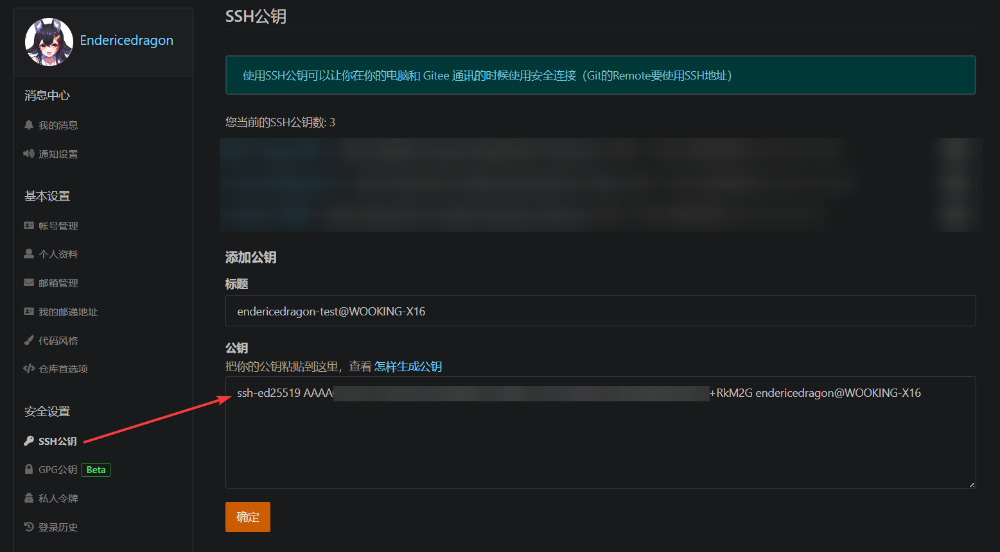
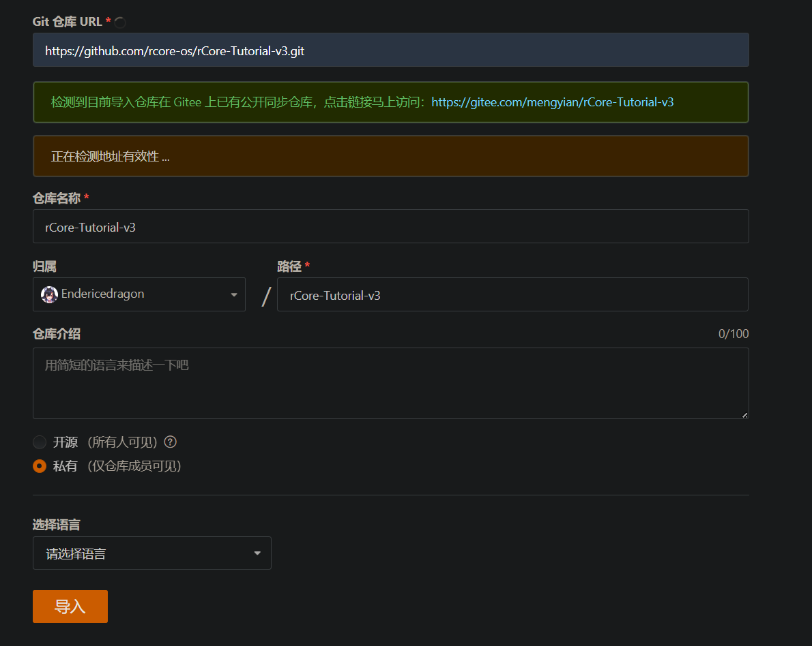
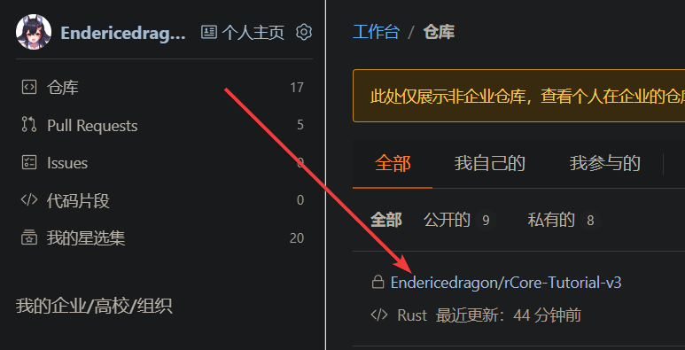
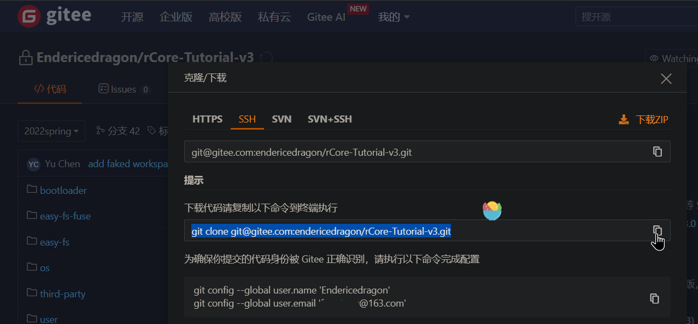

rCore环境配置指南
=================

.. toctree::
   :hidden:
   :maxdepth: 4
.. _wsl-quick-setup:

欢迎各位同学学习rCore。本文中，笔者将与各位一同完成rCore实验的环境配置步骤，帮助各位打造舒适的开发环境，进而带来更好的开发体验。

1. 配置Linux环境
----------------

运行rCore需要在Linux环境下，因此在本节中，我们将在Windows操作系统下配置Linux环境。若您的电脑上运行的已经是Linux，可以酌情跳过本节。

在Windows下使用Linux有许多方案。不过，综合简便程度、开发体验等因素，笔者强烈推荐使用微软提供的第2代Linux子系统功能（Windows
Subsystem Linux 2，下简称WSL 2）。与WSL
2相关的文档陈列如下，方便各位自行取用：

1. `适用于 Linux 的 Windows 子系统文档 \| Microsoft Learn <https://learn.microsoft.com/zh-cn/windows/wsl/>`_
2. `安装 WSL \| Microsoft Learn <https://learn.microsoft.com/zh-cn/windows/wsl/install>`_
3. `轻松搬迁！教你如何将WSL从C盘迁移到其他盘区，释放存储空间！ - 知乎 (zhihu.com) <https://zhuanlan.zhihu.com/p/621873601>`_
4. `使用 WSL 访问网络应用程序 \| Microsoft Learn <https://learn.microsoft.com/zh-cn/windows/wsl/networking#accessing-linux-networking-apps-from-windows-localhost>`_

1.1 一行指令安装WSL和最新版Ubuntu
~~~~~~~~~~~~~~~~~~~~~~~~~~~~~~~~~

在本节中，我们最关心的是2号文档，即“安装WSL”的方法。

   可能有同学会疑惑：这儿怎么说的都是WSL，不是WSL
   2呢？原因在于，WSL的1代已经被微软废弃。因此，若无特指，在较新文档资料中的WSL均指代WSL
   2。

2号文档指出，在一台从未使用过WSL 2的Windows电脑上启用WSL
2，只需在PowerShell中执行一行代码：

.. code:: bash

   wsl --install

这条指令将自动启用WSL
2所需的全部系统功能，然后安装受微软支持的最新LTS版Ubuntu（其中，LTS为长期支持Long-Term
Support的缩写）。截至笔者撰写此指南时（2024.8.26），该版本为\ ``Ubuntu-24.04 LTS``\ 。

安装完成后，会自动进入Ubuntu中，提示各位设置用户名和密码。在键入密码时，屏幕上不会有任何显示，这是正常情况，无需惊慌。

1.2 【可选】安装WSL和指定Linux发行版
~~~~~~~~~~~~~~~~~~~~~~~~~~~~~~~~~~~~

正如前文所言，一行指令安装方法会安装时下最新的系统版本。然而，我们不能保证rCore的代码在最新版系统上也能完美运行。因此，笔者认为有必要提及指定Linux发行版的安装方法。

首先使用下列指令，安装裸WSL 2而不安装任何Linux发行版。

.. code:: bash

   wsl --install --no-distribution

待裸WSL 2安装完成之后，键入如下指令，让WSL
2联网搜索并显示它支持的所有Linux发行版：

.. code:: bash

   wsl --list --online

随后，形如如下所示的输出将被显示：

::

   以下是可安装的有效分发的列表。
   使用 'wsl.exe --install ' 安装。

   NAME                            FRIENDLY NAME
   Ubuntu                          Ubuntu
   Debian                          Debian GNU/Linux
   kali-linux                      Kali Linux Rolling
   Ubuntu-18.04                    Ubuntu 18.04 LTS
   Ubuntu-20.04                    Ubuntu 20.04 LTS
   Ubuntu-22.04                    Ubuntu 22.04 LTS
   Ubuntu-24.04                    Ubuntu 24.04 LTS
   OracleLinux_7_9                 Oracle Linux 7.9
   OracleLinux_8_7                 Oracle Linux 8.7
   OracleLinux_9_1                 Oracle Linux 9.1
   openSUSE-Leap-15.6              openSUSE Leap 15.6
   SUSE-Linux-Enterprise-15-SP5    SUSE Linux Enterprise 15 SP5
   SUSE-Linux-Enterprise-15-SP6    SUSE Linux Enterprise 15 SP6
   openSUSE-Tumbleweed             openSUSE Tumbleweed

由于笔者是使用\ ``Ubuntu 22.04 LTS``\ 完成了rCore实验，因此笔者选择该版本进行安装。键入如下指令，安装这个发行版：

.. code:: bash

   wsl --install Ubuntu-22.04

..

   注意：这里的Ubuntu-22.04来自于上个指令输出的NAME一列，而非来自FRIENDLY
   NAME一列。

待安装完成后，如上一节所述设置用户名和密码即可。

2. 安装Rust工具链
-----------------

rCore是一个利用Rust编程语言写就的教学操作系统，得益于Rust编程语言的优良特性，rCore在运行效率、内存安全性上也优于其它用C语言编写的教学操作系统。本节中，我们将在刚刚创建好的Linux环境中安装Rust编程语言的工具链（下简称Rust工具链）。

首先，前往\ `入门 - Rust 程序设计语言
(rust-lang.org) <https://www.rust-lang.org/zh-CN/learn/get-started>`__\ ，下滑至“Windows
的 Linux 子系统（WSL）”小标题处，看到如下的安装命令：

.. code:: bash

   curl --proto '=https' --tlsv1.2 -sSf https://sh.rustup.rs | sh

..

   Rust的官方下载源速度较慢。为防止因安装速度过慢而浇灭了同学们的学习兴致，设置国内镜像，从而加速Rust工具链安装还是很有必要的。

   在Ubuntu的命令行界面中，输入：

   .. code:: bash

      export RUSTUP_UPDATE_ROOT=https://mirrors.cernet.edu.cn/rustup/rustup
      export RUSTUP_DIST_SERVER=https://mirrors.cernet.edu.cn/rustup

   ..

      这俩网址来自于有名的镜像站\ `Mirror
      Z <https://help.mirrors.cernet.edu.cn/>`__\ ，同学们如果有其他镜像需求，亦可前往查看。

   然后再运行上文提及的\ ``curl ...``\ 安装命令，就会发现速度飞快了。

静候指令运行，直至出现形如下列输出：

::

   You can uninstall at any time with rustup self uninstall and
   these changes will be reverted.

   Current installation options:

      default host triple: x86_64-unknown-linux-gnu
        default toolchain: stable (default)
                  profile: default
     modify PATH variable: yes

   1) Proceed with standard installation (default - just press enter)
   2) Customize installation
   3) Cancel installation
   >

这是安装程序在询问安装选项。我们使用默认设置即可，因此直接按下回车键，安装程序将会自动完成后续的安装。

2.1 进一步配置nightly环境
~~~~~~~~~~~~~~~~~~~~~~~~~

Rust工具链有两大分支：稳定版stable和非稳定测试版nightly。Rust安装程序默认安装的是stable版本，但是nightly版本提供了一些rCore需要的独有功能。因此，我们还需要执行下面两条命令，安装时下最新的nightly版工具链，并设置为默认：

.. code:: bash

   rustup install nightly  # 安装nightly工具链
   rustup default nightly  # 将刚刚装好的nightly工具链设为默认

3. 安装rCore所需的其他环境
--------------------------

本节内容是对\ `实验环境配置 - rCore-Tutorial-Book-v3 3.6.0-alpha.1 文档
(rcore-os.cn) <https://rcore-os.cn/rCore-Tutorial-Book-v3/chapter0/5setup-devel-env.html>`__\ （叙述比较混乱）的再整理。

3.1 【可选】配置crates.io镜像源
~~~~~~~~~~~~~~~~~~~~~~~~~~~~~~~

首先用Ubuntu自带的文本编辑器nano打开\ ``~/.cargo/config.toml``\ 配置文件：

.. code:: bash

   nano ~/.cargo/config.toml

在打开的编辑窗口中输入如下内容，然后依次按Ctrl+O，回车（保存内容到文件），Ctrl+X（退出）。

.. code:: toml

   [source.crates-io]
   replace-with = 'mirror'

   [source.mirror]
   registry = "sparse+https://mirrors.cernet.edu.cn/crates.io-index/"

3.2 安装编译rCore的必须组件
~~~~~~~~~~~~~~~~~~~~~~~~~~~

首先需要为Ubuntu安装一些编译工作会用到的通用组件。这些组件可以通过下列命令来安装：

.. code:: bash

   # 安装编译所需的依赖包
   sudo apt install autoconf automake autotools-dev curl libmpc-dev libmpfr-dev libgmp-dev \
                 gawk build-essential bison flex texinfo gperf libtool patchutils bc \
                 zlib1g-dev libexpat-dev pkg-config  libglib2.0-dev libpixman-1-dev libsdl2-dev libslirp-dev \
                 git tmux python3 python3-pip ninja-build

要编译rCore，还需要安装一些其他的组件。这些组件可以通过下列命令来安装：

.. code:: bash

   rustup target add riscv64gc-unknown-none-elf
   cargo install cargo-binutils
   rustup component add llvm-tools-preview
   rustup component add rust-src

rCore是运行在RISC-V架构CPU上的操作系统，这与主流的X86架构电脑并不相同，因此我们需要在虚拟机中运行rCore。本实验选择Qemu虚拟机的7.0.0版本，其安装方法如下：

.. code:: bash

   # 下载Qemu模拟器的源码包
   wget https://download.qemu.org/qemu-7.0.0.tar.xz
   # 解压
   tar xvJf qemu-7.0.0.tar.xz
   # 编译安装并配置 RISC-V 支持
   cd qemu-7.0.0
   ./configure --target-list=riscv64-softmmu,riscv64-linux-user  # 在第九章的实验中，可以有图形界面和网络。如果要支持图形界面，可添加 " --enable-sdl" 参数；如果要支持网络，可添加 " --enable-slirp" 参数
   make -j$(nproc)

待编译完成后，关注最后一行输出：

::

   make[1]: Leaving directory '/home/endericedragon/qemu-7.0.0/build'

将上述build目录添加到环境变量\ ``PATH``\ 中：

.. code:: bash

   # 用nano编辑器打开~/.bashrc
   nano ~/.bashrc
   # 在打开的编辑器页面中，不停往下滚动到文件末尾，追加下面一行：
   export PATH=$PATH:/home/endericedragon/qemu-7.0.0/build
   # 按Ctrl + O, 回车, Ctrl + X保存退出

4. 启程：下载并运行rCore
------------------------

rCore的代码以“代码仓库”的形式托管在GitHub上。这是一个全球性的代码托管平台，托管着来自世界各地的代码。想获取rCore的源代码进行实验，就必须安装、配置并学习使用Git。

4.1 为Ubuntu安装并配置Git
~~~~~~~~~~~~~~~~~~~~~~~~~

Git是一个用于版本控制的命令行工具，允许开发者方便地管理源代码。Git的使用有一些门槛，若以往从未使用过Git，笔者推荐以下学习资源：

-  廖雪峰编写的Git教程：\ `Git教程 - 廖雪峰的官方网站
   (liaoxuefeng.com) <https://liaoxuefeng.com/books/git/introduction/index.html>`__
-  在线练习各种Git命令：\ `Learn Git
   Branching <https://learngitbranching.js.org/?locale=zh_CN>`__

实际上，在上文的步骤中，我们已经在Ubuntu中安装了Git了。保险起见，笔者将安装Git的命令放在这里，供各位取用：

.. code:: bash

   sudo apt install git

安装完成后，在命令行中执行\ ``git --version``\ 命令，应该能看到形似如下的版本号信息：

::

   git version 2.43.0

4.2 配置SSH密钥对
~~~~~~~~~~~~~~~~~

假设我们即将从某个代码托管平台（例如前文提及的GitHub，国内的Gitee和Gitcode等）拉取（pull）代码。平台为保证托管于其上的“代码仓库”的安全，往往会要求拉取代码者提供身份验证信息，具体体现为要求各位在拉取时输入用户名密码等内容。若是有频繁拉取、推送（push）代码的需求，每一次操作都需要验证一次身份，岂不太费劲了？

SSH密钥对可以帮助简化这个流程。我们在本地生成一个密钥对（包含一个公钥和一个私钥，若有兴趣可以网络搜索“非对称加密”深入了解），事先把公钥告诉代码托管平台。在推送/拉取代码时，Git将自动利用本地的私钥对这次操作进行“签名”，托管平台收到操作请求后，就可以利用这个签名和公钥进行验证，从而明确操作发起人的身份。由于这个过程无需人为干预，因此比不使用SSH密钥对的朴素办法（HTTPS）方便很多。

在Ubuntu中，输入命令\ ``ssh-keygen``\ ，接下来如下操作：

::

   Generating public/private ed25519 key pair.
   Enter file in which to save the key (/home/endericedragon/.ssh/id_ed25519):

这是在询问存放密钥对的路径，我们保持默认即可，直接按回车：

::

   Created directory '/home/endericedragon/.ssh'.
   Enter passphrase (empty for no passphrase):

这是在询问保护密钥对的密码，留空即可（若不留空，则每次拉取推送代码时会要求输入这个密码，比较麻烦），直接按回车：

::

   Enter same passphrase again:

这是在再次询问保护密钥对的密码，继续留空，按回车：

::

   Your identification has been saved in /home/endericedragon/.ssh/id_ed25519
   Your public key has been saved in /home/endericedragon/.ssh/id_ed25519.pub
   The key fingerprint is:
   SHA256:yyzoDJHPqBPQsIPcwOO9lu1tb0q6MN2Ow2xwKAMXDM4 endericedragon@WOOKING-X16
   The key's randomart image is:
   +--[ED25519 256]--+
   /* -- snip -- */
   +----[SHA256]-----+

此时，密钥对已经成功生成啦。若想查看生成的公钥长啥样，请在命令行中输入：

::

   cat ~/.ssh/id_rsa.pub

该命令会读取\ ``~/.ssh/id_rsa.pub``\ 文件的内容并将内容展示到命令行中。笔者的公钥的片段如下：

::

   ssh-ed25519 AAAA...+RkM2G endericedragon@WOOKING-X16

最后一步，将生成的公钥告诉托管平台。本节以国内的代码托管平台Gitee进行演示，其他平台的过程大同小异。注册Gitee账号之后，单击右上角头像，选择“账号设置”，在新打开的设置页面的左侧找到“SSH公钥”一栏，在第二个框中输入我们生成的公钥，第一个公钥标题框将会自动填充上内容（若不满意标题，也可以自行修改）。最后点击确定，Gitee可能会要求输入当前Gitee账户的密码，完成后新公钥将会出现在输入框上方的列表中。

   将公钥提交到代码托管平台

至此，我们已做好万全准备，进行代码拉取了。

4.3 将rCore拉取至本地
~~~~~~~~~~~~~~~~~~~~~

由于GitHub在国内访问并不稳定，故想要方便地从GitHub上拉取（pull）代码，需要进行一些曲线救国的手段，例如将代码仓库导入到国内的代码托管平台上。此处仍以Gitee作为演示对象，其他托管平台的操作亦大同小异。

首先访问\ `rCore的代码仓库 <https://github.com/rcore-os/rCore-Tutorial-v3>`__\ ，获取其拉取链接。考虑到访问GitHub可能有困难，笔者将其拉取链接放于此处，供各位取用：

::

   https://github.com/rcore-os/rCore-Tutorial-v3.git

接着访问Gitee，在右上角头像处打开下拉菜单，找到如下图所示的选项，单击进入。

   导入GitHub仓库到Gitee

接下来，在新打开的页面的“Git仓库URL”中输入rCore的拉取链接，接下来的内容都将被自动填好，点击页面下方的“确定”，静候导入完成。

   填写待导入仓库的信息

导入完成后，在Gitee首页的左上角，点击“仓库”即可看到刚刚导入的rCore代码仓库了。

   查看已导入的Gitee仓库

点击进入仓库，再点按右上角的\ **橙色“克隆/下载”**\ 按钮弹出如下界面，直接复制图中高亮的命令到Ubuntu命令行中执行即可。

   克隆已导入的Gitee仓库

4.4 运行rCore
~~~~~~~~~~~~~

终于要开启rCore之旅的处女航啦！在命令行中，进入刚才被\ ``git clone``\ 到本地的rCore代码仓库：

.. code:: bash

   cd rCore-Tutorial-v3/

输入\ ``ls``\ 指令，可以看到在\ ``rCore-Tutorial-v3``\ 文件夹（目录）下有很多东西：

.. code:: bash

   ls
   # 输出如下：
   Cargo.toml.txt  LICENSE   README.md   dev-env-info.md  easy-fs-fuse  rust-toolchain  user
   Dockerfile      Makefile  bootloader  easy-fs          os            third-party

Git的代码仓库可以有很多个分支，每个分支都可以拥有各自不同的代码。本节将使用\ ``ch1``\ 分支中的rCore代码，该代码实现了一个向终端输出字符“Hello,
world!”的简单操作系统。首先切换到这个分支：

.. code:: bash

   git switch ch1

看到如下提示，说明切换成功：

::

   branch 'ch1' set up to track 'origin/ch1'.
   Switched to a new branch 'ch1'

继续进入\ ``os``\ 目录，并运行rCore：

.. code:: bash

   cd os
   make run

静候编译进度条走完。这个过程包括安装rCore指定版本的Rust工具链，为这个工具链配置必要的组件等，因此会花费比较多的时间。如果因为网络问题导致进度缓慢，目前除科学上网以外，尚无很好的解决方案，可以多试几次。最终看到如下的输出：

::

   [rustsbi] RustSBI version 0.3.1, adapting to RISC-V SBI v1.0.0
   .______       __    __      _______.___________.  _______..______   __
   |   _  \     |  |  |  |    /       |           | /       ||   _  \ |  |
   |  |_)  |    |  |  |  |   |   (----`---|  |----`|   (----`|  |_)  ||  |
   |      /     |  |  |  |    \   \       |  |      \   \    |   _  < |  |
   |  |\  \----.|  `--'  |.----)   |      |  |  .----)   |   |  |_)  ||  |
   | _| `._____| \______/ |_______/       |__|  |_______/    |______/ |__|
   [rustsbi] Implementation     : RustSBI-QEMU Version 0.2.0-alpha.2
   [rustsbi] Platform Name      : riscv-virtio,qemu
   [rustsbi] Platform SMP       : 1
   [rustsbi] Platform Memory    : 0x80000000..0x88000000
   [rustsbi] Boot HART          : 0
   [rustsbi] Device Tree Region : 0x87e00000..0x87e010f6
   [rustsbi] Firmware Address   : 0x80000000
   [rustsbi] Supervisor Address : 0x80200000
   [rustsbi] pmp01: 0x00000000..0x80000000 (-wr)
   [rustsbi] pmp02: 0x80000000..0x80200000 (---)
   [rustsbi] pmp03: 0x80200000..0x88000000 (xwr)
   [rustsbi] pmp04: 0x88000000..0x00000000 (-wr)
   [kernel] Hello, world!

恭喜各位，rCore已经成功运行在你们的电脑上了！

5. 使用VS Code进行舒适开发
--------------------------

截至目前，我们连一行rCore的代码都还没见着呢！是时候用合适的代码编辑器探索rCore的代码啦！

首先，在Windows上安装\ `VS
Code <https://code.visualstudio.com/>`__\ 。在VS
Code中，安装中文插件“Chinese Simplified”和Rust插件“Rust Analyzer”。

其次，操控Ubuntu终端进入\ ``~/rCore-Tutorial-v3/os``\ 目录，然后输入：

.. code:: bash

   code .

终端会提示正在安装VS Code Server for Linux x64，待安装完成后，VS
Code将会启动，可以浏览 & 编辑代码啦。