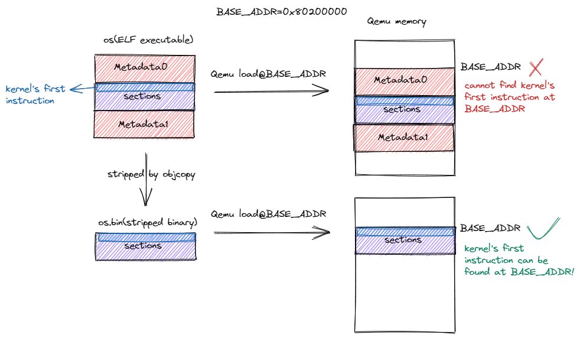

内核第一条指令（实践篇）
===========================================================================================

.. toctree::
   :hidden:
   :maxdepth: 5

本节导读
------------------------------------

提示：在进入本节之前请参考 :doc:`/chapter0/5setup-devel-env` 安装配置 Rust 相关软件包和 GDB 调试工具。

编写内核第一条指令
-------------------------------------

首先，我们需要编写进入内核后的第一条指令，这样更方便我们验证我们的内核镜像是否正确对接到 Qemu 上。

.. code-block::
   :linenos:

    # os/src/entry.asm
        .section .text.entry
        .globl _start
    _start:
        li x1, 100

实际的指令位于第 5 行，也即 ``li x1, 100`` 。 ``li`` 是 Load Immediate 的缩写，也即将一个立即数加载到某个寄存器，因此这条指令可以看做将寄存器 ``x1`` 赋值为 ``100`` 。第 4 行我们声明了一个符号 ``_start`` ，该符号指向紧跟在符号后面的内容——也就是位于第 5 行的指令，因此符号 ``_start`` 的地址即为第 5 行的指令所在的地址。第 3 行我们告知编译器 ``_start`` 是一个全局符号，因此可以被其他目标文件使用。第 2 行表明我们希望将第 2 行后面的内容全部放到一个名为 ``.text.entry`` 的段中。一般情况下，所有的代码都被放到一个名为 ``.text`` 的代码段中，这里我们将其命名为 ``.text.entry`` 从而区别于其他 ``.text`` 的目的在于我们想要确保该段被放置在相比任何其他代码段更低的地址上。这样，作为内核的入口点，这段指令才能被最先执行。

接着，我们在 ``main.rs`` 中嵌入这段汇编代码，这样 Rust 编译器才能够注意到它，不然编译器会认为它是一个与项目无关的文件：

.. code-block:: rust
    :linenos:
    :emphasize-lines: 4,8

    // os/src/main.rs
    #![no_std]
    #![no_main]
    #![feature(global_asm)]

    mod lang_item;

    global_asm!(include_str!("entry.asm"));

第 4 行中，我们手动设置 ``global_asm`` 特性来支持在 Rust 代码中嵌入全局汇编代码。第 8 行，我们首先通过 ``include_str!`` 宏将同目录下的汇编代码 ``entry.asm`` 转化为字符串并通过 ``global_asm!`` 宏嵌入到代码中。

调整内核的内存布局
-------------------------------------

.. _term-linker-script:

由于链接器默认的内存布局并不能符合我们的要求，实现与 Qemu 的正确对接，我们可以通过 **链接脚本** (Linker Script) 调整链接器的行为，使得最终生成的可执行文件的内存布局符合我们的预期。我们修改 Cargo 的配置文件来使用我们自己的链接脚本 ``os/src/linker.ld`` 而非使用默认的内存布局：

.. code-block::
   :linenos:
   :emphasize-lines: 5,6,7,8

    // os/.cargo/config
    [build]
    target = "riscv64gc-unknown-none-elf"

    [target.riscv64gc-unknown-none-elf]
    rustflags = [
        "-Clink-arg=-Tsrc/linker.ld", "-Cforce-frame-pointers=yes"
    ]

链接脚本 ``os/src/linker.ld`` 如下：

.. code-block::
    :linenos:
    :emphasize-lines: 12

    OUTPUT_ARCH(riscv)
    ENTRY(_start)
    BASE_ADDRESS = 0x80200000;

    SECTIONS
    {
        . = BASE_ADDRESS;
        skernel = .;

        stext = .;
        .text : {
            *(.text.entry)
            *(.text .text.*)
        }

        . = ALIGN(4K);
        etext = .;
        srodata = .;
        .rodata : {
            *(.rodata .rodata.*)
            *(.srodata .srodata.*)
        }

        . = ALIGN(4K);
        erodata = .;
        sdata = .;
        .data : {
            *(.data .data.*)
            *(.sdata .sdata.*)
        }

        . = ALIGN(4K);
        edata = .;
        .bss : {
            *(.bss.stack)
            sbss = .;
            *(.bss .bss.*)
            *(.sbss .sbss.*)
        }

        . = ALIGN(4K);
        ebss = .;
        ekernel = .;

        /DISCARD/ : {
            *(.eh_frame)
        }
    }

第 1 行我们设置了目标平台为 riscv ；第 2 行我们设置了整个程序的入口点为之前定义的全局符号 ``_start``；

第 3 行定义了一个常量 ``BASE_ADDRESS`` 为 ``0x80200000`` ，也就是我们之前提到的初始化代码被放置的地址；

从第 5 行开始体现了链接过程中对输入的目标文件的段的合并。其中 ``.`` 表示当前地址，也就是链接器会从它指向的位置开始往下放置从输入的目标文件中收集来的段。我们可以对 ``.`` 进行赋值来调整接下来的段放在哪里，也可以创建一些全局符号赋值为 ``.`` 从而记录这一时刻的位置。我们还能够看到这样的格式：

.. code-block::

    .rodata : {
        *(.rodata)
    }

冒号前面表示最终生成的可执行文件的一个段的名字，花括号内按照放置顺序描述将所有输入目标文件的哪些段放在这个段中，每一行格式为 ``<ObjectFile>(SectionName)``，表示目标文件 ``ObjectFile`` 的名为 ``SectionName`` 的段需要被放进去。我们也可以使用通配符来书写 ``<ObjectFile>`` 和 ``<SectionName>`` 分别表示可能的输入目标文件和段名。因此，最终的合并结果是，在最终可执行文件中各个常见的段 ``.text, .rodata .data, .bss`` 从低地址到高地址按顺序放置，每个段里面都包括了所有输入目标文件的同名段，且每个段都有两个全局符号给出了它的开始和结束地址（比如 ``.text`` 段的开始和结束地址分别是 ``stext`` 和 ``etext`` ）。

第 12 行我们将包含内核第一条指令的 ``.text.entry`` 段放在最终的 ``.text`` 段的最开头，同时注意到在最终内存布局中代码段 ``.text`` 又是先于任何其他段的。因为所有的段都从 ``BASE_ADDRESS`` 也即 ``0x80200000`` 开始放置，这就能够保证内核的第一条指令正好放在 ``0x80200000`` 从而能够正确对接到 Qemu 上。

此后我们便可以生成内核可执行文件，切换到 ``os`` 目录下并进行以下操作：

.. code-block:: console

    $ cargo build --release
    Finished release [optimized] target(s) in 0.10s
    $ file target/riscv64gc-unknown-none-elf/release/os
    target/riscv64gc-unknown-none-elf/release/os: ELF 64-bit LSB executable, UCB RISC-V, version 1 (SYSV), statically linked, not stripped

我们以 ``release`` 模式生成了内核可执行文件，它的位置在 ``os/target/riscv64gc.../release/os`` 。接着我们通过 ``file`` 工具查看它的属性，可以看到它是一个运行在 64 位 RISC-V 架构计算机上的可执行文件，它是静态链接得到的。

.. note::

	**思考： 0x80200000 可否改为其他地址？**

.. note::

	**静态链接与动态链接**

手动加载内核可执行文件
--------------------------------------------------

上面得到的内核可执行文件完全符合我们对于内存布局的要求，但是我们不能将其直接提交给 Qemu ，因为它除了实际会被用到的代码和数据段之外还有一些多余的元数据，这些元数据无法被 Qemu 在加载文件时利用，且会使代码和数据段被加载到错误的位置。如下图所示：

   丢弃元数据前后的内核可执行文件被加载到 Qemu 上的情形

图中，红色的区域表示内核可执行文件中的元数据，深蓝色的区域表示各个段（包括代码段和数据段），而浅蓝色区域则表示内核被执行的第一条指令，它位于深蓝色区域的开头。图示的上半部分中，我们直接将内核可执行文件 ``os`` 加载到 Qemu 内存的 ``0x80200000`` 处，由于内核可执行文件的开头是一段元数据，这会导致 Qemu 内存 ``0x80200000`` 处无法找到内核第一条指令，也就意味着 RustSBI 无法正常将计算机控制权转交给内核。相反，图示的下半部分中，将元数据丢弃得到的内核镜像 ``os.bin`` 被加载到 Qemu 之后，则可以在 ``0x80200000`` 处正确找到内核第一条指令。如果想要深入了解这些元数据的内容，可以参考 :doc:`/appendix-b/index` 。

使用如下命令可以丢弃内核可执行文件中的元数据得到内核镜像：

.. code-block:: console

	$ rust-objcopy --strip-all target/riscv64gc-unknown-none-elf/release/os -O binary target/riscv64gc-unknown-none-elf/release/os.bin

我们可以使用 ``stat`` 工具来比较内核可执行文件和内核镜像的大小：

.. code-block:: console

	$ stat target/riscv64gc-unknown-none-elf/release/os
	File: target/riscv64gc-unknown-none-elf/release/os
	Size: 1016      	Blocks: 8          IO Block: 4096   regular file
	...
	$ stat target/riscv64gc-unknown-none-elf/release/os.bin
	File: target/riscv64gc-unknown-none-elf/release/os.bin
	Size: 4         	Blocks: 8          IO Block: 4096   regular file
	...

可以看到，内核镜像的大小仅有 4 字节，这是因为它里面仅包含我们在 ``entry.asm`` 中编写的一条指令。一般情况下 RISC-V 架构的一条指令位宽即为 4 字节。而内核可执行文件由于包含了两部分元数据，其大小达到了 1016 字节。这些元数据能够帮助我们更加灵活地加载并使用可执行文件，比如在加载时完成一些重定位工作或者动态链接。不过由于 Qemu 的加载功能过于简单，我们只能将这些元数据丢弃再交给 Qemu 。从某种意义上可以理解为我们手动帮助 Qemu 完成了可执行文件的加载。

基于 GDB 验证启动流程
--------------------------------------------------