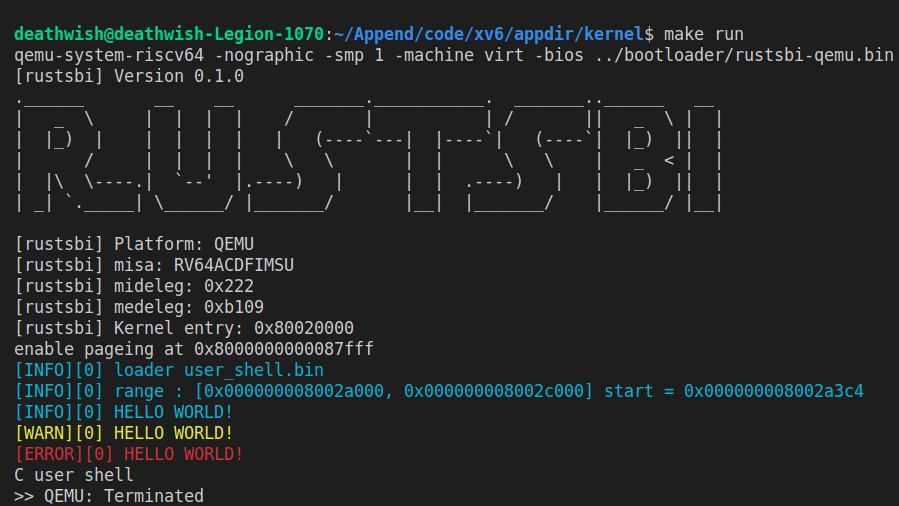

训练
=====================================================

.. toctree::
   :hidden:
   :maxdepth: 4

- 本节难度： **低** 

彩色化 LOG
-------------------------------

lab1 的工作使得我们从硬件世界跳入了软件世界，当看到自己的小 os 可以在裸机硬件上输出 ``hello world`` 是不是很高兴呢？但是为了后续的一步开发，更好的调试环境也是必不可少的，第一章的练习要求大家实现更加炫酷的彩色log。

详细的原理不多说，感兴趣的同学可以参考 `ANSI转义序列 <https://zh.wikipedia.org/wiki/ANSI%E8%BD%AC%E4%B9%89%E5%BA%8F%E5%88%97>`_ ，现在执行如下这条命令试试

.. code-block:: console

   $ echo -e "\x1b[31mhello world\x1b[0m"

如果你明白了我们是如何利用串口实现输出，那么要实现彩色输出就十分容易了，只需要用需要输出的字符串替换上一条命令中的 ``hello world``，用期望颜色替换 ``31(代表红色)``　即可。

我们推荐实现如下几个等级的输出，输出优先级依次降低：

.. list-table:: log 等级推荐
   :header-rows: 1
   :align: center

   * - 名称
     - 颜色
     - 用途
   * - ERROR
     - 红色(31)
     - 表示发生严重错误，很可能或者已经导致程序崩溃
   * - WARN
     - 黄色(93)
     - 表示发生不常见情况，但是并不一定导致系统错误
   * - INFO
     - 蓝色(34)
     - 比较中庸的选项，输出比较重要的信息，比较常用
   * - DEBUG
     - 绿色(32)
     - 输出信息较多，在 debug 时使用
   * - TRACE
     - 灰色(90)
     - 最详细的输出，跟踪了每一步关键路径的执行

我们要求输出设定输出等级以及更高输出等级的信息，如设置 ``LOG = INFO``，则输出　``ERROR``、``WARN``、``INFO`` 等级的信息。简单 demo 如下，输出等级为 INFO:

为了方便使用彩色输出，我们要求同学们实现彩色输出的宏或者函数，用以代替 print 完成输出内核信息的功能，它们有着和 prinf 十分相似的使用格式，要求支持可变参数解析，形如：

.. code-block:: rust

    // 这段代码输出了 os 内存空间布局，这到这些信息对于编写 os 十分重要
    　
    info!(".text [{:#x}, {:#x})", stext as usize, etext as usize);
    debug!(".rodata [{:#x}, {:#x})", srodata as usize, erodata as usize);
    error!(".data [{:#x}, {:#x})", sdata as usize, edata as usize);

.. code-block:: c

    info("load range : [%d, %d] start = %d\n", s, e, start);

在以后，我们还可以在 log 信息中增加线程、CPU等信息（只是一个推荐，不做要求），这些信息将极大的方便你的代码调试。

实验要求
-------------------------------

- 完成实验指导书中的内容，在裸机上实现 ``hello world`` 输出。
- 实现彩色输出宏
- 利用彩色输出宏输出 os 内存空间布局，即：输出 ``.text``、``.data``、``.rodata``、``.bss`` 各段位置，输出等级为 ``INFO``。

实验检查
-------------------------------

要求执行之后可以看到正确的内存布局输出，根据实现不同数值可能有差异，但应该位于 ``linker.ld`` 中指示 ``BASE_ADDRESS`` 后一段内存，输出之后关机。

tips
-------------------------------

- 对于 Rust, 可以使用 crate ``log``，推荐参考 `rCore <https://github.com/rcore-os/rCore/blob/master/kernel/src/logging.rs>`_ 
- 对于 C，可以实现不同的函数（注意不推荐多层可变参数解析，有时会出现不稳定情况），也可以参考 `linux printk <https://github.com/torvalds/linux/blob/master/include/linux/printk.h#L312-L385>`_ 使用宏实现代码重用。
- 两种语言都可以使用 ``extern`` 关键字获得在其他文件中定义的符号。