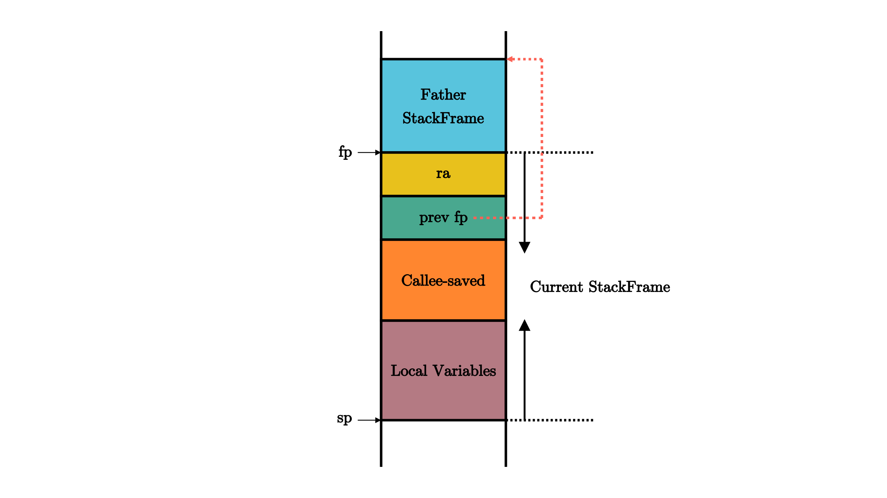
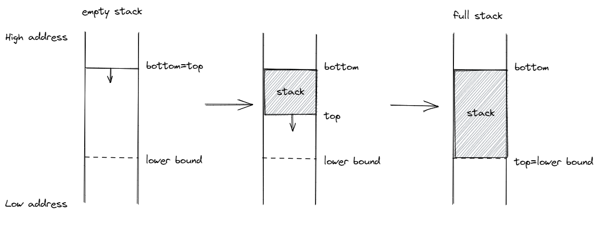

为内核支持函数调用
================================================

.. toctree::
   :hidden:
   :maxdepth: 5

本节导读
--------------------------------------------------

上一节我们成功在 Qemu 上执行了内核的第一条指令，它是我们在 ``entry.asm`` 中手写汇编代码得到的。然而，我们无论如何也不想仅靠手写汇编代码的方式编写我们的内核，绝大部分功能我们都想使用 Rust 语言来实现。不过为了将控制权转交给我们使用 Rust 语言编写的内核入口函数，我们确实需要手写若干行汇编代码进行一定的初始化工作。和之前一样，这些汇编代码放在 ``entry.asm`` 中，并在控制权被转交给内核相关函数前最先被执行，但它们的功能会更加复杂。首先需要设置栈空间，来在内核内使能函数调用，随后直接调用使用 Rust 编写的内核入口函数，从而控制权便被移交给 Rust 代码。这就是构建“三叶虫”操作系统的第三个步骤。

在具体操作之前，我们首先会介绍很多函数调用和栈的背景知识。这些知识很重要，而且有一些思想会一直延续到后面的章节。但同时这些知识相对比较基础，因此我们在正式开始介绍之前给出了一个知识点清单，有一定基础的读者可以参照此清单进行选读。

.. note::

    **本节知识清单**

    请尝试回答以下问题，如果对于自己的答案足够自信的话则可以直接进入本节的 :ref:`实践部分 <jump-practice>` 。

    - 如何使得函数返回时能够跳转到调用该函数的下一条指令，即使该函数在代码中的多个位置被调用？
    - 对于一个函数而言，保证它调用某个子函数之前，以及该子函数返回到它之后（某些）通用寄存器的值保持不变有何意义？
    - 调用者函数和被调用者函数如何合作保证调用子函数前后寄存器内容保持不变？调用者保存和被调用者保存寄存器的保存与恢复各自由谁负责？它们暂时被保存在什么位置？它们于何时被保存和恢复（如函数的开场白/退场白）？
    - 在 RISC-V 架构上，调用者保存和被调用者保存寄存器如何划分的？ 
    - `sp` 和 `ra` 是调用者还是被调用者保存寄存器，为什么这样约定？
    - 如何使用寄存器传递函数调用的参数和返回值？如果寄存器数量不够用了，如何传递函数调用的参数？

.. _term-function-call-and-stack:

函数调用与栈
----------------------------

从汇编指令的级别看待一段程序的执行，假如 CPU 依次执行的指令的物理地址序列为 :math:`\{a_n\}`，那么这个序列会符合怎样的模式呢？

.. _term-control-flow:

其中最简单的无疑就是 CPU 一条条连续向下执行指令，也即满足递推公式 :math:`a_{n+1}=a_n+L`，这里我们假设该平台的指令是定长的且均为 :math:`L` 字节（常见情况为 2/4 字节）。但是执行序列并不总是符合这种模式，当位于物理地址 :math:`a_n` 的指令是一条跳转指令的时候，该模式就有可能被破坏。跳转指令对应于我们在程序中构造的 **控制流** (Control Flow) 的多种不同结构，比如分支结构（如 if/switch 语句）和循环结构（如 for/while 语句）。用来实现上述两种结构的跳转指令，只需实现跳转功能，也就是将 pc 寄存器设置到一个指定的地址即可。

.. _term-function-call:

另一种控制流结构则显得更为复杂： **函数调用** (Function Call)。我们大概清楚调用函数整个过程中代码执行的顺序，如果是从源代码级的视角来看，我们会去执行被调用函数的代码，等到它返回之后，我们会回到调用函数对应语句的下一行继续执行。那么我们如何用汇编指令来实现这一过程？首先在调用的时候，需要有一条指令跳转到被调用函数的位置，这个看起来和其他控制结构没什么不同；但是在被调用函数返回的时候，我们却需要返回那条跳转过来的指令的下一条继续执行。这次用来返回的跳转究竟跳转到何处，在对应的函数调用发生之前是不知道的。比如，我们在两个不同的地方调用同一个函数，显然函数返回之后会回到不同的地址。这是一个很大的不同：其他控制流都只需要跳转到一个 *编译期固定下来* 的地址，而函数调用的返回跳转是跳转到一个 *运行时确定* （确切地说是在函数调用发生的时候）的地址。

.. image:: function-call.png
   :align: center
   :name: function-call

对此，指令集必须给用于函数调用的跳转指令一些额外的能力，而不只是单纯的跳转。在 RISC-V 架构上，有两条指令即符合这样的特征：

.. list-table:: RISC-V 函数调用跳转指令
   :widths: 20 30
   :header-rows: 1
   :align: center

   * - 指令
     - 指令功能
   * - :math:`\text{jal}\ \text{rd},\ \text{imm}[20:1]`
     - :math:`\text{rd}\leftarrow\text{pc}+4`

       :math:`\text{pc}\leftarrow\text{pc}+\text{imm}`
   * - :math:`\text{jalr}\ \text{rd},\ (\text{imm}[11:0])\text{rs}`
     - :math:`\text{rd}\leftarrow\text{pc}+4`
       
       :math:`\text{pc}\leftarrow\text{rs}+\text{imm}`

.. _term-source-register:
.. _term-immediate:
.. _term-destination-register:

.. note::

   **RISC-V 指令各部分含义**

   在大多数只与通用寄存器打交道的指令中， rs 表示 **源寄存器** (Source Register)， imm 表示 **立即数** (Immediate)，是一个常数，二者构成了指令的输入部分；而 rd 表示 **目标寄存器** (Destination Register)，它是指令的输出部分。rs 和 rd 可以在 32 个通用寄存器 x0~x31 中选取。但是这三个部分都不是必须的，某些指令只有一种输入类型，另一些指令则没有输出部分。

.. _term-pseudo-instruction:

从中可以看出，这两条指令在设置 pc 寄存器完成跳转功能之前，还将当前跳转指令的下一条指令地址保存在 rd 寄存器中，即 :math:`\text{rd}\leftarrow\text{pc}+4` 这条指令的含义。（这里假设所有指令的长度均为 4 字节）在 RISC-V 架构中，通常使用 ``ra`` 寄存器（即 ``x1`` 寄存器）作为其中的 ``rd`` 对应的具体寄存器，因此在函数返回的时候，只需跳转回 ``ra``  所保存的地址即可。事实上在函数返回的时候我们常常使用一条 **汇编伪指令** (Pseudo Instruction) 跳转回调用之前的位置： ``ret`` 。它会被汇编器翻译为 ``jalr x0, 0(x1)``，含义为跳转到寄存器 ``ra`` 保存的物理地址，由于 ``x0`` 是一个恒为 ``0`` 的寄存器，在 ``rd`` 中保存这一步被省略。

总结一下，在进行函数调用的时候，我们通过 ``jalr`` 指令保存返回地址并实现跳转；而在函数即将返回的时候，则通过 ``ret`` 伪指令回到跳转之前的下一条指令继续执行。这样，RISC-V 的这两条指令就实现了函数调用流程的核心机制。

由于我们是在 ``ra`` 寄存器中保存返回地址的，我们要保证它在函数执行的全程不发生变化，不然在 ``ret`` 之后就会跳转到错误的位置。事实上编译器除了函数调用的相关指令之外确实基本上不使用 ``ra`` 寄存器。也就是说，如果在函数中没有调用其他函数，那 ``ra`` 的值不会变化，函数调用流程能够正常工作。但遗憾的是，在实际编写代码的时候我们常常会遇到函数 **多层嵌套调用** 的情形。我们很容易想象，如果函数不支持嵌套调用，那么编程将会变得多么复杂。如果我们试图在一个函数 :math:`f` 中调用一个子函数，在跳转到子函数 :math:`g` 的同时，ra 会被覆盖成这条跳转指令的下一条的地址，而 ra 之前所保存的函数 :math:`f` 的返回地址将会 `永久丢失` 。 

.. _term-function-context:
.. _term-activation-record:

因此，若想正确实现嵌套函数调用的控制流，我们必须通过某种方式保证：在一个函数调用子函数的前后，``ra`` 寄存器的值不能发生变化。但实际上，这并不仅仅局限于 ``ra`` 一个寄存器，而是作用于所有的通用寄存器。这是因为，编译器是独立编译每个函数的，因此一个函数并不能知道它所调用的子函数修改了哪些寄存器。而站在一个函数的视角，在调用子函数的过程中某些寄存器的值被覆盖的确会对它接下来的执行产生影响。因此这是必要的。我们将由于函数调用，在控制流转移前后需要保持不变的寄存器集合称之为 **函数调用上下文** (Function Call Context) 。

.. _term-save-restore:

由于每个 CPU 只有一套寄存器，我们若想在子函数调用前后保持函数调用上下文不变，就需要物理内存的帮助。确切的说，在调用子函数之前，我们需要在物理内存中的一个区域 **保存** (Save) 函数调用上下文中的寄存器；而在函数执行完毕后，我们会从内存中同样的区域读取并 **恢复** (Restore) 函数调用上下文中的寄存器。实际上，这一工作是由子函数的调用者和被调用者（也就是子函数自身）合作完成。函数调用上下文中的寄存器被分为如下两类：

.. _term-callee-saved:
.. _term-caller-saved:

- **被调用者保存(Callee-Saved) 寄存器** ：被调用的函数可能会覆盖这些寄存器，需要被调用的函数来保存的寄存器，即由被调用的函数来保证在调用前后，这些寄存器保持不变；
- **调用者保存(Caller-Saved) 寄存器** ：被调用的函数可能会覆盖这些寄存器，需要发起调用的函数来保存的寄存器，即由发起调用的函数来保证在调用前后，这些寄存器保持不变。

从名字中可以看出，函数调用上下文由调用者和被调用者分别保存，其具体过程分别如下：

- 调用函数：首先保存不希望在函数调用过程中发生变化的 **调用者保存寄存器** ，然后通过 jal/jalr 指令调用子函数，返回之后恢复这些寄存器。
- 被调用函数：在被调用函数的起始，先保存函数执行过程中被用到的 **被调用者保存寄存器** ，然后执行函数，最后在函数退出之前恢复这些寄存器。

.. _term-prologue:
.. _term-epilogue:

我们发现无论是调用函数还是被调用函数，都会因调用行为而需要两段匹配的保存和恢复寄存器的汇编代码，可以分别将其称为 **开场** (Prologue) 和 **结尾** (Epilogue)，它们会由编译器帮我们自动插入，来完成相关寄存器的保存与恢复。一个函数既有可能作为调用者调用其他函数，也有可能作为被调用者被其他函数调用。

.. chyyuu

  对于这个函数而言，如果在执行的时候需要修改被调用者保存寄存器，而必须在函数开头的开场和结尾处进行保存；对于调用者保存寄存器则可以没有任何顾虑的随便使用，因为它在约定中本就不需要承担保证调用者保存寄存器保持不变的义务。

.. note::

   **寄存器保存与编译器优化**

   这里值得说明的是，调用者和被调用者实际上只需分别按需保存调用者保存寄存器和被调用者保存寄存器的一个子集。对于调用函数而言，在调用子函数的时候，即使子函数修改了调用者保存寄存器，编译器在调用函数中插入的代码会恢复这些寄存器；而对于被调用函数而言，在其执行过程中没有使用到的被调用者保存寄存器也无需保存。编译器在进行后端代码生成时，知道在这两个场景中分别有哪些值得保存的寄存器。从这一角度也可以理解为何要将函数调用上下文分成两类：可以让编译器尽可能早地优化掉一些无用的寄存器保存与恢复操作，提高程序的执行性能。

.. chyyuu 最好有个例子说明

.. _term-calling-convention:

调用规范
----------------

**调用规范** (Calling Convention) 约定在某个指令集架构上，某种编程语言的函数调用如何实现。它包括了以下内容：

1. 函数的输入参数和返回值如何传递；
2. 函数调用上下文中调用者/被调用者保存寄存器的划分；
3. 其他的在函数调用流程中对于寄存器的使用方法。

调用规范是对于一种确定的编程语言来说的，因为一般意义上的函数调用只会在编程语言的内部进行。当一种语言想要调用用另一门编程语言编写的函数接口时，编译器就需要同时清楚两门语言的调用规范，并对寄存器的使用做出调整。

.. note::

   **RISC-V 架构上的 C 语言调用规范**

   RISC-V 架构上的 C 语言调用规范可以在 `这里 <https://riscv.org/wp-content/uploads/2015/01/riscv-calling.pdf>`_ 找到。
   它对通用寄存器的使用做出了如下约定：

   .. list-table:: RISC-V 寄存器功能分类
      :widths: 20 20 40
      :align: center
      :header-rows: 1

      * - 寄存器组
        - 保存者
        - 功能
      * - a0~a7（ ``x10~x17`` ）
        - 调用者保存
        - 用来传递输入参数。其中的 a0 和 a1 还用来保存返回值。
      * - t0~t6( ``x5~x7,x28~x31`` )
        - 调用者保存
        - 作为临时寄存器使用，在被调函数中可以随意使用无需保存。
      * - s0~s11( ``x8~x9,x18~x27`` )
        - 被调用者保存
        - 作为临时寄存器使用，被调函数保存后才能在被调函数中使用。

   剩下的 5 个通用寄存器情况如下：

   - zero( ``x0`` ) 之前提到过，它恒为零，函数调用不会对它产生影响；
   - ra( ``x1`` ) 是被调用者保存的。被调用者函数可能也会调用函数，在调用之前就需要修改 ``ra`` 使得这次调用能正确返回。因此，每个函数都需要在开头保存 ``ra`` 到自己的栈帧中，并在结尾使用 ``ret`` 返回之前将其恢复。栈帧是当前执行函数用于存储局部变量和函数返回信息的内存结构。
   - sp( ``x2`` ) 是被调用者保存的。这个是之后就会提到的栈指针 (Stack Pointer) 寄存器，它指向下一个将要被存储的栈顶位置。
   - fp( ``s0`` )，它既可作为s0临时寄存器，也可作为栈帧指针（Frame Pointer）寄存器，表示当前栈帧的起始位置，是一个被调用者保存寄存器。fp 指向的栈帧起始位置 和 sp 指向的栈帧的当前栈顶位置形成了所对应函数栈帧的空间范围。 
   - gp( ``x3`` ) 和 tp( ``x4`` ) 在一个程序运行期间都不会变化，因此不必放在函数调用上下文中。它们的用途在后面的章节会提到。

   更加详细的内容可以参考 Cornell 大学的 `CS 3410: Computer System Organization and Programming 课件内容 <http://www.cs.cornell.edu/courses/cs3410/2019sp/schedule/slides/10-calling-notes-bw.pdf>`_ 。

.. _term-stack:
.. _term-stack-pointer:
.. _term-stack-frame:

之前我们讨论了函数调用上下文的保存/恢复时机以及寄存器的选择，但我们并没有详细说明这些寄存器保存在哪里，只是用“内存中的一块区域”草草带过。实际上，它更确切的名字是 **栈** (Stack) 。  ``sp`` 寄存器常用来保存 **栈指针** (Stack Pointer)，它指向内存中栈顶地址。在 RISC-V 架构中，栈是从高地址向低地址增长的。在一个函数中，作为起始的开场代码负责分配一块新的栈空间，即将 ``sp`` 
的值减小相应的字节数即可，于是物理地址区间 :math:`[\text{新sp},\text{旧sp})` 对应的物理内存的一部分便可以被这个函数用来进行函数调用上下文的保存/恢复，这块物理内存被称为这个函数的 **栈帧** (Stack Frame)。同理，函数中的结尾代码负责将开场代码分配的栈帧回收，这也仅仅需要将 ``sp`` 的值增加相同的字节数回到分配之前的状态。这也可以解释为什么 ``sp`` 是一个被调用者保存寄存器。

.. note::

  **栈帧 stack frame**
 
  我们知道程序在执行函数调用时，调用者函数和被调用函数使用的是同一个栈。在通常的情况下，我们并不需要区分调用者函数和被调用函数分别使用了栈的哪个部分。但是，当我们需要在执行过程中对函数调用进行调试或backtrace的时候，这一信息就很重要了。简单的说，栈帧（stack frame）就是一个函数所使用的栈的一部分区域，所有函数的栈帧串起来就组成了一个完整的函数调用栈。一般而言，当前执行函数的栈帧的两个边界分别由栈指针 (Stack Pointer)寄存器和栈帧指针（frame pointer）寄存器来限定。

.. figure:: CallStack.png
   :align: center

   函数调用与栈帧：如图所示，我们能够看到在程序依次调用 a、调用 b、调用 c、c 返回、b 返回整个过程中栈帧的分配/回收以及 ``sp`` 寄存器的变化。
   图中标有 a/b/c 的块分别代表函数 a/b/c 的栈帧。

.. _term-lifo:

.. note::

   **数据结构中的栈与实现函数调用所需要的栈**

   从数据结构的角度来看，栈是一个 **后入先出** (Last In First Out, LIFO) 的线性表，支持向栈顶压入一个元素以及从栈顶弹出一个元素两种操作，分别被称为 push 和 pop。从它提供的接口来看，它只支持访问栈顶附近的元素。因此在实现的时候需要维护一个指向栈顶的指针来表示栈当前的状态。

   我们这里的栈与数据结构中的栈原理相同，在很多方面可以一一对应。栈指针 ``sp`` 可以对应到指向栈顶的指针，对于栈帧的分配/回收可以分别对应到 ``push`` / ``pop`` 操作。如果将我们的栈看成一个内存分配器，它之所以可以这么简单，是因为它回收的内存一定是 *最近一次分配* 的内存，从而只需要类似 ``push`` / ``pop`` 的两种操作即可。

在合适的编译选项设置之下，一个函数的栈帧内容可能如下图所示：

   函数栈帧中的内容

它的开头和结尾分别在 sp(x2) 和 fp(s0) 所指向的地址。按照地址从高到低分别有以下内容，它们都是通过 ``sp`` 加上一个偏移量来访问的：

- ``ra`` 寄存器保存其返回之后的跳转地址，是一个被调用者保存寄存器；
- 父亲栈帧的结束地址 ``fp`` ，是一个被调用者保存寄存器；
- 其他被调用者保存寄存器 ``s1`` ~ ``s11`` ；
- 函数所使用到的局部变量。

因此，栈上多个 ``fp`` 信息实际上保存了一条完整的函数调用链，通过适当的方式我们可以实现对函数调用关系的跟踪。

``ra`` 、 ``sp`` 和 ``fp`` 是和函数调用紧密相关的寄存器，我们用一个例子来展示真实编译器生成的汇编代码会如何使用这些寄存器。首先，无论对于内核本身还是第二章后出现的应用程序，我们修改 ``.cargo/config`` :

.. code-block::

    // .cargo/config

    [build]
    target = "riscv64gc-unknown-none-elf"

    [target.riscv64gc-unknown-none-elf]
    rustflags = [
        "-Clink-args=-Tsrc/linker.ld", "-Cforce-frame-pointers=yes"
    ]

这可以设置我们的默认编译目标，同时调整编译选项，设置链接脚本以及强制打开 ``fp`` 选项，这样才会避免 ``fp`` 相关指令被编译器优化掉。随后，我们可以使用 ``rust-objdump`` 工具反汇编内核或者应用程序可执行文件，并找到某个函数的入口。然后，我们能够看到在函数的开场和结尾阶段，编译器会生成类似的汇编代码：

.. code-block:: riscv

    # 开场
    # 为当前函数分配 64 字节的栈帧
    addi	sp, sp, -64
    # 将 ra 和 fp 压栈保存
    sd	ra, 56(sp)
    sd	s0, 48(sp)
    # 更新 fp 为当前函数栈帧顶端地址
    addi	s0, sp, 64

    # 函数执行
    # 中间如果再调用了其他函数会修改 ra

    # 结尾
    # 恢复 ra 和 fp
    ld	ra, 56(sp)
    ld	s0, 48(sp)
    # 退栈
    addi	sp, sp, 64
    # 返回，使用 ret 指令或其他等价的实现方式
    ret    

至此，我们基本上说明了函数调用是如何基于栈来实现的。不过我们可以暂时先忽略掉这些细节，因为我们现在只是需要在初始化阶段完成栈的设置，也就是设置好栈指针 ``sp`` 寄存器，编译器会帮我们自动完成后面的函数调用相关机制的代码生成。麻烦的是， ``sp`` 的值也不能随便设置，至少我们需要保证它指向合法的物理内存，而且不能与程序的其他代码、数据段相交，因为在函数调用的过程中，栈区域里面的内容会被修改。如何保证这一点呢？

.. _jump-practice:

分配并使用启动栈
-------------------------------------------

我们在 ``entry.asm`` 中分配启动栈空间，并在控制权被转交给 Rust 入口之前将栈指针 ``sp`` 设置为栈顶的位置。

.. code-block:: asm
    :linenos:

    # os/src/entry.asm
        .section .text.entry
        .globl _start
    _start:
        la sp, boot_stack_top
        call rust_main

        .section .bss.stack
        .globl boot_stack_lower_bound
    boot_stack_lower_bound:
        .space 4096 * 16
        .globl boot_stack_top
    boot_stack_top:

我们在第 11 行在内核的内存布局中预留了一块大小为 4096 * 16 字节也就是 :math:`64\text{KiB}` 的空间用作接下来要运行的程序的栈空间。在 RISC-V 架构上，栈是从高地址向低地址增长。因此，最开始的时候栈为空，栈顶和栈底位于相同的位置，我们用更高地址的符号 ``boot_stack_top`` 来标识栈顶的位置。同时，我们用更低地址的符号 ``boot_stack_lower_bound`` 来标识栈能够增长到的下限位置，它们都被设置为全局符号供其他目标文件使用。如下图所示：

    
第 8 行可以看到我们将这块空间放置在一个名为 ``.bss.stack`` 的段中，在链接脚本 ``linker.ld`` 中可以看到 ``.bss.stack`` 段最终会被汇集到 ``.bss`` 段中：

.. code-block::

    .bss : {
        *(.bss.stack)
        sbss = .;
        *(.bss .bss.*)
        *(.sbss .sbss.*)
    }
    ebss = .;

前面我们提到过 ``.bss`` 段一般放置需要被初始化为零的数据。然而栈并不需要在使用前被初始化为零，因为在函数调用的时候我们会插入栈帧覆盖已有的数据。我们尝试将其放置到全局数据 ``.data`` 段中但最后未能成功，因此才决定将其放置到 ``.bss`` 段中。全局符号 ``sbss`` 和 ``ebss`` 分别指向 ``.bss`` 段除 ``.bss.stack`` 以外的起始和终止地址，我们在使用这部分数据之前需要将它们初始化为零，这个过程将在下一节进行。

回到 ``entry.asm`` ，可以发现在控制权转交给 Rust 入口之前会执行两条指令，它们分别位于 ``entry.asm`` 的第 5、6 行。第 5 行我们将栈指针 ``sp`` 设置为先前分配的启动栈栈顶地址，这样 Rust 代码在进行函数调用和返回的时候就可以正常在启动栈上分配和回收栈帧了。在我们设计好的内存布局中，这块启动栈所用的内存并不会和内核的其他代码、数据段产生冲突，它们是从物理上隔离的。然而如果启动栈溢出（比如在内核代码中出现了太多的函数调用），那么分配的栈帧将有可能覆盖内核其他部分的代码、数据从而出现十分诡异的错误。目前我们只能尽量避免栈溢出的情况发生，到了第四章，借助地址空间抽象和 MMU 硬件的帮助，我们可以做到完全禁止栈溢出。第 6 行我们通过伪指令 ``call`` 调用 Rust 编写的内核入口点 ``rust_main`` 将控制权转交给 Rust 代码，该入口点在 ``main.rs`` 中实现：

.. code-block:: rust

    // os/src/main.rs
    #[no_mangle]
    pub fn rust_main() -> ! {
        loop {}
    }

这里需要注意的是需要通过宏将 ``rust_main`` 标记为 ``#[no_mangle]`` 以避免编译器对它的名字进行混淆，不然在链接的时候， ``entry.asm`` 将找不到 ``main.rs`` 提供的外部符号 ``rust_main`` 从而导致链接失败。在 ``rust_main`` 函数的开场白中，我们将第一次在栈上分配栈帧并保存函数调用上下文，它也是内核运行全程中最底层的栈帧。

在内核初始化中，需要先完成对 ``.bss`` 段的清零。这是内核很重要的一部分初始化工作，在使用任何被分配到 ``.bss`` 段的全局变量之前我们需要确保 ``.bss`` 段已被清零。我们就在 ``rust_main`` 的开头完成这一工作，由于控制权已经被转交给 Rust ，我们终于不用手写汇编代码而是可以用 Rust 来实现这一功能了：

.. code-block:: rust
    :linenos:

    // os/src/main.rs
    #[no_mangle]
    pub fn rust_main() -> ! {
        clear_bss();
        loop {}
    }

    fn clear_bss() {
        extern "C" {
            fn sbss();
            fn ebss();
        }
        (sbss as usize..ebss as usize).for_each(|a| {
            unsafe { (a as *mut u8).write_volatile(0) }
        });
    }

在函数 ``clear_bss`` 中，我们会尝试从其他地方找到全局符号 ``sbss`` 和 ``ebss`` ，它们由链接脚本 ``linker.ld`` 给出，并分别指出需要被清零的 ``.bss`` 段的起始和终止地址。接下来我们只需遍历该地址区间并逐字节进行清零即可。

.. note::

    **Rust Tips：外部符号引用**

    extern "C" 可以引用一个外部的 C 函数接口（这意味着调用它的时候要遵从目标平台的 C 语言调用规范）。但我们这里只是引用位置标志并将其转成 usize 获取它的地址。由此可以知道 ``.bss`` 段两端的地址。

.. note::

    **Rust Tips：迭代器与闭包**

    代码第 13 行用到了 Rust 的迭代器与闭包的语法，它们在很多情况下能够提高开发效率。如读者感兴趣的话也可以将其改写为等价的 for 循环实现。

.. _term-raw-pointer:
.. _term-dereference:

.. warning::

    **Rust Tips：Unsafe**

    代码第 14 行，我们将 ``.bss`` 段内的一个地址转化为一个 **裸指针** (Raw Pointer)，并将它指向的值修改为 0。这在 C 语言中是一种司空见惯的操作，但在 Rust 中我们需要将他包裹在 unsafe 块中。这是因为，Rust 认为对于裸指针的 **解引用** (Dereference) 是一种 unsafe 行为。

    相比 C 语言，Rust 进行了更多的语义约束来保证安全性（内存安全/类型安全/并发安全），这在编译期和运行期都有所体现。但在某些时候，尤其是与底层硬件打交道的时候，在 Rust 的语义约束之内没法满足我们的需求，这个时候我们就需要将超出了 Rust 语义约束的行为包裹在 unsafe 块中，告知编译器不需要对它进行完整的约束检查，而是由程序员自己负责保证它的安全性。当代码不能正常运行的时候，我们往往也是最先去检查 unsafe 块中的代码，因为它没有受到编译器的保护，出错的概率更大。

    C 语言中的指针相当于 Rust 中的裸指针，它无所不能但又太过于灵活，程序员对其不谨慎的使用常常会引起很多内存不安全问题，最常见的如悬垂指针和多次回收的问题，Rust 编译器没法确认程序员对它的使用是否安全，因此将其划到 unsafe Rust 的领域。在 safe Rust 中，我们有引用 ``&/&mut`` 以及各种功能各异的智能指针 ``Box<T>/RefCell<T>/Rc<T>`` 可以使用，只要按照 Rust 的规则来使用它们便可借助编译器在编译期就解决很多潜在的内存不安全问题。

本节我们介绍了函数调用和栈的背景知识，通过分配栈空间并正确设置栈指针在内核中使能了函数调用并成功将控制权转交给 Rust 代码，从此我们终于可以利用强大的 Rust 语言来编写内核的各项功能了。下一节中我们将进行构建“三叶虫”操作系统的最后一个步骤：即基于 RustSBI 提供的服务成功在屏幕上打印 ``Hello, world!`` 。
