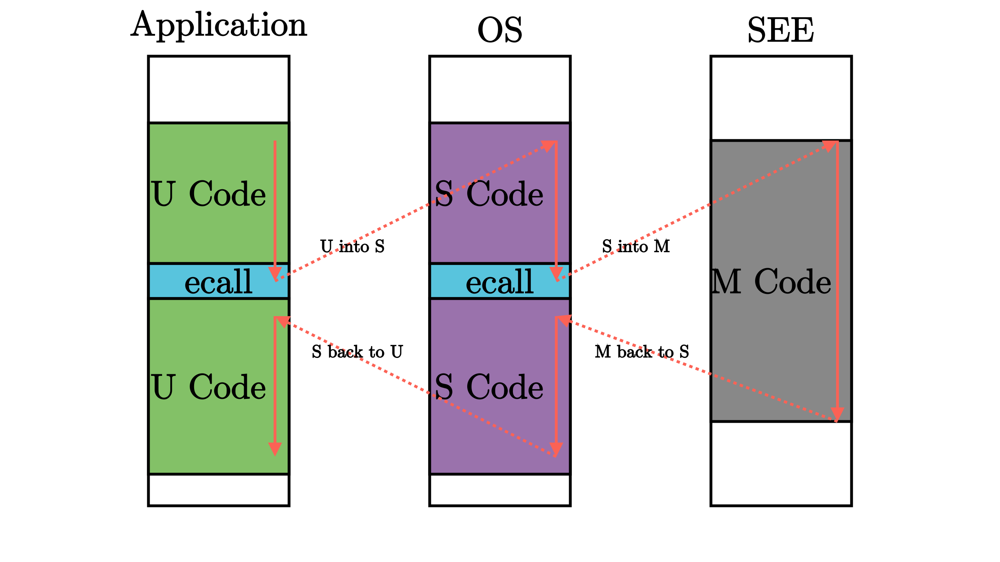

特权级机制
=====================================

.. toctree::
   :hidden:
   :maxdepth: 5

本节导读
-------------------------------

为了保护我们的批处理操作系统不受到出错应用程序的影响并全程稳定工作，单凭软件实现是很难做到的，而是需要 CPU 提供一种特权级隔离机制，使CPU在执行应用程序和操作系统内核的指令时处于不同的特权级。本节主要介绍了特权级机制的软硬件设计思路，以及RISC-V的特权级架构。

特权级的软硬件协同设计
------------------------------------------

实现特权级机制的根本原因是应用程序运行的安全性不可充分信任。在上一节里，操作系统和应用紧密连接在一起，形成一个应用程序来执行。随着应用需求的增加，操作系统也越来越大，会以库的形式存在；同时应用自身也会越来越复杂。由于操作系统会给多个应用提供服务，所以它可能的错误会比较快地被发现，但应用自身的错误可能就不会很快发现。由于二者通过编译器形成一个应用程序来执行，即使是应用本身的问题，也会导致操作系统受到连累，从而可能导致整个计算机系统都不可用了。
所以，计算机专家就想到一个方法，能否让相对安全可靠的操作系统不受到应用程序的破坏，运行在一个安全的执行环境中，而让应用程序运行在一个无法破坏操作系统的执行环境中？

为确保操作系统的安全，对应用程序而言，需要限制的主要有两个方面：
- 应用程序不能访问任意的地址空间（这个在第四章会进一步讲解，本章不会讲解）
- 应用程序不能执行某些可能破会计算机系统的指令（本章的重点）

假设有了这样的限制，我们还需要确保应用程序能够得到操作系统的服务，即应用程序和操作系统还需要有交互的手段。使得低特权级软件都只能做高特权级软件允许它做的，且低特权级软件的超出其能力的要求必须寻求高特权级软件的帮助。在这里的高特权级软件就是低特权级软件的软件执行环境。

为了完成这样的特权级需求，需要进行软硬件协同设计。一个比较简洁的方法就是，处理器设置两个不同安全等级的执行环境：用户态特权级的执行环境和内核态特权级的执行环境。且明确指出可能破会计算机系统的内核态特权级指令子集，规定内核态特权级指令子集中的指令只能在内核态特权级的执行环境中执行，如果在用户态特权级的执行环境中执行这些指令，会产生异常。处理器在执行不同特权级的执行环境下的指令前进行特权级安全检查。

为了让应用程序获得操作系统的函数服务，采用传统的函数调用方式（即通常的 ``call`` 和 ``ret`` 指令或指令组合）将会直接绕过硬件的特权级保护检查。所以要设计新的指令：执行环境调用（Execution Environment Call，简称ecall）和执行环境返回(Execution Environment Return，简称eret)）：
- ecall：具有用户态到内核态的执行环境切换能力的函数调用指令
- eret：具有用户态到内核态的执行环境切换能力的函数返回指令

但硬件具有了这样的机制后，还需要操作系统的配合才能最终完成对操作系统自己的保护。首先，操作系统需要提供相应的控制流，能在执行 ``eret`` 前准备和恢复用户态执行应用程序的上下文。其次，在应用程序调用 ``ecall`` 指令后，能够保存用户态执行应用程序的上下文，便于后续的恢复；且还要坚持应用程序发出的服务请求是安全的。

.. note::

  在实际的CPU，如x86、RISC-V等，设计了多达4种特权级。对于一般的操作系统而言，其实只要两种特权级就够了。

RISC-V 特权级架构
------------------------------------------

RISC-V 架构中一共定义了 4 种特权级：

.. list-table:: RISC-V 特权级
   :widths: 30 30 60
   :header-rows: 1
   :align: center

   * - 级别
     - 编码
     - 名称
   * - 0
     - 00
     - 用户/应用模式 (U, User/Application)
   * - 1
     - 01
     - 监督模式 (S, Supervisor)
   * - 2
     - 10
     - H, Hypervisor
   * - 3
     - 11
     - 机器模式 (M, Machine)

其中，级别的数值越小，特权级越高，掌控硬件的能力越强。从表中可以看出， M 模式处在最高的特权级，而 U 模式处于最低的特权级。

之前我们给出过支持应用程序运行的一套 :ref:`执行环境栈 <app-software-stack>` ，现在我们站在特权级架构的角度去重新看待它：

.. image:: PrivilegeStack.png
   :align: center
   :name: PrivilegeStack

.. _term-see:

和之前一样，白色块表示一层执行环境，黑色块表示相邻两层执行环境之间的接口。这张图片给出了能够支持运行 Unix 这类复杂系统的软件栈。其中
内核代码运行在 S 模式上；应用程序运行在 U 模式上。运行在 M 模式上的软件被称为 **监督模式执行环境** (SEE, Supervisor Execution Environment)
，这是站在运行在 S 模式上的软件的视角来看，它的下面也需要一层执行环境支撑，因此被命名为 SEE，它需要在相比 S 模式更高的特权级下运行，
一般情况下在 M 模式上运行。

.. note::

   **按需实现 RISC-V 特权级**

   RISC-V 架构中，只有 M 模式是必须实现的，剩下的特权级则可以根据跑在 CPU 上应用的实际需求进行调整：

   - 简单的嵌入式应用只需要实现 M 模式；
   - 带有一定保护能力的嵌入式系统需要实现 M/U 模式；
   - 复杂的多任务系统则需要实现 M/S/U 模式。
   - 到目前为止，(Hypervisor, H)模式的特权规范还没完全制定好。所以本书不会涉及。

之前我们提到过，执行环境的其中一种功能是在执行它支持的上层软件之前进行一些初始化工作。我们之前提到的引导加载程序会在加电后对整个系统进行
初始化，它实际上是 SEE 功能的一部分，也就是说在 RISC-V 架构上引导加载程序一般运行在 M 模式上。此外，编程语言的标准库也会在执行程序员
编写的逻辑之前进行一些初始化工作，但是在这张图中我们并没有将其展开，而是统一归类到 U 模式软件，也就是应用程序中。

.. _term-ecf:
.. _term-trap:

执行环境的另一种功能是对上层软件的执行进行监控管理。监控管理可以理解为，当上层软件执行的时候出现了一些情况导致需要用到执行环境中提供的功能，
因此需要暂停上层软件的执行，转而运行执行环境的代码。由于上层软件和执行环境被设计为运行在不同的特权级，这个过程也往往（而 **不一定** ）
伴随着 CPU 的 **特权级切换** 。当执行环境的代码运行结束后，我们需要回到上层软件暂停的位置继续执行。在 RISC-V 架构中，这种与常规控制流
（顺序、循环、分支、函数调用）不同的 **异常控制流** (ECF, Exception Control Flow) 被称为 **陷入** (Trap) 。

.. _term-exception:

触发 Trap 的原因总体上可以分为两种： 中断和 **异常** (Exception) 。本章我们只会用到异常，因此暂且略过中断。异常
就是指上层软件需要执行环境功能的原因确切的与上层软件的 **某一条指令的执行** 相关。下表中我们给出了 RISC-V 特权级定义的一些异常：

.. list-table:: RISC-V 异常一览表
   :align: center
   :header-rows: 1
   :widths: 30 30 60

   * - Interrupt
     - Exception Code
     - Description
   * - 0
     - 0
     - Instruction address misaligned
   * - 0
     - 1
     - Instruction access fault
   * - 0
     - 2
     - Illegal instruction
   * - 0
     - 3
     - Breakpoint
   * - 0
     - 4
     - Load address misaligned
   * - 0
     - 5
     - Load access fault
   * - 0
     - 6
     - Store/AMO address misaligned
   * - 0
     - 7
     - Store/AMO access fault
   * - 0
     - 8
     - Environment call from U-mode
   * - 0
     - 9
     - Environment call from S-mode
   * - 0
     - 11
     - Environment call from M-mode
   * - 0
     - 12
     - Instruction page fault
   * - 0
     - 13
     - Load page fault
   * - 0
     - 14
     - Store/AMO page fault

.. _term-environment-call:

其中断点(Breakpoint) 和 **执行环境调用** (Environment call) 两个异常（为了与其他非有意为之的异常区分，会把这种有意为之的指令称为 ``陷入`` 或 
``trap`` ）是通过在上层软件中执行一条特定的指令触发的：当执行 ``ebreak`` 
这条指令的之后就会触发断点陷入；而执行 ``ecall`` 这条指令的时候则会随着 CPU 当前所处特权级而触发不同的 ``陷入`` 情况。从表中可以看出，当 CPU 分别
处于 M/S/U 三种特权级时执行 ``ecall`` 这条指令会触发三种陷入。

.. _term-sbi:
.. _term-abi:

在这里我们需要说明一下执行环境调用 ``ecall`` ，这是一种很特殊的会产生 ``陷入`` 的指令， :ref:`上图 <PrivilegeStack>` 中相邻两特权级软件之间的接口正是基于这种陷入
机制实现的。M 模式软件 SEE 和 S 模式的内核之间的接口被称为 **监督模式二进制接口** (Supervisor Binary Interface, SBI)，而内核和 
U 模式的应用程序之间的接口被称为 **应用程序二进制接口** (Application Binary Interface, ABI)，当然它有一个更加通俗的名字—— **系统调用** 
(syscall, System Call) 。而之所以叫做二进制接口，是因为它和在同一种编程语言内部调用接口不同，是汇编指令级的一种接口。事实上 M/S/U 
三个特权级的软件可能分别由不同的编程语言实现，即使是用同一种编程语言实现的，其调用也并不是普通的函数调用执行流，而是陷入，在该过程中有可能
切换 CPU 特权级。因此只有将接口下降到汇编指令级才能够满足其通用性和灵活性。

可以看到，在这样的架构之下，每层特权级的软件都只能做高特权级软件允许它做的、且不会产生什么撼动高特权级软件的事情，一旦低特权级软件的要求超出了其能力范围，
就必须寻求高特权级软件的帮助。因此，在一条执行流中我们经常能够看到特权级切换。如下图所示：

.. _term-csr:

其他的异常则一般是在执行某一条指令的时候发生了错误（非有意为之），需要将控制转交给高特权级软件：当错误可恢复的时候，则处理错误并重新回到上层软件的执行；
否则，一般会将上层软件杀死以避免破坏执行环境。非法指令错误就可以在某种程度上实现特权级保护机制。通用寄存器 ``x0~x31`` 在任何特权级
都可以任意访问，而每个特权级都对应一些特殊的 **控制状态寄存器** (CSR, Control and Status Register) 来控制该特权级的某些行为并描述
其状态， 它们必须通过特殊的特权指令才能够访问。当然特权指令不只有读写 CSR 这一种用途，还有其他功能的特权指令。当我们在低特权级使用高特权级
的特权指令时就会触发非法指令异常，于是位于高特权级的执行环境能够得知上层软件出现了该错误，这个错误一般是不可恢复的，此时一般它会将上层的低特权级软件终止。

第一章只是一个简单的裸机应用，它全程运行在 S 模式下。而在后续的章节中，我们会涉及到 M/S/U 三种特权级：其中我们的内核运行在 S 模式下
（在本章表现为一个简单的批处理系统），应用程序运行在 U 特权级下，而第一章提到的预编译的 bootloader -- ``RustSBI`` 实际上是运行在 M 模式下的 SEE。
整个系统就由这三层运行在不同特权级下的不同软件组成。在特权级相关机制方面，本书正文中我们重点关心 S/U 特权级， M 特权级的机制细节则
是作为可选内容在 :doc:`/appendix-c/index` 中讲解，有兴趣的读者可以参考。

.. 
   随着特权级的逐渐降低，硬件的能力受到限制，
   从每一个特权级看来，比它特权级更低的部分都可以看成是它的应用。（这个好像没啥用？）
   M 模式是每个 RISC-V CPU 都需要实现的模式，而剩下的模式都是可选的。常见的模式组合：普通嵌入式应用只需要在 M 模式上运行；追求安全的
   嵌入式应用需要在 M/U 模式上运行；像 Unix 这样比较复杂的系统这需要 M/S/U 三种模式。
   RISC-V 特权级规范中给出了一些特权寄存器和特权指令...
   重要的是保护，也就是特权级的切换。当 CPU 处于低特权级的时候，如果发生了错误或者一些需要处理的情况，CPU 会切换到高特权级进行处理。这个
   就是所谓的 Trap 机制。
   RISC-V 架构规范分为两部分： `RISC-V 无特权级规范 <https://github.com/riscv/riscv-isa-manual/releases/download/Ratified-IMAFDQC/riscv-spec-20191213.pdf>`_ 
   和 `RISC-V 特权级规范 <https://github.com/riscv/riscv-isa-manual/releases/download/Ratified-IMFDQC-and-Priv-v1.11/riscv-privileged-20190608.pdf>`_ 。
   RISC-V 无特权级规范中给出的指令和寄存器无论在 CPU 处于哪个特权级下都可以使用。
