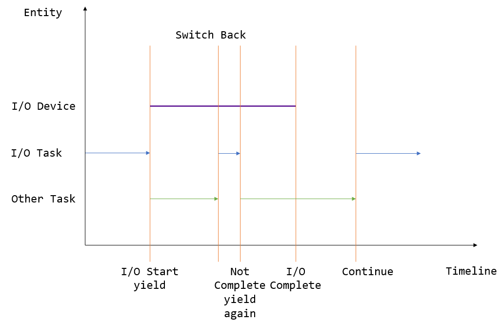

多道程序与协作式调度
=========================================

本节导读
--------------------------

上一节我们已经介绍了任务切换是如何实现的，最终我们将其封装为一个函数 ``__switch`` 。但是在实际使用的时候，我们需要知道何时调用该函数，以及如何确定传入函数的两个参数——分别代表正待换出和即将被换入的两条 Trap 控制流。本节我们就来介绍任务切换的第一种实际应用场景：多道程序。

本节的一个重点是展示进一步增强的操作系统管理能力的和对处理器资源的相对高效利用。为此，对 **任务** 的概念进行进一步扩展和延伸：形成了

- 任务运行状态：任务从开始到结束执行过程中所处的不同运行状态：未初始化、准备执行、正在执行、已退出
- 任务控制块：管理程序的执行过程的任务上下文，控制程序的执行与暂停
- 任务相关系统调用：应用程序和操作系统直接的接口，用于程序主动暂停 ``sys_yield`` 和主动退出 ``sys_exit``

本节的代码可以在 ``ch3-coop`` 分支上找到。

多道程序背景与 yield 系统调用
-------------------------------------------------------------------------

还记得第二章中介绍的批处理系统的设计初衷吗？它是注意到 CPU 并没有一直在执行应用程序，在一个应用程序运行结束直到下一个应用程序开始运行的这段时间，可能需要操作员取出上一个程序的执行结果并手动进行程序卡片的替换，这段空档期对于宝贵的 CPU 计算资源是一种巨大的浪费。于是批处理系统横空出世，它可以自动连续完成应用的加载和运行，并将一些本不需要 CPU 完成的简单任务交给廉价的外围设备，从而让 CPU 能够更加专注于计算任务本身，大大提高了 CPU 的利用率。

.. _term-input-output:

尽管 CPU 一直在跑应用了，但是其利用率仍有上升的空间。随着应用需求的不断复杂，有的时候会在内核的监督下访问一些外设，它们也是计算机系统的另一个非常重要的组成部分，即 **输入/输出** (I/O, Input/Output) 。CPU 会将请求和一些附加的参数写入外设，待外设处理完毕之后， CPU 便可以从外设读到请求的处理结果。比如在从作为外部存储的磁盘上读取数据的时候，CPU 将要读取的扇区的编号以及读到的数据放到的物理地址传给磁盘，在磁盘对请求进行调度并完成数据拷贝之后，就能在物理内存中看到要读取的数据。

在一个应用对外设发出了请求之后，它不能立即向下执行，而是要等待外设将请求处理完毕并拿到完整的处理结果之后才能继续。那么如何知道外设是否已经完成了请求呢？通常外设会提供一个可读的寄存器记录它目前的工作状态，于是 CPU 需要不断原地循环读取它直到它的结果显示设备已经将请求处理完毕了，才能向下执行。然而，外设的计算速度和 CPU 相比可能慢了几个数量级，这就导致 CPU 有大量时间浪费在等待外设这件事情上，这段时间它几乎没有做任何事情，也在一定程度上造成了 CPU 的利用率不够理想。

我们暂时考虑 CPU 只能 *单方面* 通过读取外设提供的寄存器来获取外设请求处理的状态。多道程序的思想在于：内核同时管理多个应用。如果外设处理的时间足够长，那我们可以先进行任务切换去执行其他应用，在某次切换回来之后，应用再次读取设备寄存器，发现请求已经处理完毕了，那么就可以用拿到的完整的数据继续向下执行了。这样的话，只要同时存在的应用足够多，就能保证 CPU 不必浪费时间在等待外设上，而是几乎一直在进行计算。这种任务切换，是通过应用进行一个名为 ``sys_yield`` 的系统调用来实现的，这意味着它主动交出 CPU 的使用权给其他应用。

这正是本节标题的后半部分“协作式”的含义。一个应用会持续运行下去，直到它主动调用 ``sys_yield`` 来交出 CPU 使用权。内核将很大的权力下放到应用，让所有的应用互相协作来最终达成最大化 CPU 利用率，充分利用计算资源这一终极目标。在计算机发展的早期，由于应用基本上都是一些简单的计算任务，且程序员都比较遵守规则，因此内核可以信赖应用，这样协作式的制度是没有问题的。

上图描述了一种多道程序执行的典型情况。其中横轴为时间线，纵轴为正在执行的实体。开始时，某个应用（蓝色）向外设提交了一个请求，随即可以看到对应的外设（紫色）开始工作。但是它要工作相当长的一段时间，因此应用（蓝色）不会去等待它结束而是会调用 ``sys_yield`` 主动交出 CPU 使用权来切换到另一个应用（绿色）。另一个应用（绿色）在执行了一段时间之后调用了 ``sys_yield`` ，此时内核决定让应用（蓝色）继续执行。它检查了一下外设的工作状态，发现请求尚未处理完，于是再次调用 ``sys_yield`` 。然后另一个应用（绿色）执行了一段时间之后 ``sys_yield`` 再次切换回这个应用（蓝色），这次的不同是它发现外设已经处理完请求了，于是它终于可以向下执行了。

上面我们是通过“避免无谓的外设等待来提高 CPU 利用率”这一切入点来引入 ``sys_yield`` 。但其实调用 ``sys_yield`` 不一定与外设有关。随着内核功能的逐渐复杂，我们还会遇到很多其他类型的需要等待其完成才能继续向下执行的事件，我们都可以立即调用 ``sys_yield`` 来避免等待过程造成的浪费。

.. note::

    **sys_yield 的缺点**

    请读者思考一下， ``sys_yield`` 存在哪些缺点？

    当应用调用它主动交出 CPU 使用权之后，它下一次再被允许使用 CPU 的时间点与内核的调度策略与当前的总体应用执行情况有关，很有可能远远迟于该应用等待的事件（如外设处理完请求）达成的时间点。这就会造成该应用的响应延迟不稳定，有可能极高。比如，设想一下，敲击键盘之后隔了数分钟之后才能在屏幕上看到字符，这已经超出了人类所能忍受的范畴。

    但也请不要担心，我们后面会有更加优雅的解决方案。

我们给出 ``sys_yield`` 的标准接口：

.. code-block:: rust
    :caption: 第三章新增系统调用（一）

    /// 功能：应用主动交出 CPU 所有权并切换到其他应用。
    /// 返回值：总是返回 0。
    /// syscall ID：124
    fn sys_yield() -> isize;

然后是用户库对应的实现和封装：

.. code-block:: rust
    
    // user/src/syscall.rs

    pub fn sys_yield() -> isize {
        syscall(SYSCALL_YIELD, [0, 0, 0])
    }

    // user/src/lib.rs

    pub fn yield_() -> isize { sys_yield() }

注意 ``yield`` 是 Rust 的关键字，因此我们只能将应用直接调用的接口命名为 ``yield_`` 。

接下来我们介绍内核应如何实现该系统调用。

任务控制块与任务运行状态
---------------------------------------------------------

在第二章批处理系统中我们只需知道目前执行到第几个应用就行了，因为同一时间内核只管理一个应用，当它出错或退出之后内核会
将其替换为另一个。然而，一旦引入了任务切换机制就没有那么简单了，同一时间内核需要管理多个未完成的应用，而且我们不能对
应用完成的顺序做任何假定，并不是先加入的应用就一定会先完成。这种情况下，我们必须在内核中对每个应用分别维护它的运行
状态，目前有如下几种：

.. code-block:: rust
    :linenos:

    // os/src/task/task.rs

    #[derive(Copy, Clone, PartialEq)]
    pub enum TaskStatus {
        UnInit, // 未初始化
        Ready, // 准备运行
        Running, // 正在运行
        Exited, // 已退出
    }

.. note::

    **Rust 语法卡片：#[derive]**

    通过 ``#[derive(...)]`` 可以让编译器为你的类型提供一些 Trait 的默认实现。

    - 实现了 ``Clone`` Trait 之后就可以调用 ``clone`` 函数完成拷贝；
    - 实现了 ``PartialEq`` Trait 之后就可以使用 ``==`` 运算符比较该类型的两个实例，从逻辑上说只有
      两个相等的应用执行状态才会被判为相等，而事实上也确实如此。
    - ``Copy`` 是一个标记 Trait，决定该类型在按值传参/赋值的时候取移动语义还是复制语义。

.. _term-task-control-block:

仅仅有这个是不够的，内核还需要保存一个应用的更多信息，我们将它们都保存在一个名为 **任务控制块** (Task Control Block) 的数据结构中：

.. code-block:: rust
    :linenos:

    // os/src/task/task.rs

    pub struct TaskControlBlock {
        pub task_cx_ptr: usize,
        pub task_status: TaskStatus,
    }

    impl TaskControlBlock {
        pub fn get_task_cx_ptr2(&self) -> *const usize {
            &self.task_cx_ptr as *const usize
        }
    }

可以看到我们还在 ``task_cx_ptr`` 字段中维护了一个上一小节中提到的指向应用被切换出去的时候，它内核栈栈顶的任务上下文的指针。而在任务切换函数 ``__switch`` 中我们需要用这个 ``task_cx_ptr`` 的指针作为参数并代表这个应用，于是 ``TaskControlBlock`` 还提供了获取这个指针的指针 ``task_cx_ptr2`` 的方法 ``get_task_cx_ptr2`` 。

任务控制块非常重要。在内核中，它就是应用的管理单位。在后面的章节我们还会不断向里面添加更多内容。

任务管理器
--------------------------------------

我们还需要一个全局的任务管理器来管理这些用任务控制块描述的应用：

.. code-block:: rust

    // os/src/task/mod.rs

    pub struct TaskManager {
        num_app: usize,
        inner: RefCell<TaskManagerInner>,
    }

    struct TaskManagerInner {
        tasks: [TaskControlBlock; MAX_APP_NUM],
        current_task: usize,
    }

    unsafe impl Sync for TaskManager {}

其中仍然使用到了变量与常量分离的编程风格：字段 ``num_app`` 仍然表示任务管理器管理的应用的数目，它在 ``TaskManager`` 初始化之后就不会发生变化；而包裹在 ``TaskManagerInner`` 内的任务控制块数组 ``tasks`` 以及表示 CPU 正在执行的应用编号 ``current_task`` 会在执行应用的过程中发生变化：每个应用的运行状态都会发生变化，而 CPU 执行的应用也在不断切换。

再次强调，这里的 ``current_task`` 与第二章批处理系统中的含义不同。在批处理系统中，它表示一个既定的应用序列中的执行进度，隐含着在该应用之前的都已经执行完毕，之后都没有执行；而在这里我们只能通过它知道 CPU 正在执行哪个应用，而不能获得其他应用的任何信息。

我们在使用之前初始化 ``TaskManager`` 的全局实例 ``TASK_MANAGER`` （为此也需要将 ``TaskManager`` 标记为 ``Sync``）：

.. code-block:: rust
    :linenos:

    // os/src/task/mod.rs

    lazy_static! {
        pub static ref TASK_MANAGER: TaskManager = {
            let num_app = get_num_app();
            let mut tasks = [
                TaskControlBlock { task_cx_ptr: 0, task_status: TaskStatus::UnInit };
                MAX_APP_NUM
            ];
            for i in 0..num_app {
                tasks[i].task_cx_ptr = init_app_cx(i) as * const _ as usize;
                tasks[i].task_status = TaskStatus::Ready;
            }
            TaskManager {
                num_app,
                inner: RefCell::new(TaskManagerInner {
                    tasks,
                    current_task: 0,
                }),
            }
        };
    }

- 第 5 行：调用 ``loader`` 子模块提供的 ``get_num_app`` 接口获取链接到内核的应用总数，后面会用到；
- 第 6~9 行：创建一个初始化的 ``tasks`` 数组，其中的每个任务控制块的运行状态都是 ``UnInit`` 代表尚未初始化；
- 第 10~12 行：依次对每个任务控制块进行初始化，将其运行状态设置为 ``Ready`` ，并在它的内核栈栈顶压入一些初始化
  的上下文，然后更新它的 ``task_cx_ptr`` 。一些细节我们会稍后介绍。
- 从第 14 行开始：创建 ``TaskManager`` 实例并返回。

实现 sys_yield 和 sys_exit
----------------------------------------------------------------------------

``sys_yield`` 的实现用到了 ``task`` 子模块提供的 ``suspend_current_and_run_next`` 接口：

.. code-block:: rust

    // os/src/syscall/process.rs

    use crate::task::suspend_current_and_run_next;

    pub fn sys_yield() -> isize {
        suspend_current_and_run_next();
        0
    }

这个接口如字面含义，就是暂停当前的应用并切换到下个应用。

同样， ``sys_exit`` 也改成基于 ``task`` 子模块提供的 ``exit_current_and_run_next`` 接口：

.. code-block:: rust

    // os/src/syscall/process.rs

    use crate::task::exit_current_and_run_next;

    pub fn sys_exit(exit_code: i32) -> ! {
        println!("[kernel] Application exited with code {}", exit_code);
        exit_current_and_run_next();
        panic!("Unreachable in sys_exit!");
    }

它的含义是退出当前的应用并切换到下个应用。在调用它之前我们打印应用的退出信息并输出它的退出码。如果是应用出错也应该调用该接口，不过我们这里并没有实现，有兴趣的读者可以尝试。

那么 ``suspend_current_and_run_next`` 和 ``exit_current_and_run_next`` 各是如何实现的呢？

.. code-block:: rust

    // os/src/task/mod.rs

    pub fn suspend_current_and_run_next() {
        mark_current_suspended();
        run_next_task();
    }

    pub fn exit_current_and_run_next() {
        mark_current_exited();
        run_next_task();
    }

它们都是先修改当前应用的运行状态，然后尝试切换到下一个应用。修改运行状态比较简单，实现如下：

.. code-block:: rust
    :linenos:

    // os/src/task/mod.rs

    fn mark_current_suspended() {
        TASK_MANAGER.mark_current_suspended();
    }

    fn mark_current_exited() {
        TASK_MANAGER.mark_current_exited();
    }

    impl TaskManager {
        fn mark_current_suspended(&self) {
            let mut inner = self.inner.borrow_mut();
            let current = inner.current_task;
            inner.tasks[current].task_status = TaskStatus::Ready;
        }

        fn mark_current_exited(&self) {
            let mut inner = self.inner.borrow_mut();
            let current = inner.current_task;
            inner.tasks[current].task_status = TaskStatus::Exited;
        }
    }

以 ``mark_current_suspended`` 为例。它调用了全局任务管理器 ``TASK_MANAGER`` 的 ``mark_current_suspended`` 方法。其中，首先获得里层 ``TaskManagerInner`` 的可变引用，然后根据其中记录的当前正在执行的应用 ID 对应在任务控制块数组 ``tasks`` 中修改状态。

接下来看看 ``run_next_task`` 的实现：

.. code-block:: rust
    :linenos:

    // os/src/task/mod.rs

    fn run_next_task() {
        TASK_MANAGER.run_next_task();
    }

    impl TaskManager {
        fn run_next_task(&self) {
            if let Some(next) = self.find_next_task() {
                let mut inner = self.inner.borrow_mut();
                let current = inner.current_task;
                inner.tasks[next].task_status = TaskStatus::Running;
                inner.current_task = next;
                let current_task_cx_ptr2 = inner.tasks[current].get_task_cx_ptr2();
                let next_task_cx_ptr2 = inner.tasks[next].get_task_cx_ptr2();
                core::mem::drop(inner);
                unsafe {
                    __switch(
                        current_task_cx_ptr2,
                        next_task_cx_ptr2,
                    );
                }
            } else {
                panic!("All applications completed!");
            }
        }
    }

``run_next_task`` 使用任务管理器的全局实例 ``TASK_MANAGER`` 的 ``run_next_task`` 方法。它会调用 ``find_next_task`` 方法尝试寻找一个运行状态为 ``Ready`` 的应用并返回其 ID 。注意到其返回的类型是 ``Option<usize>`` ，也就是说不一定能够找到，当所有的应用都退出并将自身状态修改为 ``Exited`` 就会出现这种情况，此时 ``find_next_task`` 应该返回 ``None`` 。如果能够找到下一个可运行的应用的话，我们就可以分别拿到当前应用 ``current`` 和即将被切换到的应用 ``next`` 的 ``task_cx_ptr2`` ，然后调用 ``__switch`` 接口进行切换。如果找不到的话，说明所有的应用都运行完毕了，我们可以直接 panic 退出内核。

注意在实际切换之前我们需要手动 drop 掉我们获取到的 ``TaskManagerInner`` 的可变引用。因为一般情况下它是在函数退出之后才会被自动释放，从而 ``TASK_MANAGER`` 的 ``inner`` 字段得以回归到未被借用的状态，之后可以再借用。如果不手动 drop 的话，编译器会在 ``__switch`` 返回，也就是当前应用被切换回来的时候才 drop，这期间我们都不能修改 ``TaskManagerInner`` ，甚至不能读（因为之前是可变借用）。正因如此，我们需要在 ``__switch`` 前提早手动 drop 掉 ``inner`` 。

于是 ``find_next_task`` 又是如何实现的呢？

.. code-block:: rust
    :linenos:

    // os/src/task/mod.rs

    impl TaskManager {
        fn find_next_task(&self) -> Option<usize> {
            let inner = self.inner.borrow();
            let current = inner.current_task;
            (current + 1..current + self.num_app + 1)
                .map(|id| id % self.num_app)
                .find(|id| {
                    inner.tasks[*id].task_status == TaskStatus::Ready
                })
        }
    }

``TaskManagerInner`` 的 ``tasks`` 是一个固定的任务控制块组成的表，长度为 ``num_app`` ，可以用下标 ``0~num_app-1`` 来访问得到每个应用的控制状态。我们的任务就是找到 ``current_task`` 后面第一个状态为 ``Ready`` 的应用。因此从 ``current_task + 1`` 开始循环一圈，需要首先对 ``num_app`` 取模得到实际的下标，然后检查它的运行状态。

.. note:: 

    **Rust 语法卡片：迭代器**

    ``a..b`` 实际上表示左闭右开区间 :math:`[a,b)` ，在 Rust 中，它会被表示为类型 ``core::ops::Range`` ，标准库中为它实现好了 ``Iterator`` trait，因此它也是一个迭代器。

    关于迭代器的使用方法如 ``map/find`` 等，请参考 Rust 官方文档。

我们可以总结一下应用的运行状态变化图：

.. image:: fsm-coop.png

第一次进入用户态
------------------------------------------

在应用真正跑起来之前，需要 CPU 第一次从内核态进入用户态。我们在第二章批处理系统中也介绍过实现方法，只需在内核栈上压入构造好的 Trap 上下文，然后 ``__restore`` 即可。本章的思路大致相同，但是有一些变化。

当一个应用即将被运行的时候，它会被 ``__switch`` 过来。如果它是之前被切换出去的话，那么此时它的内核栈上应该有 Trap 上下文和任务上下文，切换机制可以正常工作。但是如果它是第一次被执行怎么办呢？这就需要它的内核栈上也有类似结构的内容。我们是在创建 ``TaskManager`` 的全局实例 ``TASK_MANAGER`` 的时候来进行这个初始化的。

.. code-block:: rust

    // os/src/task/mod.rs

    for i in 0..num_app {
        tasks[i].task_cx_ptr = init_app_cx(i) as * const _ as usize;
        tasks[i].task_status = TaskStatus::Ready;
    }

当时我们进行了这样的操作。 ``init_app_cx`` 是在 ``loader`` 子模块中定义的：

.. code-block:: rust

    // os/src/loader.rs

    pub fn init_app_cx(app_id: usize) -> &'static TaskContext {
        KERNEL_STACK[app_id].push_context(
            TrapContext::app_init_context(get_base_i(app_id), USER_STACK[app_id].get_sp()),
            TaskContext::goto_restore(),
        )
    }

    impl KernelStack {
        fn get_sp(&self) -> usize {
            self.data.as_ptr() as usize + KERNEL_STACK_SIZE
        }
        pub fn push_context(&self, trap_cx: TrapContext, task_cx: TaskContext) -> &'static mut TaskContext {
            unsafe {
                let trap_cx_ptr = (self.get_sp() - core::mem::size_of::<TrapContext>()) as *mut TrapContext;
                *trap_cx_ptr = trap_cx;
                let task_cx_ptr = (trap_cx_ptr as usize - core::mem::size_of::<TaskContext>()) as *mut TaskContext;
                *task_cx_ptr = task_cx;
                task_cx_ptr.as_mut().unwrap()
            }
        }
    }

这里 ``KernelStack`` 的 ``push_context`` 方法先压入一个和之前相同的 Trap 上下文，再在它上面压入一个任务上下文，然后返回任务上下文的地址。这个任务上下文是我们通过 ``TaskContext::goto_restore`` 构造的：

.. code-block:: rust

    // os/src/task/context.rs

    impl TaskContext {
        pub fn goto_restore() -> Self {
            extern "C" { fn __restore(); }
            Self {
                ra: __restore as usize,
                s: [0; 12],
            }
        }
    }

它只是将任务上下文的 ``ra`` 寄存器设置为 ``__restore`` 的入口地址。这样，在 ``__switch`` 从它上面恢复并返回之后就会直接跳转到 ``__restore`` ，此时栈顶是一个我们构造出来第一次进入用户态执行的 Trap 上下文，就和第二章的情况一样了。

需要注意的是， ``__restore`` 的实现需要做出变化：它 **不再需要** 在开头 ``mv sp, a0`` 了。因为在 ``__switch`` 之后，``sp`` 就已经正确指向了我们需要的 Trap 上下文地址。

在 ``rust_main`` 中我们调用 ``task::run_first_task`` 来开始应用的执行：

.. code-block:: rust
    :linenos:

    // os/src/task/mod.rs

    impl TaskManager {
        fn run_first_task(&self) {
            self.inner.borrow_mut().tasks[0].task_status = TaskStatus::Running;
            let next_task_cx_ptr2 = self.inner.borrow().tasks[0].get_task_cx_ptr2();
            let _unused: usize = 0;
            unsafe {
                __switch(
                    &_unused as *const _,
                    next_task_cx_ptr2,
                );
            }
        }
    }

    pub fn run_first_task() {
        TASK_MANAGER.run_first_task();
    }

这里我们取出即将最先执行的编号为 0 的应用的 ``task_cx_ptr2`` 并希望能够切换过去。注意 ``__switch`` 有两个参数分别表示当前应用和即将切换到的应用的 ``task_cx_ptr2`` ，其第一个参数存在的意义是记录当前应用的任务上下文被保存在哪里，也就是当前应用内核栈的栈顶，这样之后才能继续执行该应用。但在 ``run_first_task`` 的时候，我们并没有执行任何应用， ``__switch`` 前半部分的保存仅仅是在启动栈上保存了一些之后不会用到的数据，自然也无需记录启动栈栈顶的位置。

因此，我们显式声明了一个 ``_unused`` 变量，并将它的地址作为第一个参数传给 ``__switch`` ，这样保存一些寄存器之后的启动栈栈顶的位置将会保存在此变量中。然而无论是此变量还是启动栈我们之后均不会涉及到，一旦应用开始运行，我们就开始在应用的用户栈和内核栈之间开始切换了。这里声明此变量的意义仅仅是为了避免覆盖到其他数据。

三叠纪“始初龙”协作式操作系统
---------------------------------

简介与画图！！！