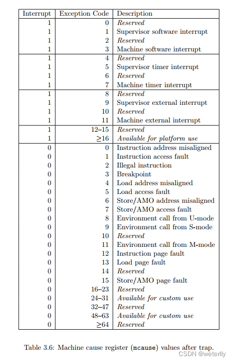

练习参考答案
=======================================

课后练习
-------------------------------

编程题
~~~~~~~~~~~~~~~~~~~~~~~~~~~~~~~

1. 扩展内核，能够显示操作系统切换任务的过程。
^^^^^^^^^^^^^^^^^^^^^^^^^^^^^^^^^^^^^^^^^^^^^

切换任务是在 ``task/mod.rs`` 中的 ``TASK_MANAGER`` 中完成的，主要靠
``mark_current_suspended()`` 和 ``mark_current_exited()``
标记任务运行结束，\ ``run_next_task``
标记任务开始运行，在其中插入输出即可显示切换任务的过程（下面代码中的加入的三行
``println!`` ）

.. caution:: **03sleep.rs测例会导致频繁切换任务，使得输出过多。可以修改测例的等待时间来减少输出。**

.. code:: rust

       /// Change the status of current `Running` task into `Ready`.
       fn mark_current_suspended(&self) {
           let mut inner = self.inner.exclusive_access();
           let current = inner.current_task;
           println!("task {} suspended", current);
           inner.tasks[current].task_status = TaskStatus::Ready;
       }

       /// Change the status of current `Running` task into `Exited`.
       fn mark_current_exited(&self) {
           let mut inner = self.inner.exclusive_access();
           let current = inner.current_task;
           println!("task {} exited", current);
           inner.tasks[current].task_status = TaskStatus::Exited;
       }

       /// Switch current `Running` task to the task we have found,
       /// or there is no `Ready` task and we can exit with all applications completed
       fn run_next_task(&self) {
           if let Some(next) = self.find_next_task() {
               let mut inner = self.inner.exclusive_access();
               let current = inner.current_task;
               println!("task {} start", current);
               inner.tasks[next].task_status = TaskStatus::Running;
               inner.current_task = next;
               let current_task_cx_ptr = &mut inner.tasks[current].task_cx as *mut TaskContext;
               let next_task_cx_ptr = &inner.tasks[next].task_cx as *const TaskContext;
               drop(inner);
               // before this, we should drop local variables that must be dropped manually
               unsafe {
                   __switch(current_task_cx_ptr, next_task_cx_ptr);
               }
               // go back to user mode
           } else {
               println!("All applications completed!");
               use crate::board::QEMUExit;
               crate::board::QEMU_EXIT_HANDLE.exit_success();
           }
       }

2. 扩展内核，能够统计每个应用执行后的完成时间：用户态完成时间和内核态完成时间。
^^^^^^^^^^^^^^^^^^^^^^^^^^^^^^^^^^^^^^^^^^^^^^^^^^^^^^^^^^^^^^^^^^^^^^^^^^^^^^^

.. note:: 如果先做了第一题，记得删掉上面的输出，并且最好复原 ``03sleep.rs``\ （如果有修改）。

2.1. 如何计算时间
'''''''''''''''''''
首先给每个 ``TaskControlBlock`` 加上用户时间和内核时间两个属性：

.. code:: rust

   #[derive(Copy, Clone)]
   pub struct TaskControlBlock {
       pub task_status: TaskStatus,
       pub task_cx: TaskContext,
       pub user_time: usize,
       pub kernel_time: usize,
   }

然后在 ``TaskManager`` 中设置一个“停表”变量
``stop_watch``\ ，并通过以下方法来“掐表”：

.. code:: rust

   /// Inner of Task Manager
   pub struct TaskManagerInner {
       /// task list
       tasks: [TaskControlBlock; MAX_APP_NUM],
       /// id of current `Running` task
       current_task: usize,
       /// 停表
       stop_watch: usize,
   }

.. code:: rust

   impl TaskManagerInner {
       fn refresh_stop_watch(&mut self) -> usize {
           let start_time = self.stop_watch;
           self.stop_watch = get_time_ms();
           self.stop_watch - start_time
       }
   }

可以看到，这个方法每次会返回从当前到上一次“掐表”的时间间隔，然后刷新为当前时间。之后就可以利用它来统计应用执行时间了。

2.2. 统计内核态时间
'''''''''''''''''''

切换内核态任务时，需要记录上一个任务的时间，并重新开始统计下一个任务的时间。

在 ``TaskManager`` 的三个方法中插入上面的
``refresh_stop_watch()``\ 即可（注意中文注释的位置）

.. code:: rust

       fn run_first_task(&self) -> ! {
           let mut inner = self.inner.exclusive_access();
           let task0 = &mut inner.tasks[0];
           task0.task_status = TaskStatus::Running;
           let next_task_cx_ptr = &task0.task_cx as *const TaskContext;
           /// 开始记录时间
           inner.refresh_stop_watch();
           drop(inner);
           let mut _unused = TaskContext::zero_init();
           // before this, we should drop local variables that must be dropped manually
           unsafe {
               __switch(&mut _unused as *mut TaskContext, next_task_cx_ptr);
           }
           panic!("unreachable in run_first_task!");
       }

       /// Change the status of current `Running` task into `Ready`.
       fn mark_current_suspended(&self) {
           let mut inner = self.inner.exclusive_access();
           let current = inner.current_task;
           // 统计内核时间
           inner.tasks[current].kernel_time += inner.refresh_stop_watch();
           inner.tasks[current].task_status = TaskStatus::Ready;
       }

       /// Change the status of current `Running` task into `Exited`.
       fn mark_current_exited(&self) {
           let mut inner = self.inner.exclusive_access();
           let current = inner.current_task;
           // 统计内核时间并输出
           inner.tasks[current].kernel_time += inner.refresh_stop_watch();
           println!("[task {} exited. user_time: {} ms, kernle_time: {} ms.", current, inner.tasks[current].user_time, inner.tasks[current].kernel_time);
           inner.tasks[current].task_status = TaskStatus::Exited;
       }

2.3. 统计用户态时间
'''''''''''''''''''

在 ``trap`` 进入退出用户态的时候，可以统计用户态的运行时间，在
``trap_handler`` 的开头结尾添加上函数 ``user_time_end``
``user_time_start``\ ：

.. code:: rust

   /// handle an interrupt, exception, or system call from user space
   pub fn trap_handler(cx: &mut TrapContext) -> &mut TrapContext {
       crate::task::user_time_end();
       let scause = scause::read(); // get trap cause
       let stval = stval::read(); // get extra value
       match scause.cause() {
           Trap::Exception(Exception::UserEnvCall) => {
               cx.sepc += 4;
               cx.x[10] = syscall(cx.x[17], [cx.x[10], cx.x[11], cx.x[12]]) as usize;
           }
           Trap::Exception(Exception::StoreFault) | Trap::Exception(Exception::StorePageFault) => {
               println!("[kernel] PageFault in application, bad addr = {:#x}, bad instruction = {:#x}, kernel killed it.", stval, cx.sepc);
               exit_current_and_run_next();
           }
           Trap::Exception(Exception::IllegalInstruction) => {
               println!("[kernel] IllegalInstruction in application, kernel killed it.");
               exit_current_and_run_next();
           }
           Trap::Interrupt(Interrupt::SupervisorTimer) => {
               set_next_trigger();
               suspend_current_and_run_next();
           }
           _ => {
               panic!(
                   "Unsupported trap {:?}, stval = {:#x}!",
                   scause.cause(),
                   stval
               );
           }
       }
       crate::task::user_time_start();
       cx
   }

这两个函数的实现也很简单，在 ``TaskManager`` 的实现中加入：

.. code:: rust

       /// 统计内核时间，从现在开始算的是用户时间
       fn user_time_start(&self) {
           let mut inner = self.inner.exclusive_access();
           let current = inner.current_task;
           inner.tasks[current].kernel_time += inner.refresh_stop_watch();
       }

       /// 统计用户时间，从现在开始算的是内核时间
       fn user_time_end(&self) {
           let mut inner = self.inner.exclusive_access();
           let current = inner.current_task;
           inner.tasks[current].user_time += inner.refresh_stop_watch();
       }

再在同文件 ``task/mod.rs`` 中包装成

.. code:: rust

   /// 统计内核时间，从现在开始算的是用户时间
   pub fn user_time_start() {
       TASK_MANAGER.user_time_start()
   }

   /// 统计用户时间，从现在开始算的是内核时间
   pub fn user_time_end() {
       TASK_MANAGER.user_time_end()
   }

就是全部的实现了。

2.4. 这个实现正确吗？（重要）
'''''''''''''''''''''''''''''''''

上面的实现其实隐含了所有的切换情况。请考虑以下的场景：

i. 第一个任务开始运行时：

-  先在\ ``run_first_task`` 中刷新了停表(不统计)，随后通过 ``__switch``
   跳转到 ``__restore``\ 进入用户态执行。

-  从用户态回来后，遇到函数
   ``user_time_end()``\ ，此时刷新停表并统计用户态时间。

ii. 正常 syscall

-  从用户态回来后，遇到函数
   ``user_time_end()``\ ，此时刷新停表并统计用户态时间。

-  在 ``trap`` 结尾处遇到函数
   ``user_time_start()``\ ，刷新停表，并统计内核态时间

iii. 通过时钟中断切换任务：

-  前一个任务从用户态回来后，遇到函数
   ``user_time_end()``\ ，此时刷新停表并统计用户态时间。

-  在 ``mark_current_suspended`` 中又刷新停表，并统计内核态时间。

-  切换到新任务后，在 ``trap`` 结尾处遇到函数
   ``user_time_start()``\ ，刷新停表，并统计新任务的内核态时间

iv. 任务结束

-  从用户态回来后，遇到函数
   ``user_time_end()``\ ，此时刷新停表并统计用户态时间。

-  在 ``mark_current_exited``\ 中又刷新停表，并统计内核态时间，然后输出

3. 编写浮点应用程序A，并扩展内核，支持面向浮点应用的正常切换与抢占。
^^^^^^^^^^^^^^^^^^^^^^^^^^^^^^^^^^^^^^^^^^^^^^^^^^^^^^^^^^^^^^^^^^^^

需要在 ``trap.S`` 中加入浮点寄存器组的保存和恢复指令（见中文注释处）：

::

   __alltraps:
       csrrw sp, sscratch, sp
       # now sp->kernel stack, sscratch->user stack
       # allocate a TrapContext on kernel stack
       addi sp, sp, -34*8
       # save general-purpose registers
       sd x1, 1*8(sp)
       # skip sp(x2), we will save it later
       sd x3, 3*8(sp)
       # skip tp(x4), application does not use it
       # save x5~x31
       .set n, 5
       .rept 27
           SAVE_GP %n
           .set n, n+1
       .endr
       # we can use t0/t1/t2 freely, because they were saved on kernel stack
       csrr t0, sstatus
       csrr t1, sepc
       sd t0, 32*8(sp)
       sd t1, 33*8(sp)
       # read user stack from sscratch and save it on the kernel stack
       csrr t2, sscratch
       # 浮点寄存器
       fsd fs0, 34*8(sp)
       fsd fs1, 35*8(sp)
       ......
       sd t2, 2*8(sp)
       # set input argument of trap_handler(cx: &mut TrapContext)
       mv a0, sp
       call trap_handler

   __restore:
       # now sp->kernel stack(after allocated), sscratch->user stack
       # restore sstatus/sepc
       ld t0, 32*8(sp)
       ld t1, 33*8(sp)
       ld t2, 2*8(sp)
       csrw sstatus, t0
       csrw sepc, t1
       csrw sscratch, t2
       # restore general-purpuse registers except sp/tp
       ld x1, 1*8(sp)
       ld x3, 3*8(sp)
       .set n, 5
       .rept 27
           LOAD_GP %n
           .set n, n+1
       .endr
       # 浮点寄存器
       fld fs0, 34*8(sp)
       fld fs1, 35*8(sp)
       ......
       # release TrapContext on kernel stack
       addi sp, sp, 34*8
       # now sp->kernel stack, sscratch->user stack
       csrrw sp, sscratch, sp
       sret

此外，支持浮点指令可能还需要(包括但不限于)以下条件：

-  机器本身支持浮点指令

-  Rust 编译目标包含浮点指令

   -  在 ``os/Makefile`` 中的 ``TARGET := riscv64gc-unknown-none-elf``
      支持浮点指令，而对应的 ``riscv64imac`` 则不支持。

   -  如果机器本身支持但使用\ ``riscv64imac``\ 作为编译目标，仍然可以通过强行插入指令的方式来支持浮点，如
      ``fld fs0, 280(sp)`` 在 RISCV 指令集中表示为机器码 ``0x2472``
      ，就可以在上面的 ``trap.S`` 中插入

      ::

         .short 0x2472 # fld fs0, 280(sp)

      来支持浮点指令

-  需要通过控制浮点控制状态寄存器（如 ``fcsr``\ ）来检查FPU状态。详见
   https://five-embeddev.com/riscv-isa-manual/latest/machine.html#machine-trap-vector-base-address-register-mtvec

4. 编写应用程序或扩展内核，能够统计任务切换的大致开销。
^^^^^^^^^^^^^^^^^^^^^^^^^^^^^^^^^^^^^^^^^^^^^^^^^^^^^^^

所有任务切换都通过
``__switch``\ ，可以包装一下这个函数，统计它运行的开销。首先删除
``task/mod.rs`` 中的 ``use switch::__switch``\ ，然后加入以下函数来代替
``__switch``\ ：

.. code:: rust

   /// 切换的开始时间
   static mut SWITCH_TIME_START: usize = 0;
   /// 切换的总时间
   static mut SWITCH_TIME_COUNT: usize = 0;

   unsafe fn __switch(current_task_cx_ptr: *mut TaskContext, next_task_cx_ptr: *const TaskContext) {
       SWITCH_TIME_START = get_time_us();
       switch::__switch(current_task_cx_ptr, next_task_cx_ptr);
       SWITCH_TIME_COUNT += get_time_us() - SWITCH_TIME_START;
   }

   fn get_switch_time_count() -> usize {
       unsafe { SWITCH_TIME_COUNT }
   }

.. caution::
   这里统计时间使用了一个
   ``get_time_us``\ ，即计算当前的微秒数。这是因为任务切换的时间比较短，不好用毫秒来计数。对应的实现在
   ``timer.rs`` 中：

.. code:: rust

   const USEC_PER_SEC: usize = 1000000;

   /// get current time in milliseconds
   pub fn get_time_us() -> usize {
       time::rad() / (CLOCK_FREQ / USEC_PER_SEC)
   }

最后，在 ``run_next_task`` 中所有程序退出后，增加一条输出语句即可：

.. code:: rust

   ......
           } else {
               println!("All applications completed!");
               // 统计任务切换时间
               println!("task switch time: {} us", get_switch_time_count());
               use crate::board::QEMUExit;
               crate::board::QEMU_EXIT_HANDLE.exit_success();
           }

5.扩展内核，支持在内核态响应中断。
^^^^^^^^^^^^^^^^^^^^^^^^^^^^^^^^^^

内核开关中断的控制主要涉及\ ``sstatus``\ 寄存器的两个位：

-  在 ``sie`` 位可开关中断，如使用

   .. code:: rust

      use riscv::register::sstatus;
      unsafe { sstatus::set_sie() }; // 打开内核态中断
      unsafe { sstatus::clear_sie() }; // 关闭内核态中断

-  在 ``spp`` 位可以分辨中断的来源。现在\ **将原本的
   ``trap/mod.rs:trap_handler()`` 改名为 ``user_trap_handler()``\ ，
   并增加一个新的 ``trap_handler()`` 函数**\ ：

   .. code:: rust

      #[no_mangle]
      pub fn trap_handler(cx: &mut TrapContext) -> &mut TrapContext {
          match sstatus::read().spp() {
              sstatus::SPP::Supervisor => kernel_trap_handler(cx),
              sstatus::SPP::User => user_trap_handler(cx),
          }
      }

从上面的函数可以看出，我们还需要额外在 ``trap/mod.rs`` 写一个
``kernel_trap_handler`` 来处理内核中断：

.. code:: rust

   /// 处理内核异常和中断
   pub fn kernel_trap_handler(cx: &mut TrapContext) -> &mut TrapContext {
       let scause = scause::read();
       let stval = stval::read();
       match scause.cause() {
           Trap::Interrupt(Interrupt::SupervisorTimer) => {
               // 内核中断来自一个时钟中断
               println!("kernel interrupt: from timer");
               // 标记一下触发了中断
               mark_kernel_interrupt();
               set_next_trigger();
           }
           Trap::Exception(Exception::StoreFault) | Trap::Exception(Exception::StorePageFault) => {
               panic!("[kernel] PageFault in kernel, bad addr = {:#x}, bad instruction = {:#x}, kernel killed it.", stval, cx.sepc);
           }
           _ => {
               // 其他的内核异常/中断
               panic!("unknown kernel exception or interrupt");
           }
       }
       cx
   }

其中和用户态的中断实现大致相同，但异常和中断没有写全，可以后续补充。值得注意的有以下几点：

-  在函数中不使用 ``clear_sie / set_sie``
   来开关中断，这是因为虽然我们在\ ``main.rs``\ 的测试中打开了中断，但
   ``RISC-V`` 会自动在中断触发时关闭 ``sstatus.SIE``\ ，在
   ``sret``\ 返回时打开
   ``sstatus.SIE``\ 。\ **在内核中需要小心打开中断的时机**\ 。例如触发中断时，内核正在拿着一些
   mutex 锁，那么它在 ``trap_handler``
   中处理时一旦尝试拿锁，就可能自己跟自己造成死锁。

-  在收到时钟中断时，输出了内容并调用了
   ``mark_kernel_interrupt``\ 。这和中断机制无关，只是在\ ``trap/mod.rs``
   中增加了一个全局变量，用于检查是否成功触发了内核中断

.. code:: rust

   static mut KERNEL_INTERRUPT_TRIGGERED: bool = false;

   /// 检查内核中断是否触发
   pub fn check_kernel_interrupt() -> bool {
       unsafe { (&mut KERNEL_INTERRUPT_TRIGGERED as *mut bool).read_volatile() }
   }

   /// 标记内核中断已触发
   pub fn trigger_kernel_interrupt() {
       unsafe {
           (&mut KERNEL_INTERRUPT_TRIGGERED as *mut bool).write_volatile(true);
       }
   }

相对应的，在 ``main.rs`` 中，我们在 ``timer::set_next_trigger()``
之后，在开始用户程序的 ``task::run_first_task();``
之前加了一段测试程序：

.. code:: rust

   pub fn rust_main() -> ! {
       clear_bss();
       println!("[kernel] Hello, world!");
       trap::init();
       loader::load_apps();
       trap::enable_timer_interrupt();
       timer::set_next_trigger();

       use riscv::register::sstatus;
       unsafe { sstatus::set_sie() }; // 打开内核态中断
       loop {
           if trap::check_kernel_interrupt() {
               println!("kernel interrupt returned.");
               break;
           }
       }
       unsafe { sstatus::clear_sie() }; // 关闭内核态中断
       task::run_first_task();
       panic!("Unreachable in rust_main!");
   }

但修改上面的代码后还无法通过编译，\ **因为真正的“中断入口处理”是在
``trap.S`` 中的汇编代码，如果它不做任何处理**\ ：

-  一个内核中断进入原本的 ``trap.S`` 代码时，它会首先遇到
   ``csrrw sp, sscratch, sp``

   -  按上面的测试，此时还没有进入用户程序，那么交换后 sp 为 0。

      ``trap.S`` 下面的代码是增长栈并尝试保存寄存器：

      ::

         __alltraps:
             csrrw sp, sscratch, sp
             # now sp->kernel stack, sscratch->user stack
             # allocate a TrapContext on kernel stack
             addi sp, sp, -34*8
             # save general-purpose registers
             sd x1, 1*8(sp)

      在\ ``addi``\ 指令后， sp 会被写成 ``0xfffffffffffffef8``\ ；在
      ``sd``
      指令时，因为写入地址不合法（整个内核都在\ ``0x80200000``\ 附近）会触发
      ``StorePageFault``

-  

   -  由于触发\ ``StorePageFault``\ ，此时又会进入
      ``__alltraps``\ ，于是内核在这几条语句上死循环了

如果进入用户程序后，在用户程序的内核态触发内核中断，那么此时会把用户态的栈交换到
``sp`` 寄存器，并在用户态的栈里写内核信息。这也是不可接受的错误。

因此，我们需要\ **在 ``trap.S``
内陷入和返回时做出判断，如果是内核中断异常则不换栈，如果是用户中断异常则通过
``csrrw sp, sscratch, sp`` 换栈**

将 ``__alltrap`` 的开头改为：

.. code:: asm

   __alltraps:
       csrr tp, sstatus
       andi tp, tp, 0x100
       beqz tp, __user_trap_start
       j __real_trap_entry

   __user_trap_start:
       csrrw sp, sscratch, sp

   __real_trap_entry:
       # now sp->kernel stack, sscratch->user stack
       # allocate a TrapContext on kernel stack
       addi sp, sp, -34*8
       ......

这段代码等价于取出\ ``sstatus``\ 寄存器的
``spp``\ 位做判断，如果为0则是用户态中断，否则是内核态中断。类似地，在中断返回时也要做一次判断。将
``__restore`` 改为：

.. code:: 

   __restore:
       # now sp->kernel stack(after allocated), sscratch->user stack
       # restore sstatus/sepc
       ld t0, 32*8(sp)
       ld t1, 33*8(sp)
       ld t2, 2*8(sp)
       csrw sstatus, t0
       csrw sepc, t1
       csrw sscratch, t2
       # get SPP
       andi t0, t0, 0x100
       bnez t0, __kernel_trap_end

   __user_trap_end:
       # restore general-purpuse registers except sp/tp
       ld x1, 1*8(sp)
       ld x3, 3*8(sp)
       .set n, 5
       .rept 27
           LOAD_GP %n
           .set n, n+1
       .endr
       # release TrapContext on kernel stack
       addi sp, sp, 34*8
       # now sp->kernel stack, sscratch->user stack
       csrrw sp, sscratch, sp
       sret

   __kernel_trap_end:
       # restore general-purpuse registers except sp/tp
       ld x1, 1*8(sp)
       ld x3, 3*8(sp)
       .set n, 5
       .rept 27
           LOAD_GP %n
           .set n, n+1
       .endr
       # release TrapContext on kernel stack
       addi sp, sp, 34*8
       sret

.. caution:: 注意返回时需要先获取中断来源信息再恢复寄存器。

以上就是内核中断的一个基本实现了，但还不具备实用价值，真正利用内核中断还需要扩展
``kernel_trap_handler`` 函数，支持更有意义的中断类型。

如何在不破坏寄存器的情况下检查中断来源
''''''''''''''''''''''''''''''''''''''

在上面的代码实现中，在陷入 ``__alltrap`` 时利用了 ``tp`` 寄存器来检查
``sstatus``\ 的\ ``SPP`` 信息，这样原本\ ``tp``
寄存器的信息就丢失了。但后续也有很多方法可以避免这个问题：

-  在
   ``rCore-Tutorial``\ 本章节中，内核栈和用户栈都直接写在\ ``loader.rs``
   中。但在实际的内核中，用户空间往往在低地址（\ ``0x00000......``\ ），而内核空间在高地址（\ ``0xfffff......``\ ）。

   可以利用这一点，把 ``sp``
   看作有符号整数，如果它是负数则是内核栈地址，代表内核态发的中断；如果它是正数则是用户栈地址，代表用户态发的中断。即：

   .. code:: asm

      __alltraps:
          bgtz sp, __user_trap_start
          j __real_trap_entry

      __user_trap_start:
          csrrw sp, sscratch, sp

      __real_trap_entry:
          # now sp->kernel stack, sscratch->user stack
          # allocate a TrapContext on kernel stack
          addi sp, sp, -34*8
          ......

这样就可以规避目前代码中丢失 ``tp`` 寄存器的问题。

-  另一种方法是扩展 ``sscratch`` 的定义。目前 ``sscratch``
   只用于用户栈和内核栈的交换，可以使它表示一个专门的页或者中间栈或者处理函数，在其中完成寄存器的保存，再安全地用寄存器检查中断来源。

注：上述扩展内核的编程基于 rcore/ucore tutorial v3: Branch ch3

问答题
~~~~~~~~~~~~~~~~~~~~~~~~~~~~~~~

1. `*` 协作式调度与抢占式调度的区别是什么？

   协作式调度中，进程主动放弃 (yield) 执行资源，暂停运行，将占用的资源让给其它进程；抢占式调度中，进程会被强制打断暂停，释放资源让给别的进程。

2. `*` 中断、异常和系统调用有何异同之处？

   * 相同点

     * 都会从通常的控制流中跳出，进入 trap handler 进行处理。

   * 不同点

     * 中断的来源是异步的外部事件，由外设、时钟、别的 hart 等外部来源，与 CPU 正在做什么没关系。
     * 异常是 CPU 正在执行的指令遇到问题无法正常进行而产生的。
     * 系统调用是程序有意想让操作系统帮忙执行一些操作，用专门的指令（如 ``ecall`` ）触发的。

3. `*` RISC-V支持哪些中断/异常？

见下图

4. `*` 如何判断进入操作系统内核的起因是由于中断还是异常？

检查 mcause 寄存器的最高位，1 表示中断，0 表示异常。

当然在 Rust 中也可以直接利用 ``riscv`` 库提供的接口判断：

.. code:: rust

   let scause = scause::read();
       if scause.is_interrupt() {
           do_something
       }
       if scause.is_exception() {
           do_something
       }

又或者，可以按照 ``trap/mod.rs:trap_handler()`` 中的写法，用
``match scause.cause()`` 来判断。

5. `**` 在 RISC-V 中断机制中，PLIC 和 CLINT 各起到了什么作用？

   CLINT 处理时钟中断 (``MTI``) 和核间的软件中断 (``MSI``)；PLIC 处理外部来源的中断 (``MEI``)。

   PLIC 的规范文档： https://github.com/riscv/riscv-plic-spec

   .. TODO SiFive CLINT 的文档在哪儿？

6. `**` 基于RISC-V 的操作系统支持中断嵌套？请给出进一步的解释说明。

RISC-V原生不支持中断嵌套。(在S态的内核中)只有 ``sstatus`` 的 ``SIE``
位为 1 时，才会开启中断，再由 ``sie``
寄存器控制哪些中断可以触发。触发中断时，\ ``sstatus.SPIE`` 置为
``sstatus.SIE``\ ，而 ``sstatus.SIE`` 置为0；当执行 ``sret``
时，\ ``sstatus.SIE``\ 置为 ``sstatus.SPIE``\ ，而 ``sstatus.SPIE``
置为1。这意味着触发中断时，因为 ``sstatus.SIE``
为0，所以无法再次触发中断。

7. `**` 本章提出的任务的概念与前面提到的进程的概念之间有何区别与联系？

   * 联系：任务和进程都有自己独立的栈、上下文信息，任务是进程的“原始版本”，在第五章会将目前的用户程序从任务升级为进程。

   * 区别：任务之间没有地址空间隔离，实际上是能相互访问到的；进程之间有地址空间隔离，一个进程无法访问到另一个进程的地址。

8. `*` 简单描述一下任务的地址空间中有哪些类型的数据和代码。

可参照 ``user/src/linker.ld``\ ：

-  ``.text``\ ：任务的代码段，其中开头的 ``.text.entry``
   段包含任务的入口地址

-  ``.rodata``\ ：只读数据，包含字符串常量，如测例中的
   ``println!("Test power_3 OK!");`` 实际打印的字符串存在这里

-  ``.data``\ ：需要初始化的全局变量

-  ``.bss``\ ：未初始化或初始为0的全局变量。

-  

   -  在之后第四章的
      ``user/src/bin/00power_3.rs``\ 中，会把第三章中在用户栈上定义的数组移到全局变量中\ ``static mut S: [u64; LEN] = [0u64; LEN];``

   -  在第五章的 ``user/lib.rs``\ 中，会在 ``bss`` 段构造一个用户堆
      ``static mut HEAP_SPACE: [u8; USER_HEAP_SIZE] = [0; USER_HEAP_SIZE];``

除此之外，在内核中为每个任务构造的用户栈
``os/src/loader.rs:USER_STACK``\ 也属于各自任务的地址。

9.  `*` 任务控制块保存哪些内容？

在本章中，任务控制块即 ``os/src/task/task.rs:TaskControlBlock``
保存任务目前的执行状态 ``task_status`` 和任务上下文 ``task_cx``\ 。

10. `*` 任务上下文切换需要保存与恢复哪些内容？

    需要保存通用寄存器的值，PC；恢复的时候除了保存的内容以外还要恢复特权级到用户态。

11. `*` 特权级上下文和任务上下文有何异同？

-  相同点：特权级上下文和任务上下文都保留了一组寄存器，都代表一个“执行流”

-  不同点：

-  

   -  特权级上下文切换可以发生在中断异常时，所以它不符合函数调用约定，需要保存所有通用寄存器。同时它又涉及特权级切换，所以还额外保留了一些
      CSR，在切换时还会涉及更多的 CSR。

   -  任务上下文由内核手动触发，它包装在
      ``os/src/task/switch.rs:__switch()``
      里，所以除了“返回函数与调用函数不同”之外，它符合函数调用约定，只需要保存通用寄存器中
      ``callee``
      类型的寄存器。为了满足切换执行流时“返回函数与调用函数不同”的要求，它还额外保存
      ``ra``\ 。

12. `*` 上下文切换为什么需要用汇编语言实现？

    上下文切换过程中，需要我们直接控制所有的寄存器。C 和 Rust 编译器在编译代码的时候都会“自作主张”使用通用寄存器，以及我们不知道的情况下访问栈，这是我们需要避免的。

    切换到内核的时候，保存好用户态状态之后，我们将栈指针指向内核栈，相当于构建好一个高级语言可以正常运行的环境，这时候就可以由高级语言接管了。

13. `*` 有哪些可能的时机导致任务切换？

    系统调用（包括进程结束执行）、时钟中断。

14. `**` 在设计任务控制块时，为何采用分离的内核栈和用户栈，而不用一个栈？

    用户程序可以任意修改栈指针，将其指向任意位置，而内核在运行的时候总希望在某一个合法的栈上，所以需要用分开的两个栈。

    此外，利用后面的章节的知识可以保护内核和用户栈，让用户无法读写内核栈上的内容，保证安全。

15. `***` （以下答案以 Linux 5.17 为准）

    1. ``arch/riscv/kernel/entry.S`` 里的 ``handle_exception`` ； ``arch/riscv/kernel/head.S`` 里的 ``setup_trap_vector``
    2. ``arch/riscv/kernel/entry.S`` 里的 ``__switch_to``
    3. ``TrapContext`` 对应 ``pt_regs`` ； ``TaskContext`` 对应 ``task_struct`` （在 ``task_struct`` 中也包含一些其它的和调度相关的信息）
    4. ``tp`` 指向当前被打断的任务的 ``task_struct`` （参见 ``arch/riscv/include/asm/current.h`` 里的宏 ``current`` ）； ``sscratch`` 是 ``0``
    5. ``sscratch`` 指向当前正在运行的任务的 ``task_struct`` ，这样设计可以用来区分异常来自用户态还是内核态。
    6. 所有通用寄存器， ``sstatus``, ``sepc``, ``scause``
    7. 内核栈底； ``arch/riscv/include/asm/processor.h`` 里的 ``task_pt_regs`` 宏
    8. ``arch/riscv/kernel/syscall_table.c`` 里的 ``sys_call_table`` 作为跳转表，根据系统调用编号调用。
    9. 从保存的 ``pt_regs`` 中读保存的 ``a0`` 到 ``a7`` 到机器寄存器里，这样系统调用实现的 C 函数就会作为参数接收到这些值，返回值是将返回的 ``a0`` 写入保存的 ``pt_regs`` ，然后切换回用户态的代码负责将其“恢复”到 ``a0``
