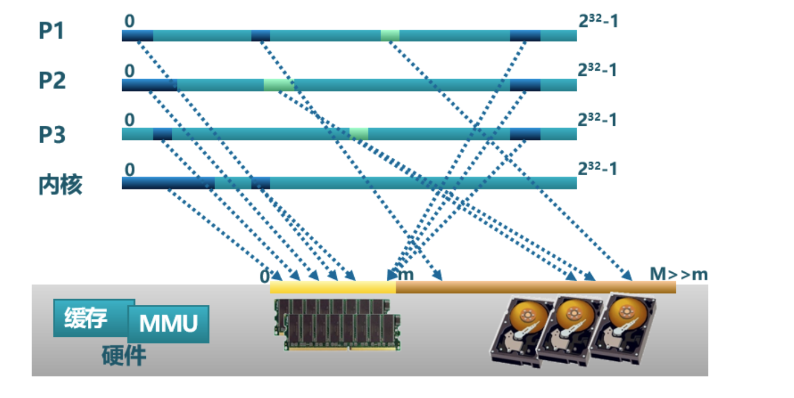
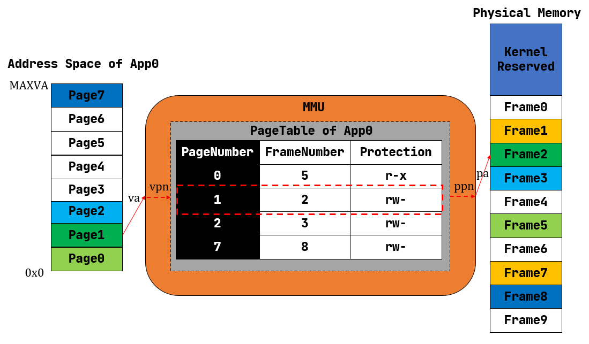

地址空间
=====================================

本节导读
--------------------------

直到现在，我们的操作系统给应用看到的是一个非常原始的物理内存空间，可以简单地理解为一个可以随便访问的大数组。为了限制应用访问内存空间的范围并给操作系统提供内存管理的灵活性，计算机硬件引入了各种内存保护/映射/地址转换硬件机制，如 RISC-V 的基址-边界翻译和保护机制、x86 的分段机制、RISC-V/x86/ARM 都有的分页机制。如果在地址转换过程中，无法找到物理地址或访问权限有误，则处理器产生非法访问内存的异常错误。

为了发挥上述硬件机制的能力，操作系统也需要升级自己的能力，更好地管理物理内存和虚拟内存，并给应用程序提供统一的虚拟内存访问接口。计算机科学家观察到这些不同硬件中的共同之处，即 CPU 访问数据和指令的内存地址是虚地址，通过硬件机制（比如 MMU +页表查询）进行地址转换，找到对应的物理地址。为此，计算机科学家提出了 **地址空间（Address Space）** 抽象，并在内核中建立虚实地址空间的映射机制，给应用程序提供一个基于地址空间的安全虚拟内存环境，让应用程序简单灵活地使用内存。

本节将结合操作系统的发展历程回顾来介绍地址空间抽象的实现策略是如何变化的。

虚拟地址与地址空间
-------------------------------

地址虚拟化出现之前
^^^^^^^^^^^^^^^^^^^^^^^^^^^^^^^^^^

我们之前介绍过，在远古计算机时代，整硬件资源只用来执行单个裸机应用的时候，并不存在真正意义上的操作系统，而只能算是一种应用函数库。那个时候，物理内存的一部分用来保存函数库的代码和数据，余下的部分都交给应用来使用。从功能上可以将应用占据的内存分成几个段：代码段、全局数据段、堆和栈等。当然，由于就只有这一个应用，它想如何调整布局都是它自己的事情。从内存使用的角度来看，批处理系统和裸机应用很相似：批处理系统的每个应用也都是独占内核之外的全部内存空间，只不过当一个应用出错或退出之后，它所占据的内存区域会被清空，而应用序列中的下一个应用将自己的代码和数据放置进来。这个时期，内核提供给应用的访存视角是一致的，因为它们确实会在运行过程中始终独占一块固定的内存区域，每个应用开发者都基于这一认知来规划程序的内存布局。

后来，为了降低等待 I/O 带来的无意义的 CPU 资源损耗，多道程序出现了。而为了提升用户的交互式体验，提高生产力，分时多任务系统诞生了。它们的特点在于：应用开始多出了一种“暂停”状态，这可能来源于它主动 yield 交出 CPU 资源，或是在执行了足够长时间之后被内核强制性放弃处理器。当应用处于暂停状态的时候，它驻留在内存中的代码、数据该何去何从呢？曾经有一种省内存的做法是每个应用仍然和在批处理系统中一样独占内核之外的整块内存，当暂停的时候，内核负责将它的代码、数据保存在外存（如硬盘）中，然后把即将换入的应用在外存上的代码、数据恢复到内存，这些都做完之后才能开始执行新的应用。

不过，由于这种做法需要大量读写外部存储设备，而它们的速度都比 CPU 慢上几个数量级，这导致任务切换的开销过大，甚至完全不能接受。既然如此，就只能像我们在第三章中的做法一样，限制每个应用的最大可用内存空间小于物理内存的容量，这样就可以同时把多个应用的数据驻留在内存中。在任务切换的时候只需完成任务上下文保存与恢复即可，这只是在内存的帮助下保存、恢复少量通用寄存器，甚至无需访问外存，这从很大程度上降低了任务切换的开销。

在本章的引言中介绍过第三章中操作系统的做法对应用程序开发带了一定的困难。从应用开发的角度看，需要应用程序决定自己会被加载到哪个物理地址运行，需要直接访问真实的物理内存。这就要求应用开发者对于硬件的特性和使用方法有更多了解，产生额外的学习成本，也会为应用的开发和调试带来不便。从内核的角度来看，将直接访问物理内存的权力下放到应用会使得它难以对应用程序的访存行为进行有效管理，已有的特权级机制亦无法阻止很多来自应用程序的恶意行为。

加一层抽象加强内存管理
^^^^^^^^^^^^^^^^^^^^^^^^^^^^^^^^^^

为了解决这种困境，抽象仍然是最重要的指导思想。在这里，抽象意味着内核要负责将物理内存管理起来，并为上面的应用提供一层抽象接口，从之前的失败经验学习，这层抽象需要达成下面的设计目标：

- *透明* ：应用开发者可以不必了解底层真实物理内存的硬件细节，且在非必要时也不必关心内核的实现策略，
  最小化他们的心智负担；
- *高效* ：这层抽象至少在大多数情况下不应带来过大的额外开销；
- *安全* ：这层抽象应该有效检测并阻止应用读写其他应用或内核的代码、数据等一系列恶意行为。

.. _term-address-space:
.. _term-virtual-address:

最终，到目前为止仍被操作系统内核广泛使用的抽象被称为 **地址空间** (Address Space) 。某种程度上讲，可以将它看成一块巨大但并不一定真实存在的内存。在每个应用程序的视角里，操作系统分配给应用程序一个地址范围受限（容量很大），独占的连续地址空间（其中有些地方被操作系统限制不能访问，如内核本身占用的虚地址空间等），因此应用程序可以在划分给它的地址空间中随意规划内存布局，它的各个段也就可以分别放置在地址空间中它希望的位置（当然是操作系统允许应用访问的地址）。应用同样可以使用一个地址作为索引来读写自己地址空间的数据，就像用物理地址作为索引来读写物理内存上的数据一样。这种地址被称为 **虚拟地址** (Virtual Address) 。当然，操作系统要达到地址空间抽象的设计目标，需要有计算机硬件的支持，这就是计算机组成原理课上讲到的 ``MMU`` 和 ``TLB`` 等硬件机制。 

从此，应用能够直接看到并访问的内存就只有操作系统提供的地址空间，且它的任何一次访存使用的地址都是虚拟地址，无论取指令来执行还是读写栈、堆或是全局数据段都是如此。事实上，特权级机制被拓展，使得应用不再具有直接访问物理内存的能力。应用所处的执行环境在安全方面被进一步强化，形成了用户态特权级和地址空间的二维安全措施。

由于每个应用独占一个地址空间，里面只含有自己的各个段，于是它可以随意规划属于它自己的各个段的分布而无需考虑和其他应用冲突；同时鉴于应用只能通过虚拟地址读写它自己的地址空间，它完全无法窃取或者破坏其他应用的数据，毕竟那些段在其他应用的地址空间内，这是它没有能力去访问的。这是地址空间抽象和具体硬件机制对应用程序执行的安全性和稳定性的一种保障。

.. image:: address-translation.png

.. _term-mmu:
.. _term-address-translation:

我们知道应用的数据终归还是存在物理内存中的，那么虚拟地址如何形成地址空间，虚拟地址空间如何转换为物理内存呢？操作系统可以设计巧妙的数据结构来表示地址空间。但如果完全由操作系统来完成转换每次处理器地址访问所需的虚实地址转换，那开销就太大了。这就需要扩展硬件功能来加速地址转换过程（回忆 *计算机组成原理* 课上讲的 ``MMU`` 和 ``TLB`` ）。

增加硬件加速虚实地址转换
^^^^^^^^^^^^^^^^^^^^^^^^^^^^^^^^^^

我们回顾一下 **计算机组成原理** 课，如上图所示，当 CPU 取指令或者执行一条访存指令的时候，它都是基于虚拟地址访问属于当前正在运行的应用的地址空间。此时，CPU 中的 **内存管理单元** (MMU, Memory Management Unit) 自动将这个虚拟地址进行 **地址转换** (Address Translation) 变为一个物理地址，即这个应用的数据/指令的物理内存位置。也就是说，在 MMU 的帮助下，应用对自己虚拟地址空间的读写才能被实际转化为对于物理内存的访问。

事实上，每个应用的地址空间都存在一个从虚拟地址到物理地址的映射关系。可以想象对于不同的应用来说，该映射可能是不同的，即 MMU 可能会将来自不同两个应用地址空间的相同虚拟地址转换成不同的物理地址。要做到这一点，就需要硬件提供一些寄存器，软件可以对它进行设置来控制 MMU 按照哪个应用的地址映射关系进行地址转换。于是，将应用的代码/数据放到物理内存并进行管理，建立好应用的地址映射关系，在任务切换时控制 MMU 选用应用的地址映射关系，则是作为软件部分的内核需要完成的重要工作。

回过头来，在介绍内核对于 CPU 资源的抽象——时分复用的时候，我们曾经提到它为应用制造了一种每个应用独占整个 CPU 的幻象，而隐藏了多个应用分时共享 CPU 的实质。而地址空间也是如此，应用只需、也只能看到它独占整个地址空间的幻象，而藏在背后的实质仍然是多个应用共享物理内存，它们的数据分别存放在内存的不同位置。

地址空间只是一层抽象接口，它有很多种具体的实现策略。对于不同的实现策略来说，操作系统内核如何规划应用数据放在物理内存的位置，而 MMU 又如何进行地址转换也都是不同的。下面我们简要介绍几种曾经被使用的策略，并探讨它们的优劣。

分段内存管理
-------------------------------------

.. image:: simple-base-bound.png

.. _term-slot:

曾经的一种做法如上图所示：每个应用的地址空间大小限制为一个固定的常数 ``bound`` ，也即每个应用的可用虚拟地址区间均为 :math:`[0,\text{bound})` 。随后，就可以以这个大小为单位，将物理内存除了内核预留空间之外的部分划分为若干个大小相同的 **插槽** (Slot) ，每个应用的所有数据都被内核放置在其中一个插槽中，对应于物理内存上的一段连续物理地址区间，假设其起始物理地址为 :math:`\text{base}` ，则由于二者大小相同，这个区间实际为 :math:`[\text{base},\text{base}+\text{bound})` 。因此地址转换很容易完成，只需检查一下虚拟地址不超过地址空间的大小限制（此时需要借助特权级机制通过异常来进行处理），然后做一个线性映射，将虚拟地址加上 :math:`\text{base}` 就得到了数据实际所在的物理地址。

.. _term-bitmap:

可以看出，这种实现极其简单：MMU 只需要 :math:`\text{base,bound}` 两个寄存器，在地址转换进行比较或加法运算即可；而内核只需要在任务切换时完成切换 :math:`\text{base}` 寄存器。在对一个应用的内存管理方面，只需考虑一组插槽的占用状态，可以用一个 **位图** (Bitmap) 来表示，随着应用的新增和退出对应置位或清空。

.. _term-internal-fragment:

然而，它的问题在于：可能浪费的内存资源过多。注意到应用地址空间预留了一部分，它是用来让栈得以向低地址增长，同时允许堆往高地址增长（支持应用运行时进行动态内存分配）。每个应用的情况都不同，内核只能按照在它能力范围之内的消耗内存最多的应用的情况来统一指定地址空间的大小，而其他内存需求较低的应用根本无法充分利用内核给他们分配的这部分空间。但这部分空间又是一个完整的插槽的一部分，也不能再交给其他应用使用。这种在已分配/使用的地址空间内部无法被充分利用的空间就是 **内碎片** (Internal Fragment) ，它限制了系统同时共存的应用数目。如果应用的需求足够多样化，那么内核无论如何设置应用地址空间的大小限制也不能得到满意的结果。这就是固定参数的弊端：虽然实现简单，但不够灵活。

为了解决这个问题，一种分段管理的策略开始被使用，如下图所示：

.. image:: segmentation.png

注意到内核开始以更细的粒度，也就是应用地址空间中的一个逻辑段作为单位来安排应用的数据在物理内存中的布局。对于每个段来说，从它在某个应用地址空间中的虚拟地址到它被实际存放在内存中的物理地址中间都要经过一个不同的线性映射，于是 MMU 需要用一对不同的 :math:`\text{base/bound}` 进行区分。这里由于每个段的大小都是不同的，我们也不再能仅仅使用一个 :math:`\text{bound}` 进行简化。当任务切换的时候，这些对寄存器也需要被切换。

简单起见，我们这里忽略一些不必要的细节。比如应用在以虚拟地址为索引访问地址空间的时候，它如何知道该地址属于哪个段，从而硬件可以使用正确的一对 :math:`\text{base/bound}` 寄存器进行合法性检查和完成实际的地址转换。这里只关注分段管理是否解决了内碎片带来的内存浪费问题。注意到每个段都只会在内存中占据一块与它实际所用到的大小相等的空间。堆的情况可能比较特殊，它的大小可能会在运行时增长，但是那需要应用通过系统调用向内核请求。也就是说这是一种按需分配，而不再是内核在开始时就给每个应用分配一大块很可能用不完的内存。由此，不再有内碎片了。

.. _term-external-fragment:

尽管内碎片被消除了，但内存浪费问题并没有完全解决。这是因为每个段的大小都是不同的（它们可能来自不同的应用，功能也不同），内核就需要使用更加通用、也更加复杂的连续内存分配算法来进行内存管理，而不能像之前的插槽那样以一个比特为单位。顾名思义，连续内存分配算法就是每次需要分配一块连续内存来存放一个段的数据。随着一段时间的分配和回收，物理内存还剩下一些相互不连续的较小的可用连续块，其中有一些只是两个已分配内存块之间的很小的间隙，它们自己可能由于空间较小，已经无法被用于分配，这就是 **外碎片** (External Fragment) 。

如果这时再想分配一个比较大的块，就需要将这些不连续的外碎片“拼起来”，形成一个大的连续块。然而这是一件开销很大的事情，涉及到极大的内存读写开销。具体而言，这需要移动和调整一些已分配内存块在物理内存上的位置，才能让那些小的外碎片能够合在一起，形成一个大的空闲块。如果连续内存分配算法选取得当，可以尽可能减少这种操作。操作系统课上所讲到的那些算法，包括 first-fit/worst-fit/best-fit 或是 buddy system，其具体表现取决于实际的应用需求，各有优劣。

那么，分段内存管理带来的外碎片和连续内存分配算法比较复杂的问题可否被解决呢？

分页内存管理
--------------------------------------

仔细分析一下可以发现，段的大小不一是外碎片产生的根本原因。之前我们把应用的整个地址空间连续放置在物理内存中，在每个应用的地址空间大小均相同的情况下，只需利用类似位图的数据结构维护一组插槽的占用状态，从逻辑上分配和回收都是以一个固定的比特为单位，自然也就不会存在外碎片了。但是这样粒度过大，不够灵活，又在地址空间内部产生了内碎片。

若要结合二者的优点的话，就需要内核始终以一个同样大小的单位来在物理内存上放置应用地址空间中的数据，这样内核就可以使用简单的插槽式内存管理，使得内存分配算法比较简单且不会产生外碎片；同时，这个单位的大小要足够小，从而其内部没有被用到的内碎片的大小也足够小，尽可能提高内存利用率。这便是我们将要介绍的分页内存管理。

.. _term-page:
.. _term-frame:

如上图所示，内核以页为单位进行物理内存管理。每个应用的地址空间可以被分成若干个（虚拟） **页面** (Page) ，而可用的物理内存也同样可以被分成若干个（物理） **页帧** (Frame) ，虚拟页面和物理页帧的大小相同。每个虚拟页面中的数据实际上都存储在某个物理页帧上。相比分段内存管理，分页内存管理的粒度更小且大小固定，应用地址空间中的每个逻辑段都由多个虚拟页面组成。而且每个虚拟页面在地址转换的过程中都使用与运行的应用绑定的不同的线性映射，而不像分段内存管理那样每个逻辑段都使用一个相同的线性映射。

.. _term-virtual-page-number:
.. _term-physical-page-number:
.. _term-page-table:

为了方便实现虚拟页面到物理页帧的地址转换，我们给每个虚拟页面和物理页帧一个编号，分别称为 **虚拟页号** (VPN, Virtual Page Number) 和 **物理页号** (PPN, Physical Page Number) 。每个应用都有一个表示地址映射关系的 **页表** (Page Table) ，里面记录了该应用地址空间中的每个虚拟页面映射到物理内存中的哪个物理页帧，即数据实际被内核放在哪里。我们可以用页号来代表二者，因此如果将页表看成一个键值对，其键的类型为虚拟页号，值的类型则为物理页号。当 MMU 进行地址转换的时候，虚拟地址会分为两部分（虚拟页号，页内偏移），MMU首先找到虚拟地址所在虚拟页面的页号，然后查当前应用的页表，根据虚拟页号找到物理页号；最后按照虚拟地址的页内偏移，给物理页号对应的物理页帧的起始地址加上一个偏移量，这就得到了实际访问的物理地址。

在页表中，还针对虚拟页号设置了一组保护位，它限制了应用对转换得到的物理地址对应的内存的使用方式。最典型的如 ``rwx`` ， ``r`` 表示当前应用可以读该内存； ``w`` 表示当前应用可以写该内存； ``x`` 则表示当前应用可以从该内存取指令用来执行。一旦违反了这种限制则会触发异常，并被内核捕获到。通过适当的设置，可以检查一些应用在运行时的明显错误：比如应用修改只读的代码段，或者从数据段取指令来执行。

当一个应用的地址空间比较大的时候，页表中的项数会很多（事实上每个虚拟页面都应该对应页表中的一项，上图中我们已经省略掉了那些未被使用的虚拟页面），导致它的容量极速膨胀，已经不再是像之前那样数个寄存器便可存下来的了，CPU 内也没有足够的硬件资源能够将它存下来。因此它只能作为一种被内核管理的数据结构放在内存中，但是 CPU 也会直接访问它来查页表，这也就需要内核和硬件之间关于页表的内存布局达成一致。

由于分页内存管理既简单又灵活，它逐渐成为了主流的内存管理机制，RISC-V 架构也使用了这种机制。后面我们会基于这种机制，自己动手从物理内存抽象出应用的地址空间来。

.. note::

    本节部分内容参考自 `Operating Systems: Three Easy Pieces <http://pages.cs.wisc.edu/~remzi/OSTEP/>`_ 
    教材的 13~16 小节。

