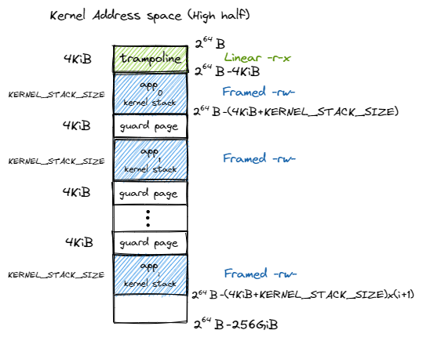
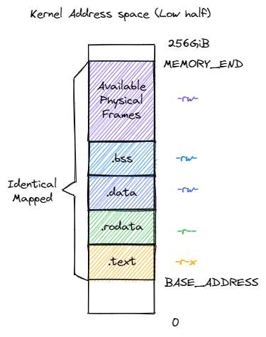
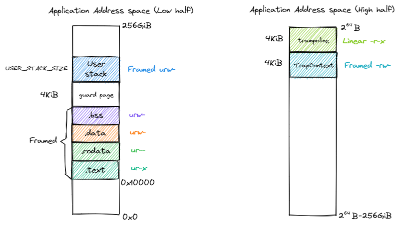

内核与应用的地址空间
================================================

本节导读
--------------------------

页表 ``PageTable`` 只能以页为单位帮助我们维护一个虚拟内存到物理内存的地址转换关系，它本身对于计算机系统的整个虚拟/物理内存空间并没有一个全局的描述和掌控。操作系统通过对不同页表的管理，来完成对不同应用和操作系统自身所在的虚拟内存，以及虚拟内存与物理内存映射关系的全面管理。这种管理是建立在 **地址空间** 的抽象上，用来表明正在运行的应用或内核自身所在执行环境中的可访问的内存空间。本节
我们就在内核中通过基于页表的各种数据结构实现地址空间的抽象，并介绍内核和应用的虚拟和物理地址空间中各需要包含哪些内容。

实现地址空间抽象
------------------------------------------

.. _term-vm-map-area:

逻辑段：一段连续地址的虚拟内存
^^^^^^^^^^^^^^^^^^^^^^^^^^^^^^^^^^^^^^^^^^^^^^^^^^^^^

我们以逻辑段 ``MapArea`` 为单位描述一段连续地址的虚拟内存。所谓逻辑段，就是指地址区间中的一段实际可用（即 MMU 通过查多级页表可以正确完成地址转换）的地址连续的虚拟地址区间，该区间内包含的所有虚拟页面都以一种相同的方式映射到物理页帧，具有可读/可写/可执行等属性。

.. code-block:: rust

    // os/src/mm/memory_set.rs

    pub struct MapArea {
        vpn_range: VPNRange,
        data_frames: BTreeMap<VirtPageNum, FrameTracker>,
        map_type: MapType,
        map_perm: MapPermission,
    }

其中 ``VPNRange`` 描述一段虚拟页号的连续区间，表示该逻辑段在地址区间中的位置和长度。它是一个迭代器，可以使用 Rust 的语法糖 for-loop 进行迭代。有兴趣的同学可以参考 ``os/src/mm/address.rs`` 中它的实现。

.. note::

    **Rust Tips：迭代器 Iterator**

    Rust编程的迭代器模式允许你对一个序列的项进行某些处理。迭代器（iterator）是负责遍历序列中的每一项和决定序列何时结束的控制逻辑。对于如何使用迭代器处理元素序列和如何实现 Iterator trait 来创建自定义迭代器的内容，可以参考 `Rust 程序设计语言-中文版第十三章第二节 <https://kaisery.github.io/trpl-zh-cn/ch13-02-iterators.html>`_

``MapType`` 描述该逻辑段内的所有虚拟页面映射到物理页帧的同一种方式，它是一个枚举类型，在内核当前的实现中支持两种方式：

.. code-block:: rust

    // os/src/mm/memory_set.rs

    #[derive(Copy, Clone, PartialEq, Debug)]
    pub enum MapType {
        Identical,
        Framed,
    }

其中 ``Identical`` 表示上一节提到的恒等映射方式；而 ``Framed`` 则表示对于每个虚拟页面都有一个新分配的物理页帧与之对应，虚地址与物理地址的映射关系是相对随机的。恒等映射方式主要是用在启用多级页表之后，内核仍能够在虚存地址空间中访问一个特定的物理地址指向的物理内存。

当逻辑段采用 ``MapType::Framed`` 方式映射到物理内存的时候， ``data_frames`` 是一个保存了该逻辑段内的每个虚拟页面和它被映射到的物理页帧 ``FrameTracker`` 的一个键值对容器 ``BTreeMap`` 中，这些物理页帧被用来存放实际内存数据而不是作为多级页表中的中间节点。和之前的 ``PageTable`` 一样，这也用到了 RAII 的思想，将这些物理页帧的生命周期绑定到它所在的逻辑段 ``MapArea`` 下，当逻辑段被回收之后这些之前分配的物理页帧也会自动地同时被回收。

``MapPermission`` 表示控制该逻辑段的访问方式，它是页表项标志位 ``PTEFlags`` 的一个子集，仅保留 U/R/W/X 四个标志位，因为其他的标志位仅与硬件的地址转换机制细节相关，这样的设计能避免引入错误的标志位。

.. code-block:: rust

    // os/src/mm/memory_set.rs

    bitflags! {
        pub struct MapPermission: u8 {
            const R = 1 << 1;
            const W = 1 << 2;
            const X = 1 << 3;
            const U = 1 << 4;
        }
    }

.. _term-vm-memory-set:

地址空间：一系列有关联的逻辑段
^^^^^^^^^^^^^^^^^^^^^^^^^^^^^^^^^^^^^^^^^

**地址空间** 是一系列有关联的不一定连续的逻辑段，这种关联一般是指这些逻辑段组成的虚拟内存空间与一个运行的程序（目前把一个运行的程序称为任务，后续会称为进程）绑定，即这个运行的程序对代码和数据的直接访问范围限制在它关联的虚拟地址空间之内。这样我们就有任务的地址空间，内核的地址空间等说法了。地址空间使用 ``MemorySet`` 类型来表示：

.. code-block:: rust

    // os/src/mm/memory_set.rs

    pub struct MemorySet {
        page_table: PageTable,
        areas: Vec<MapArea>,
    }

它包含了该地址空间的多级页表 ``page_table`` 和一个逻辑段 ``MapArea`` 的向量 ``areas`` 。注意 ``PageTable`` 下挂着所有多级页表的节点所在的物理页帧，而每个 ``MapArea`` 下则挂着对应逻辑段中的数据所在的物理页帧，这两部分合在一起构成了一个地址空间所需的所有物理页帧。这同样是一种 RAII 风格，当一个地址空间 ``MemorySet`` 生命周期结束后，这些物理页帧都会被回收。

地址空间 ``MemorySet`` 的方法如下：

.. code-block:: rust
    :linenos:

    // os/src/mm/memory_set.rs

    impl MemorySet {
        pub fn new_bare() -> Self {
            Self {
                page_table: PageTable::new(),
                areas: Vec::new(),
            }
        }
        fn push(&mut self, mut map_area: MapArea, data: Option<&[u8]>) {
            map_area.map(&mut self.page_table);
            if let Some(data) = data {
                map_area.copy_data(&mut self.page_table, data);
            }
            self.areas.push(map_area);
        }
        /// Assume that no conflicts.
        pub fn insert_framed_area(
            &mut self,
            start_va: VirtAddr, end_va: VirtAddr, permission: MapPermission
        ) {
            self.push(MapArea::new(
                start_va,
                end_va,
                MapType::Framed,
                permission,
            ), None);
        }
        pub fn new_kernel() -> Self;
        /// Include sections in elf and trampoline and TrapContext and user stack,
        /// also returns user_sp and entry point.
        pub fn from_elf(elf_data: &[u8]) -> (Self, usize, usize);
    }

- 第 4 行， ``new_bare`` 方法可以新建一个空的地址空间；
- 第 10 行， ``push`` 方法可以在当前地址空间插入一个新的逻辑段 ``map_area`` ，如果它是以 ``Framed`` 方式映射到物理内存，还可以可选地在那些被映射到的物理页帧上写入一些初始化数据 ``data`` ；
- 第 18 行， ``insert_framed_area`` 方法调用 ``push`` ，可以在当前地址空间插入一个 ``Framed`` 方式映射到物理内存的逻辑段。注意该方法的调用者要保证同一地址空间内的任意两个逻辑段不能存在交集，从后面即将分别介绍的内核和应用的地址空间布局可以看出这一要求得到了保证；
- 第 29 行， ``new_kernel`` 可以生成内核的地址空间；具体实现将在后面讨论；
- 第 32 行， ``from_elf`` 分析应用的 ELF 文件格式的内容，解析出各数据段并生成对应的地址空间；具体实现将在后面讨论。

在实现 ``push`` 方法在地址空间中插入一个逻辑段 ``MapArea`` 的时候，需要同时维护地址空间的多级页表 ``page_table`` 记录的虚拟页号到页表项的映射关系，也需要用到这个映射关系来找到向哪些物理页帧上拷贝初始数据。这用到了 ``MapArea`` 提供的另外几个方法：

.. code-block:: rust
    :linenos:
    
    // os/src/mm/memory_set.rs

    impl MapArea {
        pub fn new( 
            start_va: VirtAddr,
            end_va: VirtAddr,
            map_type: MapType,
            map_perm: MapPermission
        ) -> Self {
            let start_vpn: VirtPageNum = start_va.floor();
            let end_vpn: VirtPageNum = end_va.ceil();
            Self {
                vpn_range: VPNRange::new(start_vpn, end_vpn),
                data_frames: BTreeMap::new(),
                map_type,
                map_perm,
            }
        }
        pub fn map(&mut self, page_table: &mut PageTable) {
            for vpn in self.vpn_range {
                self.map_one(page_table, vpn);
            }
        }
        pub fn unmap(&mut self, page_table: &mut PageTable) {
            for vpn in self.vpn_range {
                self.unmap_one(page_table, vpn);
            }
        }
        /// data: start-aligned but maybe with shorter length
        /// assume that all frames were cleared before
        pub fn copy_data(&mut self, page_table: &mut PageTable, data: &[u8]) {
            assert_eq!(self.map_type, MapType::Framed);
            let mut start: usize = 0;
            let mut current_vpn = self.vpn_range.get_start();
            let len = data.len();
            loop {
                let src = &data[start..len.min(start + PAGE_SIZE)];
                let dst = &mut page_table
                    .translate(current_vpn)
                    .unwrap()
                    .ppn()
                    .get_bytes_array()[..src.len()];
                dst.copy_from_slice(src);
                start += PAGE_SIZE;
                if start >= len {
                    break;
                }
                current_vpn.step();
            }
        }
    }

- 第 4 行的 ``new`` 方法可以新建一个逻辑段结构体，注意传入的起始/终止虚拟地址会分别被下取整/上取整为虚拟页号并传入迭代器 ``vpn_range`` 中；
- 第 19 行的 ``map`` 和第 24 行的 ``unmap`` 可以将当前逻辑段到物理内存的映射从传入的该逻辑段所属的地址空间的多级页表中加入或删除。可以看到它们的实现是遍历逻辑段中的所有虚拟页面，并以每个虚拟页面为单位依次在多级页表中进行键值对的插入或删除，分别对应 ``MapArea`` 的 ``map_one`` 和 ``unmap_one`` 方法，我们后面将介绍它们的实现；
- 第 31 行的 ``copy_data`` 方法将切片 ``data`` 中的数据拷贝到当前逻辑段实际被内核放置在的各物理页帧上，从而在地址空间中通过该逻辑段就能访问这些数据。调用它的时候需要满足：切片 ``data`` 中的数据大小不超过当前逻辑段的总大小，且切片中的数据会被对齐到逻辑段的开头，然后逐页拷贝到实际的物理页帧。

  从第 36 行开始的循环会遍历每一个需要拷贝数据的虚拟页面，在数据拷贝完成后会在第 48 行通过调用 ``step`` 方法，该方法来自于 ``os/src/mm/address.rs`` 中为 ``VirtPageNum`` 实现的 ``StepOne`` Trait，感兴趣的同学可以阅读代码确认其实现。

  每个页面的数据拷贝需要确定源 ``src`` 和目标 ``dst`` 两个切片并直接使用 ``copy_from_slice`` 完成复制。当确定目标切片 ``dst`` 的时候，第 39 行从传入的当前逻辑段所属的地址空间的多级页表中，手动查找迭代到的虚拟页号被映射到的物理页帧，并通过 ``get_bytes_array`` 方法获取该物理页帧的字节数组型可变引用，最后再获取它的切片用于数据拷贝。

接下来介绍对逻辑段中的单个虚拟页面进行映射/解映射的方法 ``map_one`` 和 ``unmap_one`` 。显然它们的实现取决于当前逻辑段被映射到物理内存的方式：

.. code-block:: rust
    :linenos:

    // os/src/mm/memory_set.rs

    impl MapArea {
        pub fn map_one(&mut self, page_table: &mut PageTable, vpn: VirtPageNum) {
            let ppn: PhysPageNum;
            match self.map_type {
                MapType::Identical => {
                    ppn = PhysPageNum(vpn.0);
                }
                MapType::Framed => {
                    let frame = frame_alloc().unwrap();
                    ppn = frame.ppn;
                    self.data_frames.insert(vpn, frame);
                }
            }
            let pte_flags = PTEFlags::from_bits(self.map_perm.bits).unwrap();
            page_table.map(vpn, ppn, pte_flags);
        }
        pub fn unmap_one(&mut self, page_table: &mut PageTable, vpn: VirtPageNum) {
            match self.map_type {
                MapType::Framed => {
                    self.data_frames.remove(&vpn);
                }
                _ => {}
            }
            page_table.unmap(vpn);
        }
    }

- 对于第 4 行的 ``map_one`` 来说，在虚拟页号 ``vpn`` 已经确定的情况下，它需要知道要将一个怎么样的页表项插入多级页表。页表项的标志位来源于当前逻辑段的类型为 ``MapPermission`` 的统一配置，只需将其转换为 ``PTEFlags`` ；而页表项的物理页号则取决于当前逻辑段映射到物理内存的方式：

  - 当以恒等映射 ``Identical`` 方式映射的时候，物理页号就等于虚拟页号；
  - 当以 ``Framed`` 方式映射时，需要分配一个物理页帧让当前的虚拟页面可以映射过去，此时页表项中的物理页号自然就是
    这个被分配的物理页帧的物理页号。此时还需要将这个物理页帧挂在逻辑段的 ``data_frames`` 字段下。

  当确定了页表项的标志位和物理页号之后，即可调用多级页表 ``PageTable`` 的 ``map`` 接口来插入键值对。
- 对于第 19 行的 ``unmap_one`` 来说，基本上就是调用 ``PageTable`` 的 ``unmap`` 接口删除以传入的虚拟页号为键的键值对即可。然而，当以 ``Framed`` 映射的时候，不要忘记同时将虚拟页面被映射到的物理页帧 ``FrameTracker`` 从 ``data_frames`` 中移除，这样这个物理页帧才能立即被回收以备后续分配。

内核地址空间
------------------------------------------

.. _term-isolation:

在本章之前，内核和应用代码的访存地址都被视为一个物理地址，并直接访问物理内存，而在分页模式开启之后，CPU先拿到虚存地址，需要通过 MMU 的地址转换变成物理地址，再交给 CPU 的访存单元去访问物理内存。地址空间抽象的重要意义在于 **隔离** (Isolation) ，当内核让应用执行前，内核需要控制 MMU 使用这个应用的多级页表进行地址转换。由于每个应用地址空间在创建的时候也顺带设置好了多级页表，使得只有那些存放了它的代码和数据的物理页帧能够通过该多级页表被映射到，这样它就只能访问自己的代码和数据而无法触及其他应用或内核的内容。

.. _term-trampoline-first:

启用分页模式下，内核代码的访存地址也会被视为一个虚拟地址并需要经过 MMU 的地址转换，因此我们也需要为内核对应构造一个地址空间，它除了仍然需要允许内核的各数据段能够被正常访问之后，还需要包含所有应用的内核栈以及一个 **跳板** (Trampoline) 。我们会在本章的后续部分再深入介绍 :ref:`跳板的实现 <term-trampoline>` 。

下图是软件看到的 64 位地址空间在 SV39 分页模式下实际可能通过 MMU 检查的最高 :math:`256\text{GiB}` （之前在 :ref:`这里 <high-and-low-256gib>` 中解释过最高和最低 :math:`256\text{GiB}` 的问题）：

可以看到，跳板放在最高的一个虚拟页面中。接下来则是从高到低放置每个应用的内核栈，内核栈的大小由 ``config`` 子模块的 ``KERNEL_STACK_SIZE`` 给出。它们的映射方式为 ``MapPermission`` 中的 rw 两个标志位，意味着这个逻辑段仅允许 CPU 处于内核态访问，且只能读或写。

.. _term-guard-page:

注意相邻两个内核栈之间会预留一个 **保护页面** (Guard Page) ，它是内核地址空间中的空洞，多级页表中并不存在与它相关的映射。它的意义在于当内核栈空间不足（如调用层数过多或死递归）的时候，代码会尝试访问空洞区域内的虚拟地址，然而它无法在多级页表中找到映射，便会触发异常，此时控制权会交给内核 trap handler 函数进行异常处理。由于编译器会对访存顺序和局部变量在栈帧中的位置进行优化，我们难以确定一个已经溢出的栈帧中的哪些位置会先被访问，但总的来说，空洞区域被设置的越大，我们就能越早捕获到这一可能覆盖其他重要数据的错误异常。由于我们的内核非常简单且内核栈的大小设置比较宽裕，在当前的设计中我们仅将空洞区域的大小设置为单个页面。

下面则给出了内核地址空间的低 :math:`256\text{GiB}` 的布局：

内核的四个逻辑段 ``.text/.rodata/.data/.bss`` 被恒等映射到物理内存，这使得我们在无需调整内核内存布局 ``os/src/linker.ld`` 的情况下就仍能象启用页表机制之前那样访问内核的各个段。注意我们借用页表机制对这些逻辑段的访问方式做出了限制，这都是为了在硬件的帮助下能够尽可能发现内核中的 bug ，在这里：

- 四个逻辑段的 U 标志位均未被设置，使得 CPU 只能在处于 S 特权级（或以上）时访问它们；
- 代码段 ``.text`` 不允许被修改；
- 只读数据段 ``.rodata`` 不允许被修改，也不允许从它上面取指执行；
- ``.data/.bss`` 均允许被读写，但是不允许从它上面取指执行。

此外， :ref:`之前 <modify-page-table>` 提到过内核地址空间中需要存在一个恒等映射到内核数据段之外的可用物理页帧的逻辑段，这样才能在启用页表机制之后，内核仍能以纯软件的方式读写这些物理页帧。它们的标志位仅包含 rw ，意味着该逻辑段只能在 S 特权级以上访问，并且只能读写。

下面我们给出创建内核地址空间的方法 ``new_kernel`` ：

.. code-block:: rust
    :linenos:

    // os/src/mm/memory_set.rs

    extern "C" {
        fn stext();
        fn etext();
        fn srodata();
        fn erodata();
        fn sdata();
        fn edata();
        fn sbss_with_stack();
        fn ebss();
        fn ekernel();
        fn strampoline();
    }

    impl MemorySet {
        /// Without kernel stacks.
        pub fn new_kernel() -> Self {
            let mut memory_set = Self::new_bare();
            // map trampoline
            memory_set.map_trampoline();
            // map kernel sections
            println!(".text [{:#x}, {:#x})", stext as usize, etext as usize);
            println!(".rodata [{:#x}, {:#x})", srodata as usize, erodata as usize);
            println!(".data [{:#x}, {:#x})", sdata as usize, edata as usize);
            println!(".bss [{:#x}, {:#x})", sbss_with_stack as usize, ebss as usize);
            println!("mapping .text section");
            memory_set.push(MapArea::new(
                (stext as usize).into(),
                (etext as usize).into(),
                MapType::Identical,
                MapPermission::R | MapPermission::X,
            ), None);
            println!("mapping .rodata section");
            memory_set.push(MapArea::new(
                (srodata as usize).into(),
                (erodata as usize).into(),
                MapType::Identical,
                MapPermission::R,
            ), None);
            println!("mapping .data section");
            memory_set.push(MapArea::new(
                (sdata as usize).into(),
                (edata as usize).into(),
                MapType::Identical,
                MapPermission::R | MapPermission::W,
            ), None);
            println!("mapping .bss section");
            memory_set.push(MapArea::new(
                (sbss_with_stack as usize).into(),
                (ebss as usize).into(),
                MapType::Identical,
                MapPermission::R | MapPermission::W,
            ), None);
            println!("mapping physical memory");
            memory_set.push(MapArea::new(
                (ekernel as usize).into(),
                MEMORY_END.into(),
                MapType::Identical,
                MapPermission::R | MapPermission::W,
            ), None);
            memory_set
        }
    }

``new_kernel`` 将映射跳板和地址空间中最低 :math:`256\text{GiB}` 中的内核逻辑段。第 3 行开始，我们从 ``os/src/linker.ld`` 中引用了很多表示各个段位置的符号，而后在 ``new_kernel`` 中，我们从低地址到高地址依次创建 5 个逻辑段并通过 ``push`` 方法将它们插入到内核地址空间中，上面我们已经详细介绍过这 5 个逻辑段。跳板是通过 ``map_trampoline`` 方法来映射的，我们也将在本章最后一节进行讲解。

.. _term-vm-app-addr-space:

应用地址空间
------------------------------------------

现在我们来介绍如何创建应用的地址空间。在前面的章节中，我们直接将丢弃了所有符号信息的应用二进制镜像链接到内核，在初始化的时候内核仅需将他们加载到正确的初始物理地址就能使它们正确执行。但本章中，我们希望效仿内核地址空间的设计，同样借助页表机制使得应用地址空间的各个逻辑段也可以有不同的访问方式限制，这样可以提早检测出应用的错误并及时将其终止以最小化它对系统带来的恶劣影响。

在第三章中，每个应用链接脚本中的起始地址被要求是不同的，这样它们的代码和数据存放的位置才不会产生冲突。但这是一种对于应用开发者很不方便的设计。现在，借助地址空间的抽象，我们终于可以让所有应用程序都使用同样的起始地址，这也意味着所有应用可以使用同一个链接脚本了：

.. code-block:: 
    :linenos:

    /* user/src/linker.ld */

    OUTPUT_ARCH(riscv)
    ENTRY(_start)

    BASE_ADDRESS = 0x10000;

    SECTIONS
    {
        . = BASE_ADDRESS;
        .text : {
            *(.text.entry)
            *(.text .text.*)
        }
        . = ALIGN(4K);
        .rodata : {
            *(.rodata .rodata.*)
        }
        . = ALIGN(4K);
        .data : {
            *(.data .data.*)
        }
        .bss : {
            *(.bss .bss.*)
        }
        /DISCARD/ : {
            *(.eh_frame)
            *(.debug*)
        }
    }

我们将起始地址 ``BASE_ADDRESS`` 设置为 :math:`\text{0x10000}` （我们这里并不设置为 :math:`\text{0x0}` ，因为它一般代表空指针），显然它只能是一个地址空间中的虚拟地址而非物理地址。事实上由于我们将入口汇编代码段放在最低的地方，这也是整个应用的入口点。我们只需清楚这一事实即可，而无需像之前一样将其硬编码到代码中。此外，在 ``.text`` 和 ``.rodata`` 中间以及 ``.rodata`` 和 ``.data`` 中间我们进行了页面对齐，因为前后两个逻辑段的访问方式限制是不同的，由于我们只能以页为单位对这个限制进行设置，因此就只能将下一个逻辑段对齐到下一个页面开始放置。而 ``.data`` 和 ``.bss`` 两个逻辑段由于访问限制相同（可读写），它们中间则无需进行页面对齐。

下图展示了应用地址空间的布局：

    
左侧给出了应用地址空间最低 :math:`256\text{GiB}` 的布局：从 :math:`\text{0x10000}` 开始向高地址放置应用内存布局中的各个逻辑段，最后放置带有一个保护页面的用户栈。这些逻辑段都是以 ``Framed`` 方式映射到物理内存的，从访问方式上来说都加上了 U 标志位代表 CPU 可以在 U 特权级也就是执行应用代码的时候访问它们。右侧则给出了最高的 :math:`256\text{GiB}` ，可以看出它只是和内核地址空间一样将跳板放置在最高页，还将 Trap 上下文放置在次高页中。这两个虚拟页面虽然位于应用地址空间，但是它们并不包含 U 标志位，事实上它们在地址空间切换的时候才会发挥作用，请同样参考本章的最后一节。

在 ``os/src/build.rs`` 中，我们不再将丢弃了所有符号的应用二进制镜像链接进内核，因为在应用二进制镜像中，内存布局中各个逻辑段的位置和访问限制等信息都被裁剪掉了。我们直接使用保存了逻辑段信息的 ELF 格式的应用可执行文件。这样 ``loader`` 子模块的设计实现也变得精简：

.. code-block:: rust

    // os/src/loader.rs

    pub fn get_num_app() -> usize {
        extern "C" { fn _num_app(); }
        unsafe { (_num_app as usize as *const usize).read_volatile() }
    }

    pub fn get_app_data(app_id: usize) -> &'static [u8] {
        extern "C" { fn _num_app(); }
        let num_app_ptr = _num_app as usize as *const usize;
        let num_app = get_num_app();
        let app_start = unsafe {
            core::slice::from_raw_parts(num_app_ptr.add(1), num_app + 1)
        };
        assert!(app_id < num_app);
        unsafe {
            core::slice::from_raw_parts(
                app_start[app_id] as *const u8,
                app_start[app_id + 1] - app_start[app_id]
            )
        }
    }

它仅需要提供两个函数： ``get_num_app`` 获取链接到内核内的应用的数目，而 ``get_app_data`` 则根据传入的应用编号取出对应应用的 ELF 格式可执行文件数据。它们和之前一样仍是基于 ``build.rs`` 生成的 ``link_app.S`` 给出的符号来确定其位置，并实际放在内核的数据段中。 ``loader`` 模块中原有的内核和用户栈则分别作为逻辑段放在内核和用户地址空间中，我们无需再去专门为其定义一种类型。

在创建应用地址空间的时候，我们需要对 ``get_app_data`` 得到的 ELF 格式数据进行解析，找到各个逻辑段所在位置和访问限制并插入进来，最终得到一个完整的应用地址空间：

.. code-block:: rust
    :linenos:

    // os/src/mm/memory_set.rs

    impl MemorySet {
        /// Include sections in elf and trampoline and TrapContext and user stack,
        /// also returns user_sp and entry point.
        pub fn from_elf(elf_data: &[u8]) -> (Self, usize, usize) {
            let mut memory_set = Self::new_bare();
            // map trampoline
            memory_set.map_trampoline();
            // map program headers of elf, with U flag
            let elf = xmas_elf::ElfFile::new(elf_data).unwrap();
            let elf_header = elf.header;
            let magic = elf_header.pt1.magic;
            assert_eq!(magic, [0x7f, 0x45, 0x4c, 0x46], "invalid elf!");
            let ph_count = elf_header.pt2.ph_count();
            let mut max_end_vpn = VirtPageNum(0);
            for i in 0..ph_count {
                let ph = elf.program_header(i).unwrap();
                if ph.get_type().unwrap() == xmas_elf::program::Type::Load {
                    let start_va: VirtAddr = (ph.virtual_addr() as usize).into();
                    let end_va: VirtAddr = ((ph.virtual_addr() + ph.mem_size()) as usize).into();
                    let mut map_perm = MapPermission::U;
                    let ph_flags = ph.flags();
                    if ph_flags.is_read() { map_perm |= MapPermission::R; }
                    if ph_flags.is_write() { map_perm |= MapPermission::W; }
                    if ph_flags.is_execute() { map_perm |= MapPermission::X; }
                    let map_area = MapArea::new(
                        start_va,
                        end_va,
                        MapType::Framed,
                        map_perm,
                    );
                    max_end_vpn = map_area.vpn_range.get_end();
                    memory_set.push(
                        map_area,
                        Some(&elf.input[ph.offset() as usize..(ph.offset() + ph.file_size()) as usize])
                    );
                }
            }
            // map user stack with U flags
            let max_end_va: VirtAddr = max_end_vpn.into();
            let mut user_stack_bottom: usize = max_end_va.into();
            // guard page
            user_stack_bottom += PAGE_SIZE;
            let user_stack_top = user_stack_bottom + USER_STACK_SIZE;
            memory_set.push(MapArea::new(
                user_stack_bottom.into(),
                user_stack_top.into(),
                MapType::Framed,
                MapPermission::R | MapPermission::W | MapPermission::U,
            ), None);
            // map TrapContext
            memory_set.push(MapArea::new(
                TRAP_CONTEXT.into(),
                TRAMPOLINE.into(),
                MapType::Framed,
                MapPermission::R | MapPermission::W,
            ), None);
            (memory_set, user_stack_top, elf.header.pt2.entry_point() as usize)
        }
    }

- 第 9 行，我们将跳板插入到应用地址空间；
- 第 11 行，我们使用外部 crate ``xmas_elf`` 来解析传入的应用 ELF 数据并可以轻松取出各个部分。:ref:`此前 <term-elf>` 我们简要介绍过 ELF 格式的布局。第 14 行，我们取出 ELF 的魔数来判断它是不是一个合法的 ELF 。 
  
  第 15 行，我们可以直接得到 program header 的数目，然后遍历所有的 program header 并将合适的区域加入到应用地址空间中。这一过程的主体在第 17~39 行之间。第 19 行我们确认 program header 的类型是 ``LOAD`` ，这表明它有被内核加载的必要，此时不必理会其他类型的 program header 。接着通过 ``ph.virtual_addr()`` 和 ``ph.mem_size()`` 来计算这一区域在应用地址空间中的位置，通过 ``ph.flags()`` 来确认这一区域访问方式的限制并将其转换为 ``MapPermission`` 类型（注意它默认包含 U 标志位）。最后我们在第 27 行创建逻辑段 ``map_area`` 并在第 34 行 ``push`` 到应用地址空间。在 ``push`` 的时候我们需要完成数据拷贝，当前 program header 数据被存放的位置可以通过 ``ph.offset()`` 和 ``ph.file_size()`` 来找到。 注意当存在一部分零初始化的时候， ``ph.file_size()`` 将会小于 ``ph.mem_size()`` ，因为这些零出于缩减可执行文件大小的原因不应该实际出现在 ELF 数据中。
- 我们从第 40 行开始处理用户栈。注意在前面加载各个 program header 的时候，我们就已经维护了 ``max_end_vpn`` 记录目前涉及到的最大的虚拟页号，只需紧接着在它上面再放置一个保护页面和用户栈即可。
- 第 53 行则在应用地址空间中映射次高页面来存放 Trap 上下文。
- 第 59 行返回的时候，我们不仅返回应用地址空间 ``memory_set`` ，也同时返回用户栈虚拟地址 ``user_stack_top`` 以及从解析 ELF 得到的该应用入口点地址，它们将被我们用来创建应用的任务控制块。

小结一下，本节讲解了 **地址空间** 这一抽象概念的含义与对应的具体数据结构设计与实现，并进一步介绍了在分页机制的帮助下，内核和应用各自的地址空间的基本组成和创建这两种地址空间的基本方法。接下来，需要考虑如何把地址空间与之前的分时多任务结合起来，实现一个更加安全和强大的内核，这还需要进一步拓展内核功能 -- 建立具体的内核虚拟地址空间和应用虚拟地址空间、实现不同地址空间的切换，即能切换不同应用之间的地址空间，以及应用与内核之间的地址空间。在下一节，我们将讲解如何构建基于地址空间的分时多任务操作系统 -- “头甲龙”。

.. hint::
    
    **内核如何访问应用的数据？** 

    应用应该不能直接访问内核的数据，但内核可以访问应用的数据，这是如何做的？由于内核要管理应用，所以它负责构建自身和其他应用的多级页表。如果内核获得了一个应用数据的虚地址，内核就可以通过查询应用的页表来把应用的虚地址转换为物理地址，内核直接访问这个地址（注：内核自身的虚实映射是恒等映射），就可以获得应用数据的内容了。