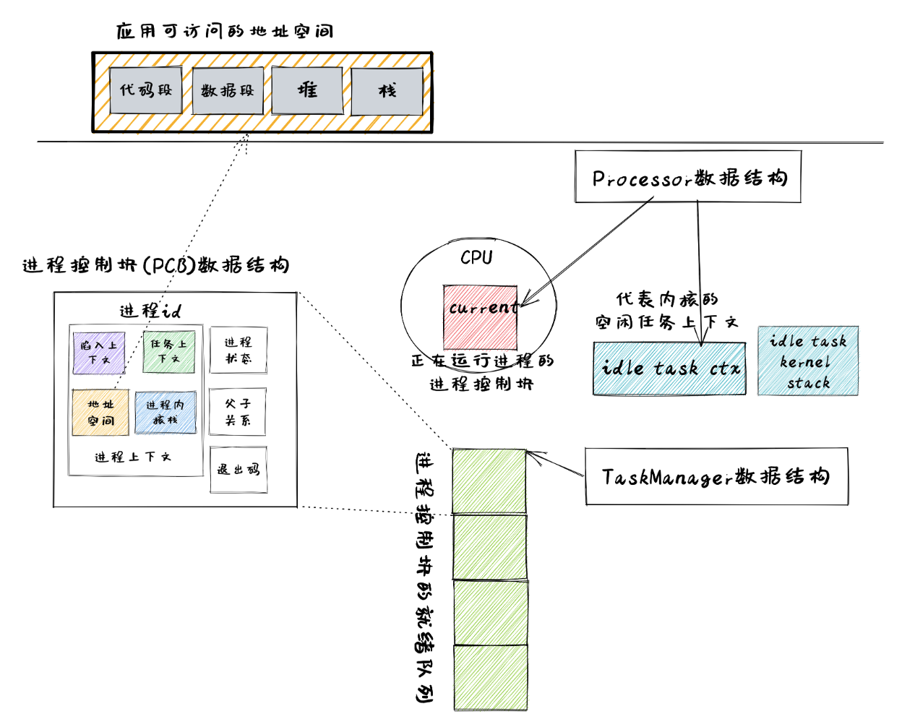

进程管理的核心数据结构
===================================

本节导读
-----------------------------------

为了更好实现进程管理，同时也使得操作系统整体架构更加灵活，能够满足后续的一些需求，我们需要重新设计一些数据结构包含的内容及接口。本节将按照如下顺序来进行介绍：

- 基于应用名的应用链接：在编译阶段的链接过程中，生成包含多个应用和应用位置信息的 ``link_app.S`` 文件。
- 基于应用名的加载器：根据应用名字来加载应用的 ELF 文件中代码段和数据段到内存中，为创建一个新进程做准备。
- 进程标识符 ``PidHandle`` 以及内核栈 ``KernelStack`` ：进程控制块的重要组成部分。
- 任务控制块 ``TaskControlBlock`` ：表示进程的核心数据结构。
- 任务管理器 ``TaskManager`` ：管理进程集合的核心数据结构。
- 处理器管理结构 ``Processor`` ：用于进程调度，维护进程的处理器状态。

应用的链接与加载支持
------------------------------------------------------------------------

基于应用名的应用链接
^^^^^^^^^^^^^^^^^^^^^^^^^^^^^^^^^^^^^^^^

在实现 ``exec`` 系统调用的时候，我们需要根据应用的名字而不仅仅是一个编号来获取应用的 ELF 格式数据。因此原有的链接和加载接口需要做出如下变更：

在 Rust 编译&链接辅助程序 ``os/build.rs`` 中，会读取位于 ``user/src/bin`` 中应用程序对应的执行文件，并生成 ``link_app.S`` ，按顺序保存链接进来的每个应用的名字：
  
.. code-block:: rust
    :linenos:
    :emphasize-lines: 8-13

    // os/build.rs

    for i in 0..apps.len() {
        writeln!(f, r#"    .quad app_{}_start"#, i)?;
    }
    writeln!(f, r#"    .quad app_{}_end"#, apps.len() - 1)?;

    writeln!(f, r#"
    .global _app_names
    _app_names:"#)?;
    for app in apps.iter() {
        writeln!(f, r#"    .string "{}""#, app)?;
    }

    for (idx, app) in apps.iter().enumerate() {
        ...
    }

第 8~13 行，我们按照顺序将各个应用的名字通过 ``.string`` 伪指令放到数据段中，注意链接器会自动在每个字符串的结尾加入分隔符 ``\0`` ，它们的位置则由全局符号 ``_app_names`` 指出。这样在编译操作系统的过程中，会生成如下的 ``link_app.S`` 文件：

.. code-block::
    :linenos:

        .section .data
        .global _num_app
    _num_app:
        .quad 15
        .quad app_0_start
        .quad app_1_start
    ......
        .global _app_names
    _app_names:
        .string "exit"
        .string "fantastic_text"
    ......        
        .section .data
        .global app_0_start
        .global app_0_end
        .align 3
    app_0_start:
        .incbin "../user/target/riscv64gc-unknown-none-elf/release/exit"
    app_0_end:  
    ......

在这个文件中，可以看到应用代码和表示应用的元数据信息都放在数据段。第10行是第一个应用的名字 ``exit`` ，第13~14行是第一个应用 ``exit`` 在OS镜像文件中的开始和结束位置；第18行是第一个应用 ``exit`` 的ELF格式执行文件的内容，

基于应用名的应用加载器
^^^^^^^^^^^^^^^^^^^^^^^^^^^^^^^^^^^^^^^^

而在加载器 ``loader.rs`` 中，我们会分析 ``link_app.S`` 中的内容，并用一个全局可见的 *只读* 向量 ``APP_NAMES`` 来按照顺序将所有应用的名字保存在内存中：

.. code-block:: Rust

    // os/src/loader.rs

    lazy_static! {
        static ref APP_NAMES: Vec<&'static str> = {
            let num_app = get_num_app();
            extern "C" { fn _app_names(); }
            let mut start = _app_names as usize as *const u8;
            let mut v = Vec::new();
            unsafe {
                for _ in 0..num_app {
                    let mut end = start;
                    while end.read_volatile() != '\0' as u8 {
                        end = end.add(1);
                    }
                    let slice = core::slice::from_raw_parts(start, end as usize - start as usize);
                    let str = core::str::from_utf8(slice).unwrap();
                    v.push(str);
                    start = end.add(1);
                }
            }
            v
        };
    }

使用 ``get_app_data_by_name`` 可以按照应用的名字来查找获得应用的 ELF 数据，而 ``list_apps`` 在内核初始化时被调用，它可以打印出所有可用的应用的名字。

.. code-block:: rust

    // os/src/loader.rs

    pub fn get_app_data_by_name(name: &str) -> Option<&'static [u8]> {
        let num_app = get_num_app();
        (0..num_app)
            .find(|&i| APP_NAMES[i] == name)
            .map(|i| get_app_data(i))
    }

    pub fn list_apps() {
        println!("/**** APPS ****");
        for app in APP_NAMES.iter() {
            println!("{}", app);
        }
        println!("**************/")
    }

这样，操作系统就可以读取并加载某个应用的执行文件到内存中了，这就为通过 ``exec`` 系统调用创建新进程做好了前期准备。

进程标识符和内核栈
------------------------------------------------------------------------

进程标识符
^^^^^^^^^^^^^^^^^^^^^^^^^^^^^^^^^^^^^^^^

同一时间存在的所有进程都有一个唯一的进程标识符，它们是互不相同的整数，这样才能表示表示进程的唯一性。这里我们使用 RAII 的思想，将其抽象为一个 ``PidHandle`` 类型，当它的生命周期结束后对应的整数会被编译器自动回收：

.. code-block:: rust

    // os/src/task/pid.rs

    pub struct PidHandle(pub usize);

类似之前的物理页帧分配器 ``FrameAllocator`` ，我们实现一个同样使用简单栈式分配策略的进程标识符分配器 ``PidAllocator`` ，并将其全局实例化为 ``PID_ALLOCATOR`` ：

.. code-block:: rust

    // os/src/task/pid.rs

    struct PidAllocator {
        current: usize,
        recycled: Vec<usize>,
    }

    impl PidAllocator {
        pub fn new() -> Self {
            PidAllocator {
                current: 0,
                recycled: Vec::new(),
            }
        }
        pub fn alloc(&mut self) -> PidHandle {
            if let Some(pid) = self.recycled.pop() {
                PidHandle(pid)
            } else {
                self.current += 1;
                PidHandle(self.current - 1)
            }
        }
        pub fn dealloc(&mut self, pid: usize) {
            assert!(pid < self.current);
            assert!(
                self.recycled.iter().find(|ppid| **ppid == pid).is_none(),
                "pid {} has been deallocated!", pid
            );
            self.recycled.push(pid);
        }
    }

    lazy_static! {
        static ref PID_ALLOCATOR : UPSafeCell<PidAllocator> = unsafe {
            UPSafeCell::new(PidAllocator::new())
        };
    }

``PidAllocator::alloc`` 将会分配出去一个将 ``usize`` 包装之后的 ``PidHandle`` 。我们将其包装为一个全局分配进程标识符的接口 ``pid_alloc`` 提供给内核的其他子模块：

.. code-block:: rust

    // os/src/task/pid.rs

    pub fn pid_alloc() -> PidHandle {
        PID_ALLOCATOR.exclusive_access().alloc()
    }

同时我们也需要为 ``PidHandle`` 实现 ``Drop`` Trait 来允许编译器进行自动的资源回收：

.. code-block:: rust

    // os/src/task/pid.rs

    impl Drop for PidHandle {
        fn drop(&mut self) {
            PID_ALLOCATOR.exclusive_access().dealloc(self.0);
        }
    }

内核栈
^^^^^^^^^^^^^^^^^^^^^^^^^^^^^^^^^^^^^^^^

在前面的章节中我们介绍过 :ref:`内核地址空间布局 <kernel-as-high>` ，当时我们将每个应用的内核栈按照应用编号从小到大的顺序将它们作为逻辑段从高地址到低地址放在内核地址空间中，且两两之间保留一个守护页面使得我们能够尽可能早的发现内核栈溢出问题。从本章开始，我们将应用编号替换为进程标识符。我们可以在内核栈 ``KernelStack`` 中保存着它所属进程的 PID ：

.. code-block:: rust

    // os/src/task/pid.rs

    pub struct KernelStack {
        pid: usize,
    }

它提供以下方法：

.. code-block:: rust
    :linenos:

    // os/src/task/pid.rs

    /// Return (bottom, top) of a kernel stack in kernel space.
    pub fn kernel_stack_position(app_id: usize) -> (usize, usize) {
        let top = TRAMPOLINE - app_id * (KERNEL_STACK_SIZE + PAGE_SIZE);
        let bottom = top - KERNEL_STACK_SIZE;
        (bottom, top)
    }

    impl KernelStack {
        pub fn new(pid_handle: &PidHandle) -> Self {
            let pid = pid_handle.0;
            let (kernel_stack_bottom, kernel_stack_top) = kernel_stack_position(pid);
            KERNEL_SPACE
                .exclusive_access()
                .insert_framed_area(
                    kernel_stack_bottom.into(),
                    kernel_stack_top.into(),
                    MapPermission::R | MapPermission::W,
                );
            KernelStack {
                pid: pid_handle.0,
            }
        }
        pub fn push_on_top<T>(&self, value: T) -> *mut T where
            T: Sized, {
            let kernel_stack_top = self.get_top();
            let ptr_mut = (kernel_stack_top - core::mem::size_of::<T>()) as *mut T;
            unsafe { *ptr_mut = value; }
            ptr_mut
        }
        pub fn get_top(&self) -> usize {
            let (_, kernel_stack_top) = kernel_stack_position(self.pid);
            kernel_stack_top
        }
    }

- 第 11 行， ``new`` 方法可以从一个 ``PidHandle`` ，也就是一个已分配的进程标识符中对应生成一个内核栈 ``KernelStack`` 。它调用了第 4 行声明的 ``kernel_stack_position`` 函数来根据进程标识符计算内核栈在内核地址空间中的位置，随即在第 14 行将一个逻辑段插入内核地址空间 ``KERNEL_SPACE`` 中。
- 第 25 行的 ``push_on_top`` 方法可以将一个类型为 ``T`` 的变量压入内核栈顶并返回其裸指针，这也是一个泛型函数。它在实现的时候用到了第 32 行的 ``get_top`` 方法来获取当前内核栈顶在内核地址空间中的地址。

内核栈 ``KernelStack`` 也用到了 RAII 的思想，具体来说，实际保存它的物理页帧的生命周期与它绑定在一起，当 ``KernelStack`` 生命周期结束后，这些物理页帧也将会被编译器自动回收：

.. code-block:: rust

    // os/src/task/pid.rs

    impl Drop for KernelStack {
        fn drop(&mut self) {
            let (kernel_stack_bottom, _) = kernel_stack_position(self.pid);
            let kernel_stack_bottom_va: VirtAddr = kernel_stack_bottom.into();
            KERNEL_SPACE
                .exclusive_access()
                .remove_area_with_start_vpn(kernel_stack_bottom_va.into());
        }
    }

这仅需要为 ``KernelStack`` 实现 ``Drop`` Trait，一旦它的生命周期结束则在内核地址空间中将对应的逻辑段删除（为此在 ``MemorySet`` 中新增了一个名为 ``remove_area_with_start_vpn`` 的方法，感兴趣的同学可以参考其实现），由前面章节的介绍我们知道这也就意味着那些物理页帧被同时回收掉了。

进程控制块
------------------------------------------------------------------------

在内核中，每个进程的执行状态、资源控制等元数据均保存在一个被称为 **进程控制块** (PCB, Process Control Block) 的结构中，它是内核对进程进行管理的单位，故而是一种极其关键的内核数据结构。在内核看来，它就等价于一个进程。

承接前面的章节，我们仅需对任务控制块 ``TaskControlBlock`` 进行若干改动并让它直接承担进程控制块的功能：

.. code-block:: rust
    :linenos:

    // os/src/task/task.rs

    pub struct TaskControlBlock {
        // immutable
        pub pid: PidHandle,
        pub kernel_stack: KernelStack,
        // mutable
        inner: UPSafeCell<TaskControlBlockInner>,
    }

    pub struct TaskControlBlockInner {
        pub trap_cx_ppn: PhysPageNum,
        pub base_size: usize,
        pub task_cx: TaskContext,
        pub task_status: TaskStatus,
        pub memory_set: MemorySet,
        pub parent: Option<Weak<TaskControlBlock>>,
        pub children: Vec<Arc<TaskControlBlock>>,
        pub exit_code: i32,
    }

任务控制块中包含两部分：

- 在初始化之后就不再变化的元数据：直接放在任务控制块中。这里将进程标识符 ``PidHandle`` 和内核栈 ``KernelStack`` 放在其中；
- 在运行过程中可能发生变化的元数据：则放在 ``TaskControlBlockInner`` 中，将它再包裹上一层 ``UPSafeCell<T>`` 放在任务控制块中。这是因为在我们的设计中外层只能获取任务控制块的不可变引用，若想修改里面的部分内容的话这需要 ``UPSafeCell<T>`` 所提供的内部可变性。

``TaskControlBlockInner`` 中则包含下面这些内容：

- ``trap_cx_ppn`` 指出了应用地址空间中的 Trap 上下文（详见第四章）被放在的物理页帧的物理页号。
- ``base_size`` 的含义是：应用数据仅有可能出现在应用地址空间低于 ``base_size`` 字节的区域中。借助它我们可以清楚的知道应用有多少数据驻留在内存中。
- ``task_cx`` 将暂停的任务的任务上下文保存在任务控制块中。
- ``task_status`` 维护当前进程的执行状态。
- ``memory_set`` 表示应用地址空间。
- ``parent`` 指向当前进程的父进程（如果存在的话）。注意我们使用 ``Weak`` 而非 ``Arc`` 来包裹另一个任务控制块，因此这个智能指针将不会影响父进程的引用计数。
- ``children`` 则将当前进程的所有子进程的任务控制块以 ``Arc`` 智能指针的形式保存在一个向量中，这样才能够更方便的找到它们。
- 当进程调用 exit 系统调用主动退出或者执行出错由内核终止的时候，它的退出码 ``exit_code`` 会被内核保存在它的任务控制块中，并等待它的父进程通过 waitpid 回收它的资源的同时也收集它的 PID 以及退出码。

注意我们在维护父子进程关系的时候大量用到了引用计数 ``Arc/Weak`` 。进程控制块的本体是被放到内核堆上面的，对于它的一切访问都是通过智能指针 ``Arc/Weak`` 来进行的，这样是便于建立父子进程的双向链接关系（避免仅基于 ``Arc`` 形成环状链接关系）。当且仅当智能指针 ``Arc`` 的引用计数变为 0 的时候，进程控制块以及被绑定到它上面的各类资源才会被回收。子进程的进程控制块并不会被直接放到父进程控制块中，因为子进程完全有可能在父进程退出后仍然存在。

``TaskControlBlockInner`` 提供的方法主要是对于它内部的字段的快捷访问：

.. code-block:: rust

    // os/src/task/task.rs

    impl TaskControlBlockInner {
        pub fn get_trap_cx(&self) -> &'static mut TrapContext {
            self.trap_cx_ppn.get_mut()
        }
        pub fn get_user_token(&self) -> usize {
            self.memory_set.token()
        }
        fn get_status(&self) -> TaskStatus {
            self.task_status
        }
        pub fn is_zombie(&self) -> bool {
            self.get_status() == TaskStatus::Zombie
        }
    }

而任务控制块 ``TaskControlBlock`` 目前提供以下方法：

.. code-block:: rust

    // os/src/task/task.rs

    impl TaskControlBlock {
        pub fn inner_exclusive_access(&self) -> RefMut<'_, TaskControlBlockInner> {
            self.inner.exclusive_access()
        }
        pub fn getpid(&self) -> usize {
            self.pid.0
        }
        pub fn new(elf_data: &[u8]) -> Self {...}
        pub fn exec(&self, elf_data: &[u8]) {...}
        pub fn fork(self: &Arc<TaskControlBlock>) -> Arc<TaskControlBlock> {...}
    }

- ``inner_exclusive_access`` 通过 ``UPSafeCell<T>.exclusive_access()`` 来得到一个 ``RefMut<'_, TaskControlBlockInner>`` ，它可以被看成一个内层 ``TaskControlBlockInner`` 的可变引用并可以对它指向的内容进行修改。
- ``getpid`` 以 ``usize`` 的形式返回当前进程的进程标识符。
- ``new`` 用来创建一个新的进程，目前仅用于内核中手动创建唯一一个初始进程 ``initproc`` 。
- ``exec`` 用来实现 ``exec`` 系统调用，即当前进程加载并执行另一个 ELF 格式可执行文件。
- ``fork`` 用来实现 ``fork`` 系统调用，即当前进程 fork 出来一个与之几乎相同的子进程。

``new/exec/fork`` 的实现我们将在下一小节再介绍。

任务管理器
------------------------------------------------------------------------

在前面的章节中，任务管理器 ``TaskManager`` 不仅负责管理所有的任务，还维护着 CPU 当前在执行哪个任务。由于这种设计不够灵活，不能拓展到后续的多核环境，我们需要将任务管理器对于 CPU 的监控职能拆分到下面即将介绍的处理器管理结构 ``Processor`` 中去，任务管理器自身仅负责管理所有任务。在这里，任务指的就是进程。

.. code-block:: rust
    :linenos:

    // os/src/task/manager.rs

    pub struct TaskManager {
        ready_queue: VecDeque<Arc<TaskControlBlock>>,
    }

    /// A simple FIFO scheduler.
    impl TaskManager {
        pub fn new() -> Self {
            Self { ready_queue: VecDeque::new(), }
        }
        pub fn add(&mut self, task: Arc<TaskControlBlock>) {
            self.ready_queue.push_back(task);
        }
        pub fn fetch(&mut self) -> Option<Arc<TaskControlBlock>> {
            self.ready_queue.pop_front()
        }
    }

    lazy_static! {
        pub static ref TASK_MANAGER: UPSafeCell<TaskManager> = unsafe {
            UPSafeCell::new(TaskManager::new())
        };
    }

    pub fn add_task(task: Arc<TaskControlBlock>) {
        TASK_MANAGER.exclusive_access().add(task);
    }

    pub fn fetch_task() -> Option<Arc<TaskControlBlock>> {
        TASK_MANAGER.exclusive_access().fetch()
    }

``TaskManager`` 将所有的任务控制块用引用计数 ``Arc`` 智能指针包裹后放在一个双端队列 ``VecDeque`` 中。正如之前介绍的那样，我们并不直接将任务控制块放到 ``TaskManager`` 里面，而是将它们放在内核堆上，在任务管理器中仅存放他们的引用计数智能指针，这也是任务管理器的操作单位。这样做的原因在于，任务控制块经常需要被放入/取出，如果直接移动任务控制块自身将会带来大量的数据拷贝开销，而对于智能指针进行移动则没有多少开销。其次，允许任务控制块的共享引用在某些情况下能够让我们的实现更加方便。

``TaskManager`` 提供 ``add/fetch`` 两个操作，前者表示将一个任务加入队尾，后者则表示从队头中取出一个任务来执行。从调度算法来看，这里用到的就是最简单的 RR 算法。全局实例 ``TASK_MANAGER`` 则提供给内核的其他子模块 ``add_task/fetch_task`` 两个函数。

.. chyyuu 在我们的设计中，即使在多核情况下，我们也只有单个任务管理器共享给所有的核来使用。然而在其他设计中，每个核可能都有一个自己独立的任务管理器来管理仅可以在自己上面运行的任务。

处理器管理结构
------------------------------------------------------------------------

处理器管理结构 ``Processor`` 负责从任务管理器 ``TaskManager`` 中分出去的维护 CPU 状态的职责：

.. code-block:: rust

    // os/src/task/processor.rs

    pub struct Processor {
        current: Option<Arc<TaskControlBlock>>,
        idle_task_cx: TaskContext,
    }

    impl Processor {
        pub fn new() -> Self {
            Self {
                current: None,
                idle_task_cx: TaskContext::zero_init(),
            }
        }
    }

在 ``Processor`` 中存放所有在运行过程中可能变化的内容，目前包括：

- ``current`` 表示在当前处理器上正在执行的任务；
- ``idle_task_cx`` 表示当前处理器上的 idle 控制流的任务上下文。

``Processor`` 是描述CPU 执行状态 的数据结构。在单核CPU环境下，我们仅创建单个 ``Processor`` 的全局实例 ``PROCESSOR`` ：

.. code-block:: rust

    // os/src/task/processor.rs

    lazy_static! {
        pub static ref PROCESSOR: UPSafeCell<Processor> = unsafe {
            UPSafeCell::new(Processor::new())
        };
    }

正在执行的任务
^^^^^^^^^^^^^^^^^^^^^^^^^^^^^^^^^^^^^^^^^^^^^^^^^

在抢占式调度模型中，在一个处理器上执行的任务常常被换入或换出，因此我们需要维护在一个处理器上正在执行的任务，可以查看它的信息或是对它进行替换：

.. code-block:: rust
    :linenos:

    // os/src/task/processor.rs

    impl Processor {
        pub fn take_current(&mut self) -> Option<Arc<TaskControlBlock>> {
            self.current.take()
        }
        pub fn current(&self) -> Option<Arc<TaskControlBlock>> {
            self.current.as_ref().map(|task| Arc::clone(task))
        }
    }

    pub fn take_current_task() -> Option<Arc<TaskControlBlock>> {
        PROCESSOR.exclusive_access().take_current()
    }

    pub fn current_task() -> Option<Arc<TaskControlBlock>> {
        PROCESSOR.exclusive_access().current()
    }

    pub fn current_user_token() -> usize {
        let task = current_task().unwrap();
        let token = task.inner_exclusive_access().get_user_token();
        token
    }

    pub fn current_trap_cx() -> &'static mut TrapContext {
        current_task().unwrap().inner_exclusive_access().get_trap_cx()
    }

- 第 4 行的 ``Processor::take_current`` 可以取出当前正在执行的任务。
- 第 7 行的 ``Processor::current`` 返回当前执行的任务的一份拷贝。
- 第 12 行的 ``take_current_task`` 以及第 16 行的 ``current_task`` 是对 ``Processor::take_current/current`` 进行封装并提供给内核其他子模块的接口。
- 第 20 行的 ``current_user_token`` 和第 26 行的 ``current_trap_cx`` 基于 ``current_task`` 实现，可以提供当前正在执行的任务的更多信息。

任务调度的 idle 控制流
^^^^^^^^^^^^^^^^^^^^^^^^^^^^^^^^^^^^^^^^^^^^^^^^^

 ``Processor`` 有一个不同的 idle 控制流，它运行在这个 CPU 核的启动栈上，功能是尝试从任务管理器中选出一个任务来在当前 CPU 核上执行。在内核初始化完毕之后，会通过调用 ``run_tasks`` 函数来进入 idle 控制流：

.. code-block:: rust
    :linenos:

    // os/src/task/processor.rs

    pub fn run_tasks() {
        loop {
            let mut processor = PROCESSOR.exclusive_access();
            if let Some(task) = fetch_task() {
                let idle_task_cx_ptr = processor.get_idle_task_cx_ptr();
                // access coming task TCB exclusively
                let mut task_inner = task.inner_exclusive_access();
                let next_task_cx_ptr = &task_inner.task_cx as *const TaskContext;
                task_inner.task_status = TaskStatus::Running;
                // stop exclusively accessing coming task TCB manually
                drop(task_inner);
                processor.current = Some(task);
                // stop exclusively accessing processor manually
                drop(processor);
                unsafe {
                    __switch(
                        idle_task_cx_ptr,
                        next_task_cx_ptr,
                    );
                }
            }
        }
    }    

    impl Processor {
        fn get_idle_task_cx_ptr(&mut self) -> *mut TaskContext {
            &mut self.idle_task_cx as *mut _
        }  
    }

可以看到，调度功能的主体是 ``run_tasks()`` 。它循环调用 ``fetch_task`` 直到顺利从任务管理器中取出一个任务，随后便准备通过任务切换的方式来执行：

- 第 7 行得到 ``__switch`` 的第一个参数，也就是当前 idle 控制流的 task_cx_ptr，这调用了第 25 行的 ``Processor.get_idle_task_cx_ptr`` 方法。
- 第 9~11 行需要先获取从任务管理器中取出对应的任务控制块，并获取任务块内部的 ``next_task_cx_ptr`` 作为 ``__switch`` 的第二个参数，然后修改任务的状态为 ``Running`` 。
- 第 13 行需要手动回收对即将执行任务的任务控制块的借用标记，使得后续我们仍可以访问该任务控制块。这里我们不能依赖编译器在 ``if let`` 块结尾时的自动回收，因为中间我们会在自动回收之前调用 ``__switch`` ，这将导致我们在实际上已经结束访问却没有进行回收的情况下切换到下一个任务，最终可能违反 ``UPSafeCell`` 的借用约定而使得内核报错退出。同理在第 16 行我们手动回收 ``PROCESSOR`` 的借用标记。
- 第 14 行我们修改当前 ``Processor`` 正在执行的任务为我们取出的任务。注意这里相当于 ``Arc<TaskControlBlock>`` 形式的任务从任务管理器流动到了处理器管理结构中。也就是说，在稳定的情况下，每个尚未结束的进程的任务控制块都只能被引用一次，要么在任务管理器中，要么则是在代表 CPU 处理器的 ``Processor`` 中。
- 第 18 行我们调用 ``__switch`` 来从当前的 idle 控制流切换到接下来要执行的任务。

上面介绍了从 idle 控制流通过任务调度切换到某个任务开始执行的过程。而反过来，当一个应用用尽了内核本轮分配给它的时间片或者它主动调用 ``yield`` 系统调用交出 CPU 使用权之后，内核会调用 ``schedule`` 函数来切换到 idle 控制流并开启新一轮的任务调度。

.. code-block:: rust

    // os/src/task/processor.rs

    pub fn schedule(switched_task_cx_ptr: *mut TaskContext) {
        let mut processor = PROCESSOR.exclusive_access();
        let idle_task_cx_ptr = processor.get_idle_task_cx_ptr();
        drop(processor);
        unsafe {
            __switch(
                switched_task_cx_ptr,
                idle_task_cx_ptr,
            );
        }
    }

这里，我们需要传入即将被切换出去的任务的 task_cx_ptr 来在合适的位置保存任务上下文，之后就可以通过 ``__switch`` 来切换到 idle 控制流。从源代码来看，切换回去之后，内核将跳转到 ``run_tasks`` 中 ``__switch`` 返回之后的位置，也即开启了下一轮的调度循环。
