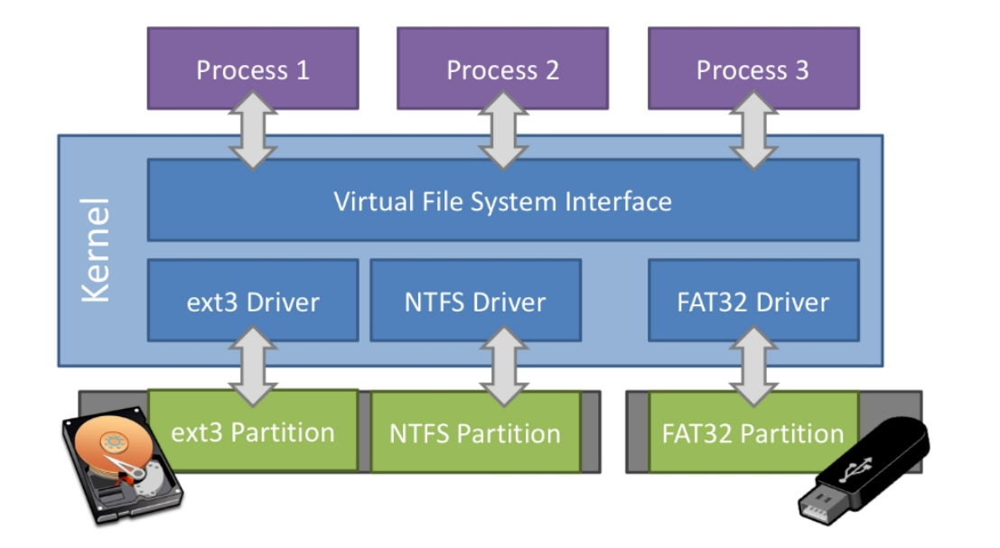
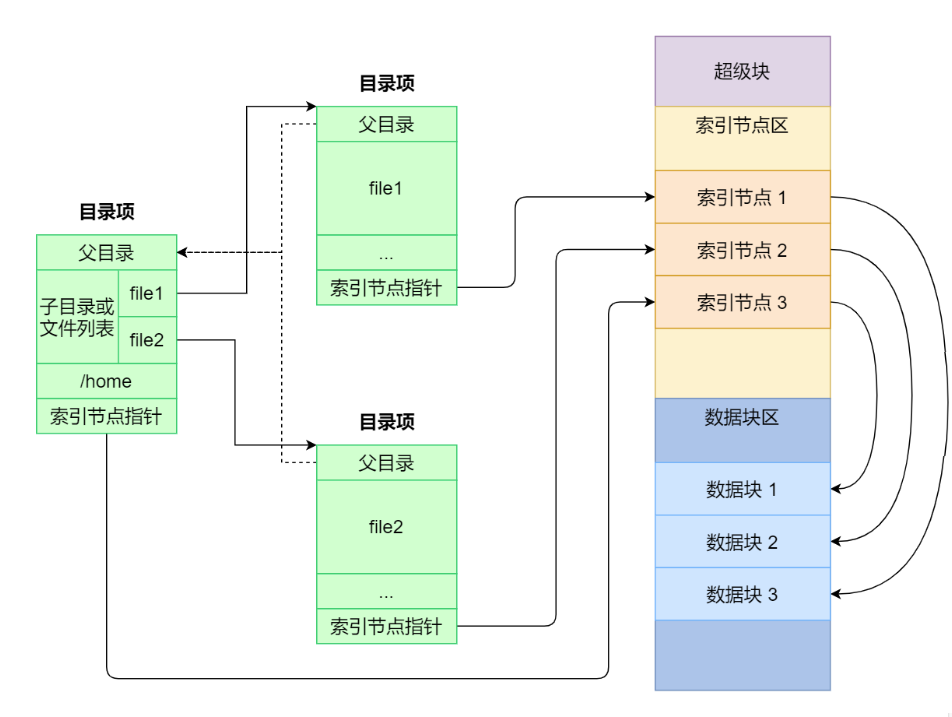

文件系统接口
=================================================

本节导读
-------------------------------------------------

本节首先以Linux 上的常规文件和目录为例，站在访问文件的应用的角度，介绍文件中值得注意的地方及文件使用方法。由于 Linux 上的文件系统模型还是比较复杂，在内核实现中对它进行了很大程度的简化，我们会对简化的具体情形进行介绍。最后介绍内核上应用的开发者应该如何使用我们简化后的文件系统和一些相关知识。

文件和目录
-------------------------------------------------

常规文件
+++++++++++++++++++++++++++++++++++++++++++++++++

在操作系统的用户看来，常规文件是保存在持久存储设备上的一个字节序列，每个常规文件都有一个 **文件名** (Filename) ，用户需要通过它来区分不同的常规文件。方便起见，在下面的描述中，“文件”有可能指的是常规文件、目录，也可能是之前提到的若干种进程可以读写的 标准输出、标准输入、管道等I/O 资源，请同学自行根据上下文判断取哪种含义。

在 Linux 系统上， ``stat`` 工具可以获取文件的一些信息。下面以我们项目中的一个源代码文件 ``os/src/main.rs`` 为例：

.. code-block:: console

    $ cd os/src/
    $ stat main.rs
    File: main.rs
    Size: 940       	Blocks: 8          IO Block: 4096   regular file
    Device: 801h/2049d	Inode: 4975        Links: 1
    Access: (0644/-rw-r--r--)  Uid: ( 1000/   oslab)   Gid: ( 1000/   oslab)
    Access: 2021-02-28 23:32:50.289925450 +0800
    Modify: 2021-02-28 23:32:50.133927136 +0800
    Change: 2021-02-28 23:32:50.133927136 +0800
    Birth: -

``stat`` 工具展示了 ``main.rs`` 的如下信息：

- File 表明它的文件名为 ``main.rs`` 。
- Size 表明它的字节大小为 940 字节。
- Blocks 表明它占据 8 个 **块** (Block) 来存储。在文件系统中，文件的数据以块为单位进行存储。在 IO Block 可以看出，在 Linux操作系统中的Ext4文件系统的每个块的大小为 4096 字节。
- regular file 表明这个文件是一个常规文件。事实上，其他类型的文件也可以通过文件名来进行访问。
- 当文件是一个特殊文件（如块设备文件或者字符设备文件）的时候，Device 将指出该特殊文件的 major/minor ID 。对于一个常规文件，我们无需关心它。
- Inode 表示文件的底层编号。在文件系统的底层实现中，并不是直接通过文件名来索引文件，而是首先需要将文件名转化为文件的底层编号，再根据这个编号去索引文件。目前我们无需关心这一信息。
- Links 给出文件的硬链接数。同一个文件系统中如果两个文件（目录也是文件）具有相同的inode号码，那么就称它们是“硬链接”关系。这样links的值其实是一个文件的不同文件名的数量。（本章的练习需要你在文件系统中实现硬链接！）
- Uid 给出该文件的所属的用户 ID ， Gid 给出该文件所属的用户组 ID 。Access 的其中一种表示是一个长度为 10 的字符串（这里是 ``-rw-r--r--`` ），其中第 1 位给出该文件的类型，这个文件是一个常规文件，因此这第 1 位为 ``-`` 。后面的 9 位可以分为三组，分别表示该文件的所有者/在该文件所属的用户组内的其他用户以及剩下的所有用户能够读取/写入/将该文件作为一个可执行文件来执行。
- Access/Modify 分别给出该文件的最近一次访问/最近一次修改时间。

如果我们使用 ``stat`` 工具查看一个能在我们内核上执行的 ELF 可执行文件：

.. code-block:: console

    $ cd user/target/riscv64gc-unknown-none-elf/release/
    $ stat user_shell
    File: user_shell
    Size: 85712     	Blocks: 168        IO Block: 4096   regular file
    Device: 801h/2049d	Inode: 1460936     Links: 2
    Access: (0755/-rwxr-xr-x)  Uid: ( 1000/   oslab)   Gid: ( 1000/   oslab)
    Access: 2021-03-01 11:21:34.785309066 +0800
    Modify: 2021-03-01 11:21:32.829332116 +0800
    Change: 2021-03-01 11:21:32.833332069 +0800
    Birth: -

从中可以看出我们构建的应用体积大概在数十 KiB 量级。它的 Access 指出所有用户均可将其作为一个可执行文件在当前 OS 中加载并执行。然而这仅仅是能够通过权限检查而已，这个应用只有在我们自己的内核上才能真正被加载运行。

用户常常通过文件的 **拓展名** (Filename extension) 来推断该文件的用途，如 ``main.rs`` 的拓展名是 ``.rs`` ，我们由此知道它是一个 Rust 源代码文件。但从内核的角度来看，它会将所有文件无差别的看成一个字节序列，文件内容的结构和含义则是交给对应的应用进行解析。

目录
+++++++++++++++++++++++++++++++++++++++++++++++++

最早的文件系统仅仅通过文件名来区分文件，但是这会造成一些归档和管理上的困难。如今我们的使用习惯是将文件根据功能、属性的不同分类归档到不同层级的目录之下。这样我们就很容易逐级找到想要的文件。结合用户和用户组的概念，目录的存在也使得文件访问权限控制更加容易，只需要对于目录进行设置就可以间接设置用户/用户组对该目录下所有文件的访问权限，这使得操作系统能够更加安全的支持多用户情况下对不同文件的访问。

同样可以通过 ``stat`` 工具获取目录的一些信息：

.. code-block:: console

    $ stat os
    File: os
    Size: 4096      	Blocks: 8          IO Block: 4096   directory
    Device: 801h/2049d	Inode: 4982        Links: 5
    Access: (0755/drwxr-xr-x)  Uid: ( 1000/   oslab)   Gid: ( 1000/   oslab)
    Access: 2021-02-28 23:32:50.133927136 +0800
    Modify: 2021-02-28 23:32:50.129927180 +0800
    Change: 2021-02-28 23:32:50.129927180 +0800
    Birth: -

directory 表明 ``os`` 是一个目录，从 Access 字符串的首位 ``d`` 也可以看出这一点。对于目录而言， Access 的 ``rwx`` 含义有所不同：

- ``r`` 表示是否允许获取该目录下有哪些文件和子目录；
- ``w`` 表示是否允许在该目录下创建/删除文件和子目录；
- ``x`` 表示是否允许“通过”该目录。

Blocks 给出 ``os`` 目录也占用 8 个块进行存储。实际上目录也可以看作一种文件，它也有属于自己的底层编号，它的内容中保存着若干 **目录项** (Dirent, Directory Entry) ，可以看成一组映射，根据它下面的文件名或子目录名能够查到文件和子目录在文件系统中的底层编号，即 Inode 编号。但是与常规文件不同的是，用户无法 **直接** 修改目录的内容，只能通过创建/删除它下面的文件或子目录才能间接做到这一点。

有了目录之后，我们就可以将所有的文件和目录组织为一种被称为 **目录树** (Directory Tree) 的有根树结构（不考虑软链接）。树中的每个节点都是一个文件或目录，一个目录下面的所有的文件和子目录都是它的孩子。可以看出所有的文件都是目录树的叶子节点。目录树的根节点也是一个目录，它被称为 **根目录** (Root Directory)。目录树中的每个目录和文件都可以用它的 **绝对路径** (Absolute Path) 来进行索引和定位。绝对路径是目录树上的根节点到待索引的目录和文件所在的节点之间自上而下的路径。此路径上的所有节点(文件或目录)两两之间加上路径分隔符拼接就可得到绝对路径名。例如，在 Linux 上，根目录的绝对路径是 ``/`` ，路径分隔符也是 ``/`` ，因此：

- ``main.rs`` 的绝对路径是 ``/home/oslab/workspace/v3/rCore-Tutorial-v3/os/src/main.rs`` ；
- ``os`` 目录的绝对路径则是 ``/home/oslab/workspace/v3/rCore-Tutorial-v3/os/`` 。

上面的绝对路径因具体环境而异。
一般情况下，绝对路径都很长，用起来颇为不便。而且，在日常使用中，我们通常固定在一个工作目录下而不会频繁切换目录。因此更为常用的是 **相对路径** (Relative Path) 而非绝对路径。每个进程都会记录自己当前所在的工作目录（Current Working Directory, CWD），当它在索引文件或目录的时候，如果传给它的路径并未以 ``/`` 开头，则会被内核认为是一个相对于进程当前工作目录的相对路径。这个路径会被拼接在进程当前路径的后面组成一个绝对路径，实际索引的是这个绝对路径对应的文件或目录。其中， ``./`` 表示当前目录，而 ``../`` 表示当前目录的父目录，这在通过相对路径进行索引的时候非常实用。在使用终端的时候，执行 ``pwd`` 命令可以打印终端进程当前所在的目录，而通过 ``cd`` 可以切换终端进程的工作目录。

一旦引入目录之后，我们就不再单纯的通过文件名来索引文件，而是通过路径（绝对或相对）进行索引。在文件系统的底层实现中，也是对应的先将路径转化为一个文件或目录的底层编号，然后再通过这个编号具体索引文件或目录。将路径转化为底层编号的过程是逐级进行的，对于绝对路径的情况，需要从根目录出发，每次根据当前目录底层编号获取到它的内容，根据下一级子目录的目录名查到该子目录的底层编号，然后从该子目录继续向下遍历，依此类推。在这个过程目录的权限控制位将会起到保护作用，阻止无权限用户进行访问。

.. note::

    **目录是否有必要存在**

    基于路径的索引难以并行或分布式化，因为我们总是需要查到一级目录的底层编号才能查到下一级，这是一个天然串行的过程。在一些性能需求极高的环境中，可以考虑弱化目录的权限控制职能，将目录树结构扁平化，将文件系统的磁盘布局变为类键值对存储。

文件系统
+++++++++++++++++++++++++++++++++++++++++++++++++

常规文件和目录都是实际保存在持久存储设备中的。持久存储设备仅支持以扇区（或块）为单位的随机读写，这和上面介绍的通过路径即可索引到文件并以字节流进行读写的用户视角有很大的不同。负责中间转换的便是 **文件系统** (File System) 。具体而言，文件系统负责将逻辑上的目录树结构（包括其中每个文件或目录的数据和其他信息）映射到持久存储设备上，决定设备上的每个扇区应存储哪些内容。反过来，文件系统也可以从持久存储设备还原出逻辑上的目录树结构。

文件系统有很多种不同的实现，每一种都能将同一个逻辑上目录树结构转化为一个不同的持久存储设备上的扇区布局。最著名的文件系统有 Windows 上的 FAT/NTFS 和 Linux 上的 Ext3/Ext4/Btrfs 等。

在一个计算机系统中，可以同时包含多个持久存储设备，它们上面的数据可能是以不同文件系统格式存储的。为了能够对它们进行统一管理，在内核中有一层 **虚拟文件系统** (VFS, Virtual File System) ，它规定了逻辑上目录树结构的通用格式及相关操作的抽象接口，只要不同的底层文件系统均实现虚拟文件系统要求的那些抽象接口，再加上 **挂载** (Mount) 等方式，这些持久存储设备上的不同文件系统便可以用一个统一的逻辑目录树结构一并进行管理。

.. _fs-simplification:

简化的文件与目录抽象
-------------------------------------------------

我们的内核实现对于目录树结构进行了很大程度上的简化，这样做的目的是为了能够完整地展示文件系统的工作原理，但代码量又不至于太多。我们进行的简化如下：

- 扁平化：仅存在根目录 ``/`` 一个目录，剩下所有的文件都放在根目录内。在索引一个文件的时候，我们直接使用文件的文件名而不是它含有 ``/`` 的绝对路径。
- 权限控制：我们不设置用户和用户组概念，全程只有单用户。同时根目录和其他文件也都没有权限控制位，即完全不限制文件的访问方式，不会区分文件是否可执行。
- 不记录文件访问/修改的任何时间戳。
- 不支持软硬链接。
- 除了下面即将介绍的系统调用之外，其他的很多文件系统相关系统调用均未实现。

打开、关闭与读写文件的系统调用
--------------------------------------------------

.. _sys-open:

文件打开
++++++++++++++++++++++++++++++++++++++++++++++++++

在读写一个常规文件之前，应用首先需要通过内核提供的 ``sys_open`` 系统调用让该文件在进程的文件描述符表中占一项，并得到操作系统的返回值--文件描述符，即文件关联的表项在文件描述表中的索引值：

.. code-block:: rust

    /// 功能：打开一个常规文件，并返回可以访问它的文件描述符。
    /// 参数：path 描述要打开的文件的文件名（简单起见，文件系统不需要支持目录，所有的文件都放在根目录 / 下），
    /// flags 描述打开文件的标志，具体含义下面给出。
    /// 返回值：如果出现了错误则返回 -1，否则返回打开常规文件的文件描述符。可能的错误原因是：文件不存在。
    /// syscall ID：56
    fn sys_open(path: &str, flags: u32) -> isize

.. image:: file-open.png
   :align: center
   :scale: 70 %
   :name: File Open
   :alt: 文件打开示意图

目前我们的内核支持以下几种标志（多种不同标志可能共存）：

- 如果 ``flags`` 为 0，则表示以只读模式 *RDONLY* 打开；
- 如果 ``flags`` 第 0 位被设置（0x001），表示以只写模式 *WRONLY* 打开；
- 如果 ``flags`` 第 1 位被设置（0x002），表示既可读又可写 *RDWR* ；
- 如果 ``flags`` 第 9 位被设置（0x200），表示允许创建文件 *CREATE* ，在找不到该文件的时候应创建文件；如果该文件已经存在则应该将该文件的大小归零；
- 如果 ``flags`` 第 10 位被设置（0x400），则在打开文件的时候应该清空文件的内容并将该文件的大小归零，也即 *TRUNC* 。

注意 ``flags`` 里面的权限设置只能控制进程对本次打开的文件的访问。一般情况下，在打开文件的时候首先需要经过文件系统的权限检查，比如一个文件自身不允许写入，那么进程自然也就不能以 *WRONLY* 或 *RDWR* 标志打开文件。但在我们简化版的文件系统中文件不进行权限设置，这一步就可以绕过。

在用户库 ``user_lib`` 中，我们将该系统调用封装为 ``open`` 接口：

.. code-block:: rust

    // user/src/lib.rs

    bitflags! {
        pub struct OpenFlags: u32 {
            const RDONLY = 0;
            const WRONLY = 1 << 0;
            const RDWR = 1 << 1;
            const CREATE = 1 << 9;
            const TRUNC = 1 << 10;
        }
    }

    pub fn open(path: &str, flags: OpenFlags) -> isize {
        sys_open(path, flags.bits)
    }

借助 ``bitflags!`` 宏我们将一个 ``u32`` 的 flags 包装为一个 ``OpenFlags`` 结构体更易使用，它的 ``bits`` 字段可以将自身转回 ``u32`` ，它也会被传给 ``sys_open``。

.. code-block:: rust

    // user/src/syscall.rs

    const SYSCALL_OPEN: usize = 56;

    pub fn sys_open(path: &str, flags: u32) -> isize {
        syscall(SYSCALL_OPEN, [path.as_ptr() as usize, flags as usize, 0])
    }

``sys_open`` 传给内核的参数只有待打开文件的文件名字符串的起始地址（和之前一样，我们需要保证该字符串以 ``\0`` 结尾）还有标志位。由于每个通用寄存器为 64 位，我们需要先将 ``u32`` 的 ``flags`` 转换为 ``usize`` 。

.. _sys-close:

文件关闭
++++++++++++++++++++++++++++++++++++++++++++++++++

在打开文件，对文件完成了读写操作后，还需要关闭文件，这样才让进程释放被这个文件占用的内核资源。 ``close`` 的调用参数是文件描述符，当文件被关闭后，该文件在内核中的资源会被释放，文件描述符会被回收。这样，进程就不能继续使用该文件描述符进行文件读写了。

.. code-block:: rust

    /// 功能：当前进程关闭一个文件。
    /// 参数：fd 表示要关闭的文件的文件描述符。
    /// 返回值：如果成功关闭则返回 0 ，否则返回 -1 。可能的出错原因：传入的文件描述符并不对应一个打开的文件。

    // usr/src/lib.rs
    pub fn close(fd: usize) -> isize { sys_close(fd) }
    
    // user/src/syscall.rs
    const SYSCALL_CLOSE: usize = 57;

    pub fn sys_close(fd: usize) -> isize {
        syscall(SYSCALL_CLOSE, [fd, 0, 0])
    }

文件的顺序读写
++++++++++++++++++++++++++++++++++++++++++++++++++

在打开一个文件之后，我们就可以用之前的 ``sys_read/sys_write`` 两个系统调用来对它进行读写了。需要注意的是，常规文件的读写模式和之前介绍过的几种文件有所不同。标准输入输出和匿名管道都属于一种流式读写，而常规文件则是顺序读写和随机读写的结合。由于常规文件可以看成一段字节序列，我们应该能够随意读写它的任一段区间的数据，即随机读写。然而用户仅仅通过 ``sys_read/sys_write`` 两个系统调用不能做到这一点。

事实上，进程为每个它打开的常规文件维护了一个偏移量，在刚打开时初始值一般为 0 字节。当 ``sys_read/sys_write`` 的时候，将会从文件字节序列偏移量的位置开始 **顺序** 把数据读到应用缓冲区/从应用缓冲区写入数据。操作完成之后，偏移量向后移动读取/写入的实际字节数。这意味着，下次 ``sys_read/sys_write`` 将会从刚刚读取/写入之后的位置继续。如果仅使用 ``sys_read/sys_write`` 的话，则只能从头到尾顺序对文件进行读写。当我们需要从头开始重新写入或读取的话，只能通过 ``sys_close`` 关闭并重新打开文件来将偏移量重置为 0。为了解决这种问题，有另一个系统调用 ``sys_lseek`` 可以调整进程打开的一个常规文件的偏移量，这样便能对文件进行随机读写。在本教程中并未实现这个系统调用，因为对于目前实验中的应用例子，顺序文件读写功能就已经足够满足需求了。顺带一提，在文件系统的底层实现中都是对文件进行随机读写的。
 
.. _filetest-simple:

下面我们从本章的测试用例 ``filetest_simple`` 来介绍文件系统接口的使用方法：

.. code-block:: rust
    :linenos:

    // user/src/bin/filetest_simple.rs

    #![no_std]
    #![no_main]

    #[macro_use]
    extern crate user_lib;

    use user_lib::{
        open,
        close,
        read,
        write,
        OpenFlags,
    };

    #[no_mangle]
    pub fn main() -> i32 {
        let test_str = "Hello, world!";
        let filea = "filea\0";
        let fd = open(filea, OpenFlags::CREATE | OpenFlags::WRONLY);
        assert!(fd > 0);
        let fd = fd as usize;
        write(fd, test_str.as_bytes());
        close(fd);

        let fd = open(filea, OpenFlags::RDONLY);
        assert!(fd > 0);
        let fd = fd as usize;
        let mut buffer = [0u8; 100];
        let read_len = read(fd, &mut buffer) as usize;
        close(fd);

        assert_eq!(
            test_str,
            core::str::from_utf8(&buffer[..read_len]).unwrap(),
        );
        println!("file_test passed!");
        0
    }

- 第 20~25 行，我们打开文件 ``filea`` ，向其中写入字符串 ``Hello, world!`` 而后关闭文件。这里需要注意的是我们需要为字符串字面量手动加上 ``\0`` 作为结尾。在打开文件时 *CREATE* 标志使得如果 ``filea`` 原本不存在，文件系统会自动创建一个同名文件，如果已经存在的话则会清空它的内容。而 *WRONLY* 使得此次只能写入该文件而不能读取。
- 第 27~32 行，我们以只读 *RDONLY* 的方式将文件 ``filea`` 的内容读取到缓冲区 ``buffer`` 中。注意我们很清楚 ``filea`` 的总大小不超过缓冲区的大小，因此通过单次 ``read`` 即可将 ``filea`` 的内容全部读取出来。而更常见的情况是需要进行多次 ``read`` 直到它的返回值为 0 才能确认文件的内容已被读取完毕了。
- 最后的第 34~38 行我们确认从 ``filea`` 读取到的内容和之前写入的一致，则测试通过。

.. chyyuu 测试的具体操作？？