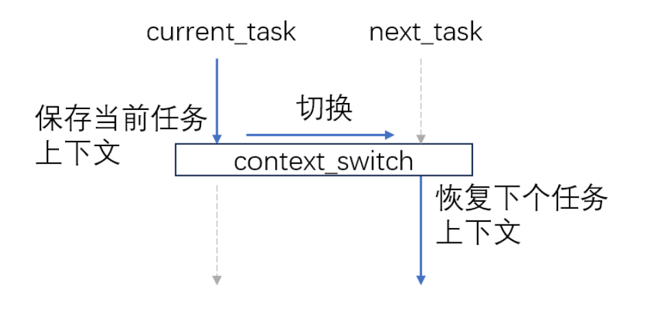

用户态的线程管理
=========================================

本节导读
-----------------------------------------

在本章的起始介绍中，给出了线程的基本定义，但没有具体的实现，这可能让同学在理解线程上还有些不够深入。其实实现多线程不一定需要操作系统的支持，完全可以在用户态实现。本节的主要目标是理解线程的基本要素、多线程应用的执行方式以及如何在用户态构建一个多线程的基本执行环境(即线程管理运行时， Thread Manager Runtime)。

在这里，我们首先分析了一个简单的用户态多线程应用的执行过程，然后设计支持这种简单多线程应用的执行环境，包括线程的总体结构、管理线程执行的线程控制块数据结构、以及对线程管理相关的重要函数：线程创建和线程切换。安排本节的原因在于：它能帮助我们直接理解线程最核心的设计思想与具体实现，并对后续在有进程支持的操作系统内核中进一步实现线程机制打下一个基础。

用户态多线程应用
------------------------------------------------

我们先看看一个简单的用户态多线程应用。

.. code-block:: rust
    :linenos:

    // 多线程基本执行环境的代码
    ...
    // 多线程应用的主体代码
    fn main() {
        let mut runtime = Runtime::new();
        runtime.init();
        runtime.spawn(|| {
            println!("TASK 1 STARTING");
            let id = 1;
            for i in 0..10 {
                println!("task: {} counter: {}", id, i);
                yield_task();
            }
            println!("TASK 1 FINISHED");
        });
        runtime.spawn(|| {
            println!("TASK 2 STARTING");
            let id = 2;
            for i in 0..15 {
                println!("task: {} counter: {}", id, i);
                yield_task();
            }
            println!("TASK 2 FINISHED");
        });
        runtime.run();
    }

可以看出，多线程应用的结构很简单，大致含义如下：

- 第 5~6 行 首先是多线程执行环境的创建和初始化，具体细节在后续小节会进一步展开讲解。
- 第 7~15 行 创建了第一个线程；第 16~24 行 创建了第二个线程。这两个线程都是用闭包的形式创建的。
- 第 25 行 开始执行这两个线程。

这里面需要注意的是第12行和第21行的 ``yield_task()`` 函数。这个函数与我们在第二章讲的 :ref:`sys_yield系统调用 <term-sys-yield>` 在功能上是一样的，即当前线程主动交出CPU并切换到其它线程执行。

假定同学在一个linux for RISC-V 64的开发环境中，我们可以执行上述的程序：

.. chyyuu 建立linux for RISC-V 64的开发环境的说明???

注：可参看指导，建立linux for RISC-V 64的开发环境

.. code-block:: console

    $ git clone -b rv64 https://github.com/chyyuu/example-greenthreads.git
    $ cd example-greenthreads
    $ cargo run
    ...
	TASK 1 STARTING
	task: 1 counter: 0
	TASK 2 STARTING
	task: 2 counter: 0
	task: 1 counter: 1
	task: 2 counter: 1
	...
	task: 1 counter: 9
	task: 2 counter: 9
	TASK 1 FINISHED
	...
	task: 2 counter: 14
	TASK 2 FINISHED

可以看到，在一个进程内的两个线程交替执行。这是如何实现的呢？

多线程的基本执行环境
------------------------------------------------

线程的运行需要一个执行环境，这个执行环境可以是操作系统内核，也可以是更简单的用户态的一个线程管理运行时库。如果是基于用户态的线程管理运行时库来实现对线程的支持，那我们需要对线程的管理、调度和执行方式进行一些限定。由于是在用户态进行线程的创建，调度切换等，这就意味着我们不需要操作系统提供进一步的支持，即操作系统不需要感知到这种线程的存在。如果一个线程A想要运行，它只有等到目前正在运行的线程B主动交出处理器的使用权，从而让线程管理运行时库有机会得到处理器的使用权，且线程管理运行时库通过调度，选择了线程A，再完成线程B和线程A的线程上下文切换后，线程A才能占用处理器并运行。这其实就是第三章讲到的 :ref:`任务切换的设计与实现 <term-task-switch-impl>` 和 :ref:`协作式调度 <term-coop-impl>` 的另外一种更简单的具体实现。

线程的结构与执行状态
^^^^^^^^^^^^^^^^^^^^^^^^^^^^^^^^^^^^^^^

为了实现用户态的协作式线程管理，我们首先需要考虑这样的线程大致的结构应该是什么？在上一节的 :ref:`线程的基本定义 <term-thread-define>` 中，已经给出了具体的答案：

- 线程ID
- 执行状态
- 当前指令指针(PC)
- 通用寄存器集合
- 栈

基于这个定义，就可以实现线程的结构了。把上述内容集中在一起管理，形成线程控制块：

.. code-block:: rust
    :linenos:

    //线程控制块
	struct Task {
	    id: usize,            // 线程ID
	    stack: Vec<u8>,       // 栈
	    ctx: TaskContext,     // 当前指令指针(PC)和通用寄存器集合
	    state: State,         // 执行状态
	}

	struct TaskContext {
	    // 15 u64
	    x1: u64,  //ra: return address，即当前正在执行线程的当前指令指针(PC)
	    x2: u64,  //sp
	    x8: u64,  //s0,fp
	    x9: u64,  //s1
	    x18: u64, //x18-27: s2-11
	    x19: u64,
	    ...
	    x27: u64,
	    nx1: u64, //new return address, 即下一个要执行线程的当前指令指针(PC)
	}

线程在执行过程中的状态与之前描述的进程执行状态类似，表明线程在执行过程中的动态执行特征：

.. code-block:: rust
    :linenos:

	enum State {
	    Available, // 初始态：线程空闲，可被分配一个任务去执行
	    Running,   // 运行态：线程正在执行
	    Ready,     // 就绪态：线程已准备好，可恢复执行
	}

下面的线程管理初始化过程中，会创建一个线程控制块向量，其中的每个线程控制块对应到一个已创建的线程（其状态为 `Running` 或 `Ready` ）或还没加入一个具体的线程（此时其状态为 `Available` ）。当创建线程并分配一个空闲的线程控制块给这个线程时，管理此线程的线程控制块的状态将转为 `Ready` 状态。当线程管理运行时调度切换此线程占用处理器执行时，会把此线程的线程控制块的状态设置为 `Running` 状态。

线程管理运行时初始化
^^^^^^^^^^^^^^^^^^^^^^^^^^^^^^^^^^^^^^^

线程管理运行时负责整个应用中的线程管理。当然，它也需要完成自身的初始化工作。这里主要包括两个函数：

-  `Runtime::new()` 主要有三个步骤：

  - 初始化应用主线程控制块（其TID为 `0` ），并设置其状态为 `Running` 状态；
  - 初始化 `tasks` 线程控制块向量，加入应用主线程控制块和空闲线程控制块，为后续的线程创建做好准备；
  - 包含 `tasks` 线程控制块向量和 `current` 当前线程id（初始值为0， 表示当前正在运行的线程是应用主线程），来建立 `Runtime` 变量；

-  `Runtime::init()` ，把线程管理运行时的 `Runtime` 自身的地址指针赋值给全局可变变量 `RUNTIME`

.. code-block:: rust
    :linenos:

	impl Task {
	    fn new(id: usize) -> Self {
	        Task {
	            id,
	            stack: vec![0_u8; DEFAULT_STACK_SIZE],
	            ctx: TaskContext::default(),
	            state: State::Available,
	        }
	    }
	}
	impl Runtime {
	    pub fn new() -> Self {
	        // This will be our base task, which will be initialized in the `running` state
	        let base_task = Task {
	            id: 0,
	            stack: vec![0_u8; DEFAULT_STACK_SIZE],
	            ctx: TaskContext::default(),
	            state: State::Running,
	        };

	        // We initialize the rest of our tasks.
	        let mut tasks = vec![base_task];
	        let mut available_tasks: Vec<Task> = (1..MAX_TASKS).map(|i| Task::new(i)).collect();
	        tasks.append(&mut available_tasks);

	        Runtime {
	            tasks,
	            current: 0,
	        }
	    }

	    pub fn init(&self) {
	        unsafe {
	            let r_ptr: *const Runtime = self;
	            RUNTIME = r_ptr as usize;
	        }
	    }
	}    
	...
	fn main() {
	    let mut runtime = Runtime::new();
	    runtime.init();
	    ...
	}    

这样，在应用的 `main()` 函数中，首先会依次调用上述两个函数。这样线程管理运行时会附在TID为 `0` 的应用主线程上，处于运行正在运行的 `Running` 状态。而且，线程管理运行时也建立好了空闲线程控制块向量。后续创建线程时，会从此空闲线程控制块向量中找到一个空闲线程控制块，来绑定要创建的线程，并进行后续的管理。

线程创建
^^^^^^^^^^^^^^^^^^^^^^^^^^^^^^^^^^^^^^^

当应用要创建一个线程时，会调用 `runtime.spawn` 函数。这个函数主要完成的功能是：

- 第4~12行，在线程向量中查找一个状态为 `Available` 的空闲线程控制块；
- 第14~20行，初始化该空闲线程的线程控制块；

  - `x1` 寄存器：老的返回地址 -- `guard` 函数地址
  - `nx1` 寄存器：新的返回地址 -- 输入参数 `f` 函数地址
  - `x2` 寄存器：新的栈地址 --  available.stack+size

.. code-block:: rust
    :linenos:

	impl Runtime {
	    pub fn spawn(&mut self, f: fn()) {
	        let available = self
	            .tasks
	            .iter_mut()
	            .find(|t| t.state == State::Available)
	            .expect("no available task.");

	        let size = available.stack.len();
	        unsafe {
	            let s_ptr = available.stack.as_mut_ptr().offset(size as isize);
	            let s_ptr = (s_ptr as usize & !7) as *mut u8;

	            available.ctx.x1 = guard as u64;  //ctx.x1  is old return address
	            available.ctx.nx1 = f as u64;     //ctx.nx1 is new return address
	            available.ctx.x2 = s_ptr.offset(32) as u64; //cxt.x2 is sp

	        }
	        available.state = State::Ready;
	    }
	}
	...
	fn guard() {
	    unsafe {
	        let rt_ptr = RUNTIME as *mut Runtime;
	        (*rt_ptr).t_return();
	    };
	}
	...
	fn main() {
        ...
	    runtime.spawn(|| {
	        println!("TASK 1 STARTING");
	        let id = 1;
	        for i in 0..10 {
	            println!("task: {} counter: {}", id, i);
	            yield_task();
	        }
	        println!("TASK 1 FINISHED");
	    });
	    ...
	}   

线程切换
^^^^^^^^^^^^^^^^^^^^^^^^^^^^^^^^^^^^^^^

当应用要切换线程时，会调用 `yield_task` 函数，通过 `runtime.t_yield` 函数来完成具体的切换过程。`runtime.t_yield` 这个函数主要完成的功能是：

- 第4~12行，在线程向量中查找一个状态为 `Ready` 的线程控制块；
- 第14~20行， 把当前运行的线程的状态改为 `Ready` ，把新就绪线程的状态改为 `Running` ，把 `runtime` 的 `current` 设置为这个新线程控制块的id；
- 第23行，调用汇编代码写的函数 `switch` ，完成两个线程的栈和上下文的切换；

.. code-block:: rust
    :linenos:

	impl Runtime {
	    fn t_yield(&mut self) -> bool {
	        let mut pos = self.current;
	        while self.tasks[pos].state != State::Ready {
	            pos += 1;
	            if pos == self.tasks.len() {
	                pos = 0;
	            }
	            if pos == self.current {
	                return false;
	            }
	        }

	        if self.tasks[self.current].state != State::Available {
	            self.tasks[self.current].state = State::Ready;
	        }

	        self.tasks[pos].state = State::Running;
	        let old_pos = self.current;
	        self.current = pos;

	        unsafe {
	            switch(&mut self.tasks[old_pos].ctx, &self.tasks[pos].ctx);
	        }
	        self.tasks.len() > 0
	    }
	}

	pub fn yield_task() {
	    unsafe {
	        let rt_ptr = RUNTIME as *mut Runtime;
	        (*rt_ptr).t_yield();
	    };
	}

这里还需分析一下汇编函数 `switch` 的具体实现细节，才能完全掌握线程切换的完整过程。注意到切换线程控制块的函数 `t_yield` 已经完成了当前运行线程的 `state` ， `id` 这两个部分，还缺少：当前指令指针(PC)、通用寄存器集合和栈。所以 `switch` 主要完成的就是完成这剩下的三部分的切换。

- 第7，14，16，23行，完成当前指令指针(PC)的切换；
- 第8，17行，完成栈指针的切换；
- 第9-13，18-22行，完成通用寄存器集合的切换；

.. code-block:: rust
    :linenos:

	#[naked]
	#[inline(never)]
	unsafe fn switch(old: *mut TaskContext, new: *const TaskContext) {
	    // a0: old, a1: new
	    llvm_asm!("
	        //if comment below lines: sd x1..., ld x1..., TASK2 can not finish, and will segment fault
	        sd x1, 0x00(a0)
	        sd x2, 0x08(a0)
	        sd x8, 0x10(a0)
	        sd x9, 0x18(a0)
	        sd x18, 0x20(a0) # sd x18..x27
	        ...
	        sd x27, 0x68(a0)
	        sd x1, 0x70(a0)

	        ld x1, 0x00(a1)
	        ld x2, 0x08(a1)
	        ld x8, 0x10(a1)
	        ld x9, 0x18(a1)
	        ld x18, 0x20(a1) #ld x18..x27
	        ...
	        ld x27, 0x68(a1)
	        ld t0, 0x70(a1)

	        jr t0
	    "
	    :    :    :    : "volatile", "alignstack"
	    );
	}

这里需要注意两个细节。第一个是寄存器集合的保存数量。在保存通用寄存器集合时，并没有保存所有的通用寄存器，其原因是根据RISC-V的函数调用约定，有一部分寄存器是由调用函数 `Caller` 来保存的，所以就不需要被调用函数 `switch` 来保存了。第二个是当前指令指针(PC)的切换。在具体切换过程中，是基于函数返回地址来进行切换的。即首先把 `switch` 的函数返回地址 `ra` (即 `x1` )寄存器保存在 `TaskContext` 中，在此函数的倒数第二步，恢复切换后要执行线程的函数返回地址，即 `ra` 寄存器到 `t0` 寄存器，然后调用 `jr t0` 即完成了函数的返回。 

开始执行
^^^^^^^^^^^^^^^^^^^^^^^^^^^^^^^^^^^^^^^	

有了上述线程管理运行时的各种功能支持，就可以开始线程的正常执行了。假设完成了线程管理运行时初始化，并创建了几个线程。当执行 `runtime.run()`  函数，通过 `t_yield` 函数时，将切换线程管理运行时所在的应用主线程到另外一个处于 `Ready` 状态的线程，让那个线程开始执行。当所有的线程都执行完毕后，会回到  `runtime.run()`  函数，通过 `std::process::exit(0)` 来退出该应用进程，整个应用的运行就结束了。

.. code-block:: rust
    :linenos:

	impl Runtime {
	   pub fn run(&mut self) -> ! {
	        while self.t_yield() {}
	        std::process::exit(0);
	    }
	}
	...
	fn main() {
        ...
		runtime.run();
	}   

注：本节的内容参考了Carl Fredrik Samson设计实现的 "Green Threads Example" [#explain_green_thread]_ [#code_green_thread]_ ，并把代码移植到了Linux for RISC-V64上。

.. [#explain_green_thread] https://cfsamson.gitbook.io/green-threads-explained-in-200-lines-of-rust/ 

.. [#code_green_thread] https://github.com/cfsamson/example-greenthreads