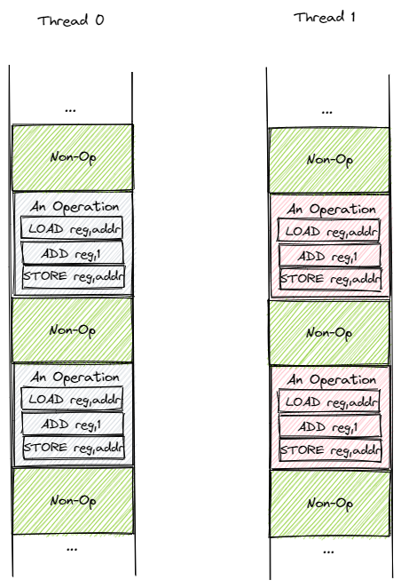
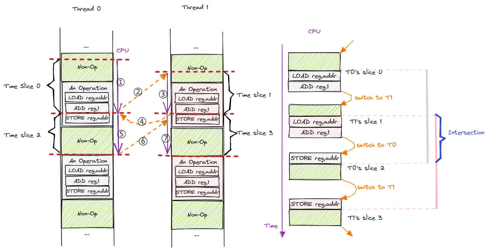
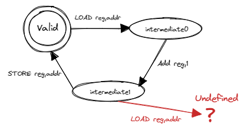

互斥锁
===============================================

本节导读
-----------------------------------------------

引子：多线程计数器
-----------------------------------------------

我们知道，同进程下的线程共享进程的地址空间，因此它们均可以读写程序内的全局/静态数据。通过这种方式，线程可以非常方便的相互协作完成一项任务。下面是一个简单的例子，同学可以在 Linux/Windows 等系统上运行这段代码：

.. code-block:: rust
    :linenos:

    // adder.rs

    static mut A: usize = 0;
    const THREAD_COUNT: usize = 4;
    const PER_THREAD: usize = 10000;
    fn main() {
        let mut v = Vec::new();
        for _ in 0..THREAD_COUNT {
            v.push(std::thread::spawn(|| {
                unsafe {
                    for _ in 0..PER_THREAD {
                        A = A + 1;
                    }
                }
            }));
        }
        for handle in v {
            handle.join().unwrap();
        }
        println!("{}", unsafe { A });
    }

前一节中我们已经熟悉了多线程应用的编程方法。因此我们很容易看出这个程序开了 ``THREAD_COUNT`` 个线程，每个线程都将一个全局变量 ``A`` 加 1 ，次数为 ``PER_THREAD`` 次。从中可以看出多线程协作确实比较方便，因为我们只需将单线程上的代码（即第 11~13 行的主循环）提交给多个线程就从单线程得到了多线程版本。然而，这样确实能够达到我们预期的效果吗？

全局变量 ``A`` 的初始值为 ``0`` ，而 ``THREAD_COUNT`` 个线程每个将其加 1 重复 ``PER_THREAD`` 次，因此当所有的线程均完成任务之后，我们预期 ``A`` 的值应该是二者的乘积即 40000 。让我们尝试运行一下这个程序，可以看到类似下面的结果：

.. code-block:: console

    $ rustc adder.rs
    $ ./adder
    40000
    $ ./adder
    17444
    $ ./adder
    36364
    $ ./adder
    39552
    $ ./adder
    21397

可以看到只有其中一次的结果是正确的，其他的情况下结果都比较小且各不相同，这是为什么呢？我们可以尝试分析一下哪些因素会影响到代码的执行结果，使得结果与我们的预期不同。

1. 编译器在将源代码编译为汇编代码或者机器码的时候会进行一些优化。
2. 操作系统在执行程序的时候会进行调度。
3. CPU 在执行指令的时候会进行一些调度或优化。

那么按照顺序首先来检查第一步，即编译器生成的汇编代码是否正确。可以用如下命令反汇编可执行文件 ``adder`` 生成汇编代码 ``adder.asm`` ：

.. code-block:: console

    $ rustup component add llvm-tools-preview
    $ rust-objdump -D adder > adder.asm

在 ``adder.asm`` 中找到传给每个线程的闭包函数（这部分是我们自己写的，更容易出错）的汇编代码：

.. code-block::
    :linenos:

    # adder.asm
    000000000000bce0 <_ZN5adder4main28_$u7b$$u7b$closure$u7d$$u7d$17hfcc06370a766a1c4E>:
        bce0: subq    $56, %rsp
        bce4: movq    $0, 8(%rsp)
        bced: movq    $10000, 16(%rsp)        # imm = 0x2710
        bcf6: movq    8(%rsp), %rdi
        bcfb: movq    16(%rsp), %rsi
        bd00: callq   0xb570 <_ZN63_$LT$I$u20$as$u20$core..iter..traits..collect..IntoIterator$GT$9into_iter17h0e9595229a318c79E>
        bd05: movq    %rax, 24(%rsp)
        bd0a: movq    %rdx, 32(%rsp)
        bd0f: leaq    24(%rsp), %rdi
        bd14: callq   0xb560 <_ZN4core4iter5range101_$LT$impl$u20$core..iter..traits..iterator..Iterator$u20$for$u20$core..ops..range..Range$LT$A$GT$$GT$4next17h703752eeba5b7a01E>
        bd19: movq    %rdx, 48(%rsp)
        bd1e: movq    %rax, 40(%rsp)
        bd23: cmpq    $0, 40(%rsp)
        bd29: jne     0xbd30 <_ZN5adder4main28_$u7b$$u7b$closure$u7d$$u7d$17hfcc06370a766a1c4E+0x50>
        bd2b: addq    $56, %rsp
        bd2f: retq
        bd30: movq    328457(%rip), %rax      # 0x5c040 <_ZN5adder1A17hce2f3c024bd1f707E>
        bd37: addq    $1, %rax
        bd3b: movq    %rax, (%rsp)
        bd3f: setb    %al
        bd42: testb   $1, %al
        bd44: jne     0xbd53 <_ZN5adder4main28_$u7b$$u7b$closure$u7d$$u7d$17hfcc06370a766a1c4E+0x73>
        bd46: movq    (%rsp), %rax
        bd4a: movq    %rax, 328431(%rip)      # 0x5c040 <_ZN5adder1A17hce2f3c024bd1f707E>
        bd51: jmp     0xbd0f <_ZN5adder4main28_$u7b$$u7b$closure$u7d$$u7d$17hfcc06370a766a1c4E+0x2f>
        bd53: leaq    242854(%rip), %rdi      # 0x47200 <str.0>
        bd5a: leaq    315511(%rip), %rdx      # 0x58dd8 <writev@GLIBC_2.2.5+0x58dd8>
        bd61: leaq    -15080(%rip), %rax      # 0x8280 <_ZN4core9panicking5panic17h73f802489c27713bE>
        bd68: movl    $28, %esi
        bd6d: callq   *%rax
        bd6f: ud2
        bd71: nopw    %cs:(%rax,%rax)
        bd7b: nopl    (%rax,%rax)

虽然函数名经过了一些混淆，还是能看出这是程序 ``adder`` 的 ``main`` 函数中的一个闭包（Closure）。我们现在基于 x86_64 而不是 RISC-V 架构，因此会有一些不同：

- 指令的目标寄存器后置而不是像 RISC-V 一样放在最前面；
- 使用 ``%rax,%rdx,%rsi,%rdi`` 作为 64 位通用寄存器，观察代码可以发现 ``%rsi`` 和 ``%rdi`` 用来传参， ``%rax`` 和 ``%rdx`` 用来保存返回值；
- ``%rsp`` 是 64 位栈指针，功能与 RISC-V 中的 ``sp`` 相同；
- ``%rip`` 是 64 位指令指针，指向当前指令的下一条指令的地址，等同于我们之前介绍的 PC 寄存器。
- ``callq`` 为函数调用， ``retq`` 则为函数返回。

在了解了这些知识之后，我们可以尝试读一读代码：

- 第 3 行是在分配栈帧；
- 第 4~8 行准备参数，并调用标准库实现的 ``IntoIterator`` trait 的 ``into_iter`` 方法将 Range 0..10000 转化为一个迭代器；
- 第 9 行的 ``24(%rsp)`` 应该保存的是生成的迭代器的地址；
- 第 11 行开始进入主循环。第 11 行加载 ``24(%rsp)`` 到 ``%rdi`` 作为参数并在第 12 行调用 ``Iterator::next`` 函数，返回值在 ``%rdx`` 和 ``%rax`` 中并被保存在栈上。我们知道 ``Iterator::next`` 返回的是一个 ``Option<T>`` 。观察第 15-16 行，当 ``%rax`` 里面的值不为 0 的时候就跳转到 0xbd30 ，否则就向下执行到第 17-18 行回收栈帧并退出。这意味着 ``%rax`` 如果为 0 的话说明返回的是 ``None`` ，这时迭代器已经用尽，就可以退出函数了。于是，主循环的次数为 10000 次就定下来了。
- 0xbd30 （第 19 行）开始才真正进入 ``A=A+1`` 的部分。第 19 行从虚拟地址 0x5c040（这就是全局变量 ``A`` 的地址）加载一个 usize 到寄存器 ``%rax`` 中；第 20 行将 ``%rax`` 加一；第 26 行将寄存器 ``%rax`` 的值写回到虚拟地址 0x5c040 中。也就是说 ``A=A+1`` 是通过这三条指令达成。第 27 行无条件跳转到 0xbd0f 也就是第 11 行，进入下一轮循环。

.. note::

    **Rust Tips: Rust 的无符号溢出是不可恢复错误**

    有兴趣的同学可以读一读第 21~24 行代码，它可以判断在将 ``%rax`` 加一的时候是否出现溢出（注意其中复用了 ``%rax`` ，因此有一次额外的保存/恢复）。如果出现溢出的话则会跳转到 0xbd53（第 28 行）直接 panic 。

    从中我们可以看出，相比 C/C++ 来说 Rust 的确会生成更多的代码来针对算术溢出、数组越界的情况进行判断，但是这并不意味着在现代 CPU 上就会有很大的性能损失。如果可以确保不会出现溢出的情况，可以考虑使用 unsafe 的 ``usize::unchecked_add`` 来避免生成相关的判断代码并提高性能。

我们可以得出结论：编译器生成的汇编代码是符合我们的预期的。那么接下来进行第二步，操作系统的调度是否会影响结果的正确性呢？在具体分析之前，我们先对汇编代码进行简化，只保留直接与结果相关的部分。那么，可以看成每个线程进行 ``PER_THREAD`` 次操作，每次操作按顺序进行下面三个步骤：

1. 使用访存指令，从全局变量 ``A`` 的地址 addr 加载 ``A`` 当前的值到寄存器 reg；
2. 使用算术指令将寄存器 reg 的值加一；
3. 使用访存指令，将 reg 的值写回到全局变量 ``A`` 的地址 addr，至此 ``A`` 的值成功加一。

这是一个可以认为与具体指令集架构无关的过程。因为对于传统的计算机架构而言，在 ALU 上进行的算术指令需要以寄存器为载体，而不能直接在 RAM 上进行操作。在此基础上，我们可以建立简化版的线程执行模型，如下图所示：

.. _term-interleave:

目前有两个线程 T0 和 T1 ，二者都是从上到下顺序执行。我们将 ``A=A+1`` 的操作打包成包含三条指令的一个块，剩下的绿色区域则表示与操作无关的那些指令。每个线程都会有一种幻觉就是它能够从头到尾独占 CPU 执行，但实际上操作系统会通过抢占式调度划分时间片使它们 **交错** (Interleave) 运行。注意时钟中断可能在执行任意一条指令之后触发，因此时间片之间的边界可能是任意一条指令。下图是一种可能的时间片划分方式：

我们暂时只考虑单 CPU 的简单情况。按照时间顺序，CPU 依次执行 T0 的时间片 0、T1 的时间片 1、T0 的时间片 2 和 T1 的时间片 3，在相邻两个时间片之间会进行一次线程切换。注意到在这种划分方式中，两个线程各有一个操作块被划分到多个时间片完成。图片的右侧展示了 CPU 视角的指令执行过程，我们仅关注操作块中的指令，并尝试模拟一下：

.. list-table:: 
    :widths: 40 30 50 50
    :header-rows: 1

    * - 动作
      - 所属线程
      - 寄存器 reg 的值（动作后）
      - addr 处的值（动作后）
    * - 切换到 T0
      - T0
      - -
      - v
    * - LOAD reg, addr
      - T0
      - v
      - v
    * - ADD reg, 1
      - T0
      - v+1
      - v
    * - T0 切换到 T1
      - T1
      - -
      - v
    * - LOAD reg, addr
      - T1
      - v
      - v
    * - ADD reg, 1
      - T1
      - v+1
      - v
    * - T1 切换到 T0
      - T0
      - v+1
      - v
    * - STORE reg, addr
      - T0
      - v+1
      - v+1
    * - T0 切换到 T1
      - T1
      - v+1
      - v+1
    * - STORE reg, addr
      - T1
      - v+1
      - v+1
    * - T1 切换出去
      - -
      - -
      - v+1

假设开始之前全局变量 ``A`` 的值为 v ，而在这来自两个线程的四个时间片中包含了完整的两个 ``A=A+1`` 的操作块，那么结束之后 ``A`` 的值应该变成 v+2 。然而我们模拟下来的结果却是 v+1 ，这是为什么呢？首先需要说明的是，尽管两个线程都使用寄存器 reg 中转，但是它们之间并不会产生冲突，因为在线程切换的时候会对线程上下文进行保存与恢复，其中也包括寄存器 reg 。因此我们可以认为两个线程均有一份自己独占的寄存器。言归正传，我们从结果入手进行分析， ``A`` 最终的值来源于我们在这段时间对它进行的最后一次写入，这次写入由 T1 进行，但是为什么 T1 会写入 v+1 而不是 v+2 呢？从 T1 的视角来看，首先要读取 ``A`` 的值到 reg ，发现是 v ，这一点就很奇怪，好像此前 T0 什么都没做一样。而后 T1 将 reg 的值加一变成 v+1 ，于是最后写入的也是这个值。所以，问题的关键在于 T0 将自己的 reg 更新为 v+1 之后，还没来得及写回到 ``A`` ，就被操作系统切换到 T1 ，因此 T1 会看到 v 而不是 v+1 。等再切换回 T0 将 v+1 写入到 ``A`` 的时候已经为时已晚，因为已经过了关键的 T1 读取 ``A`` 的时间点了，于是这次写入无法对 T1 产生任何影响，也无法影响到最终的结果了。因此，在这种情况下，由于操作系统的抢占式调度，可以看到 T0 的 ``A=A+1`` 操作完全在做无用功，于是最终结果比期望少 1 。

.. _term-indeterminate:
.. _term-race-condition:

从上个例子可以看出，操作系统的调度有可能使得两个线程上的操作块 **交错** 出现，也就是说两个操作块从开始到结束的时间区间存在交集。一旦出现这种情况，便会导致结果出现偏差。最终的结果取决于这种交错的情况出现多少次，如果完全没有出现则结果正确；否则出现次数越多，结果偏差越大。这就能够解释为什么我们每次运行 ``adder.rs`` 会得到不同的结果。这种运行结果 **不确定** (Indeterminate)，且取决于像是操作系统的调度顺序这种无法控制的外部事件的情况被称为 **竞态条件** (Race Condition) 。在 ``adder.rs`` 中，竞态条件导致了我们预料之外的结果，因此它应当被认为是一个 bug 。

我们尝试更加形象的说明为什么操作块交错出现就会有问题。在写程序的时候，我们需要做的是通过软件控制一些资源，这些资源可能是软件资源或者硬件资源。软件资源可能包括保存在内存中的一些数据结构，硬件资源可能是内存的一部分或者某些 I/O 设备。在资源被初始化之后，资源处于一种合法（Valid）状态，这里的合法状态是指资源符合一些特定的约束条件从而具有该种资源所应该具有的特征。以我们耳熟能详的链表数据结构为例，一个合法的链表应该满足每个节点的 next 指针均为空指针或者指向合法的内存区域。同时，next 指针不能形成环。当然，实际上还有更多的约束条件，我们使用自然语言很难完全表述它们。总之，只有满足所有的约束条件，我们才说这是一个合法的链表。

.. _term-intermediate-state:

每种资源可能都有多种不同的控制方式，每种控制方式称为对这种资源的一种操作。比如说，如果将链表看成一种资源，那么链表的插入和删除就是两种对链表的操作。每一种操作仅在资源处于合法状态时才能进行，且在操作完成之后保证资源仍旧处于合法状态。设想我们要实现链表的插入操作，这必须在待操作的数据结构是一个合法的链表这一前提下才能进行，不然我们的操作将完全没有意义。我们还需要保证插入之后链表依然合法，才称得上是正确的实现。但是资源并非任意时刻均处于合法状态。因为一般来说操作都比较复杂，会分成多个阶段多条指令完成。通常，处于合法状态的资源在操作时会变成不合法的 **中间状态** (Intermediate State)，待操作结束之后再重回合法状态。以我们的多线程计数器 ``adder.rs`` 为例，状态转移过程如下：

.. 接下来这一段的主旨大概是说，其他线程不能从中间状态开始操作。

这里我们将全局变量 ``A`` 视为一种资源，操作 ``A=A+1`` 为一个三阶段操作。我们可以用有限状态自动机来描述资源 ``A`` 和操作 ``A=A+1`` ：状态机中一共有 3 种状态，一个合法状态和两个不合法的中间状态 0 和 1。对于每次操作，第一条指令 ``A`` 从合法状态转移到中间状态 0；第二条指令 ``A`` 从中间状态 0 转移到中间状态 1；第三条指令 ``A`` 从中间状态 1 转移回合法状态。将操作块交错的情况代入到状态机中，最开始切换到 T0 之前 ``A`` 处于合法状态，接下来切换到 T0 执行了第一、二条指令之后 ``A`` 转移到中间状态 1，而此时操作系统切换到 T1 ， T1 又开始执行第一条指令。问题来了：我们发现中间状态 1 并没有定义此时再执行第一条指令应该如何转移。如果去执行的话，就会产生未定义行为并可能永远无法使 ``A`` 回到合法状态。不过，由于 ``adder.rs`` 中 ``A`` 只是一个整数，我们会发现 ``A`` 仍能回到合法状态，只是结果不对。如果换成一种复杂的数据结构，就会产生极其微妙且难以调试的结果。

我们可以发现多线程对共享资源的访问天然需求某种互斥性：当一个线程在对共享资源进行操作的时候，共享资源处在不合法的中间状态，如果此时其他线程开始操作会产生未定义行为。只有当操作完成，共享资源重新回到合法状态之后，之前操作的线程或者其他线程才能开始下一次操作。只有满足这种互斥性，才能保证多线程对共享资源的访问符合我们的预期。下面，我们换用操作系统中的术语进行表述：

.. _term-shared-resources:
.. _term-critical-section:
.. _term-mutual-exclusion:

**共享资源** (Shared Resources) 是指多个线程均能够访问的资源。线程对于共享资源进行操作的那部分代码被称为 **临界区** (Critical Section)。在多线程并发访问某种共享资源的时候，为了正确性，必须要满足 **互斥** (Mutual Exclusion) 访问要求，即同一时间最多只能有一个线程在这种共享资源的临界区之内。这样才能保证当一个线程开始操作时，共享资源总是处于合法状态，这保证了操作是有意义的。如果能够做到互斥访问的话，我们 ``adder.rs`` 出现 bug 的根源————即对于 ``A`` 的操作可能交错出现的情况便能够被避免。

.. _term-mutex:
.. _term-lock:

从 ``adder.rs`` 中可以看出，如果任由操作系统进行时间片切分和线程调度而不加任何特殊处理，是很难满足互斥访问要求的。那么应该如何实现互斥访问呢？接下来，我们将会尝试构建一组称之为 **互斥锁** (Mutex，源于 **Mut** ual **Ex** clusion，简称为 **锁** Lock) 的通用互斥原语来对临界区进行保护，从而在一般意义上保证互斥访问要求。这将是本节接下来的主要内容。

.. _term-atomic-instruction:

如果仅仅考虑 ``adder.rs`` 的话，其实不借助锁机制也能够解决问题。这是因为其中的共享资源为一个 64 位无符号整型，是一个十分简单的类型。对于这种原生类型，现代指令集架构额外提供一组 **原子指令** (Atomic Instruction) ，在某些架构上只需一条原子指令就能完成包括访存、算术运算在内的一系列功能。这就是说 ``adder.rs`` 中的 ``A=A+1`` 操作其实只需一条原子指令就能完成。如果这样做的话，我们相当于 **将临界区缩小为一条原子指令** ，这已经是处理器执行指令和时间片切分的最小单位，因此我们不使用任何保护手段也能满足互斥要求。修改之后的代码如下：

.. code-block:: rust
    :linenos:

    // adder.rs

    use std::sync::atomic::{AtomicUsize, Ordering};
    static A: AtomicUsize = AtomicUsize::new(0);
    const THREAD_COUNT: usize = 4;
    const PER_THREAD: usize = 10000;
    fn main() {
        let mut v = Vec::new();
        for _ in 0..THREAD_COUNT {
            v.push(std::thread::spawn(|| {
                for _ in 0..PER_THREAD {
                    A.fetch_add(1, Ordering::Relaxed);
                }
            }));
        }
        for handle in v {
            handle.join().unwrap();
        }
        println!("{}", A.load(Ordering::Relaxed));
    }

.. _term-atomicity:

Rust 核心库在 ``core::sync::atomic`` 中提供了很多原子类型，比如我们这里可以使用 ``usize`` 对应的原子类型 ``AtomicUsize`` ，它支持很多原子操作。比如，第 12 行 ``fetch_add`` 的功能是将 ``A`` 的值加一并返回 ``A`` 之前的值，这其中涉及到读取内存、算术运算和写回内存，但是却只需要这一个操作就能同时完成。这种原子操作基于硬件提供的原子指令，硬件可以保证其 **原子性** (Atomicity)，含义是该操作的一系列功能要么全部完成，要么都不完成，而不会出现有些完成有些未完成的情况。原子性中的“原子”是为了强调操作中的各种功能作为一个整体不可分割的属性。这种由硬件提供的 **原子指令是整个计算机系统中最根本的原子性和互斥性的来源** 。无论软件执行了哪些指令，也无论 CPU 执行指令的时候出现了哪些中断/异常，又或者多个 CPU 同时访问内存中同一个位置这种情形，都不能破坏原子指令的原子性。

可惜的是，原子指令虽然强大，其应用范围却比较有限，通常它只能用来保护 **单内存位置** 上的简单操作，比如 ``A=A+1`` 这种操作。当资源是比较复杂的数据结构的时候它就无能为力了。当然，我们也不会指望硬件提供一条“原子地完成红黑树插入/删除”这种指令，毕竟这样的数据结构有无数种，硬件总不可能对每种可能的数据结构和每种可能的操作都提供一条指令，这样的硬件是不存在的。即使如此我们也没有必要担心，只要我们能够灵活使用原子指令来根据实际需求限制多线程对共享资源的并发访问，比如基于原子指令实现通用的锁机制来保证互斥访问，所有的并发访问问题就一定能够迎刃而解。

需要注意的是， ``adder.rs`` 的错误结果是多种因素共同导致的，这里我们深入分析的操作系统调度带来的影响只不过是其中之一，其实 CPU 的指令执行也会有影响，这个我们会在后面再详细介绍。

.. note::

    **原子性**

    原子性最早来源于数据库领域，...

.. note::

    **Rust Tips: static mut 和 unsafe 的消失**

    TODO:

.. 好像缺一点只读-修改操作的区别。回顾数据竞争的定义：有线程在写，同时有其他线程读或写。

锁的简介
----------------------------------------------------

锁机制的形态与功能
~~~~~~~~~~~~~~~~~~~~~~~~~~~~~~~~~~~~~~~~~~~~~~~~~~~~

我们提到为了保证多线程能够正确并发访问共享资源，可以使用一种叫做 **锁** 的通用机制来对线程操作共享资源的 **临界区** 进行保护。这里的锁和现实生活中的含义很接近。回想一下我们如何使用常见于理发店或者游泳馆更衣室的公共储物柜：首先需要找到一个没有上锁的柜子并将物品存放进去。接着我们锁上柜子并拔出插在锁孔上的钥匙妥善保管。最后，当我们想取出物品时，我们使用钥匙打开存放物品的柜子并将钥匙留在锁孔上以便他人使用。至此，完整的使用流程结束。

那么，如何使用类似的思路用锁机制保护临界区呢？锁是附加在一种共享资源上的一种标记，最简单的情况下它只需有两种状态：上锁和空闲。上锁状态表示此时已经有某个线程在该种共享资源的临界区中，故而为了正确性其他线程不能进入临界区。相反的，空闲状态则表示线程可以进入临界区。显然，线程成功进入临界区之后锁也需要从空闲转为上锁状态。锁的两个基本操作是 **上锁** 和 **解锁** ，在线程进入临界区之前和退出临界区之后分别需要成功上锁和解锁。通过这种方式，我们就可以保证临界区的互斥性。在引入锁机制之后，线程访问共享资源的流程如下：

- 第一步上锁：线程进入临界区之前检查共享资源是否已经上锁。如果已经上锁的话，则需要 **等待** 持有钥匙的线程归还钥匙并解锁。接下来，线程尝试“抢”到钥匙，如果成功的话，线程将资源上锁，此时我们说该线程 **获取到了锁** （或者说 **持有锁或拿到了锁** ）。最后线程拿走钥匙并进入临界区。此时资源进入上锁状态，其他线程不能进入临界区。
- 第二步在临界区内访问共享资源。只有持有共享资源锁的线程能够进入临界区，这就能够保证临界区的互斥性。
- 第三步解锁：线程离开临界区之后将资源解锁并归还钥匙，我们说线程 **释放了锁** 。此时资源回到空闲状态。

锁的使用方法
~~~~~~~~~~~~~~~~~~~~~~~~~~~~~~~~~~~~~~~~~~~~~~~~~~~~

Rust 在标准库中提供了互斥锁 ``std::sync::Mutex<T>`` ，它可以包裹一个类型为 ``T`` 的共享资源为它提供互斥访问。线程可以调用 ``Mutex<T>::lock`` 来获取锁，注意线程不一定立即就能拿到锁，所以它会等待持有锁的线程释放锁且自身抢到锁之后才会返回。其返回值为 ``std::sync::MutexGuard<T>`` （篇幅所限省略掉外层的 ``Result`` ），可以理解为前面描述中的一把钥匙，拿到它的线程也就拿到了锁，于是有资格独占共享资源并进入临界区。 ``MutexGuard<T>`` 提供内部可变性，可以看做可变引用 ``&mut T`` ，用来修改共享资源。它的另一种功能是用来开锁，它也是 RAII 风格的，在它被 drop 之后会将锁自动释放。

让我们看看如何使用 ``Mutex<T>`` 来更正 ``adder.rs`` ：

.. code-block:: rust
    :linenos:

    // adder.rs

    use std::sync::Mutex;
    const THREAD_COUNT: usize = 4;
    const PER_THREAD: usize = 10000;
    static A: Mutex<usize> = Mutex::new(0);
    fn main() {
        let mut v = Vec::new();
        for _ in 0..THREAD_COUNT {
            v.push(std::thread::spawn(|| {
                for _ in 0..PER_THREAD {
                    let mut a_guard = A.lock().unwrap();
                    *a_guard = *a_guard + 1;
                }
            }));
        }
        for handle in v {
            handle.join().unwrap();
        }
        println!("{}", *A.lock().unwrap());
    }

第 6 行我们将共享资源用 ``A`` 使用 ``Mutex<T>`` 包裹。第 12~14 行构成一次完整的受锁保护的临界区访问：第 12 行获取锁；第 13 行是临界区；第 14 行循环的一次迭代结束，第 12 行的 ``MutexGuard<T>`` 退出作用域，于是它被 drop 之后自动解锁。

在上面的做法中，锁以及被锁保护的共享资源被整合到一个数据结构中，这也是最为常见的做法。但在某些情况下，它们之间可以相互分离，参考下面的代码：

.. code-block:: rust
    :linenos:

    // adder.rs

    use std::sync::Mutex;
    static mut A: usize = 0;
    static LOCK: Mutex<bool> = Mutex::new(true);
    const THREAD_COUNT: usize = 4;
    const PER_THREAD: usize = 10000;
    fn main() {
        let mut v = Vec::new();
        for _ in 0..THREAD_COUNT {
            v.push(std::thread::spawn(|| {
                for _ in 0..PER_THREAD {
                    let _lock = LOCK.lock();
                    unsafe { A = A + 1; }
                }
            }));
        }
        for handle in v {
            handle.join().unwrap();
        }
        println!("{}", unsafe { A });
    }

其中锁 ``LOCK`` 用来保护共享资源 ``A`` 。此处， ``LOCK`` 有用的仅有那个描述锁状态（可能是上锁或空闲）的标记，它内部包裹的值反而无关紧要，其类型 ``T`` 可以随意选择。可以看到在这种实现中，锁 ``LOCK`` 和共享资源 ``A`` 是分离开的，这样实现更加灵活，但是更容易由于编码错误而出现 bug 。

评价锁实现的指标
~~~~~~~~~~~~~~~~~~~~~~~~~~~~~~~~~~~~~~~~~~~~~~~~~~~~~~~~~~~

锁机制有多种不同的实现。对于一种实现而言，我们常常用以下的指标来从多个维度评估这种实现是否能够正确、高效地达成锁这种互斥原语应有的功能：

.. _term-progress:
.. _term-bounded-waiting:
.. _term-fairness:
.. _term-starvation:

- 忙则等待：意思是当一个线程持有了共享资源的锁，此时资源处于繁忙状态，这个时候其他线程必须等待拿着锁的线程将锁释放后才有进入临界区的机会。这其实就是互斥访问的另一种说法。这种互斥性是锁实现中最重要的也是必须做到的目标，不然共享资源访问的正确性会受到影响。
- **空闲则入** (Progress)：当资源处于空闲状态的时候，任何线程可以进入临界区。在某些实现中可能无法做到这一点，导致多线程的总体效率受到影响。
- **有界等待** (Bounded Waiting)：当线程获取锁失败的时候首先需要等待锁被释放，但这并不意味着此后它能够立即抢到被释放的锁，因此此时可能还有其他的线程也处于等待状态。于是它可能需要等待一轮、二轮、多轮才能拿到锁，甚至在极端情况下永远拿不到锁。 **有界等待** 要求每个线程在等待有限长时间后最终总能够拿到锁。相对的，线程可能永远无法拿到锁的情况被称之为 **饥饿** (Starvation) 。这体现了锁实现分配共享资源给线程的 **公平性** (Fairness) 。
- 让权等待：线程如何进行等待实际上也大有学问。这里所说的让权等待是指需要等待线程暂时主动或被动交出 CPU 使用权来让 CPU 做一些有意义的事情，这通常需要操作系统的支持。这样可以提升系统的总体效率。

总的来说，忙则等待关系到互斥访问这一锁机制的最根本要求，是必须满足的；而剩下的三个指标关系到锁机制的效率，是可选的。

这一小节我们介绍了锁的形态：一种附加在共享资源上的标记，需要区分当前是否有线程在该种资源的临界区中。它支持两种基本操作：上锁和解锁。接着我们还介绍了 Rust 标准库提供的互斥锁 ``Mutex<T>`` 并通过例子演示了它的用法。最后我们介绍了评价锁机制实现的一些指标，从中我们可以了解到怎样才可以称之为一个好的锁实现。接下来，我们将正式开始亲自动手根据上述需求尝试实现锁机制。

