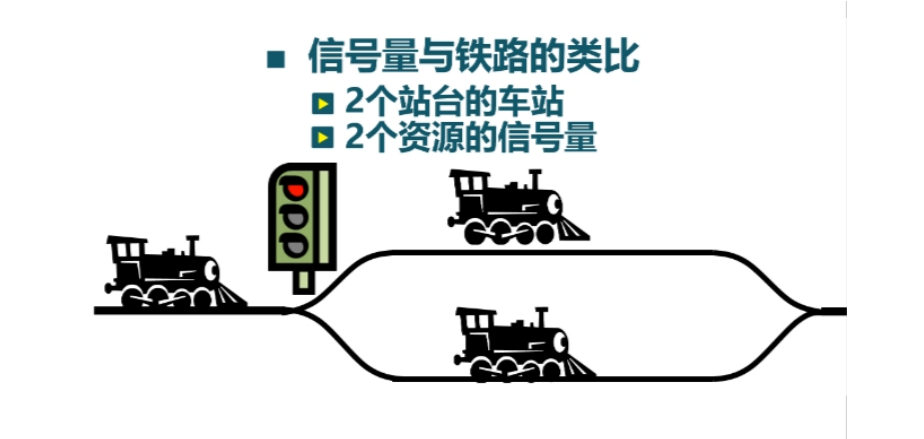
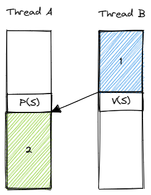
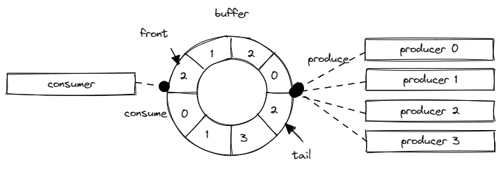

信号量机制
=========================================

本节导读
-----------------------------------------

.. chyyuu https://en.wikipedia.org/wiki/Semaphore_(programming)

在上一节中，我们介绍了互斥锁的起因、使用和实现过程。通过互斥锁，可以让线程在临界区执行时，独占共享资源。然而，当我们需要一种线程间更灵活的同步访问需求，如要求同时最多只允许 N 个线程在临界区中访问共享资源，或让某个线程等待另外一个线程执行到某一阶段后再继续执行的同步过程等，互斥锁这种方式就有点力不从心了。

在本节中，将介绍功能更加强大和灵活的同步互斥机制 -- 信号量(Semaphore) 的设计思路，使用方式和在操作系统中的具体实现。可以看到，在实现信号量的时候可能会用到互斥锁和处理器提供的原子指令，因此它是一种更高级的同步互斥机制。

.. _term-synchronization:
.. _term-sync-primitives:

.. note::

    **同步互斥**

    **同步** (Synchronization) 和 **互斥** (Mutual Exclusion) 事实上是在多线程并发访问过程中出现的两种不同需求。同步指的是线程执行顺序上的一些约束，比如一个线程必须等待另一个线程执行到某个阶段之后才能继续向下执行；而互斥指的是多线程在访问共享资源的时候，同一时间最多只有一个线程能够在共享资源的临界区中。

    同步和互斥的界限其实比较模糊。比如，互斥也可以看成是一种同步需求，即一个线程在进入临界区之前必须等待当前在临界区中的线程（如果存在）退出临界区；而对于一种特定的同步需求，线程间也往往需要某些共享状态，线程需要通过查看或修改这些共享状态来进入等待或唤醒等待的线程。为了能够正确访问这些共享状态，就需要互斥。所以，二者之间是一种“你中有我，我中有你”的关系，我们就将这两种需求统称为 **同步互斥** ，而将针对于这种需求比较通用的解决方案称之为 **同步互斥原语** （简称为 **同步原语** ，英文 Synchronization Primitives ）。

信号量的起源和基本思路
-----------------------------------------

.. _term-semaphore:

1963 年前后，当时的数学家兼计算机科学家 Edsger Dijkstra 和他的团队为 Electrologica X8 开发一款名为 THE 多道程序的操作系统的时候，提出了 **信号量** (Semaphore) 的概念。信号量是一种同步原语，用一个变量或一种抽象数据类型实现，用于控制多个线程对共享资源的访问。1965 年，Dijkstra 发表了论文手稿 "Cooperating sequential processes" ，详细论述了在多个顺序代码执行流（在论文中被称为 Sequential Processes ）的并发执行过程中，如果没有约束机制则会产生不确定的执行结果。为此，他提出了信号量的设计思路，能够让这些松耦合的顺序代码执行流能够在同步需求的约束下正确并发执行。

.. 对于由于不当互斥同步操作引入的死锁（论文用语：Deadly Embrace），可通过其设计的银行家算法（The Banker's Algorithm）来解决。注：银行家算法将在下一节讲解。

信号量相比互斥锁是一种更为强大和灵活的同步原语。它用来描述这样一种同步需求：初始状态下，某种资源的可用数量为一个非负整数 :math:`N` 。线程可以在某个时刻占用一个该种资源，并在使用过后将资源返还。然而，如果此时已经没有可用的资源了，也就是说所有这类资源都已经被其他线程占用了，那么当前线程就需要暂时进入等待，等待其他线程至少返回一个资源之后再重新尝试占用资源或是直接向下执行。可以结合现实中这样一个例子来形象理解信号量：考虑一个火车站只有两个站台，最多可以同时停放两列火车。那么就可以用一个 :math:`N=2` 的信号量来描述站台资源。设想，当一列火车尝试进站时，它会尝试占用一个站台来停车。如果此时仍有空闲的站台，那么它会看到绿色的信号灯而顺利进站；否则，它会看到信号灯为红色，此时它需要在站外等待空出一个站台再进站。 

.. Edsger Dijkstra和他的团队提出的信号量是对互斥锁的一种巧妙的扩展。上一节中的互斥锁的初始值一般设置为 1 的整型变量， 表示临界区还没有被某个线程占用。互斥锁用 0 表示临界区已经被占用了，用 1 表示临界区为空。再通过 lock/unlock 操作来协调多个线程轮流独占临界区执行。而信号量的初始值可设置为 N 的整数变量, 如果 N 大于 0， 表示最多可以有N个线程进入临界区执行，如果 N 小于等于 0 ， 表示不能有线程进入临界区了，必须在后续操作中让信号量的值加 1 ，才能唤醒某个等待的线程。

信号量支持两种操作：P 操作（来自荷兰语中的 Proberen ，意为尝试）和 V 操作（来自荷兰语中的 Verhogen ，意为增加），其中 P 操作表示线程尝试占用一个资源，而与之匹配的 V 操作表示线程将占用的资源归还。P 操作和 V 操作也是基于阻塞-唤醒机制实现的。当进行 P 操作的时候，如果此时没有可用的资源，则当前线程会被阻塞；而进行 V 操作的时候，如果返还之后有了可用的资源，且此时有线程被阻塞，那么就可以考虑唤醒它们。从数据结构层面，信号量中存在一个整数变量表示当前资源的状态，同时还有一个阻塞队列保存所有被阻塞的线程。在信号量不同的实现中，整数变量的具体含义以及阻塞队列中的内容都是不同的。它们其实也属于所有线程都能访问到的共享资源，但是不用担心其互斥性。因为线程不会直接访问它们，而是只能通过 P 操作和 V 操作，操作系统保证这两个操作中包括整数变量的修改和阻塞/唤醒线程的整个流程是原子的。

.. Dijkstra对信号量设立两种操作：P（Proberen（荷兰语），尝试）操作和V（Verhogen（荷兰语），增加）操作。P操作是检查信号量的值是否大于0，若该值大于0，则将其值减1并继续（表示可以进入临界区了）；若该值为0，则线程将睡眠。注意，此时P操作还未结束。而且由于信号量本身是一种临界资源（可回想一下上一节的锁，其实也是一种临界资源），所以在P操作中，检查/修改信号量值以及可能发生的睡眠这一系列操作是一个不可分割的原子操作过程。通过原子操作才能保证一旦P操作开始，则在该操作完成或阻塞睡眠之前，其他线程均不允许访问该信号量。

.. V操作会对信号量的值加1，然后检查是否有一个或多个线程在该信号量上睡眠等待。如有，则选择其中的一个线程唤醒并允许该线程继续完成它的P操作；如没有，则直接返回。注意，信号量的值加1，并可能唤醒一个线程的一系列操作同样也是不可分割的原子操作过程。不会有某个进程因执行v操作而阻塞。

.. 如果信号量是一个任意的整数，通常被称为计数信号量（Counting Semaphore），或一般信号量（General Semaphore）；如果信号量只有0或1的取值，则称为二值信号量（Binary Semaphore）。可以看出，互斥锁只是信号量的一种特例 -- 二值信号量，信号量很好地解决了最多只允许N个线程访问临界资源的情况。

一种信号量实现的伪代码如下所示：

.. code-block:: rust
    :linenos:

    fn P(S) { 
        if S >= 1
            // 如果还有可用资源，更新资源剩余数量 S 
            S = S - 1;
            // 使用资源
        else
            // 已经没有可用资源
            // 阻塞当前线程并将其加入阻塞队列
            <block and enqueue the thread>;
    }

    fn V(S) { 
        if <some threads are blocked on the queue>
            // 如果已经有线程在阻塞队列中
            // 则唤醒这个线程 
            <unblock a thread>;
        else
            // 否则只需恢复 1 资源可用数量
            S = S + 1;
    }

在上述实现中信号量中的整数变量 :math:`S`` 为非负整数。当 :math:`S>0` 时，表示还有 :math:`S` 个可用资源；当 :math:`S=0` 时，表示没有可用资源且可能已经有线程被阻塞。显然 :math:`S` 应该被初始化为 :math:`N` 。这种情形下 P 操作和 V 操作的具体实现可以参考注释。注意，阻塞在 P 操作中的线程一经被唤醒就会立即进入临界区而不会检查此时是否有可用资源。这是因为 **进行 V 操作的线程直接将资源移交给了它唤醒的线程** ，于是此时并没有更新资源可用数量。

.. _link-the-second-sem-impl:

下面是另外一种信号量实现的伪代码：

.. code-block:: rust
    :linenos:

    fn P(S) { 
        S = S - 1;
        if 0 > S then 
            // 阻塞当前线程并将其加入阻塞队列
            <block and enqueue the thread>;
    }

    fn V(S) { 
        S = S + 1;
        if <some threads are blocked on the queue>
            // 如果已经有线程在阻塞队列中
            // 则唤醒这个线程
            <unblock a thread>;
    }

上述实现中，整数变量 :math:`S` 的含义如下：当 :math:`S>0` 时，表示还有 :math:`S` 个可用资源；当 :math:`S=0` 时，表示所有可用资源恰好耗尽；当 :math:`S<0` 时，表示此时有 :math:`-S` 个线程被阻塞。显然 :math:`S` 也应该被初始化为 :math:`N` 。对于 P 操作，我们首先将 :math:`S` 减一，如果发现 :math:`S<0` ，说明之前 :math:`S\leq0` ，一定没有可用资源了，于是需要阻塞当前线程；对于 V 操作，这里将 :math:`S` 加一可以这样理解：如果此时没有线程被阻塞则恢复 1 个可用资源；否则将阻塞线程数减少 1 ，因为当前线程将资源移交给了其中一个被阻塞的线程并唤醒了它。

这只是信号量的两种不同实现，本质上是相同的。

.. 在上述实现中，S的取值范围为大于等于0 的整数。 S的初值一般设置为一个大于0的正整数，表示可以进入临界区的线程数。当S取值为1，表示是二值信号量，也就是互斥锁了。使用信号量实现线程互斥访问临界区的伪代码如下：

.. .. code-block:: rust
    :linenos:

    let static mut S: semaphore = 1;

    // Thread i
    fn  foo() {
        ...
        P(S);
        execute Cricital Section;
        V(S);
        ...
    }
    
.. 在这种实现中，S的初值一般设置为一个大于0的正整数，表示可以进入临界区的线程数。但S的取值范围可以是小于 0 的整数，表示等待进入临界区的睡眠线程数。

信号量的使用方法
---------------------------------------------------------

信号量的初始资源可用数量 :math:`N` 是一个非负整数，它决定了信号量的用途。如果 :math:`N` 为大于 0 的任意整数，我们称之为计数信号量 (Counting Semaphore) 或者一般信号量 (General Semaphore) ，它可以用来进行上面描述过的那种资源管理。特别地，当 :math:`N=1` 的时候，我们称其为二值信号量 (Binary Semaphore) 。从定义上容易看出它和互斥锁是等价的。因此，互斥锁可以看成信号量的一种特例。

然而，当 :math:`N=0` 的时候，信号量就与资源管理无关了，而是可以用作一种比较通用的同步原语。比如，现在的需求是：线程 A 需要等待线程 B 执行到了某一阶段之后再向下执行。假设有一个 :math:`N=0` 的信号量。那么，在线程 A 需要等待的时候可以对该信号量进行 P 操作，于是线程会被阻塞。在线程 B 执行完指定阶段之后再对该信号量进行 V 操作就能够唤醒线程 A 向下执行。如下图所示：

在线程 A 和 B 上分别对一个 :math:`N=0` 的信号量使用 P 操作和 V 操作即可保证：在线程 B 的代码块 1 执行 **完毕** 之后才会 **开始** 执行线程 A 的代码块 2 。换句话说，在线程 A 的代码块 2 的开头就可以假定此前线程 B 的代码块 1 已经执行完毕了。这在很多情况下是一种很有用的同步约束关系。

.. 信号量的另一种用途是用于实现同步（synchronization）。比如，把信号量的初始值设置为 0 ，当一个线程A对此信号量执行一个P操作，那么该线程立即会被阻塞睡眠。之后有另外一个线程B对此信号量执行一个V操作，就会将线程A唤醒。这样线程B中执行V操作之前的代码序列B-stmts和线程A中执行P操作之后的代码A-stmts序列之间就形成了一种确定的同步执行关系，即线程B的B-stmts会先执行，然后才是线程A的A-stmts开始执行。相关伪代码如下所示：

.. .. code-block:: rust
    :linenos:

    let static mut S: semaphore = 0;
    
    //Thread A
    ...
    P(S);
    Label_2:
    A-stmts after Thread B::Label_1;
    ...

    //Thread B
    ...
    B-stmts before Thread A::Label_2;
    Label_1:
    V(S);

    ...    

.. _term-lost-wakeup:

.. note::

    **唤醒丢失问题**

    在上面线程 A 和 B 的同步问题中，其实未必总先是线程 A 执行到 P 操作被阻塞住，然后线程 B 执行 V 操作唤醒线程 A 。也有另一种可能是线程 B 先执行 V 操作，随后线程 A 再执行 P 操作。那么在线程 B 执行 V 操作的时候，信号量的阻塞队列中是没有任何线程的，此时 B 无法唤醒 A 。但如果此时 B 什么都不做，那么之后 A 执行 P 操作陷入阻塞的时候就没有任何线程能够唤醒 A 了，这将导致 A 无法顺利执行。
    
    这种问题被我们称为 **唤醒丢失** (Lost Wakeup) 问题。为了解决这个问题，我们需要 B 在进行 V 操作的时候即使没有线程需要唤醒，也需要一种方法将这次可能的唤醒记录下来。请同学思考我们在上面的信号量实现中是如何解决这个问题的。

信号量的系统调用接口
----------------------------------------------------

和互斥锁一样，我们将信号量也视为进程内的一种由操作系统管理并由进程内所有线程共享的资源。同个进程内可以有多个不同信号量，它们之间通过信号量 ID （与互斥锁或其他资源的的 ID 独立）来区分。相关系统调用接口如下：

.. code-block:: rust
    :linenos:

    /// 功能：为当前进程新增一个信号量。
    /// 参数：res_count 表示该信号量的初始资源可用数量，即 N ，为一个非负整数。
    /// 返回值：假定该操作必定成功，返回创建的信号量的 ID 。
    /// syscall ID : 1020
    pub fn sys_semaphore_create(res_count: usize) -> isize;
    /// 功能：对当前进程内的指定信号量进行 V 操作。
    /// 参数：sem_id 表示要进行 V 操作的信号量的 ID 。
    /// 返回值：假定该操作必定成功，返回 0 。
    pub fn sys_semaphore_up(sem_id: usize) -> isize;
    /// 功能：对当前进程内的指定信号量进行 P 操作。
    /// 参数：sem_id 表示要进行 P 操作的信号量的 ID 。
    /// 返回值：假定该操作必定成功，返回 0 。
    pub fn sys_semaphore_down(sem_id: usize) -> isize;

可以看到，这里我们分别用 down 和 up 这样比较形象的名字作为 P 操作和 V 操作的别名，因为 P 操作和 V 操作通常分别导致整数变量 :math:`S` 的降低和增加。这几个系统调用也会在用户库 ``user_lib`` 被直接封装为 ``semaphore_create/down/up`` 。

信号量的应用
-------------------------------------------

这里给出两个应用：第一个是信号量作为同步原语来解决条件同步问题；第二个则是生产者和消费者基于一个有限缓冲进行协作的复杂问题。

.. _link-cond-sync:

条件同步问题
~~~~~~~~~~~~~~~~~~~~~~~~~~~~~~~~~~~~~~~~~~~

来看这样一个例子：

.. code-block:: rust
    :linenos:

    // user/src/bin/sync_sem.rs

    const SEM_SYNC: usize = 0;

    unsafe fn first() -> ! {
        sleep(10);
        println!("First work and wakeup Second");
        semaphore_up(SEM_SYNC);
        exit(0)
    }

    unsafe fn second() -> ! {
        println!("Second want to continue,but need to wait first");
        semaphore_down(SEM_SYNC);
        println!("Second can work now");
        exit(0)
    }

    #[no_mangle]
    pub fn main() -> i32 {
        // create semaphores
        assert_eq!(semaphore_create(0) as usize, SEM_SYNC);
        // create threads
        let threads = vec![
            thread_create(first as usize, 0),
            thread_create(second as usize, 0),
        ];
        // wait for all threads to complete
        for thread in threads.iter() {
            waittid(*thread as usize);
        }
        println!("sync_sem passed!");
        0
    }

其中，两个线程并发执行，第一个线程执行 ``first`` 函数而第二个线程执行 ``second`` 函数。我们想要达到的同步约束是：在第二个线程执行 ``second`` 的后一行打印之前，第一个线程必须完成 ``first`` 中的打印。于是，根据上面关于信号量用法的介绍，第 22 行我们调用 ``semaphore_create`` 函数创建一个用于同步的 :math:`N=0` 的信号量，其 ID 应为 ``SEM_SYNC`` 。为了实现同步约束，则只需第一个线程在 ``first`` 中的打印结束后进行信号量的 V（也就是 up） 操作，而第二个线程在 ``second`` 后一次打印之前进行信号量的 P （也就是 down）操作，这样即可解决这个问题。

生产者和消费者问题
~~~~~~~~~~~~~~~~~~~~~~~~~~~~~~~~~~~~~~~~~~~~~

生产者-消费者问题（也称为有限缓冲问题）是 Dijkstra 自 1965 年以来描述的一系列同步互斥问题中的一个。如图所示，一共有 5 个线程在同进程下进行协作，其中有 4 个生产者（Producer，图中右侧）和 1 个消费者（Consumer，图中左侧），它们共享一个容量有限的环形缓冲区（图中间）。生产者的职责是将输入放入缓冲区，而消费者则从缓冲区中取出数据进行处理。然而，这两种操作并不总是能够立即成功的。比如，当缓冲区已满的情况下，生产者就无法将数据放入缓冲区，需要等消费者取出数据空出缓冲区槽位；而当缓冲区为空没有数据的时候，消费者也无法从中取出数据，需要等生产者将数据填充到缓冲区。考虑使用信号量来实现上述同步需求，可以看成管理以下资源：

- 空闲槽位资源，初始数量 :math:`N` 等于缓冲区容量。生产者每次写入需要占用 1 个，消费者每次读取恢复 1 个；
- 可用数据资源，初始数量 :math:`N=0` （最开始缓冲区为空）。消费者每次读取占用 1 个，生产者每次写入恢复 1 个；
- 将缓冲区以及相应指针（即 ``front`` 和 ``tail`` ）整体上视作一种共享资源，那么生产者和消费者的写入和读取都会对这个共享资源进行修改。注意 **信号量只保证无可用资源时进行阻塞，但并不保证访问共享资源的互斥性，甚至这可能是两种不同资源** 。因此，我们还需要引入互斥锁对缓冲区进行保护，这里使用一个 :math:`N=1` 的二值信号量来实现。

代码如下：

.. code-block:: rust
    :linenos:

    // user/src/bin/mpsc_sem.rs

    const SEM_MUTEX: usize = 0;
    const SEM_EMPTY: usize = 1;
    const SEM_AVAIL: usize = 2;
    const BUFFER_SIZE: usize = 8;
    static mut BUFFER: [usize; BUFFER_SIZE] = [0; BUFFER_SIZE];
    static mut FRONT: usize = 0;
    static mut TAIL: usize = 0;
    const PRODUCER_COUNT: usize = 4;
    const NUMBER_PER_PRODUCER: usize = 100;

    unsafe fn producer(id: *const usize) -> ! {
        let id = *id;
        for _ in 0..NUMBER_PER_PRODUCER {
            semaphore_down(SEM_EMPTY);
            semaphore_down(SEM_MUTEX);
            BUFFER[TAIL] = id;
            TAIL = (TAIL + 1) % BUFFER_SIZE;
            semaphore_up(SEM_MUTEX);
            semaphore_up(SEM_AVAIL);
        }
        exit(0)
    }

    unsafe fn consumer() -> ! {
        for _ in 0..PRODUCER_COUNT * NUMBER_PER_PRODUCER {
            semaphore_down(SEM_AVAIL);
            semaphore_down(SEM_MUTEX);
            print!("{} ", BUFFER[FRONT]);
            FRONT = (FRONT + 1) % BUFFER_SIZE;
            semaphore_up(SEM_MUTEX);
            semaphore_up(SEM_EMPTY);
        }
        println!("");
        exit(0)
    }

    #[no_mangle]
    pub fn main() -> i32 {
        // create semaphores
        assert_eq!(semaphore_create(1) as usize, SEM_MUTEX);
        assert_eq!(semaphore_create(BUFFER_SIZE) as usize, SEM_EMPTY);
        assert_eq!(semaphore_create(0) as usize, SEM_AVAIL);
        // create threads
        let ids: Vec<_> = (0..PRODUCER_COUNT).collect();
        let mut threads = Vec::new();
        for i in 0..PRODUCER_COUNT {
            threads.push(thread_create(
                producer as usize,
                &ids.as_slice()[i] as *const _ as usize,
            ));
        }
        threads.push(thread_create(consumer as usize, 0));
        // wait for all threads to complete
        for thread in threads.iter() {
            waittid(*thread as usize);
        }
        println!("mpsc_sem passed!");
        0
    }

第 42-44 行分别创建了二值信号量 ``SEM_MUTEX`` ，描述空闲槽位资源的信号量 ``SEM_EMPTY`` 以及描述可用数据资源的信号量 ``SEM_AVAIL`` 。生产者线程会执行 ``producer`` 函数，循环的每次迭代向共享缓冲区写入数据。于是在写入之前需要进行信号量 ``SEM_EMPTY`` 的 down 操作尝试占用一个空闲槽位资源，而在写入之后进行信号量 ``SEM_AVAIL`` 的 up 操作释放一个可用数据资源。相对的，消费者线程会执行 ``consumer`` 函数，循环的每次迭代从共享缓冲区读取数据。于是在读入之前需要进行信号量 ``SEM_AVAIL`` 的 down 操作尝试占用一个可用数据资源，而在读取之后进行信号量 ``SEM_EMPTY`` 的 up 操作释放一个空闲槽位资源。两个线程对共享缓冲区的操作都需要用二值信号量 ``SEM_MUTEX`` 来保护。

从这个例子可以看出，信号量的使用可以是非常灵活的。同一个信号量的 P 操作和 V 操作不一定是连续的，甚至可以不在一个线程上。

.. hint::

    请同学们思考：能否将二值信号量的 down 和 up 操作放在循环每次迭代的最外层？为什么？

实现信号量
------------------------------------------

现在我们来看操作系统如何实现信号量相关的系统调用。首先，和互斥锁一样，信号量也是进程内的一种资源，而且同一个进程内也可以有多个不同的信号量，我们可以通过它们的组合来实现更加复杂的同步需求。因此，从数据结构角度看，需要将一个信号量表加入到进程控制块 PCB 中：

.. code-block:: rust
    :linenos:
    :emphasize-lines: 6

    // os/src/task/process.rs

    pub struct ProcessControlBlockInner {
        ...
        pub mutex_list: Vec<Option<Arc<dyn Mutex>>>,
        pub semaphore_list: Vec<Option<Arc<Semaphore>>>,
        ...
    }

在内核中，信号量是一个叫做 ``Semaphore`` 内核数据结构，定义如下：

.. code-block:: rust
    :linenos:

    // os/src/sync/semaphore.rs

    pub struct Semaphore {
        pub inner: UPSafeCell<SemaphoreInner>,
    }

    pub struct SemaphoreInner {
        pub count: isize,
        pub wait_queue: VecDeque<Arc<TaskControlBlock>>,
    }

    impl Semaphore {
        pub fn new(res_count: usize) -> Self {...}
        pub fn up(&self) {...}
        pub fn down(&self) {...}
    }

其中包括一个整数变量 ``count`` （也就是上面信号量基本思路中的整数变量 S）以及保存阻塞在该信号量中的所有线程的阻塞队列 ``wait_queue`` 。信号量 ``Semaphore`` 支持三种操作：创建 ``new`` （带有一个参数 ``res_count`` ，也即信号量初始可用资源数量 :math:`N` ）以及 up （也即 V 操作）和 down （也即 P 操作）。相关的系统调用主要是找到当前进程中的指定信号量实例，随后再调用它的这几种方法来实现的，在此不再赘述。于是我们主要看这几种方法是如何实现的：

.. code-block:: rust
    :linenos:

    // os/src/sync/semaphore.rs

    impl Semaphore {
        pub fn new(res_count: usize) -> Self {
            Self {
                inner: unsafe {
                    UPSafeCell::new(SemaphoreInner {
                        count: res_count as isize,
                        wait_queue: VecDeque::new(),
                    })
                },
            }
        }

        pub fn up(&self) {
            let mut inner = self.inner.exclusive_access();
            inner.count += 1;
            if inner.count <= 0 {
                if let Some(task) = inner.wait_queue.pop_front() {
                    wakeup_task(task);
                }
            }
        }

        pub fn down(&self) {
            let mut inner = self.inner.exclusive_access();
            inner.count -= 1;
            if inner.count < 0 {
                inner.wait_queue.push_back(current_task().unwrap());
                drop(inner);
                block_current_and_run_next();
            }
        }
    }

``new`` 方法比较简单。而 ``up`` 和 ``down`` 方法和我们在信号量基本思路中介绍的 :ref:`信号量的第二种实现 <link-the-second-sem-impl>` 一致。只需要注意如何使用阻塞-唤醒机制的核心接口 ``block_current_and_run_next`` 和 ``wakeup_task`` 即可。

.. 操作系统如何实现信号量系统调用呢？我们首先考虑一下与此相关的核心数据结构，然后考虑与数据结构相关的相关函数/方法的实现。

.. 在线程的眼里，信号量是一种每个线程能看到的共享资源，且可以存在多个不同信号量来合理使用不同的资源。所以我们可以把信号量也看成四一种资源，可放在一起让进程来管理，如下面代码第9行所示。这里需要注意的是： ``semaphore_list: Vec<Option<Arc<Semaphore>>>`` 表示的是信号量资源的列表。而 ``Semaphore`` 是信号量的内核数据结构，由信号量值和等待队列组成。操作系统需要显式地施加某种控制，来确定当一个线程执行P操作和V操作时，如何让线程睡眠或唤醒线程。在这里，P操作是由 ``Semaphore`` 的 ``down`` 方法实现，而V操作是由 ``Semaphore`` 的 ``up`` 方法实现。

小结
-----------------------------------------------------

本节我们介绍了相比互斥锁更加灵活强大的同步原语——信号量，并用它解决了条件同步和经典的生产者-消费者问题。但是要看到的是，信号量还是比较复杂的。对于程序员来说开发和阅读代码比较困难，且比较容易出错，对程序员的要求比较高。

参考文献
----------------------------------------------------

- Dijkstra, Edsger W. Cooperating sequential processes (EWD-123) (PDF). E.W. Dijkstra Archive. Center for American History, University of Texas at Austin. (transcription) (September 1965)  https://www.cs.utexas.edu/users/EWD/transcriptions/EWD01xx/EWD123.html
- Downey, Allen B. (2016) [2005]. "The Little Book of Semaphores" (2nd ed.). Green Tea Press.
- Leppäjärvi, Jouni (May 11, 2008). "A pragmatic, historically oriented survey on the universality of synchronization primitives" (pdf). University of Oulu, Finland.
- `Producer-consumer problem, Wikipedia <https://en.wikipedia.org/wiki/Producer%E2%80%93consumer_problem>`_