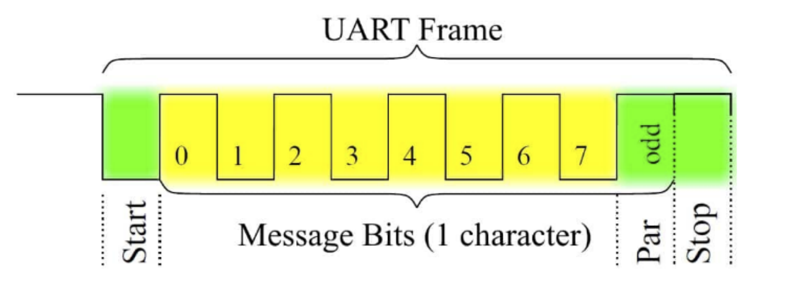

串口驱动程序
=========================================

本节导读
-----------------------------------------

现在我们对如何了解计算机系统中给的外设信息，以及如何初始化或与外设进行交互有了基本的了解。接下来，我们需要看看如何在完整的操作系统中通过添加设备驱动程序来扩展应用访问外设的I/O能力。本节将通过介绍一个具体的物理设备串口的驱动程序的设计与实现，来分析如何在操作系统中添加设备驱动程序。

串口驱动程序
------------------------------------

我们要管理是串口(UART)物理设备。我们在第一章其实就接触了串口，但当时是通过RustSBI来帮OS完成对串口的访问，即OS只需发出两种SBI调用请求就可以输出和获取字符了。但这种便捷性是有代价的。比如OS在调用获取字符的SBI调用请求后，RustSBI如果没收到串口字符，会返回 ``-1`` ，这样OS只能采用类似轮询的方式来继续查询。到第七章为止的串口驱动不支持中断是导致在多进程情况下，系统效率低下的主要原因之一。大家也不要遗憾，我们的第一阶段的目标是 **Just do it** ，先把OS做出来。在本节，我们需要逐步改进优化对串口的操作了。

串口（Universal Asynchronous Receiver-Transmitter，简称UART）是一种在嵌入式系统中常用的用于传输、接收系列数据的外部设备。串行数据传输是逐位（bit）顺序发送数据的过程。了解QEMU模拟的兼容NS16550A硬件规范 [#UART1]_ [#UART2]_  是写驱动程序的准备工作，建议同学们先阅读一下。每个UART使用8个I/O字节来访问其寄存器。下表 [#UART1]_ 显示了UART中每个寄存器的地址和基本含义。表中使用的 `base` 是串口设备的起始地址。在QEMU模拟的virt计算机中串口设备寄存器的MMIO起始地址为 ``0x10000000`` 。

+-----------+-----------------------------------+------------------------------+-----------------------------------+----------------------------+
| I/O port  | Read (DLAB=0)                     | Write (DLAB=0)               | Read (DLAB=1)                     | Write (DLAB=1)             |
+===========+===================================+==============================+===================================+============================+
| base      | **RBR** receiver buffer           | **THR** transmitter holding  | **DLL** divisor latch LSB         | **DLL** divisor latch LSB  |
+-----------+-----------------------------------+------------------------------+-----------------------------------+----------------------------+
| base+1    | **IER** interrupt enable          | **IER** interrupt enable     | **DLM** divisor latch MSB         | **DLM** divisor latch MSB  |
+-----------+-----------------------------------+------------------------------+-----------------------------------+----------------------------+
| base+2    | **IIR** interrupt identification  | **FCR** FIFO control         | **IIR** interrupt identification  | **FCR** FIFO control       |
+-----------+-----------------------------------+------------------------------+-----------------------------------+----------------------------+
| base+3    | **LCR** line control              | **LCR** line control         | **LCR** line control              | **LCR** line control       |
+-----------+-----------------------------------+------------------------------+-----------------------------------+----------------------------+
| base+4    | **MCR** modem control             | **MCR** modem control        | **MCR** modem control             | **MCR** modem control      |
+-----------+-----------------------------------+------------------------------+-----------------------------------+----------------------------+
| base+5    | **LSR** line status               | *factory test*               | **LSR** line status               | *factory test*             |
+-----------+-----------------------------------+------------------------------+-----------------------------------+----------------------------+
| base+6    | **MSR** modem status              | *not used*                   | **MSR** modem status              | *not used*                 |
+-----------+-----------------------------------+------------------------------+-----------------------------------+----------------------------+
| base+7    | **SCR** scratch                   | **SCR** scratch              | **SCR** scratch                   | **SCR** scratch            |
+-----------+-----------------------------------+------------------------------+-----------------------------------+----------------------------+

注：LCR 寄存器中的 DLAB 位设置为 0 或 1 ，会导致CPU访问的是不同的寄存器。比如，DLAB位为0时，读位于 `base` 处的串口寄存器是 `RBR`， DLAB位为1时，读位于 `base` 处的串口寄存器是 `DLL`。

大致猜测完上述寄存器的含义后，我们就算是完成前期准备工作，在接下来的驱动程序设计中，会用到上述的部分寄存器。
我们先尝试脱离RustSBI的帮助，在操作系统中完成支持中断机制的串口驱动。

通过查找 ``dtc`` （Device Tree Compiler）工具生成的 ``riscv64-virt.dts`` 文件，我们可以看到串口设备相关的MMIO模式的寄存器信息和中断相关信息。

.. code-block:: shell
   
   ...
   chosen {
     bootargs = [00];
     stdout-path = "/uart@10000000";
   };

   uart@10000000 {
     interrupts = <0x0a>;
     interrupt-parent = <0x02>;
     clock-frequency = <0x384000>;
     reg = <0x00 0x10000000 0x00 0x100>;
     compatible = "ns16550a";
   };

``chosen`` 节点的内容表明字符输出会通过串口设备打印出来。``uart@10000000`` 节点表明串口设备中寄存器的MMIO起始地址为 ``0x10000000`` ，范围在 ``0x00~0x100`` 区间内，中断号为 ``0x0a`` 。 ``clock-frequency`` 表示时钟频率，其值为0x38400 ，即3.6864 MHz。 ``compatible = "ns16550a"`` 表示串口的硬件规范兼容NS16550A。

在如下情况下，串口会产生中断：

- 有新的输入数据进入串口的接收缓存
- 串口完成了缓存中数据的发送
- 串口发送出现错误

这里我们仅关注有输入数据时串口产生的中断。

在 UART 中，可访问的 I/O寄存器一共有8个。访问I/O寄存器的方法把串口寄存器的MMIO起始地址加上偏移量，就是各个寄存器的MMIO地址了。

串口设备初始化
~~~~~~~~~~~~~~~~~~~~~~~~~~~~~~~~~~~~~~~~~

对串口进行初始化设置的相关代码如下所示：

.. code-block:: Rust
   :linenos:

   // os/src/drivers/chardev/mod.rs
   ...
   lazy_static! {
      pub static ref UART: Arc<CharDeviceImpl> = Arc::new(CharDeviceImpl::new());
   }
   // os/src/boards/qemu.rs
   pub type CharDeviceImpl = crate::drivers::chardev::NS16550a<VIRT_UART>;
   // os/src/drivers/chardev/ns16550a.rs
   impl<const BASE_ADDR: usize> NS16550a<BASE_ADDR> {
      pub fn new() -> Self {
         let mut inner = NS16550aInner {
               ns16550a: NS16550aRaw::new(BASE_ADDR),
               read_buffer: VecDeque::new(),
         };
         inner.ns16550a.init();
         Self {
               inner: unsafe { UPIntrFreeCell::new(inner) },
               condvar: Condvar::new(),
         }
      }
   }
   ...
   impl NS16550aRaw {
      pub fn init(&mut self) {
         let read_end = self.read_end();
         let mut mcr = MCR::empty();
         mcr |= MCR::DATA_TERMINAL_READY;
         mcr |= MCR::REQUEST_TO_SEND;
         mcr |= MCR::AUX_OUTPUT2;
         read_end.mcr.write(mcr);
         let ier = IER::RX_AVAILABLE;
         read_end.ier.write(ier);
      }
   }

上述代码完成的主要工作包括：

.. chyyuu 需要更新！！！
   1. 设置每次传输的位数为 8 位，即一个 ASCII 码的大小
   2. 激活先进先出队列
   3. 使能中断，这意味着我们的输入可以通过中断进行通知
   4. 设置输入产生的中断频率

串口设备输入输出操作
~~~~~~~~~~~~~~~~~~~~~~~~~~~~~~~~~~~~~~~~~

先看串口输出，由于不设置和处理输出后产生中断的情况，使得整个输出操作比较简单。即向偏移量为 ``0`` 的串口控制寄存器的MMIO地址写8位字符即可。

.. code-block:: Rust
   :linenos:

   // os/src/drivers/chardev/ns16550a.rs

   impl<const BASE_ADDR: usize> CharDevice for NS16550a<BASE_ADDR> {
      fn write(&self, ch: u8) {
         let mut inner = self.inner.exclusive_access();
         inner.ns16550a.write(ch);
      }
   impl NS16550aRaw {
      pub fn write(&mut self, ch: u8) {
         let write_end = self.write_end();
         loop {
               if write_end.lsr.read().contains(LSR::THR_EMPTY) {
                  write_end.thr.write(ch);
                  break;
               }
         }
      }
   

.. chyyuu 在我们的具体实现中，与上述的一般中断处理过程不太一样。首先操作系统通过自定义的 ``SBI_DEVICE_HANDLER`` SBI调用，告知RustSBI在收到外部中断后，要跳转到的操作系统中处理外部中断的函数 ``device_trap_handler`` 。这样，在外部中断产生后，先由RustSBI在M Mode下接收的，并转到S Mode，交由 ``device_trap_handler`` 内核函数进一步处理。

在以往的操作系统实现中，当一个进程通过 ``sys_read`` 系统调用来获取串口字符时，并没有用上中断机制。但一个进程读不到字符的时候，将会被操作系统调度到就绪队列的尾部，等待下一次执行的时刻。这其实就是一种变相的轮询方式来获取串口的输入字符。这里其实是可以对进程管理做的一个改进，来避免进程通过轮询的方式检查串口字符输入。既然我们已经在上一章设计实现了让用户态线程挂起的同步互斥机制，我们就可以把这种机制也用在内核中，在外设不能及时提供资源的情况下，让想获取资源的线程或进程挂起，直到外设提供了资源，再唤醒线程或进程继续执行。

目前，支持中断的驱动可有效地支持等待的进程唤醒的操作。以串口为例，如果一个进程通过系统调用想获取串口输入，但此时串口还没有输入的字符，那么操作系统就设置一个进程等待串口输入的条件变量（条件变量包含一个等待队列），然后把当前进程设置等待状态，并挂在这个等待队列上，再把CPU让给其它就绪进程执行。对于串口输入的处理，由于要考虑中断，相对就要复杂一些。读字符串的代码如下所示：

.. code-block:: Rust
   :linenos:

   //os/src/fs/stdio.rs
   impl File for Stdin {
      ...
      fn read(&self, mut user_buf: UserBuffer) -> usize {
         assert_eq!(user_buf.len(), 1);
         //println!("before UART.read() in Stdin::read()");
         let ch = UART.read();
         unsafe {
               user_buf.buffers[0].as_mut_ptr().write_volatile(ch);
         }
         1
      }
   // os/src/drivers/chardev/ns16550a.rs
   impl<const BASE_ADDR: usize> CharDevice for NS16550a<BASE_ADDR> {
      fn read(&self) -> u8 {
         loop {
               let mut inner = self.inner.exclusive_access();
               if let Some(ch) = inner.read_buffer.pop_front() {
                  return ch;
               } else {
                  let task_cx_ptr = self.condvar.wait_no_sched();
                  drop(inner);
                  schedule(task_cx_ptr);
               }
         }
      }

响应串口输入中断的代码如下所示：

.. code-block:: Rust
   :linenos:

   // os/src/boards/qemu.rs
   pub fn irq_handler() {
      let mut plic = unsafe { PLIC::new(VIRT_PLIC) };
      let intr_src_id = plic.claim(0, IntrTargetPriority::Supervisor);
      match intr_src_id {
         ...
         10 => UART.handle_irq(),
      }
      plic.complete(0, IntrTargetPriority::Supervisor, intr_src_id);
   }
   // os/src/drivers/chardev/ns16550a.rs
   impl<const BASE_ADDR: usize> CharDevice for NS16550a<BASE_ADDR> {
      fn handle_irq(&self) {
         let mut count = 0;
         self.inner.exclusive_session(|inner| {
               while let Some(ch) = inner.ns16550a.read() {
                  count += 1;
                  inner.read_buffer.push_back(ch);
               }
         });
         if count > 0 {
               self.condvar.signal();
         }
      }

对于操作系统的一般处理过程是，首先是能接收中断，即在 ``trap_handler`` 中通过访问 ``scause`` 寄存器，能够识别出有外部中断产生。然后再进一步通过读PLIC的 ``Claim`` 寄存器来了解是否是收到了串口发来的输入中断。如果PLIC识别出是串口，就会调用串口的中断处理例程。
当产生串口有输入并产生中断后，操作系统通过对偏移量为 ``0`` 的串口寄存器的进行读操作，从而获得通过串口输入的字符，并存入 ``NS16550aInner::read_buffer`` 中。然后操作系统将查找等待串口输入的等待队列上的进程，把它唤醒并加入到就绪队列中。这样但这个进程再次执行时，就可以获取到串口数据了。

.. [#UART1] Serial UART information， https://www.lammertbies.nl/comm/info/serial-uart
.. [#UART2] TECHNICAL DATA ON 16550， http://www.byterunner.com/16550.html
