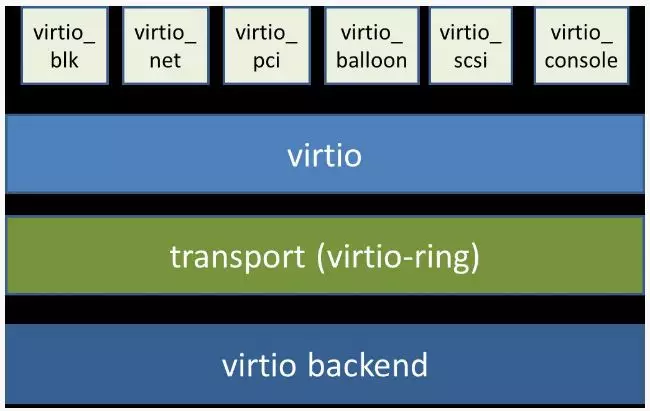
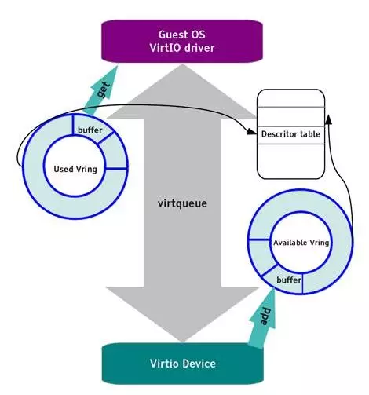

virtio设备驱动程序
=========================================

本节导读
-----------------------------------------

本节主要介绍了QEMU模拟的RISC-V计算机中的virtio设备的架构和重要组成部分，以及面向virtio设备的驱动程序主要功能；并对virtio-blk设备及其驱动程序，virtio-gpu设备及其驱动程序进行了比较深入的分析。这里选择virtio设备来进行介绍，主要考虑基于两点考虑，首先这些设备就是QEMU模拟的高性能物理外设，操作系统可以面向这些设备编写出合理的驱动程序（如Linux等操作系统中都有virtio设备的驱动程序，并被广泛应用于云计算虚拟化场景中。）；其次，各种类型的virtio设备，如块设备（virtio-blk）、网络设备（virtio-net）、键盘鼠标类设备（virtio-input）、显示设备（virtio-gpu）具有对应外设类型的共性特征、专有特征和与具体处理器无关的设备抽象性。通过对这些设备的分析和比较，能够比较快速地掌握各类设备的核心特点，并掌握编写裸机或操作系统驱动程序的关键技术。

virtio设备
-----------------------------------------

virtio概述
~~~~~~~~~~~~~~~~~~~~~~~~~~~~~~~~~~~~

.. chyyuu https://blogs.oracle.com/linux/post/introduction-to-virtio
   https://docs.oasis-open.org/virtio/virtio/v1.1/csprd01/virtio-v1.1-csprd01.html
   https://ozlabs.org/~rusty/virtio-spec/virtio-paper.pdf
   
Rusty Russell 在2008年左右设计了virtio协议，并开发了相应的虚拟化解决方案 lguest，形成了VirtIO规范（Virtual I/O Device Specification）。其主要目的是为了简化和统一虚拟机（Hypervisor）的设备模拟，并提高虚拟机环境下的I/O性能。virtio 协议是对hypervisor 中的一组通用模拟设备的抽象，即virtio协议定义了虚拟设备的输入/输出接口。而基于virtio协议的I/O设备称为virtio设备。下图列出了两种在虚拟机中模拟外设的总体框架。

.. chyyuu https://cloud.tencent.com/developer/article/1065771 virtio 简介

.. image:: ../../os-lectures/lec13/figs/two-hypervisor-io-arch.png
   :align: center
   :scale: 40 %
   :name: two-hypervisor-io-arch
   :alt: 两种在虚拟机中模拟外设的总体框架

在上图左侧的虚拟机模拟外设的传统方案中，如果guest VM 要使用底层 host主机的资源，需要 Hypervisor 截获所有的I/O请求指令，然后模拟出这些I/O指令的行为，这会带来较大的性能开销。

.. note::

   **虚拟机（Virtual Machine，VM）**
   
   虚拟机是物理计算机的虚拟表示形式或仿真环境。 虚拟机通常被称为访客机（Guest Machine，简称Guest）或访客虚拟机（Guest VM），而它们运行所在的物理计算机被称为主机（Host Machine，简称Host）。

   **虚拟机监视器 Hypervisor**

   虚拟机监视器（Hypervisor或Virtual Machine Monitor，简称VMM）是创造并且运行虚拟机的软件、固件、或者硬件。这样主机硬件上能同时运行一个至多个虚拟机，这些虚拟机能高效地分享主机硬件资源。

在上图右侧的虚拟机模拟外设的virtio方案中，模拟的外设实现了功能最小化，即虚拟外设的数据面接口主要是与guest VM 共享的内存、控制面接口主要基于内存映射的寄存器和中断机制。这样guest VM 通过访问虚拟外设来使用底层 host主机的资源时，Hypervisor只需对少数寄存器访问和中断机制进行处理，实现了高效的I/O虚拟化过程。

.. note::

   **数据面（Data Plane）**

   设备与处理器之间的I/O数据传输相关的数据设定（地址、布局等）与传输方式（基于内存或寄存器等）

   **控制平面（Control Plane）**

   处理器发现设备、配置设备、管理设备等相关的操作，以及处理器和设备之间的相互通知机制。

另外，各种类型的virtio设备，如块设备（virtio-blk）、网络设备（virtio-net）、键盘鼠标类设备（virtio-input）、显示设备（virtio-gpu）具有共性特征和独有特征。对于共性特征，virtio设计了各种类型设备的统一抽象接口，而对于独有特征，virtio尽量最小化各种类型设备的独有抽象接口。这样，virtio就形成了一套通用框架和标准接口（协议）来屏蔽各种hypervisor的差异性，实现了guest VM和不同hypervisor之间的交互过程。

.. image:: ../../os-lectures/lec13/figs/compatable-hypervisors-io-arch.png
   :align: center
   :scale: 40 %
   :name: compatable-hypervisors-io-arch
   :alt: 兼容不同虚拟机的外设模拟方案

上图意味着什么呢？它意味着在guest VM 上看到的虚拟设备具有简洁通用的优势，这对运行在guest VM上的操作系统而言，可以设计出轻量高效的设备驱动程序（即上图的 Front-end drivers）。

从本质上讲，virtio是一个接口，允许运行在虚拟机上的操作系统和应用软件通过访问 virtio 设备使用其主机的设备。这些 virtio 设备具备功能最小化的特征，Guest VM中的设备驱动程序（Front-end drivers只需实现基本的发送和接收I/O数据即可，而位于Hypervisor中的Back-end drivers和设备模拟部分让主机处理其实际物理硬件设备上的大部分设置、维护和处理。这种设计方案极大减轻了virtio驱动程序的复杂性。

virtio设备是虚拟外设，存在于QEMU模拟的RISC-V 64 virt 计算机中。而我们要在操作系统中实现virtio驱动程序，来管理和控制这些virtio虚拟设备。每一类virtio设备都有自己的virtio接口，virtio接口包括了数据结构和相关API的定义。这些定义中，有共性内容，也有属于设备特定类型的非共性内容。

virtio架构
~~~~~~~~~~~~~~~~~~~~~~~~~~~~~~~~~~~~

总体上看，virtio 架构可以分为上中下三层，上层包括运行在QEMU模拟器上的前端操作系统中各种驱动程序（Front-end drivers）；下层是在QEMU中模拟的各种虚拟设备 Device；中间层是传输（transport）层，就是驱动程序与虚拟设备之间的交互接口，包含两部分：上半部是virtio接口定义，即I/O数据传输机制的定义：virtio 虚拟队列（virtqueue）；下半部是virtio接口实现，即I/O数据传输机制的具体实现：virtio-ring，主要由环形缓冲区和相关操作组成，用于保存驱动程序和虚拟设备之间进行命令和数据交互的信息。

操作系统中virtio 驱动程序的主要功能包括：

- 接受来自用户进程或操作系统其它组件发出的 I/O 请求
- 将这些 I/O 请求通过virqueue发送到相应的 virtio 设备
- 通过中断或轮询等方式查找并处理相应设备完成的I/O请求

Qemu或Hypervisor中virtio 设备的主要功能包括：

- 通过virqueue接受来自相应 virtio 驱动程序的 I/O 请求
- 通过设备仿真模拟或将 I/O 操作卸载到主机的物理硬件来处理I/O请求，使处理后的I/O数据可供 virtio 驱动程序使用
- 通过寄存器、内存映射或中断等方式通知virtio 驱动程序处理已完成的I/O请求

运行在Qemu中的操作系统中的virtio 驱动程序和Qemu模拟的virtio设备驱动的关系如下图所示：

.. image:: ../../os-lectures/lec13/figs/virtio-driver-device.png
   :align: center
   :name: virtio-driver-device

I/O设备基本组成结构
~~~~~~~~~~~~~~~~~~~~~~~~~~~~~~~~~~~~

virtio设备代表了一类I/O通用设备，为了让设备驱动能够管理和使用设备。在程序员的眼里，I/O设备基本组成结构包括如下恩利：

- 呈现模式：设备一般通过寄存器、内存或特定I/O指令等方式让设备驱动能看到和访问到设备；
- 特征描述：让设备驱动能够了解设备的静态特性（可通过软件修改），从而决定是否或如何使用该设备；
- 状态表示：让设备驱动能够了解设备的当前动态状态，从而确定如何进行设备管理或I/O数据传输；
- 交互机制：交互包括事件通知和数据传输；对于事件通知，让设备驱动及时获知设备的状态变化的机制（可基于中断等机制），以及让设备及时获得设备驱动发出的I/O请求（可基于寄存器读写等机制）；对于数据传输，让设备驱动能处理设备给出的数据，以及让设备能处理设备驱动给出的数据，如（可基于DMA或virtqueue等机制）。

virtio设备具体定义了设备驱动和设备之间的接口，包括设备呈现模式、设备状态域、特征位、通知、设备配置空间、虚拟队列等，覆盖了上述的基本接口描述。

virtio设备基本组成要素
~~~~~~~~~~~~~~~~~~~~~~~~~~~~~~~~~~~~~~~~~~~~~~~~~~~~~~~~

virtio设备的基本组成要素如下：

- 设备状态域（Device status field）
- 特征位（Feature bits）
- 通知（Notifications）
- 设备配置空间（Device Configuration space）
- 一个或多个虚拟队列（virtqueue）

其中的设备特征位和设备配置空间属于virtio设备的特征描述；设备状态域属于virtio设备初始化时的状态表示；通知和虚拟队列属于virtio设备的交互机制，也包含virtio设备运行时的状态表示。

virtio设备呈现模式
~~~~~~~~~~~~~~~~~~~~~~~~~~~~~~~~~~~~

virtio设备支持三种设备呈现模式：

- Virtio Over MMIO，虚拟设备直接挂载到系统总线上，我们实验中的虚拟计算机就是这种呈现模式；
- Virtio Over PCI BUS，遵循PCI规范，挂在到PCI总线上，作为virtio-pci设备呈现，在QEMU虚拟的x86计算机上采用的是这种模式；
- Virtio Over Channel I/O：主要用在虚拟IBM s390计算机上，virtio-ccw使用这种基于channel I/O的机制。

在Qemu模拟的RISC-V计算机 -- virt 上，采用的是Virtio Over MMIO的呈现模式。这样在实现设备驱动时，我们只需要找到相应virtio设备的I/O寄存器等以内存形式呈现的地址空间，就可以对I/O设备进行初始化和管理了。

virtio设备特征描述
~~~~~~~~~~~~~~~~~~~~~~~~~~~~~~~~~~~~~~~~~~~~~~~~~~~~~~~~

virtio设备特征描述包括设备特征位和设备配置空间。

**特征位** 

特征位用于表示VirtIO设备具有的各种特性和功能。其中bit0 -- 23是特定设备可以使用的feature bits， bit24 -- 37预给队列和feature协商机制，bit38以上保留给未来其他用途。驱动程序与设备对设备特性进行协商，形成一致的共识，这样才能正确的管理设备。

**设备配置空间**

设备配置空间通常用于配置不常变动的设备参数（属性），或者初始化阶段需要设置的设备参数。设备的特征位中包含表示配置空间是否存在的bit位，并可通过在特征位的末尾添加新的bit位来扩展配置空间。

设备驱动程序在初始化virtio设备时，需要根据virtio设备的特征位和配置空间来了解设备的特征，并对设备进行初始化。

virtio设备状态表示
~~~~~~~~~~~~~~~~~~~~~~~~~~~~~~~~~~~~~~~~~~~~~~~~~~~~~~~~

virtio设备状态表示包括在设备初始化过程中用到的设备状态域，以及在设备进行I/O传输过程中用到的I/O数据访问状态信息和I/O完成情况等。

**设备状态域**

设备状态域包含对设备初始化过程中virtio设备的6种状态：

- ACKNOWLEDGE（1）：驱动程序发现了这个设备，并且认为这是一个有效的virtio设备；
- DRIVER (2) : 驱动程序知道该如何驱动这个设备；
- FAILED (128) : 由于某种错误原因，驱动程序无法正常驱动这个设备；
- FEATURES_OK (8) : 驱动程序认识设备的特征，并且与设备就设备特征协商达成一致；
- DRIVER_OK (4) : 驱动程序加载完成，设备可以正常工作了；
- DEVICE_NEEDS_RESET (64) ：设备触发了错误，需要重置才能继续工作。

在设备驱动程序对virtio设备初始化的过程中，需要经历一系列的初始化阶段，这些阶段对应着设备状态域的不同状态。

**I/O传输状态**

设备驱动程序控制virtio设备进行I/O传输过程中，会经历一系列过程和执行状态，包括 `I/O请求` 状态、 `I/O处理` 状态、 `I/O完成` 状态、  `I/O错误` 状态、 `I/O后续处理` 状态等。设备驱动程序在执行过程中，需要对上述状态进行不同的处理。

virtio设备进行I/O传输过程中，设备驱动会指出 `I/O请求` 队列的当前位置状态信息，这样设备能查到I/O请求的信息，并根据 `I/O请求` 进行I/O传输；而设备会指出 `I/O完成` 队列的当前位置状态信息，这样设备驱动通过读取 `I/O完成` 数据结构中的状态信息，就知道设备是否完成I/O请求的相应操作，并进行后续事务处理。

比如，virtio_blk设备驱动发出一个读设备块的I/O请求，并在某确定位置给出这个I/O请求的地址，然后给设备发出'kick'通知(读或写相关I/O寄存器映射的内存地址)，此时处于I/O请求状态；设备在得到通知后，此时处于 `I/O处理` 状态，它解析这个I/O请求，完成这个I/O请求的处理，即把磁盘块内容读入到内存中，并给出读出的块数据的内存地址，再通过中断通知设备驱动，此时处于 `I/O完成` 状态；如果磁盘块读取发生错误，此时处于 `I/O错误` 状态；设备驱动通过中断处理例程，此时处于 `I/O后续处理` 状态，设备驱动知道设备已经完成读磁盘块操作，会根据磁盘块数据所在内存地址，把数据传递给文件系统进行进一步处理；如果设备驱动发现磁盘块读错误，则会进行错误恢复相关的后续处理。

virtio设备交互机制
~~~~~~~~~~~~~~~~~~~~~~~~~~~~~~~~~~~~~~~~~~~~~~~~~~~~~~~~

virtio设备交互机制包括基于Notifications的事件通知和基于virtqueue虚拟队列的数据传输。事件通知是指设备和驱动程序必须通知对方，它们有数据需要对方处理。数据传输是指设备和驱动程序之间进行I/O数据（如磁盘块数据、网络包）传输。

**Notification通知**

驱动程序和设备在交互过程中需要相互通知对方：驱动程序组织好相关命令/信息要通知设备去处理I/O事务，设备处理完I/O事务后，要通知驱动程序进行后续事务，如回收内存，向用户进程反馈I/O事务的处理结果等。

驱动程序通知设备可用``门铃 doorbell``机制，即采用PIO或MMIO方式访问设备特定寄存器，QEMU进行拦截再通知其模拟的设备。设备通知驱动程序一般用中断机制，即在QEMU中进行中断注入，让CPU响应并执行中断处理例程，来完成对I/O执行结果的处理。

**virtqueue虚拟队列**

在virtio设备上进行批量数据传输的机制被称为虚拟队列（virtqueue），virtio设备的虚拟队列（virtqueue）可以由各种数据结构（如数组、环形队列等）来具体实现。每个virtio设备可以拥有零个或多个virtqueue，每个virtqueue占用多个物理页，可用于设备驱动程序给设备发I/O请求命令和相关数据（如磁盘块读写请求和读写缓冲区），也可用于设备给设备驱动程序发I/O数据（如接收的网络包）。 

.. _term-virtqueue:

**virtqueue虚拟队列**
~~~~~~~~~~~~~~~~~~~~~~~~~

virtio协议中一个关键部分是virtqueue，在virtio规范中，virtqueue是virtio设备上进行批量数据传输的机制和抽象表示。在设备驱动实现和Qemu中virtio设备的模拟实现中，virtqueue是一种数据结构，用于设备和驱动程序中执行各种数据传输操作。

操作系统在Qemu上运行时，virtqueue是 virtio 驱动程序和 virtio 设备访问的同一块内存区域。

当涉及到 virtqueue 的描述时，有很多不一致的地方。有将其与vring（virtio-rings或VRings）等同表示，也有将二者分别单独描述为不同的对象。我们将在这里单独描述它们，因为vring是virtqueues的主要组成部分，是达成virtio设备和驱动程序之间数据传输的数据结构， vring本质是virtio设备和驱动程序之间的共享内存，但 virtqueue 不仅仅只有vring。

virtqueue由三部分组成（如下图所示）： 

- 描述符表 Descriptor Table：描述符表是描述符为组成元素的数组，每个描述符描述了一个内存buffer 的address/length。而内存buffer中包含I/O请求的命令/数据（由virtio设备驱动填写），也可包含I/O完成的返回结果（由virtio设备填写）等。
- 可用环 Available Ring：一种vring，记录了virtio设备驱动程序发出的I/O请求索引，即被virtio设备驱动程序更新的描述符索引的集合，需要virtio设备进行读取并完成相关I/O操作；
- 已用环 Used Ring：另一种vring，记录了virtio设备发出的I/O完成索引，即被virtio设备更新的描述符索引的集合，需要vrtio设备驱动程序进行读取并对I/O操作结果进行进一步处理。

.. image:: ../../os-lectures/lec13/figs/virtqueue-arch.png
   :align: center
   :name: virtqueue-arch

**描述符表 Descriptor Table**

描述符表用来指向virtio设备I/O传输请求的缓冲区（buffer）信息，由 ``Queue Size`` 个Descriptor（描述符）组成。描述符中包括buffer的物理地址 -- addr字段，buffer的长度 -- len字段，可以链接到 ``next Descriptor`` 的next指针（用于把多个描述符链接成描述符链）。buffer所在物理地址空间需要设备驱动程序在初始化时分配好，并在后续由设备驱动程序在其中填写IO传输相关的命令/数据，或者是设备返回I/O操作的结果。多个描述符（I/O操作命令，I/O操作数据块，I/O操作的返回结果）形成的描述符链可以表示一个完整的I/O操作请求。

**可用环 Available Ring** 

可用环在结构上是一个环形队列，其中的条目（item）仅由驱动程序写入，并由设备读出。可用环中的条目包含了一个描述符链的头部描述符的索引值。可用环用头指针（idx）和尾指针（last_avail_idx）表示其可用条目范围。virtio设备通过读取可用环中的条目可获取驱动程序发出的I/O操作请求对应的描述符链，然后virtio设备就可以进行进一步的I/O处理了。描述符指向的缓冲区具有可读写属性，可读的缓冲区用于Driver发送数据，可写的缓冲区用于接收数据。

比如，对于virtio-blk设备驱动发出的一个读I/O操作请求包含了三部分内容，由三个buffer承载，需要用到三个描述符 ：（1） “读磁盘块”，（2）I/O操作数据块 -- “数据缓冲区”，（3）I/O操作的返回结果 --“结果缓冲区”）。这三个描述符形成的一个完成的I/O请求链，virtio-blk从设备可通过读取第一个描述符指向的缓冲区了解到是“读磁盘块”操作，这样就可把磁盘块数据通过DMA操作放到第二个描述符指向的“数据缓冲区”中，然后把“OK”写入到第三个描述符指向的“结果缓冲区”中。

**已用环 Used Ring**

已用环在结构上是一个环形队列，其中的的条目仅由virtio设备写入，并由驱动程序读出。已用环中的条目也一个是描述符链的头部描述符的索引值。已用环也有头指针（idx）和尾指针（last_avail_idx）表示其已用条目的范围。

比如，对于virtio-blk设备驱动发出的一个读I/O操作请求（由三个描述符形成的请求链）后，virtio设备完成相应I/O处理，即把磁盘块数据写入第二个描述符指向的“数据缓冲区”中，可用环中对应的I/O请求条目“I/O操作的返回结果”的描述符索引值移入到已用环中，把“OK”写入到第三个描述符指向的“结果缓冲区”中，再在已用环中添加一个已用条目，即I/O操作完成信息；然后virtio设备通过中断机制来通知virtio驱动程序，并让virtio驱动程序读取已用环中的描述符，获得I/O操作完成信息，即磁盘块内容。

上面主要说明了virqueue中的各个部分的作用。对如何基于virtqueue进行I/O操作的过程还缺乏一个比较完整的描述。我们把上述基于virtqueue进行I/O操作的过程小结一下，大致需要如下步骤：

**1. 初始化过程：（驱动程序执行）**

1.1 virtio设备驱动在对设备进行初始化时，会申请virtqueue（包括描述符表、可用环、已用环）的内存空间；

1.2 并把virtqueue中的描述符、可用环、已用环三部分的物理地址分别写入到virtio设备中对应的控制寄存器（即设备绑定的特定内存地址）中。至此，设备驱动和设备就共享了整个virtqueue的内存空间。

**2. I/O请求过程：（驱动程序执行）**

2.1 设备驱动在发出I/O请求时，首先把I/O请求的命令/数据等放到一个或多个buffer中；

2.2 然后在描述符表中分配新的描述符（或描述符链）来指向这些buffer；

2.3 再把描述符（或描述符链的首描述符）的索引值写入到可用环中，更新可用环的idx指针；

2.4 驱动程序通过 `kick` 机制（即写virtio设备中特定的通知控制寄存器）来通知设备有新请求；

**3. I/O完成过程：（设备执行）**

3.1 virtio设备通过 `kick` 机制（知道有新的I/O请求，通过访问可用环的idx指针，解析出I/O请求；

3.2 根据I/O请求内容完成I/O请求，并把I/O操作的结果放到I/O请求中相应的buffer中；

3.3 再把描述符（或描述符链的首描述符）的索引值写入到已用环中，更新已用环的idx指针；

3.4  设备通过再通过中断机制来通知设备驱动程序有I/O操作完成；

**4. I/O后处理过程：（驱动程序执行）**

4.1 设备驱动程序读取已用环的idx信息，读取已用环中的描述符索引，获得I/O操作完成信息。

基于MMIO方式的virtio设备
~~~~~~~~~~~~~~~~~~~~~~~~~~~~~~~~~~~~~~~~~~~

基于MMIO方式的virtio设备没有基于总线的设备探测机制。 所以操作系统采用Device Tree的方式来探测各种基于MMIO方式的virtio设备，从而操作系统能知道与设备相关的寄存器和所用的中断。基于MMIO方式的virtio设备提供了一组内存映射的控制寄存器，后跟一个设备特定的配置空间，在形式上是位于一个特定地址上的内存区域。一旦操作系统找到了这个内存区域，就可以获得与这个设备相关的各种寄存器信息。比如，我们在 `virtio-drivers` crate 中就定义了基于MMIO方式的virtio设备的寄存器区域：

.. _term-virtio-mmio-regs:

.. code-block:: Rust
   :linenos:

   //virtio-drivers/src/header.rs
   pub struct VirtIOHeader {
      magic: ReadOnly<u32>,  //魔数 Magic value
      ...
      //设备初始化相关的特征/状态/配置空间对应的寄存器
      device_features: ReadOnly<u32>, //设备支持的功能
      device_features_sel: WriteOnly<u32>,//设备选择的功能
      driver_features: WriteOnly<u32>, //驱动程序理解的设备功能
      driver_features_sel: WriteOnly<u32>, //驱动程序选择的设备功能
      config_generation: ReadOnly<u32>, //配置空间
      status: Volatile<DeviceStatus>, //设备状态
      
      //virtqueue虚拟队列对应的寄存器
      queue_sel: WriteOnly<u32>, //虚拟队列索引号
      queue_num_max: ReadOnly<u32>,//虚拟队列最大容量值
      queue_num: WriteOnly<u32>, //虚拟队列当前容量值
      queue_notify: WriteOnly<u32>, //虚拟队列通知
      queue_desc_low: WriteOnly<u32>, //设备描述符表的低32位地址
      queue_desc_high: WriteOnly<u32>,//设备描述符表的高32位地址
      queue_avail_low: WriteOnly<u32>,//可用环的低32位地址
      queue_avail_high: WriteOnly<u32>,//可用环的高32位地址
      queue_used_low: WriteOnly<u32>,//已用环的低32位地址
      queue_used_high: WriteOnly<u32>,//已用环的高32位地址            

      //中断相关的寄存器
      interrupt_status: ReadOnly<u32>, //中断状态
      interrupt_ack: WriteOnly<u32>, //中断确认
   }

这里列出了部分关键寄存器和它的基本功能描述。在后续的设备初始化以及设备I/O操作中，会访问这里列出的寄存器。

在有了上述virtio设备的理解后，接下来，我们将进一步分析virtio驱动程序如何管理virtio设备来完成初始化和I/O操作。

virtio驱动程序
-----------------------------------

这部分内容是各种virtio驱动程序的共性部分，主要包括初始化设备，驱动程序与设备的交互步骤，以及驱动程序执行过程中的一些实现细节。

设备的初始化
~~~~~~~~~~~~~~~~~~~~~~~~~~~~~~~~~~~

操作系统通过某种方式（设备发现，基于设备树的查找等）找到virtio设备后，驱动程序进行设备初始化的常规步骤如下所示：

1. 重启设备状态，设置设备状态域为0
2. 设置设备状态域为 ``ACKNOWLEDGE`` ，表明当前已经识别到了设备
3. 设置设备状态域为 ``DRIVER`` ，表明驱动程序知道如何驱动当前设备
4. 进行设备特定的安装和配置，包括协商特征位，建立virtqueue，访问设备配置空间等, 设置设备状态域为 ``FEATURES_OK``
5. 设置设备状态域为 ``DRIVER_OK`` 或者 ``FAILED`` （如果中途出现错误）

注意，上述的步骤不是必须都要做到的，但最终需要设置设备状态域为 ``DRIVER_OK`` ，这样驱动程序才能正常访问设备。

在 `virtio_driver` 模块中，我们实现了通用的virtio驱动程序框架，各种virtio设备驱动程序的共同的初始化过程为：

1. 确定协商特征位，调用 `VirtIOHeader` 的 `begin_init` 方法进行virtio设备初始化的第1-4步骤；
2. 读取配置空间，确定设备的配置情况；
3. 建立虚拟队列1~n个virtqueue；
4. 调用 `VirtIOHeader`  `finish_init` 方法进行virtio设备初始化的第5步骤。  

.. _term-virtio-blk-init:

比如，对于virtio_blk设备初始化的过程如下所示：

.. code-block:: Rust
   :linenos:

   // virtio_drivers/src/blk.rs   
   //virtio_blk驱动初始化：调用header.begin_init方法
   impl<H: Hal> VirtIOBlk<'_, H> {
      /// Create a new VirtIO-Blk driver.
      pub fn new(header: &'static mut VirtIOHeader) -> Result<Self> {
         header.begin_init(|features| {
               ...
               (features & supported_features).bits()
         });
         //读取virtio_blk设备的配置空间
         let config = unsafe { &mut *(header.config_space() ...) };
         //建立1个虚拟队列
         let queue = VirtQueue::new(header, 0, 16)?;
         //结束设备初始化
         header.finish_init();
         ...
      }
   // virtio_drivers/src/header.rs 
   // virtio设备初始化的第1~4步骤
   impl VirtIOHeader {
      pub fn begin_init(&mut self, negotiate_features: impl FnOnce(u64) -> u64) {
         self.status.write(DeviceStatus::ACKNOWLEDGE);
         self.status.write(DeviceStatus::DRIVER);
         let features = self.read_device_features();
         self.write_driver_features(negotiate_features(features));
         self.status.write(DeviceStatus::FEATURES_OK);
         self.guest_page_size.write(PAGE_SIZE as u32);
      }

      // virtio设备初始化的第5步骤 
      pub fn finish_init(&mut self) {
         self.status.write(DeviceStatus::DRIVER_OK);
      }

驱动程序与设备之间的交互
~~~~~~~~~~~~~~~~~~~~~~~~~~~~~~~~~~~

.. https://rootw.github.io/2019/09/firecracker-virtio/

.. 对于驱动程序和外设之间采用virtio机制（也可称为协议）进行交互的原理如下图所示。

.. .. image:: virtio-cpu-device-io2.png
..    :align: center
..    :name: virtio-cpu-device-io2

驱动程序与外设可以共同访问约定的virtqueue，virtqueue将保存设备驱动的I/O请求信息和设备的I/O响应信息。virtqueue由描述符表（Descriptor Table）、可用环（Available Ring）和已用环（Used Ring）组成。在上述的设备驱动初始化过程描述中已经看到了虚拟队列的创建过程。

当驱动程序向设备发送I/O请求（由命令/数据组成）时，它会在buffer（设备驱动申请的内存空间）中填充命令/数据，各个buffer所在的起始地址和大小信息放在描述符表的描述符中，再把这些描述符链接在一起，形成描述符链。

而描述符链的起始描述符的索引信息会放入一个称为环形队列的数据结构中。该队列有两类，一类是包含由设备驱动发出的I/O请求所对应的描述符索引信息，即可用环。另一类由包含由设备发出的I/O响应所对应的描述符索引信息，即已用环。

一个用户进程发起的I/O操作的处理过程大致可以分成如下四步：

1. 用户进程发出I/O请求，经过层层下传给到驱动程序，驱动程序将I/O请求信息放入虚拟队列virtqueue的可用环中，并通过某种通知机制（如写某个设备寄存器）通知设备；
2. 设备收到通知后，解析可用环和描述符表，取出I/O请求并在内部进行实际I/O处理；
3. 设备完成I/O处理或出错后，将结果作为I/O响应放入已用环中，并以某种通知机制（如外部中断）通知CPU；
4. 驱动程序解析已用环，获得I/O响应的结果，在进一步处理后，最终返回给用户进程。

**发出I/O请求的过程**
~~~~~~~~~~~~~~~~~~~~~~~~~~~~

虚拟队列的相关操作包括两个部分：向设备提供新的I/O请求信息（可用环-->描述符-->缓冲区），以及处理设备使用的I/O响应（已用环-->描述符-->缓冲区）。 比如，virtio-blk块设备具有一个虚拟队列来支持I/O请求和I/O响应。在驱动程序进行I/O请求和I/O响应的具体操作过程中，需要注意如下一些细节。

驱动程序给设备发出I/O请求信息的具体步骤如下所示：

1. 将包含一个I/O请求内容的缓冲区的地址和长度信息放入描述符表中的空闲描述符中，并根据需要把多个描述符进行链接，形成一个描述符链（表示一个I/O操作请求）；
2. 驱动程序将描述符链头的索引放入可用环的下一个环条目中；
3. 如果可以进行批处理（batching），则可以重复执行步骤1和2，这样通过（可用环-->描述符-->缓冲区）来添加多个I/O请求；
4. 根据添加到可用环中的描述符链头的数量，更新可用环；
5. 将"有可用的缓冲区"的通知发送给设备。

注：在第3和第4步中，都需要指向适当的内存屏障操作（Memory Barrier），以确保设备能看到更新的描述符表和可用环。

.. note::

   内存屏障 (Memory Barrier)

   大多数现代计算机为了提高性能而采取乱序执行，这使得内存屏障在某些情况下成为必须要执行的操作。内存屏障是一类同步屏障指令，它使得 CPU 或编译器在对内存进行操作的时候, 严格按照一定的顺序来执行, 也就是说在内存屏障之前的指令和内存屏障之后的指令不会由于系统优化等原因而导致乱序。内存屏障分为写屏障（Store Barrier）、读屏障（Load Barrier）和全屏障（Full Barrier），其作用是：

   - 防止指令之间的重排序
   - 保证数据的可见性

**将缓冲区信息放入描述符表的操作**

缓冲区用于表示一个I/O请求的具体内容，由零个或多个设备可读/可写的物理地址连续的内存块组成（一般前面是可读的内存块，后续跟着可写的内存块）。我们把构成缓冲区的内存块称为缓冲区元素，把缓冲区映射到描述符表中以形成描述符链的具体步骤：

对于每个缓冲区元素 ``b`` 执行如下操作：

1. 获取下一个空闲描述符表条目 ``d`` ；
2. 将 ``d.addr`` 设置为 ``b`` 的的起始物理地址；
3. 将 ``d.len`` 设置为 ``b`` 的长度；
4. 如果 ``b`` 是设备可写的，则将 ``d.flags`` 设置为 ``VIRTQ_DESC_F_WRITE`` ，否则设置为0；
5. 如果 ``b`` 之后还有一个缓冲元素 ``c`` ：
   
   5.1 将 ``d.next`` 设置为下一个空闲描述符元素的索引；

   5.2 将 ``d.flags`` 中的 ``VIRTQ_DESC_F_NEXT`` 位置1；

**更新可用环的操作**

描述符链头是上述步骤中的第一个条目 ``d`` ，即描述符表条目的索引，指向缓冲区的第一部分。一个驱动程序实现可以执行以下的伪码操作（假定在与小端字节序之间进行适当的转换）来更新可用环：

.. code-block:: Rust

   avail.ring[avail.idx % qsz] = head;  //qsz表示可用环的大小

但是，通常驱动程序可以在更新idx之前添加许多描述符链 （这时它们对于设备是可见的），因此通常要对驱动程序已添加的数目 ``added`` 进行计数：

.. code-block:: Rust

   avail.ring[(avail.idx + added++) % qsz] = head;

idx总是递增，并在到达 ``qsz`` 后又回到0：

.. code-block:: Rust

   avail.idx += added;

一旦驱动程序更新了可用环的 ``idx`` 指针，这表示描述符及其它指向的缓冲区能够被设备看到。这样设备就可以访问驱动程序创建的描述符链和它们指向的内存。驱动程序必须在idx更新之前执行合适的内存屏障操作，以确保设备看到最新描述符和buffer内容。

**通知设备的操作**

在包含virtio设备的Qemu virt虚拟计算机中，驱动程序一般通过对代表通知"门铃"的特定寄存器进行写操作来发出通知。

.. code-block:: Rust
   :linenos:

   // virtio_drivers/src/header.rs 
   pub struct VirtIOHeader {
   // Queue notifier 用户虚拟队列通知的寄存器
   queue_notify: WriteOnly<u32>,
   ...
   impl VirtIOHeader {
      // Notify device.
      pub fn notify(&mut self, queue: u32) {
         self.queue_notify.write(queue);
      }

**接收设备I/O响应的操作**
~~~~~~~~~~~~~~~~~~~~~~~~~~~~~~~~~~~~~~

一旦设备完成了I/O请求，形成I/O响应，就会更新描述符所指向的缓冲区，并向驱动程序发送已用缓冲区通知（used buffer notification）。一般会采用中断这种更加高效的通知机制。设备驱动程序在收到中断后，就会对I/O响应信息进行后续处理。相关的伪代码如下所示：

.. code-block:: Rust
   :linenos:

   // virtio_drivers/src/blk.rs
   impl<H: Hal> VirtIOBlk<'_, H> {
      pub fn ack_interrupt(&mut self) -> bool {
         self.header.ack_interrupt()
      }

   // virtio_drivers/src/header.rs 
   pub struct VirtIOHeader {
      // 中断状态寄存器 Interrupt status
      interrupt_status: ReadOnly<u32>,
      // 中断响应寄存器 Interrupt acknowledge
      interrupt_ack: WriteOnly<u32>,
   impl VirtIOHeader {   
      pub fn ack_interrupt(&mut self) -> bool {
         let interrupt = self.interrupt_status.read();
         if interrupt != 0 {
               self.interrupt_ack.write(interrupt);
               true
         } 
         ...

这里给出了virtio设备驱动通过中断来接收设备I/O响应的共性操作过程。如果结合具体的操作系统，还需与操作系统的总体中断处理、同步互斥、进程/线程调度进行结合。